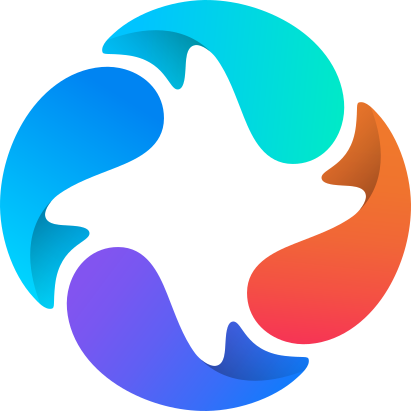
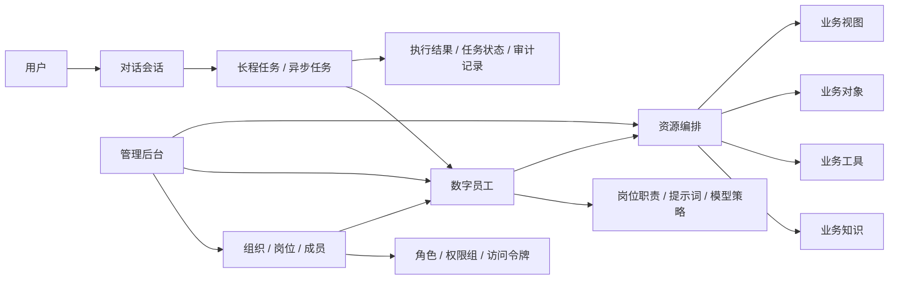
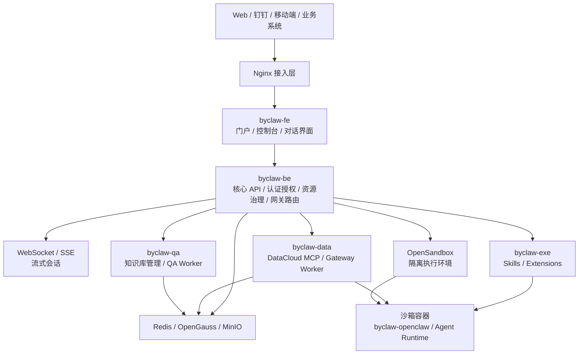
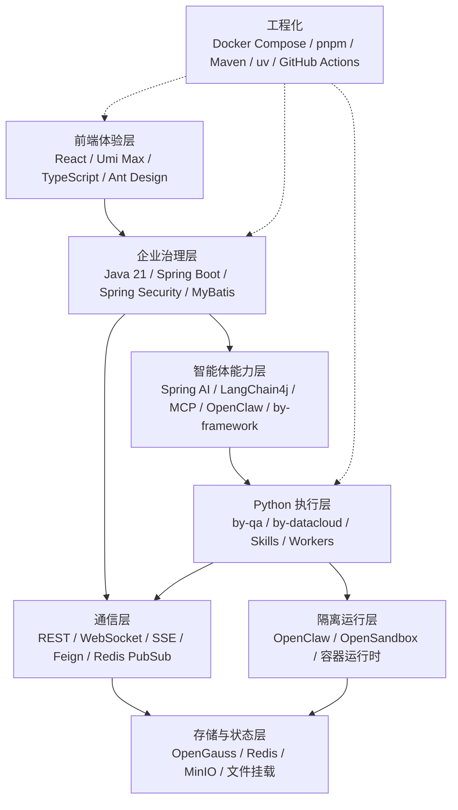
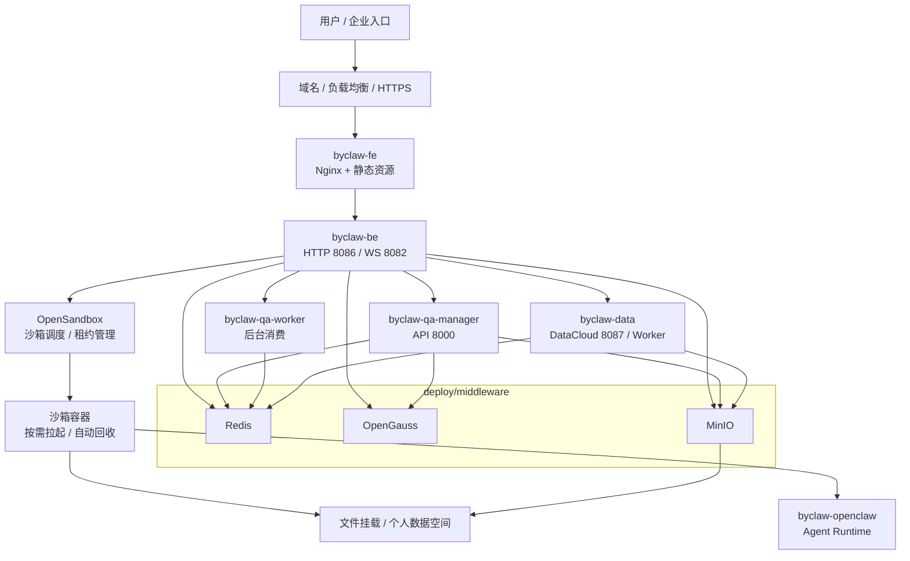
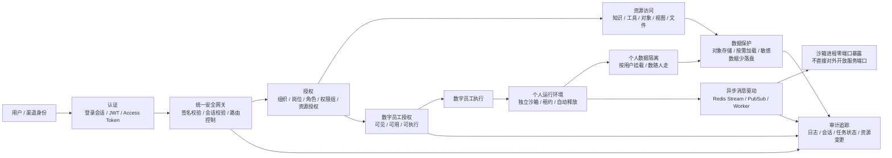

#  ByClaw — 企业级智能体执行框架

<p align="center">
  <strong>鲸智百应 · 重塑人机协作，驱动组织进化</strong>
</p>

<p align="center">
  <a href="https://github.com/beyonai/ByClaw/actions"></a>
  <a href="https://github.com/beyonai/ByClaw/releases"></a>
  <a href="LICENSE"></a>
  <a href="https://github.com/beyonai/ByClaw/stargazers"></a>
</p>

<p align="center">
  <strong>中文</strong> | <a href="README_EN.md">English</a>
</p>

90% 的企业在智能体转型中卡在"最后一公里"——概念很火、试点很美，但一规模化、一进生产、一碰核心数据，就遇到四大死结：**不敢用、不会用、接不通、算不清**。

我们总结了智能体组织的必赢公式：

> **可持续竞争力 = AI 原生思维 × 智能体组织架构 × 人机共生文化 × 可信技术底座**

四者缺一不可。没有安全可控、可规模化、可沉淀的技术底座，所有智能体转型都只能停留在演示阶段。

**ByClaw（鲸智百应）** 就是为解决这个问题而生——企业级智能体组织操作系统，支撑新质生产力的可信 AI 底座。它是 OpenClaw 的"企业增强版"，在开源智能体内核之上叠加了企业生产环境所需的核心能力：多租户隔离、统一安全网关、合规沙箱、长程任务支持、动态算力分配与释放。从一个 Agent 的 PoC 到千人组织的全面落地，ByClaw 提供完整的技术底座——**让企业敢部署、CEO 敢拍板、CIO 敢签字、CFO 敢算账**。

[核心亮点](#核心亮点) · [架构总览](#架构总览) · [快速开始](#快速开始) · [痛点与方案](#痛点与解决方案) · [参与贡献](CONTRIBUTING.md) · [安全策略](SECURITY.md)

---

## 核心亮点

- **数字员工** — 可视化创建、部署和管理超级助手、个人助理、数字员工，它们拥有明确的岗位职责
- **多智能体协作** — 通过异步事件、控制流与数据流分离两种核心技术：实现多智能体之间的协作，控制流与数据流分离，解决多智能体参与的长程任务碰到的问题
- **智能反向代理** — 将多个 MCP/Skill 能力压缩到恒定级别的上下文，多智能体生产级运行的"中枢神经系统"
- **多租户运行时** — 单实例统一部署、统一管理，支撑整个组织
- **统一安全网关** — 身份认证、会话管控、零信任访问

---

## 架构总览

ByClaw 采用“统一接入、集中治理、分布执行、资源隔离”的整体架构。平台把 Web、钉钉等入口统一收敛到安全网关和后端服务，由后端完成认证、会话、资源、权限、路由与编排，再把智能体任务分发给 DataCloud、QA、OpenClaw、OpenSandbox 等执行与能力服务。业务数据、知识文件、会话状态、执行结果分别落在数据库、Redis、MinIO 与个人沙箱中，形成可审计、可扩展、可隔离的企业级智能体运行底座。

```
用户 / 业务系统 / 钉钉 / Web
        │
        ▼
Nginx / 统一接入层
        │
        ▼
byclaw-fe ── REST / WebSocket / SSE ── byclaw-be
                                          │
              ┌───────────────────────────┼───────────────────────────┐
              ▼                           ▼                           ▼
        byclaw-qa                   byclaw-data                  byclaw-exe
   知识库 / QA Worker          DataCloud / MCP Worker          Skills / Extensions
              │                           │                           │
              └───────────────┬───────────┴───────────┬───────────────┘
                              ▼                       ▼
                     OpenClaw / OpenSandbox       业务 API / 外部系统
                              │
                              ▼
        OpenGauss / Redis / MinIO / 文件挂载 / 个人沙箱空间
```

### 业务架构

ByClaw 面向“组织中的智能体生产力”建模，核心业务对象包括用户、组织、岗位、数字员工、知识、工具、对象、视图、会话与任务。



- **组织与权限**：支持组织、岗位、成员、权限组、访问令牌等管理能力，为企业内部多角色协同提供统一身份与权限基础。
- **数字员工**：将智能体抽象为可配置、可发布、可运行的数字员工，包含岗位职责、模型配置、知识资源、工具资源和运行策略。
- **对话与任务**：以聊天会话作为人机协作入口，支持流式回复、上下文记忆、长程任务、异步执行和执行结果回传。
- **资源中心**：统一管理业务工具、业务对象、业务视图、业务知识和技能，让智能体按需加载上下文和能力。
- **管理后台**：提供模型、沙箱、组织、资源、数字员工等运营管理能力，支撑从 PoC 到生产运行的完整生命周期。

### 应用架构

应用层按职责拆分为前端、后端、数据云、QA、扩展执行和中间件服务。



| 模块 | 职责 | 关键能力 |
|------|------|----------|
| `byclaw-fe` | Web 门户与管理控制台 | 对话、知识中心、数字员工、工作中心、工具中心、沙箱页面、移动端适配 |
| `byclaw-be` | 核心业务后端与统一网关 | 认证授权、会话管理、资源管理、数字员工管理、文件管理、Feign 调用、WebSocket |
| `byclaw-qa` | 知识库与问答服务 | 知识导入、索引构建、检索问答、QA Worker、知识资源映射 |
| `byclaw-data` | 数据云与智能体执行服务 | DataCloud MCP、Gateway Worker、数据查询分析、工具调用、结果文件存储 |
| `byclaw-exe` | 扩展插件与技能脚本 | Skills、Extensions、业务脚本、能力扩展 |
| `middleware` | 基础运行组件 | Redis、MinIO、OpenGauss、OpenSandbox 等运行依赖 |

同步链路以 REST、WebSocket、SSE 和 Feign 为主，异步链路以 Redis Pub/Sub、Redis Stream、Worker 消费和后台任务为主。控制流由后端统一编排，数据流按资源类型进入数据库、对象存储、缓存、沙箱或外部业务系统。

### 数据架构

ByClaw 将数据分为业务元数据、会话状态、知识文件、执行结果和运行配置五类，避免所有数据被塞进单一存储。

- **OpenGauss / PostgreSQL**：存储用户、组织、权限、数字员工、资源元数据、知识库索引任务、系统配置等结构化数据。
- **Redis**：承载登录会话、缓存、分布式锁、数字员工配置快照、Pub/Sub 通知和 Worker 消息通道。
- **MinIO / OSS / SFTP**：保存上传文件、知识库原始文件、Markdown 转换结果、附件和大结果文件。
- **向量与检索数据**：由 QA / DataCloud 服务负责知识切分、索引构建、检索投影和召回，服务于 RAG 与问答场景。
- **个人数据空间**：为员工或智能体提供独立文件空间和沙箱挂载路径，实现“数随人走、多智能体共享、敏感数据少落盘”。

数据访问遵循“元数据进库、文件进对象存储、热状态进缓存、执行隔离进沙箱”的原则，便于扩展、审计和故障恢复。

### 技术架构

ByClaw 采用多语言、多运行时的组合架构：Java 负责核心业务和企业级治理，TypeScript 负责前端体验，Python 负责智能体、知识和数据执行。



| 层次 | 技术选型 | 说明 |
|------|----------|------|
| 前端 | React 18、Umi Max 4、TypeScript、Ant Design 5 | 企业级 Web 控制台与对话体验 |
| 后端 | Java 21、Spring Boot 3.4、Spring Security、Spring Session、MyBatis | 核心 API、认证授权、资源治理、服务编排 |
| AI / Agent | Spring AI、LangChain4j、MCP、OpenClaw、by-framework、by-qa、by-datacloud | 模型接入、智能体执行、知识问答、数据分析 |
| 通信 | REST、WebSocket、SSE、OpenFeign、Redis Pub/Sub | 同步请求、流式响应、服务间调用和异步通知 |
| 存储 | OpenGauss / PostgreSQL、Redis、MinIO、文件挂载 | 结构化数据、缓存消息、对象文件和沙箱数据 |
| 工程化 | Docker Compose、pnpm、Maven、uv、GitHub Actions | 本地开发、镜像构建、依赖管理和 CI/CD |

### 部署架构

ByClaw 支持本地开发、单机 Compose 和拆分部署。默认部署形态由 `deploy/middleware` 和 `deploy/standalone` 两组 Compose 文件组成。



- **中间件层**：先启动 Redis、MinIO、OpenGauss、OpenSandbox 等基础组件；OpenSandbox 负责按需拉起沙箱容器。
- **应用层**：启动 `byclaw-fe`、`byclaw-be`、`byclaw-qa-manager`、`byclaw-qa-worker`、`byclaw-data`。
- **接入层**：前端容器内置 Nginx，统一暴露 HTTP / HTTPS 入口，并转发后端 API、WebSocket、文件浏览和沙箱相关请求。
- **配置层**：通过根目录 `.env` 和 `deploy/config` 注入数据库、Redis、MinIO、模型、沙箱、端口和域名配置。
- **执行层**：`byclaw-openclaw` 运行在 OpenSandbox 拉起的沙箱容器中，Skills、Extensions 和外部业务 API 通过沙箱执行环境按需加载。

在生产环境中，可以将数据库、缓存、对象存储、QA Worker、DataCloud Worker 和 OpenSandbox 分别扩容；前端与后端保持无状态或弱状态部署，通过 Redis 和数据库共享状态。

### 安全架构

ByClaw 的安全设计围绕“身份可信、资源可控、执行隔离、链路可审计”展开。



- **身份认证**：支持登录会话、JWT、访问令牌和第三方渠道身份接入，统一收敛到后端认证体系。
- **权限控制**：通过组织、岗位、角色、权限组和资源授权控制用户可见、可用、可管理的业务资源。
- **网关治理**：后端作为统一安全网关，负责请求签名校验、会话校验、路由控制、文件访问控制和渠道接入。
- **数字员工授权**：数字员工在可见、可用、可执行三个层面接受授权控制，用户只能调用被授权的数字员工及其绑定资源。
- **个人环境隔离**：每个用户拥有独立沙箱运行环境，沙箱按需申请、租约管理、用完释放或自动过期，避免不同用户的执行空间相互影响。
- **个人数据隔离**：个人数据空间按用户隔离和挂载，数字员工执行时访问的是当前用户授权范围内的数据，实现“数随人走”。
- **零端口暴露**：沙箱容器内进程不直接向外暴露业务端口，任务通过 Redis Stream、Pub/Sub、Worker 等异步消息机制驱动和回传。
- **数据保护**：敏感配置通过环境变量注入，文件进入对象存储，工具调用按需加载业务资源，减少敏感数据在模型上下文和本地磁盘中的长期驻留。
- **审计与追踪**：日志、任务状态、会话记录、资源变更和执行结果可沉淀为审计线索，支撑问题回溯和合规检查。

---

## 快速开始

### 环境要求

| 工具 | 版本要求 | 验证命令 |
|------|---------|---------|
| Docker & Compose V2 | 最新版 | `docker compose version` |
| Node.js | >= 18.20 | `node --version` |
| pnpm | >= 9.x | `pnpm --version` |
| JDK | 21 | `java -version` |
| Maven | >= 3.8 | `mvn --version` |
| Python | >= 3.12 | `python3 --version` |
| uv | 任意版本 | `uv --version` |

### Docker 一键部署

```bash
# 1. 克隆仓库
git clone https://github.com/beyonai/ByClaw.git
cd ByClaw

# 2. 配置环境变量
cp .env.example .env
# ⚠️ 重要：.env.example 中所有地址默认为 127.0.0.1，
#    你需要根据 deploy/middleware 中各中间件实际暴露的端口，
#    逐项回填 DB_URL、DB_USER、DB_PASS、REDIS_HOST、REDIS_PORT、
#    REDIS_PASSWORD、MID_FTP_* 等配置。
#    如果中间件部署在远程机器，请替换为对应 IP。

# 3. 在 .env 中选择存储方案
# BYCLAW_DEPLOY_STORAGE=nfs        # 推荐：OpenClaw /by 和 BE 文件 CRUD 都走 /mnt/byclaw-file
# BYCLAW_DEPLOY_STORAGE=minio      # 兼容旧 MinIO/rclone 方案
# BYCLAW_DEPLOY_STORAGE=nfs-hybrid # OpenClaw /by 走 NFS，上传下载 API 继续走 MinIO

# 4. 首次部署：按 .env 拉镜像、可选初始化 NFS、启动中间件和应用
sh deploy.sh init

# 5. 增量更新：按 .env 重新生成配置并重建服务，不重复初始化 NFS
# sh deploy.sh update
```

访问 **http://localhost:8080** 开始使用。

### 本地开发

本地开发同样需要先配置 `.env` 文件（步骤与上方 Docker 部署一致）。

中间件可以部署在本地，也可以部署在远程服务器——只需在 `.env` 中将 `127.0.0.1` 替换为远程服务器的 IP 和端口即可。

```bash
# 1. 配置环境变量（同上，必须先完成）
cp .env.example .env
# 根据中间件实际地址回填 DB_URL、REDIS_HOST 等

# 2. 拉取并启动中间件（本地部署时执行，远程部署则跳过此步）
(cd deploy/middleware && sh pull.sh && sh start-all.sh)

# 3. 启动应用（推荐统一脚本）
scripts/start.sh --all

# 按模块启动
scripts/start.sh --fe      # 前端 :8000
scripts/start.sh --be      # 后端 :8086
scripts/start.sh --qa      # QA 服务
scripts/start.sh --data    # 数据云服务

# 停止服务
scripts/stop.sh            # 停止全部
scripts/stop.sh --fe       # 仅停止前端
```

启动脚本会自动执行**环境预检**——校验所有工具、版本和依赖是否就绪，有问题会立即报错并给出修复建议。使用 `--skip-checks` 可跳过预检。

前端开发服务器运行在 http://localhost:8000，自动代理 API 请求到后端。

---

## 项目结构

```
ByClaw/
├── byclaw-fe/          # Web 前端（React, Umi Max, TypeScript）
├── byclaw-be/          # 后端服务（Spring Boot 3.4, Java 21）
├── byclaw-data/        # 数据云服务（Python 3.12, uv）
├── byclaw-qa/          # QA 与 Agent 服务（Python 3.12, uv）
├── byclaw-exe/         # 扩展插件与技能脚本
├── deploy/             # Docker Compose 部署配置
├── docs/               # 项目文档
├── scripts/            # 开发自动化脚本（start/stop/deploy）
└── .github/            # CI/CD 工作流与模板
```

---

## 端口说明

| 服务 | 默认端口 |
|------|:--------:|
| 前端（Nginx） | 8080 |
| 后端 HTTP | 8086 |
| 后端 WebSocket | 8082 |
| QA Manager | 8000 |
| DataCloud | 8087 |
| Redis | 6379 |
| MinIO API / Console | 9000 / 9001 |
| OpenGauss | 5432 |
| OpenSandbox | 9005 |

---

## 提交规范

使用 [Conventional Commits](https://www.conventionalcommits.org/)，scope 为模块名：

```
feat(fe): 新增对话历史搜索
fix(be): 修复分页边界问题
docs: 更新部署文档
```

详见 [.github/commit-convention.md](.github/commit-convention.md)。

---

## 参与贡献

欢迎参与！请阅读 [CONTRIBUTING.md](CONTRIBUTING.md) 了解贡献流程。

使用 [Pull Request 模板](.github/PULL_REQUEST_TEMPLATE.md) 提交 PR。

---

## 社区

- [GitHub Issues](https://github.com/beyonai/ByClaw/issues) — Bug 反馈与功能建议
- [GitHub Discussions](https://github.com/beyonai/ByClaw/discussions) — 问题讨论与想法交流
- [安全策略](SECURITY.md) — 漏洞负责任披露

---

## 许可证

[Apache License 2.0](LICENSE)

---

<p align="center">
  <sub>由 <a href="https://github.com/beyonai">BeyondAI</a> 构建 · 站在未来，看见今天。</sub>
</p>
