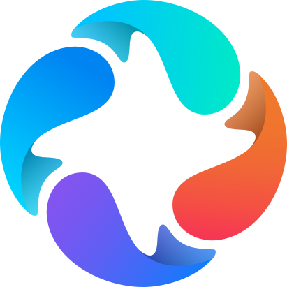

#  ByClaw — Enterprise Agent Execution Framework

<p align="center">
  <strong>Reshaping Human-Machine Collaboration, Driving Organizational Evolution</strong>
</p>

<p align="center">
  <a href="https://github.com/beyonai/ByClaw/actions"></a>
  <a href="https://github.com/beyonai/ByClaw/releases"></a>
  <a href="LICENSE"></a>
  <a href="https://github.com/beyonai/ByClaw/stargazers"></a>
</p>

<p align="center">
  <a href="README.md">中文</a> | <strong>English</strong>
</p>

90% of enterprises get stuck at the "last mile" of agent transformation — the concepts are hot, the pilots look great, but the moment you scale up, go to production, or touch core data, you hit four dead ends: **afraid to use it, don't know how to use it, can't connect it, can't measure it**.

We've distilled the winning formula for an agent-powered organization:

> **Sustainable Competitiveness = AI-Native Thinking × Agent Organization Architecture × Human-Machine Symbiosis Culture × Trusted Technology Foundation**

All four are indispensable. Without a secure, scalable, and accumulable technology foundation, all agent transformation stays at the demo stage.

**ByClaw** is built to solve exactly this — an enterprise-grade agent organization operating system, the trusted AI foundation for next-generation productivity. It is the "enterprise-enhanced edition" of OpenClaw, layering production-critical capabilities on top of the open-source agent kernel: multi-tenant isolation, unified security gateway, compliance sandbox, long-running task support, and dynamic compute allocation. From a single Agent PoC to full-scale deployment across a thousand-person organization, ByClaw provides the complete technology foundation — **so enterprises dare to deploy, CEOs dare to approve, CIOs dare to sign off, and CFOs dare to budget**.

[Highlights](#highlights) · [Architecture](#architecture) · [Quick Start](#quick-start) · [Contributing](CONTRIBUTING.md) · [Security](SECURITY.md)

---

## Highlights

- **Digital Employees** — Visually create, deploy, and manage super assistants, personal assistants, and digital employees, each with clearly defined job responsibilities
- **Multi-Agent Collaboration** — Two core technologies — async events and control/data flow separation — enable multi-agent coordination and solve long-running task challenges
- **Intelligent Reverse Proxy** — Compresses multiple MCP/Skill capabilities into constant-level context, the "central nervous system" for production-grade multi-agent operation
- **Multi-Tenant Runtime** — Single-instance unified deployment and management, supporting the entire organization
- **Unified Security Gateway** — Identity authentication, session management, zero-trust access

---

## Architecture

```
                    web / DingTalk / more channels
                              │
                              ▼
┌─────────────────────────────────────────────────────────────────┐
│  Layer 1: Access                                                │
│  ┄┄┄┄┄┄┄┄┄┄┄┄┄┄┄┄┄┄┄┄┄┄┄┄┄┄┄┄┄┄┄┄┄┄┄┄┄┄┄┄┄┄┄┄┄┄┄┄┄┄┄┄┄┄┄┄┄  │
│  Unified access  · websocket · DingTalk · sse                   │
│  Unified control · auth · authorization · routing               │
└────────────────────────────┬────────────────────────────────────┘
                             ▼
┌─────────────────────────────────────────────────────────────────┐
│  Layer 2: Coordination                                          │
│  ┄┄┄┄┄┄┄┄┄┄┄┄┄┄┄┄┄┄┄┄┄┄┄┄┄┄┄┄┄┄┄┄┄┄┄┄┄┄┄┄┄┄┄┄┄┄┄┄┄┄┄┄┄┄┄┄┄  │
│  Intent recognition · intelligent orchestration                 │
│  Async scheduling (event-driven, control/data flow separation,  │
│                     zero port exposure)                          │
└────────────────────────────┬────────────────────────────────────┘
                             ▼
┌─────────────────────────────────────────────────────────────────┐
│  Layer 3: Execution                                             │
│  ┄┄┄┄┄┄┄┄┄┄┄┄┄┄┄┄┄┄┄┄┄┄┄┄┄┄┄┄┄┄┄┄┄┄┄┄┄┄┄┄┄┄┄┄┄┄┄┄┄┄┄┄┄┄┄┄┄  │
│  Super assistant · personal assistant · digital employee        │
│  Progressive Skill loading                                      │
│  BaiYing-call (on-demand resource loading, zero sensitive data  │
│                storage)                                         │
└────────────────────────────┬────────────────────────────────────┘
                             ▼
┌─────────────────────────────────────────────────────────────────┐
│  Layer 4: State                                                 │
│  ┄┄┄┄┄┄┄┄┄┄┄┄┄┄┄┄┄┄┄┄┄┄┄┄┄┄┄┄┄┄┄┄┄┄┄┄┄┄┄┄┄┄┄┄┄┄┄┄┄┄┄┄┄┄┄┄┄  │
│  ★ Chat sessions                                                │
│  ★ Personal memory                                              │
│  ★ Global resources (tools, objects, views, knowledge)          │
└────────────────────────────┬────────────────────────────────────┘
                             ▼
┌─────────────────────────────────────────────────────────────────┐
│  Layer 5: Resource Scheduling                                   │
│  ┄┄┄┄┄┄┄┄┄┄┄┄┄┄┄┄┄┄┄┄┄┄┄┄┄┄┄┄┄┄┄┄┄┄┄┄┄┄┄┄┄┄┄┄┄┄┄┄┄┄┄┄┄┄┄┄┄  │
│  Independent sandbox per employee · allocate on demand, release │
│  when done                                                      │
│  Independent data space per employee · data follows the person, │
│  shared across agents                                           │
└─────────────────────────────────────────────────────────────────┘
```

---

## Quick Start

### Prerequisites

| Tool | Version | Check |
|------|---------|-------|
| Docker & Compose V2 | latest | `docker compose version` |
| Node.js | >= 18.20 | `node --version` |
| pnpm | >= 9.x | `pnpm --version` |
| JDK | 21 | `java -version` |
| Maven | >= 3.8 | `mvn --version` |
| Python | >= 3.12 | `python3 --version` |
| uv | any | `uv --version` |

### Docker Deployment

```bash
# 1. Clone
git clone https://github.com/beyonai/ByClaw.git
cd ByClaw

# 2. Configure environment variables
cp .env.example .env
# ⚠️ Important: all addresses in .env.example default to 127.0.0.1.
#    You must fill in the actual ports exposed by deploy/middleware:
#    DB_URL, DB_USER, DB_PASS, REDIS_HOST, REDIS_PORT,
#    REDIS_PASSWORD, MID_FTP_*, etc.
#    If middleware is on a remote server, replace with the corresponding IP.

# 3. Start middleware (Redis, MinIO, OpenGauss, Sandbox)
cd deploy/middleware && sh start-all.sh && cd ../..

# 4. Start application
cd deploy/standalone && docker compose up -d
```

Visit **http://localhost:8080** to start using ByClaw.

### Local Development

Local development also requires configuring the `.env` file first (same steps as Docker deployment above).

Middleware can be deployed locally or on a remote server — just replace `127.0.0.1` in `.env` with the remote server's IP and port.

```bash
# 1. Configure environment variables (same as above, must complete first)
cp .env.example .env
# Fill in DB_URL, REDIS_HOST, etc. based on actual middleware addresses

# 2. Start middleware (run for local deployment, skip if remote)
cd deploy/middleware && sh start-all.sh && cd ../..

# 3. Start application (unified script recommended)
scripts/start.sh --all

# Start by module
scripts/start.sh --fe      # Frontend :8000
scripts/start.sh --be      # Backend :8086
scripts/start.sh --qa      # QA service
scripts/start.sh --data    # Data cloud service

# Stop services
scripts/stop.sh            # Stop all
scripts/stop.sh --fe       # Stop frontend only
```

The start script automatically runs **preflight environment checks** — validating all tools, versions, and dependencies before launching. Use `--skip-checks` to bypass.

The frontend dev server runs at http://localhost:8000 and proxies API requests to the backend.

---

## Project Structure

```
ByClaw/
├── byclaw-fe/          # Web frontend (React, Umi Max, TypeScript)
├── byclaw-be/          # Backend service (Spring Boot 3.4, Java 21)
├── byclaw-data/        # Data cloud service (Python 3.12, uv)
├── byclaw-qa/          # QA & Agent service (Python 3.12, uv)
├── byclaw-exe/         # Extension plugins & skill scripts
├── deploy/             # Docker Compose deployment configs
├── docs/               # Documentation
├── scripts/            # Dev automation scripts (start/stop/deploy)
└── .github/            # CI/CD workflows & templates
```

---

## Ports

| Service | Default Port |
|---------|:------------:|
| Frontend (Nginx) | 8080 |
| Backend HTTP | 8086 |
| Backend WebSocket | 8082 |
| QA Manager | 8000 |
| DataCloud | 8087 |
| Redis | 6379 |
| MinIO API / Console | 9000 / 9001 |
| OpenGauss | 5432 |
| OpenSandbox | 9005 |

---

## Commit Convention

Uses [Conventional Commits](https://www.conventionalcommits.org/) with module scopes:

```
feat(fe): add conversation history search
fix(be): fix pagination boundary
docs: update deployment guide
```

See [.github/commit-convention.md](.github/commit-convention.md) for details.

---

## Contributing

Contributions welcome! See [CONTRIBUTING.md](CONTRIBUTING.md) for guidelines.

Use the [Pull Request template](.github/PULL_REQUEST_TEMPLATE.md) when submitting PRs.

---

## Community

- [GitHub Issues](https://github.com/beyonai/ByClaw/issues) — Bug reports & feature requests
- [GitHub Discussions](https://github.com/beyonai/ByClaw/discussions) — Questions & ideas
- [Security Policy](SECURITY.md) — Responsible disclosure

---

## License

[Apache License 2.0](LICENSE)

---

<p align="center">
  <sub>Built by <a href="https://github.com/beyonai">BeyondAI</a> · Standing in the future, seeing today.</sub>
</p>
