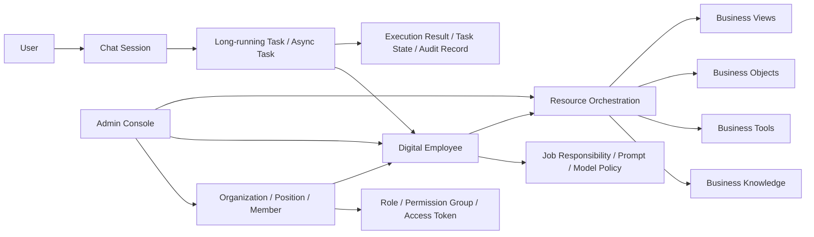
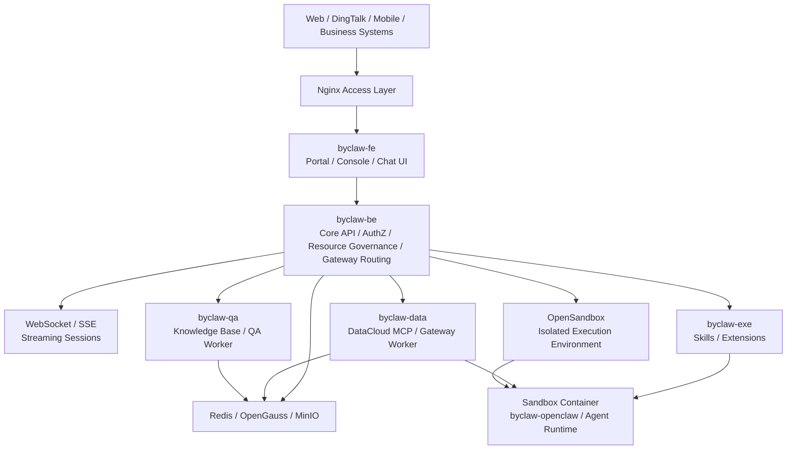
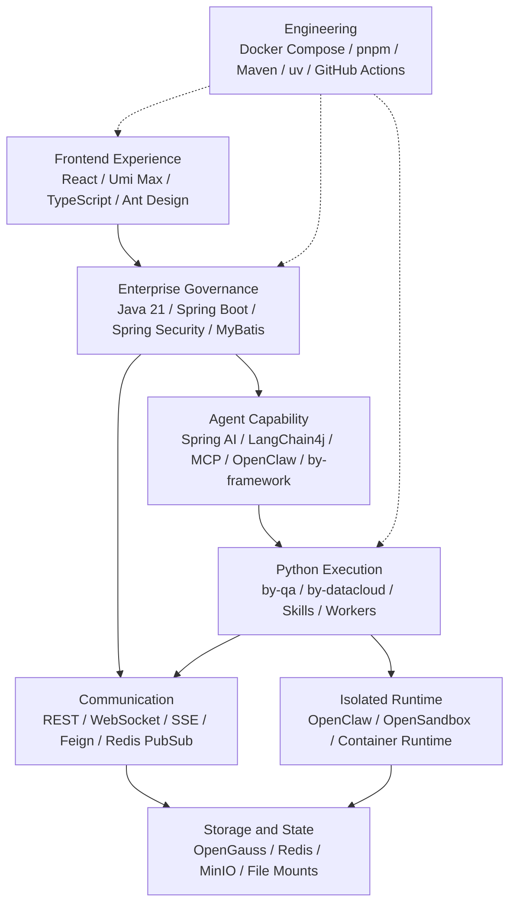
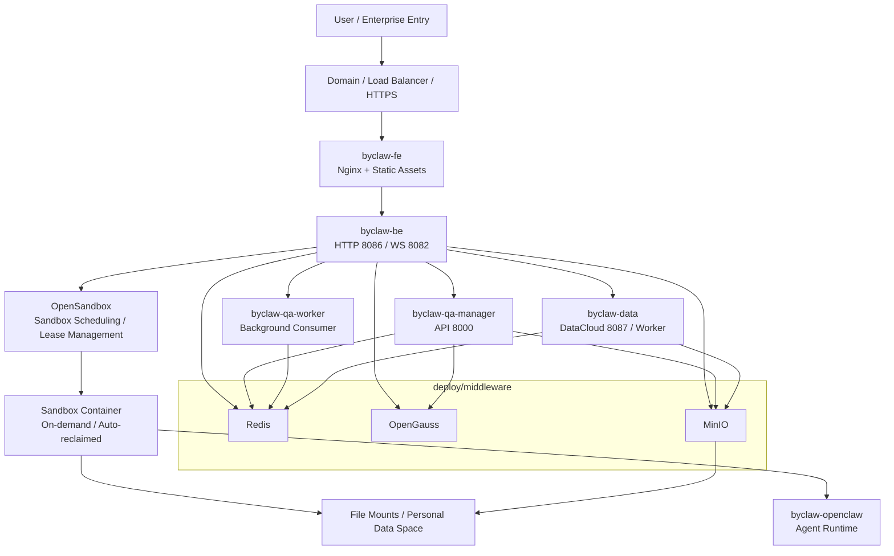
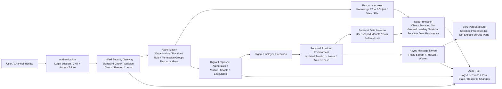

#  ByClaw — Enterprise Agent Execution Framework

<p align="center">
  <strong>Reshaping Human-Machine Collaboration, Driving Organizational Evolution</strong>
</p>

<p align="center">
  <a href="https://github.com/beyonai/ByClaw/actions"></a>
  <a href="https://github.com/beyonai/ByClaw/releases"></a>
  <a href="LICENSE"></a>
  <a href="https://github.com/beyonai/ByClaw/stargazers"></a>
</p>

<p align="center">
  <a href="README.md">中文</a> | <strong>English</strong>
</p>

90% of enterprises get stuck at the "last mile" of agent transformation — the concepts are hot, the pilots look great, but the moment you scale up, go to production, or touch core data, you hit four dead ends: **afraid to use it, don't know how to use it, can't connect it, can't measure it**.

We've distilled the winning formula for an agent-powered organization:

> **Sustainable Competitiveness = AI-Native Thinking × Agent Organization Architecture × Human-Machine Symbiosis Culture × Trusted Technology Foundation**

All four are indispensable. Without a secure, scalable, and accumulable technology foundation, all agent transformation stays at the demo stage.

**ByClaw** is built to solve exactly this — an enterprise-grade agent organization operating system, the trusted AI foundation for next-generation productivity. It is the "enterprise-enhanced edition" of OpenClaw, layering production-critical capabilities on top of the open-source agent kernel: multi-tenant isolation, unified security gateway, compliance sandbox, long-running task support, and dynamic compute allocation. From a single Agent PoC to full-scale deployment across a thousand-person organization, ByClaw provides the complete technology foundation — **so enterprises dare to deploy, CEOs dare to approve, CIOs dare to sign off, and CFOs dare to budget**.

[Highlights](#highlights) · [Architecture](#architecture) · [Quick Start](#quick-start) · [Contributing](CONTRIBUTING.md) · [Security](SECURITY.md)

---

## Highlights

- **Digital Employees** — Visually create, deploy, and manage super assistants, personal assistants, and digital employees, each with clearly defined job responsibilities
- **Multi-Agent Collaboration** — Two core technologies — async events and control/data flow separation — enable multi-agent coordination and solve long-running task challenges
- **Intelligent Reverse Proxy** — Compresses multiple MCP/Skill capabilities into constant-level context, the "central nervous system" for production-grade multi-agent operation
- **Multi-Tenant Runtime** — Single-instance unified deployment and management, supporting the entire organization
- **Unified Security Gateway** — Identity authentication, session management, zero-trust access

---

## Architecture

ByClaw follows an architecture of unified access, centralized governance, distributed execution, and resource isolation. Web, DingTalk, and other entry points are consolidated behind the access gateway and backend service. The backend handles authentication, sessions, resources, permissions, routing, and orchestration, then dispatches agent tasks to DataCloud, QA, OpenClaw, OpenSandbox, and other execution services. Business data, knowledge files, session state, and execution results are stored across the database, Redis, MinIO, and personal sandbox spaces, forming an auditable, scalable, and isolated enterprise agent runtime foundation.

```
Users / business systems / DingTalk / Web
        │
        ▼
Nginx / unified access layer
        │
        ▼
byclaw-fe ── REST / WebSocket / SSE ── byclaw-be
                                          │
              ┌───────────────────────────┼───────────────────────────┐
              ▼                           ▼                           ▼
        byclaw-qa                   byclaw-data                  byclaw-exe
  Knowledge base / QA Worker   DataCloud / MCP Worker          Skills / Extensions
              │                           │                           │
              └───────────────┬───────────┴───────────┬───────────────┘
                              ▼                       ▼
                     OpenClaw / OpenSandbox       Business APIs / external systems
                              │
                              ▼
        OpenGauss / Redis / MinIO / file mounts / personal sandbox space
```

### Business Architecture

ByClaw models agent productivity inside an organization. Its core business objects include users, organizations, positions, digital employees, knowledge, tools, objects, views, sessions, and tasks.


```mermaid
flowchart LR
    org["Organization / Position / Member"] --> perm["Role / Permission Group / Access Token"]
    org --> employee["Digital Employee"]
    employee --> profile["Job Responsibility / Prompt / Model Policy"]
    employee --> resources["Resource Orchestration"]
    resources --> knowledge["Business Knowledge"]
    resources --> tools["Business Tools"]
    resources --> objects["Business Objects"]
    resources --> views["Business Views"]
    user["User"] --> session["Chat Session"]
    session --> task["Long-running Task / Async Task"]
    task --> employee
    task --> result["Execution Result / Task State / Audit Record"]
    admin["Admin Console"] --> org
    admin --> employee
    admin --> resources
```

- **Organization and permissions**: Manages organizations, positions, members, permission groups, and access tokens as the unified identity and authorization foundation for enterprise collaboration.
- **Digital employees**: Represents agents as configurable, publishable, and runnable digital employees with job responsibilities, model settings, knowledge resources, tool resources, and runtime policies.
- **Conversations and tasks**: Uses chat sessions as the human-agent collaboration entry point, supporting streaming responses, context memory, long-running tasks, async execution, and result callbacks.
- **Resource center**: Manages business tools, business objects, business views, business knowledge, and skills so agents can load context and capabilities on demand.
- **Admin console**: Provides operational management for models, sandboxes, organizations, resources, and digital employees, supporting the full lifecycle from PoC to production.

### Application Architecture

The application layer is split by responsibility into frontend, backend, DataCloud, QA, extension execution, and middleware services.


```mermaid
flowchart TB
    client["Web / DingTalk / Mobile / Business Systems"] --> nginx["Nginx Access Layer"]
    nginx --> fe["byclaw-fe<br/>Portal / Console / Chat UI"]
    fe --> be["byclaw-be<br/>Core API / AuthZ / Resource Governance / Gateway Routing"]
    be --> ws["WebSocket / SSE<br/>Streaming Sessions"]
    be --> qa["byclaw-qa<br/>Knowledge Base / QA Worker"]
    be --> data["byclaw-data<br/>DataCloud MCP / Gateway Worker"]
    be --> exe["byclaw-exe<br/>Skills / Extensions"]
    be --> sandbox["OpenSandbox<br/>Isolated Execution Environment"]
    sandbox --> sandboxRuntime["Sandbox Container<br/>byclaw-openclaw / Agent Runtime"]
    data --> sandboxRuntime
    exe --> sandboxRuntime
    qa --> infra["Redis / OpenGauss / MinIO"]
    data --> infra
    be --> infra
```

| Module | Responsibility | Key Capabilities |
|--------|----------------|------------------|
| `byclaw-fe` | Web portal and admin console | Chat, knowledge center, digital employees, work center, tool center, sandbox pages, mobile adaptation |
| `byclaw-be` | Core backend and unified gateway | AuthN/AuthZ, session management, resource management, digital employee management, file management, Feign calls, WebSocket |
| `byclaw-qa` | Knowledge base and QA service | Knowledge import, index building, retrieval QA, QA Worker, knowledge resource mapping |
| `byclaw-data` | DataCloud and agent execution service | DataCloud MCP, Gateway Worker, data query and analysis, tool calls, result file storage |
| `byclaw-exe` | Extension plugins and skill scripts | Skills, Extensions, business scripts, capability extensions |
| `middleware` | Runtime infrastructure | Redis, MinIO, OpenGauss, OpenSandbox, and related runtime dependencies |

Synchronous communication mainly uses REST, WebSocket, SSE, and Feign. Asynchronous communication mainly uses Redis Pub/Sub, Redis Stream, Worker consumption, and background tasks. Control flow is centrally orchestrated by the backend, while data flow enters the database, object storage, cache, sandbox, or external business systems based on resource type.

### Data Architecture

ByClaw separates data into five categories: business metadata, session state, knowledge files, execution results, and runtime configuration, avoiding a single monolithic storage model.

- **OpenGauss / PostgreSQL**: Stores structured data such as users, organizations, permissions, digital employees, resource metadata, knowledge indexing tasks, and system configuration.
- **Redis**: Holds login sessions, cache, distributed locks, digital employee configuration snapshots, Pub/Sub notifications, and Worker message channels.
- **MinIO / OSS / SFTP**: Stores uploaded files, original knowledge files, Markdown conversion outputs, attachments, and large result files.
- **Vector and retrieval data**: QA and DataCloud services handle knowledge chunking, index building, retrieval projection, and recall for RAG and QA scenarios.
- **Personal data space**: Provides each user or agent with isolated file space and sandbox mount paths, enabling data to follow the user and be shared across authorized agents with minimal sensitive data persistence.

Data access follows the principle of storing metadata in the database, files in object storage, hot state in cache, and isolated execution data in sandboxes, making the system easier to scale, audit, and recover.

### Technical Architecture

ByClaw uses a multi-language, multi-runtime architecture: Java handles core business and enterprise governance, TypeScript handles frontend experience, and Python handles agents, knowledge, and data execution.


```mermaid
flowchart TB
    ui["Frontend Experience<br/>React / Umi Max / TypeScript / Ant Design"] --> api["Enterprise Governance<br/>Java 21 / Spring Boot / Spring Security / MyBatis"]
    api --> agent["Agent Capability<br/>Spring AI / LangChain4j / MCP / OpenClaw / by-framework"]
    agent --> py["Python Execution<br/>by-qa / by-datacloud / Skills / Workers"]
    api --> comm["Communication<br/>REST / WebSocket / SSE / Feign / Redis PubSub"]
    py --> comm
    comm --> storage["Storage and State<br/>OpenGauss / Redis / MinIO / File Mounts"]
    py --> runtime["Isolated Runtime<br/>OpenClaw / OpenSandbox / Container Runtime"]
    runtime --> storage
    devops["Engineering<br/>Docker Compose / pnpm / Maven / uv / GitHub Actions"] -.-> ui
    devops -.-> api
    devops -.-> py
```

| Layer | Technologies | Description |
|-------|--------------|-------------|
| Frontend | React 18, Umi Max 4, TypeScript, Ant Design 5 | Enterprise Web console and chat experience |
| Backend | Java 21, Spring Boot 3.4, Spring Security, Spring Session, MyBatis | Core APIs, authentication and authorization, resource governance, service orchestration |
| AI / Agent | Spring AI, LangChain4j, MCP, OpenClaw, by-framework, by-qa, by-datacloud | Model integration, agent execution, knowledge QA, data analysis |
| Communication | REST, WebSocket, SSE, OpenFeign, Redis Pub/Sub | Synchronous requests, streaming responses, service-to-service calls, async notifications |
| Storage | OpenGauss / PostgreSQL, Redis, MinIO, file mounts | Structured data, cached messages, object files, sandbox data |
| Engineering | Docker Compose, pnpm, Maven, uv, GitHub Actions | Local development, image building, dependency management, CI/CD |

### Deployment Architecture

ByClaw supports local development, single-node Compose deployment, and split deployment. The default deployment is composed of `deploy/middleware` and `deploy/standalone`.


```mermaid
flowchart TB
    user["User / Enterprise Entry"] --> lb["Domain / Load Balancer / HTTPS"]
    lb --> feC["byclaw-fe<br/>Nginx + Static Assets"]
    feC --> beC["byclaw-be<br/>HTTP 8086 / WS 8082"]
    beC --> qaApi["byclaw-qa-manager<br/>API 8000"]
    beC --> qaWorker["byclaw-qa-worker<br/>Background Consumer"]
    beC --> dataC["byclaw-data<br/>DataCloud 8087 / Worker"]
    beC --> sandboxC["OpenSandbox<br/>Sandbox Scheduling / Lease Management"]
    sandboxC --> sandboxContainer["Sandbox Container<br/>On-demand / Auto-reclaimed"]
    sandboxContainer --> openclawC["byclaw-openclaw<br/>Agent Runtime"]
    subgraph middleware["deploy/middleware"]
        redisC["Redis"]
        dbC["OpenGauss"]
        minioC["MinIO"]
    end
    beC --> redisC
    beC --> dbC
    beC --> minioC
    qaApi --> redisC
    qaApi --> dbC
    qaApi --> minioC
    qaWorker --> redisC
    dataC --> redisC
    dataC --> minioC
    sandboxContainer --> mount["File Mounts / Personal Data Space"]
    minioC --> mount
```

- **Middleware layer**: Starts Redis, MinIO, OpenGauss, OpenSandbox, and other infrastructure components first. OpenSandbox is responsible for launching sandbox containers on demand.
- **Application layer**: Starts `byclaw-fe`, `byclaw-be`, `byclaw-qa-manager`, `byclaw-qa-worker`, and `byclaw-data`.
- **Access layer**: The frontend container embeds Nginx, exposes HTTP / HTTPS, and forwards backend APIs, WebSocket, file browsing, and sandbox-related requests.
- **Configuration layer**: Injects database, Redis, MinIO, model, sandbox, port, and domain configuration through the root `.env` file and `deploy/config`.
- **Execution layer**: `byclaw-openclaw` runs inside sandbox containers launched by OpenSandbox. Skills, Extensions, and external business APIs are loaded through the sandbox execution environment on demand.

In production, databases, cache, object storage, QA Workers, DataCloud Workers, and OpenSandbox can be scaled independently. Frontend and backend services remain stateless or weakly stateful, sharing state through Redis and the database.

### Security Architecture

ByClaw security is designed around trusted identity, controlled resources, isolated execution, and auditable flows.


```mermaid
flowchart LR
    user["User / Channel Identity"] --> auth["Authentication<br/>Login Session / JWT / Access Token"]
    auth --> gateway["Unified Security Gateway<br/>Signature Check / Session Check / Routing Control"]
    gateway --> authz["Authorization<br/>Organization / Position / Role / Permission Group / Resource Grant"]
    authz --> resource["Resource Access<br/>Knowledge / Tool / Object / View / File"]
    authz --> agentAuth["Digital Employee Authorization<br/>Visible / Usable / Executable"]
    agentAuth --> agent["Digital Employee Execution"]
    agent --> sandbox["Personal Runtime Environment<br/>Isolated Sandbox / Lease / Auto Release"]
    sandbox --> dataSpace["Personal Data Isolation<br/>User-scoped Mounts / Data Follows User"]
    sandbox --> async["Async Message Driven<br/>Redis Stream / PubSub / Worker"]
    async --> noPort["Zero Port Exposure<br/>Sandbox Processes Do Not Expose Service Ports"]
    resource --> dataGuard["Data Protection<br/>Object Storage / On-demand Loading / Minimal Sensitive Data Persistence"]
    dataSpace --> dataGuard
    gateway --> audit["Audit Trail<br/>Logs / Sessions / Task State / Resource Changes"]
    agentAuth --> audit
    async --> audit
    dataGuard --> audit
```

- **Authentication**: Supports login sessions, JWT, access tokens, and third-party channel identities, all consolidated into the backend authentication system.
- **Authorization**: Controls which resources users can see, use, and manage through organizations, positions, roles, permission groups, and resource grants.
- **Gateway governance**: The backend acts as the unified security gateway for request signature checks, session validation, routing control, file access control, and channel access.
- **Digital employee authorization**: Digital employees are controlled across visibility, usability, and executability; users can only invoke authorized digital employees and their bound resources.
- **Personal runtime isolation**: Each user has an independent sandbox runtime environment with on-demand allocation, lease management, and automatic release to prevent execution-space interference.
- **Personal data isolation**: Personal data spaces are isolated and mounted per user. Digital employees only access data within the current user's authorization scope, so data follows the user.
- **Zero port exposure**: Processes inside sandbox containers do not directly expose service ports. Tasks are driven and reported back through async mechanisms such as Redis Stream, Pub/Sub, and Workers.
- **Data protection**: Sensitive configuration is injected through environment variables, files are stored in object storage, and tool calls load business resources on demand to reduce long-lived sensitive data in model context or local disks.
- **Audit and traceability**: Logs, task state, session records, resource changes, and execution results form audit trails for troubleshooting and compliance.

---

## Quick Start

### Prerequisites

| Tool | Version | Check |
|------|---------|-------|
| Docker & Compose V2 | latest | `docker compose version` |
| Node.js | >= 18.20 | `node --version` |
| pnpm | >= 9.x | `pnpm --version` |
| JDK | 21 | `java -version` |
| Maven | >= 3.8 | `mvn --version` |
| Python | >= 3.12 | `python3 --version` |
| uv | any | `uv --version` |

### Docker Deployment

```bash
# 1. Clone
git clone https://github.com/beyonai/ByClaw.git
cd ByClaw

# 2. Configure environment variables
cp .env.example .env
# ⚠️ Important: all addresses in .env.example default to 127.0.0.1.
#    You must fill in the actual ports exposed by deploy/middleware:
#    DB_URL, DB_USER, DB_PASS, REDIS_HOST, REDIS_PORT,
#    REDIS_PASSWORD, MID_FTP_*, etc.
#    If middleware is on a remote server, replace with the corresponding IP.

# 3. Pull middleware images (first-time only)
(cd deploy/middleware && sh pull.sh)

# 4. Start middleware (Redis, MinIO, OpenGauss, Sandbox)
(cd deploy/middleware && sh start-all.sh)

# 5. Start application
(cd deploy/standalone && docker compose up -d)
```

Visit **http://localhost:8080** to start using ByClaw.

### Local Development

Local development also requires configuring the `.env` file first (same steps as Docker deployment above).

Middleware can be deployed locally or on a remote server — just replace `127.0.0.1` in `.env` with the remote server's IP and port.

```bash
# 1. Configure environment variables (same as above, must complete first)
cp .env.example .env
# Fill in DB_URL, REDIS_HOST, etc. based on actual middleware addresses

# 2. Pull and start middleware (run for local deployment, skip if remote)
(cd deploy/middleware && sh pull.sh && sh start-all.sh)

# 3. Start application (unified script recommended)
scripts/start.sh --all

# Start by module
scripts/start.sh --fe      # Frontend :8000
scripts/start.sh --be      # Backend :8086
scripts/start.sh --qa      # QA service
scripts/start.sh --data    # Data cloud service

# Stop services
scripts/stop.sh            # Stop all
scripts/stop.sh --fe       # Stop frontend only
```

The start script automatically runs **preflight environment checks** — validating all tools, versions, and dependencies before launching. Use `--skip-checks` to bypass.

The frontend dev server runs at http://localhost:8000 and proxies API requests to the backend.

---

## Project Structure

```
ByClaw/
├── byclaw-fe/          # Web frontend (React, Umi Max, TypeScript)
├── byclaw-be/          # Backend service (Spring Boot 3.4, Java 21)
├── byclaw-data/        # Data cloud service (Python 3.12, uv)
├── byclaw-qa/          # QA & Agent service (Python 3.12, uv)
├── byclaw-exe/         # Extension plugins & skill scripts
├── deploy/             # Docker Compose deployment configs
├── docs/               # Documentation
├── scripts/            # Dev automation scripts (start/stop/deploy)
└── .github/            # CI/CD workflows & templates
```

---

## Ports

| Service | Default Port |
|---------|:------------:|
| Frontend (Nginx) | 8080 |
| Backend HTTP | 8086 |
| Backend WebSocket | 8082 |
| QA Manager | 8000 |
| DataCloud | 8087 |
| Redis | 6379 |
| MinIO API / Console | 9000 / 9001 |
| OpenGauss | 5432 |
| OpenSandbox | 9005 |

---

## Commit Convention

Uses [Conventional Commits](https://www.conventionalcommits.org/) with module scopes:

```
feat(fe): add conversation history search
fix(be): fix pagination boundary
docs: update deployment guide
```

See [.github/commit-convention.md](.github/commit-convention.md) for details.

---

## Contributing

Contributions welcome! See [CONTRIBUTING.md](CONTRIBUTING.md) for guidelines.

Use the [Pull Request template](.github/PULL_REQUEST_TEMPLATE.md) when submitting PRs.

---

## Community

- [GitHub Issues](https://github.com/beyonai/ByClaw/issues) — Bug reports & feature requests
- [GitHub Discussions](https://github.com/beyonai/ByClaw/discussions) — Questions & ideas
- [Security Policy](SECURITY.md) — Responsible disclosure

---

## License

[Apache License 2.0](LICENSE)

---

<p align="center">
  <sub>Built by <a href="https://github.com/beyonai">BeyondAI</a> · Standing in the future, seeing today.</sub>
</p>
