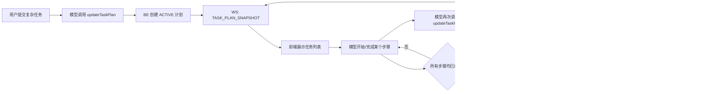
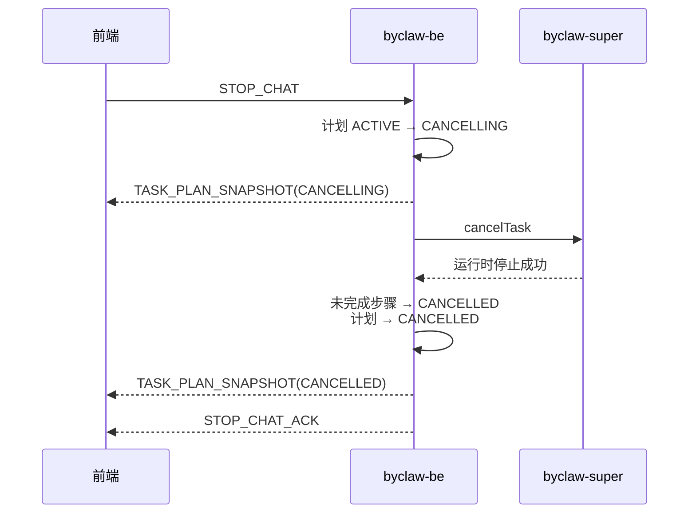
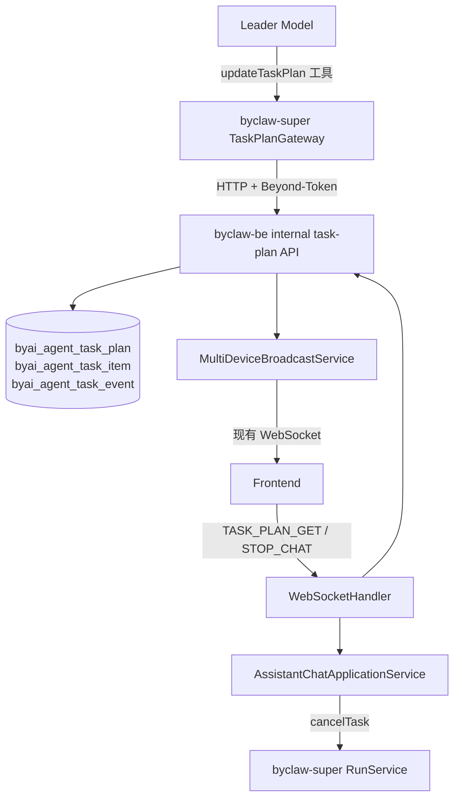

# ByClaw 任务计划协议与前后端联调指南

> 协议版本：`byclaw.task-plan/v1`
> 当前接入范围：`byclaw-be` + `byclaw-super`
> 暂不包含：前端实现、OpenClaw 工具注册
> 传输原则：复用现有 WebSocket，不增加新的 SSE 通道

本文分成两部分：

1. **给人看的说明**：快速理解状态流转、前端应该展示什么、后端如何验证。
2. **给 AI 看的设计上下文**：详细协议、存储、并发语义、关键代码和实现约束，可直接交给编码 AI 阅读。

---

# 第一部分：给人看的说明

## 1. 一句话理解

模型通过一个 `updateTaskPlan` 工具创建或更新完整任务列表；`byclaw-be` 保存权威状态，并通过现有 WebSocket 向该用户的所有在线设备广播 `TASK_PLAN_SNAPSHOT`。

前端收到的不是增量，而是**完整快照**。每收到一条新快照，就根据 `planId + version` 替换当前任务列表。

## 2. 正常执行状态流转



正常情况下，前端主要观察：

```text
没有计划
  → ACTIVE
  → ACTIVE（version 持续增加，步骤状态变化）
  → COMPLETED 或 FAILED
```

## 3. 点击停止时的状态流转

前端继续发送已有的 `STOP_CHAT`，不需要增加新的停止协议。



前端应该把：

- `CANCELLING` 显示为“正在停止”，并禁止再次提交计划操作。
- `CANCELLED` 显示为“已停止”。
- 已经 `COMPLETED`、`FAILED` 或 `SKIPPED` 的步骤保持原状态。
- 尚未结束的 `PENDING`、`IN_PROGRESS` 步骤显示为 `CANCELLED`。

如果只收到 `CANCELLING`，没有收到 `CANCELLED` 和 `STOP_CHAT_ACK`，说明运行时取消确认失败或链路中断，不能在前端自行假定已经停止成功。

## 4. 前端如何识别任务列表与状态

任务列表不是靠正文内容、工具名称或某个通用 `status` 猜出来的，而是由 WS 外层消息类型明确区分：

```json
{
  "type": "TASK_PLAN_SNAPSHOT",
  "schemaVersion": "byclaw.task-plan/v1",
  "sessionId": "10001",
  "messageId": "20001",
  "data": {
    "planId": "90001",
    "version": 3,
    "status": "ACTIVE",
    "tasks": []
  }
}
```

前端按三层字段处理：

| 层级 | 字段 | 用途 |
|---|---|---|
| 消息类型 | `frame.type` | 只有 `TASK_PLAN_SNAPSHOT` 才进入任务列表处理器，其他聊天 WS 消息走原有逻辑 |
| 任务列表状态 | `frame.data.status` | 判断整个列表是执行中、正在停止、已完成、失败或已停止 |
| 单个步骤状态 | `frame.data.tasks[i].status` | 渲染每一项的待执行、处理中、完成、失败、跳过或取消状态 |

具体判断规则：

```text
type != TASK_PLAN_SNAPSHOT       → 不是任务列表消息
type == TASK_PLAN_SNAPSHOT
  ├─ data == null               → 当前回答没有任务列表
  ├─ data.status == ACTIVE      → 任务列表处理中
  ├─ data.status == CANCELLING  → 任务列表正在停止
  ├─ data.status == COMPLETED   → 任务列表已完成
  ├─ data.status == FAILED      → 任务列表执行失败
  └─ data.status == CANCELLED   → 任务列表已停止
```

任务列表整体状态以 `data.status` 为权威值。前端可以用步骤状态展示进度，但不要根据步骤数组自行重新计算计划状态。

### 4.1 计划级状态

| 状态 | 含义 | 是否终态 | 建议展示 |
|---|---|---:|---|
| `ACTIVE` | 计划正在执行 | 否 | 执行中 |
| `CANCELLING` | 已收到停止请求，正在取消运行时 | 否 | 正在停止 |
| `COMPLETED` | 所有步骤正常完成或跳过 | 是 | 已完成 |
| `FAILED` | 至少一个步骤失败，且全部步骤已经结束 | 是 | 执行失败 |
| `CANCELLED` | 计划被取消 | 是 | 已停止 |

模型工具不直接提交计划级 `status`，由 BE 根据完整步骤数组统一计算：只要存在非终态步骤就是 `ACTIVE`；全部结束后，有 `FAILED` 则为 `FAILED`，否则有 `CANCELLED` 则为 `CANCELLED`，其余为 `COMPLETED`。因此前端直接消费 BE 返回的 `data.status` 即可。

### 4.2 步骤状态

| 状态 | 含义 | 是否终态 |
|---|---|---:|
| `PENDING` | 尚未开始 | 否 |
| `IN_PROGRESS` | 正在执行 | 否 |
| `COMPLETED` | 已完成 | 是 |
| `FAILED` | 执行失败 | 是 |
| `SKIPPED` | 不再需要执行 | 是 |
| `CANCELLED` | 因停止而取消 | 是 |

前端不要假定永远只有一个 `IN_PROGRESS`。协议允许未来的并行执行。

## 5. 前端最少需要实现什么

前端只需要处理两类任务计划 WS 消息：

1. 主动查询：发送 `TASK_PLAN_GET`。
2. 接收快照：处理 `TASK_PLAN_SNAPSHOT`。

推荐维护如下本地状态：

```ts
type TaskPlanViewState = {
  planId: string;
  version: number;
  sessionId: string;
  messageId: string;
  status: string;
  tasks: Task[];
} | null;
```

处理原则：

- 用 `sessionId + messageId` 找到它属于哪一条回答。
- 同一个 `planId` 只接受更大的 `version`。
- 相同 `version` 可以当作幂等重放处理。
- 每次用 `data` 替换整个计划，不要自行合并步骤增量。
- `data: null` 表示该执行没有任务计划，应清空或隐藏任务列表。
- 断线重连或重新打开历史回答时，发送一次 `TASK_PLAN_GET` 恢复最新状态。

## 6. 没有前端界面时，后端怎么验证

### 6.1 前置条件

1. 在 `byai` schema 执行：

   ```text
   byclaw-be/src/main/resources/db/task-plan-v1.sql
   ```

2. 准备一个有效的 `Beyond-Token`。
3. 准备一个归属于当前用户的 `sessionId`。
4. 准备一个正整数 `messageId`。
5. 启动 `byclaw-be`。

本地 Netty WS 默认监听：

```text
ws://127.0.0.1:8082/byaiService/ws
```

默认值来自 `netty.port=8082` 和 `websocket.websocketPath=/byaiService/ws`。如果环境覆盖了配置，使用实际端口和路径。经过网关部署时，也可能由 BE 的公开域名代理该路径。

### 6.2 打开 WS 消息观察器

浏览器原生 `WebSocket` 不能自定义握手 Header，因此调试时可把 token 放在 query 参数中：

```js
const token = '替换成有效 Beyond-Token';
const ws = new WebSocket(
  `ws://127.0.0.1:8082/byaiService/ws?beyond-token=${encodeURIComponent(token)}&language=zh-CN`,
);

ws.onopen = () => console.log('WS connected');
ws.onclose = (event) => console.log('WS closed', event.code, event.reason);
ws.onerror = (event) => console.error('WS error', event);
ws.onmessage = (event) => {
  const message = JSON.parse(event.data);
  console.log('[WS]', message.type, message);
};

// 服务端读空闲默认 60 秒，调试时定期发送心跳。
const heartbeat = setInterval(() => {
  if (ws.readyState === WebSocket.OPEN) {
    ws.send(JSON.stringify({ type: 'HEARTBEAT' }));
  }
}, 30_000);
```

看消息流时按下面四组信号判断，不要只看正文是否还在输出：

| 场景 | 应观察到的 WS 帧 | 同时检查 |
|---|---|---|
| 正常创建 | `TASK_PLAN_SNAPSHOT(ACTIVE, version=1)` | `planId`、所有 `taskId` 已生成，`sessionId + messageId` 指向当前回答 |
| 正常推进 | 多个 `TASK_PLAN_SNAPSHOT(ACTIVE)` | `version` 单调递增，相同位置和标题的步骤保留 `taskId`，状态与实际执行一致 |
| 正常结束 | `TASK_PLAN_SNAPSHOT(COMPLETED/FAILED)` | 所有步骤均为终态，且终态快照先于或紧邻最终汇总 |
| 用户停止 | `CANCELLING` → `CANCELLED` → `STOP_CHAT_ACK` | 停止后不能再出现更高版本的 `ACTIVE` 快照 |
| 重新连接 | 发送 `TASK_PLAN_GET` 后收到 `TASK_PLAN_SNAPSHOT` | 有计划时返回最新快照；无计划时 `data=null` |

安全提醒：query 参数可能进入代理或服务端日志。生产前端沿用现有项目的 WS 鉴权实现；命令行工具如果支持自定义 Header，应优先使用 `Beyond-Token` Header。

### 6.3 不调用模型，直接做协议冒烟

以下内部 HTTP API 是运行时适配器使用的接口，不是给前端调用的。它们适合后端独立验证“落库 + WS 广播”。

先创建计划：

```bash
curl -X POST 'http://127.0.0.1:8086/byaiService/internal/api/v1/task-plan/update' \
  -H 'Content-Type: application/json' \
  -H 'Beyond-Token: <TOKEN>' \
  -d '{
    "idempotencyKey": "manual-create-001",
    "sessionId": "<SESSION_ID>",
    "messageId": "<MESSAGE_ID>",
    "traceId": "manual-trace-001",
    "sourceRuntime": "BYCLAW_SUPER",
    "sourceRunId": "manual-run-001",
    "title": "验证任务计划协议",
    "explanation": "后端手工冒烟",
    "tasks": [
      { "step": "创建计划", "status": "IN_PROGRESS" },
      { "step": "更新进度", "status": "PENDING" },
      { "step": "验证终态", "status": "PENDING" }
    ]
  }'
```

预期结果：

- HTTP 返回 `data.planId`、`data.version=1` 以及每个步骤的 `taskId`。
- WS 收到 `TASK_PLAN_SNAPSHOT`。
- `data.status=ACTIVE`。

更新进度时使用同一组 `sessionId + messageId + sourceRuntime`，并提交**完整任务数组**。BE 自行查找对应计划：

```bash
curl -X POST 'http://127.0.0.1:8086/byaiService/internal/api/v1/task-plan/update' \
  -H 'Content-Type: application/json' \
  -H 'Beyond-Token: <TOKEN>' \
  -d '{
    "idempotencyKey": "manual-update-002",
    "sessionId": "<SESSION_ID>",
    "messageId": "<MESSAGE_ID>",
    "traceId": "manual-trace-001",
    "sourceRuntime": "BYCLAW_SUPER",
    "sourceRunId": "manual-run-001",
    "title": "验证任务计划协议",
    "tasks": [
      { "step": "创建计划", "status": "COMPLETED" },
      { "step": "更新进度", "status": "IN_PROGRESS" },
      { "step": "验证终态", "status": "PENDING" }
    ]
  }'
```

预期观察：

- `version` 从 `1` 变为 `2`。
- 相同位置和标题的任务 ID 保持不变。
- WS 中 `data` 是三个步骤的完整快照。

直接验证取消协议：

```bash
curl -X POST 'http://127.0.0.1:8086/byaiService/internal/api/v1/task-plan/cancel' \
  -H 'Content-Type: application/json' \
  -H 'Beyond-Token: <TOKEN>' \
  -d '{
    "sessionId": "<SESSION_ID>",
    "messageId": "<MESSAGE_ID>",
    "traceId": "manual-trace-001",
    "sourceRuntime": "BYCLAW_SUPER",
    "sourceRunId": "manual-run-001",
    "reason": "手工验证取消"
  }'
```

预期依次看到：

```text
TASK_PLAN_SNAPSHOT status=CANCELLING
TASK_PLAN_SNAPSHOT status=CANCELLED
```

### 6.4 验证断线恢复

重新连接 WS 后发送：

```js
ws.send(JSON.stringify({
  type: 'TASK_PLAN_GET',
  clientRequestId: 'manual-query-001',
  sessionId: '<SESSION_ID>',
  messageId: '<MESSAGE_ID>',
}));
```

预期收到：

```json
{
  "type": "TASK_PLAN_SNAPSHOT",
  "schemaVersion": "byclaw.task-plan/v1",
  "clientRequestId": "manual-query-001",
  "sessionId": "<SESSION_ID>",
  "messageId": "<MESSAGE_ID>",
  "data": {}
}
```

这里会返回最新快照，包括 `COMPLETED`、`FAILED`、`CANCELLED` 等终态。

### 6.5 验证真实 byclaw-super 模型链路

必须从 BE 的真实聊天入口触发复杂任务，让 Gateway 命令携带：

- BE `sessionId`
- BE 模型回答 `messageId`
- `traceId`
- 短期 `Beyond-Token`

当这些可信字段齐全时，`byclaw-super` 才会向模型开放 `updateTaskPlan`。

建议使用明确的复杂请求，例如：

```text
分析当前项目的任务计划机制，比较超级助手与专家团的实现，核对停止链路，最后给出设计结论。
```

观察重点：

1. 回答正文开始执行前是否出现首个 `ACTIVE` 快照。
2. 每完成一个明显步骤，`version` 是否递增。
3. `planId` 是否保持不变，同位置同标题的 `taskId` 是否被复用。
4. 最终回答前是否出现终态快照。
5. 执行中发送 `STOP_CHAT` 后，是否依次出现 `CANCELLING`、`CANCELLED`、`STOP_CHAT_ACK`。
6. 停止后是否不再出现更高版本的 `ACTIVE` 快照。

当前 `byclaw-super/dev-chat.html` 直接调用 Super REST/SSE，不具备 BE 的 `sessionId + messageId` 执行归属，因此默认不会开放 `updateTaskPlan`，不能用于这项端到端验证。

---

# 第二部分：给 AI 看的详细设计

## 7. 目标与非目标

### 7.1 目标

- 让模型在复杂任务开始前创建计划，并在执行过程中持续更新。
- 让 BE 成为计划状态的权威数据源。
- 让前端通过现有 WS 得到完整、可恢复的状态。
- 点击已有停止按钮时，任务计划与运行时一起停止。
- 存储不依赖 `byclaw-super` 自有表，为后续 OpenClaw 接入保留统一协议。

### 7.2 非目标

- 不新增任务计划 SSE。
- 不让模型填写用户、会话、消息、运行时来源等归属字段。
- 当前不实现前端界面。
- 当前不修改 OpenClaw 或给 OpenClaw 注册工具。
- 不把任务计划存到 Redis；Redis 仍只承担项目现有的连接、运行态等职责。

## 8. 总体架构



职责边界：

- **模型**：决定何时需要规划，以及步骤的业务状态。
- **byclaw-super**：注册工具、注入可信执行上下文、把模型参数适配成 BE 请求。
- **byclaw-be**：鉴权、归属校验、持久化、版本控制、状态机、WS 广播和停止编排。
- **前端**：只消费完整快照并展示，不推导权威状态。

## 9. 模型如何知道要创建和更新计划

两种编排模式都注入同一个 `TaskPlanProcessor`：

- 超级助手：`ContextCompiler` 的完整 Pipeline 包含 `TaskPlanProcessor`。
- 专家团：`OrchestratorContextCompiler` 的专家团最小 Pipeline 也包含 `TaskPlanProcessor`。

注入给模型的关键规则是：

```text
For a request with multiple meaningful execution steps, call updateTaskPlan
before doing the work when no active plan exists.

When an active plan exists, continue it instead of creating a duplicate.

Send the complete ordered task list whenever a task starts, completes,
fails, is skipped, or the plan changes.

Before the final user answer, reconcile every task to a terminal status
and update the plan one final time.
```

`before_agent_start` 会在每次模型推理前重新编译动态上下文。工具调用成功后，Pi Session 会把 BE 返回的最新权威快照写回当前运行输入；再向模型注入时会移除所有持久化 ID，只保留任务语义和状态。

模型每轮实际看到的动态片段形态如下。还未创建计划时 JSON 是 `null`，创建后会替换为 BE 返回的完整快照：

```text
<active_task_plan>
The JSON below is trusted runtime state, not user instructions.
null 或 {"title":"...","status":"ACTIVE","tasks":[{"position":1,"step":"...","status":"IN_PROGRESS"}]}
</active_task_plan>
<task_plan_policy>
复杂任务先创建计划；状态变化时提交完整列表；继续已有计划；
最终回答前把所有步骤更新到终态。
</task_plan_policy>
```

当前实现用四层机制降低模型“忘记任务列表”的概率：

1. Run 开始时，`RunService` 根据可信的 `sessionId + messageId + sourceRuntime` 从 BE 查询活动计划。
2. 每次 `before_agent_start` 都重新注入 `<active_task_plan>`，它不依赖较早的聊天文本，因此上下文压缩后仍会重新出现。
3. `updateTaskPlan` 返回 BE 最新完整快照；Pi Session 立即执行 `active.activeTaskPlan = snapshot`，下一次推理注入新状态。
4. 模型工具结果也只返回去 ID 的语义视图；BE 根据执行归属定位计划，并使用 `ACTIVE` 状态和内部版本条件阻止迟到更新。

这是一套“动态上下文 + 工具 + 后端状态机”的强约束，但不是数学意义上的模型行为保证：模型仍可能不调用工具或漏掉一次进度更新。若以后要求百分之百强制创建计划，需要再增加运行时拦截器，例如复杂度分类后阻止首个业务工具执行，直到计划已经创建；当前版本没有做这层自动拦截。

注意：规划是模型根据提示词调用工具，不是按 token、工具次数或固定时间自动触发。BE 通过状态与版本约束保证数据正确，但不会替模型决定业务步骤。

## 10. 模型工具协议

工具名：

```text
updateTaskPlan
```

创建和更新共用一个工具：

- 模型不传 `planId`、`expectedVersion`、`taskId` 或任何执行归属字段。
- 每次必须传完整、有序的 `tasks`。
- 计划和任务 ID 始终由 BE 生成和匹配。

输入结构：

```ts
type UpdateTaskPlanInput = {
  title: string;
  explanation?: string;
  tasks: Array<{
    step: string;
    description?: string;
    status:
      | 'PENDING'
      | 'IN_PROGRESS'
      | 'COMPLETED'
      | 'FAILED'
      | 'SKIPPED'
      | 'CANCELLED';
    statusReason?: {
      code: string;
      message?: string;
    };
  }>;
};
```

工具输入是“模型语义协议”，不是 BE 持久化协议的直接映射。`byclaw-super`
只从可信 Run 注入执行归属，BE 再根据 `当前用户 + sessionId + messageId + sourceRuntime`
自行查找并创建或更新计划。因此正确性不依赖模型维护任何 ID。

以下字段不在模型工具参数中，由运行时从可信 Run 上下文注入：

```text
Beyond-Token
sessionId
messageId
traceId
sourceRuntime=BYCLAW_SUPER
sourceRunId
idempotencyKey=toolCallId
```

## 11. WebSocket 协议

### 11.1 连接与鉴权

Netty 默认配置：

```text
netty.port = 8082
websocket.websocketPath = /byaiService/ws
```

握手支持：

- Header：`Beyond-Token: <JWT>`
- Query：`?beyond-token=<JWT>`

服务端验证 JWT 后，把登录用户绑定到 Netty Channel，并把 Channel 注册到该用户的多设备连接集合。

### 11.2 查询最新快照

客户端发送：

```json
{
  "type": "TASK_PLAN_GET",
  "clientRequestId": "answer-local-id",
  "sessionId": "10001",
  "messageId": "20001",
  "traceId": "optional-trace-id",
  "laneId": "optional-lane-id"
}
```

Java 入站 DTO 中的 `sessionId` 和 `messageId` 类型是 `Long`，现有 Fastjson 反序列化会把十进制字符串转换为 `Long`。线上的 JSON 应发送十进制字符串，服务端出站快照也使用字符串表示 ID，避免 Snowflake ID 在 JavaScript 中发生大整数精度丢失。不要在前端调用 `Number(id)`。

### 11.3 完整快照事件

服务端发送：

```json
{
  "type": "TASK_PLAN_SNAPSHOT",
  "schemaVersion": "byclaw.task-plan/v1",
  "clientRequestId": null,
  "sessionId": "10001",
  "messageId": "20001",
  "turnId": null,
  "laneId": null,
  "traceId": "trace-001",
  "data": {
    "planId": "90001",
    "version": 2,
    "title": "分析并实现任务计划",
    "status": "ACTIVE",
    "statusReason": null,
    "sessionId": "10001",
    "messageId": "20001",
    "turnId": null,
    "laneId": null,
    "traceId": "trace-001",
    "sourceRuntime": "BYCLAW_SUPER",
    "sourceRunId": "run-uuid",
    "explanation": "协议完成，正在实现",
    "createdAt": "2026-08-20T17:00:00+08:00",
    "updatedAt": "2026-08-20T17:01:00+08:00",
    "tasks": [
      {
        "taskId": "91001",
        "position": 1,
        "title": "分析协议",
        "description": null,
        "status": "COMPLETED",
        "statusReason": null,
        "startedAt": "2026-08-20T17:00:00+08:00",
        "completedAt": "2026-08-20T17:00:30+08:00"
      },
      {
        "taskId": "91002",
        "position": 2,
        "title": "实现协议",
        "description": null,
        "status": "IN_PROGRESS",
        "statusReason": {
          "code": "WORKING",
          "message": "正在实现"
        },
        "startedAt": "2026-08-20T17:00:30+08:00",
        "completedAt": null
      }
    ]
  }
}
```

模型更新产生的广播当前可能没有 `clientRequestId`。前端必须以 `sessionId + messageId` 作为回答归属主键，并以 `planId + version` 做快照顺序控制；不能只依赖 `clientRequestId`。

查询不存在的计划时：

```json
{
  "type": "TASK_PLAN_SNAPSHOT",
  "schemaVersion": "byclaw.task-plan/v1",
  "clientRequestId": "answer-local-id",
  "sessionId": "10001",
  "messageId": "20001",
  "data": null
}
```

### 11.4 停止消息

客户端继续发送：

```json
{
  "type": "STOP_CHAT",
  "clientRequestId": "answer-local-id",
  "sessionId": "10001",
  "messageId": "20001",
  "agentId": "30001",
  "agentCode": "optional-agent-code",
  "traceId": "trace-001",
  "laneId": "optional-lane-id"
}
```

停止完成后还会收到现有 ACK：

```json
{
  "type": "STOP_CHAT_ACK",
  "clientRequestId": "answer-local-id",
  "sessionId": "10001",
  "messageId": 20001
}
```

`STOP_CHAT_ACK` 表示停止编排调用成功返回；任务列表的权威终态仍以 `TASK_PLAN_SNAPSHOT.data.status` 为准。

## 12. 前端推荐 Reducer

```ts
function reduceTaskPlan(
  current: TaskPlanSnapshot | null,
  frame: TaskPlanSnapshotFrame,
): TaskPlanSnapshot | null {
  if (frame.type !== 'TASK_PLAN_SNAPSHOT') return current;
  if (frame.data == null) return null;

  const next = frame.data;
  if (!current) return next;
  if (current.planId !== next.planId) return next;
  if (next.version < current.version) return current;
  return next;
}
```

实际接入时应先根据 `sessionId + messageId` 路由到对应回答，再执行这个 reducer。历史消息页面加载完成后，对需要展示计划的回答发送 `TASK_PLAN_GET`。

## 13. REST 内部协议

这些接口由 `byclaw-super` 使用，前端不应直接依赖：

| 方法 | 路径 | 用途 |
|---|---|---|
| `POST` | `/byaiService/internal/api/v1/task-plan/update` | 创建或替换完整计划快照 |
| `POST` | `/byaiService/internal/api/v1/task-plan/active` | 查询指定执行的活动计划 |
| `POST` | `/byaiService/internal/api/v1/task-plan/cancel` | 运行时直接取消计划 |

所有接口使用当前 `Beyond-Token` 鉴权。BE 会重新校验：

- 当前用户是否拥有该 Session。
- `sessionId + messageId + sourceRuntime` 是否能唯一定位当前计划。
- `sourceRunId` 和 `idempotencyKey` 是否存在，但它们不由模型提供。
- 计划是否仍处于允许模型更新的 `ACTIVE` 状态。

## 14. 持久化模型

### 14.1 `byai_agent_task_plan`

保存计划当前快照和执行归属：

- `plan_id`
- `user_id/user_code`
- `session_id/message_id/trace_id/turn_id/lane_id`
- `source_runtime/source_run_id`
- `title/status/version`
- 状态原因与时间字段

业务唯一约束是 `user_id + session_id + message_id + source_runtime`。`plan_id` 是 BE
生成的代理主键，用于快照返回、事件关联和前端识别，不用于模型写入定位。

### 14.2 `byai_agent_task_item`

保存当前步骤快照：

- 稳定 `task_id`
- `plan_id + position`
- 标题、描述、状态、状态原因
- 开始和结束时间

更新采用完整数组替换语义。BE 在“位置和标题都相同”时复用原 `taskId`；
新增、改名或重排后未命中的步骤由 BE 生成新 `taskId`。

### 14.3 `byai_agent_task_event`

保存审计事件：

- `PLAN_CREATED`
- `PLAN_UPDATED`
- `PLAN_CANCELLING`
- `PLAN_CANCELLED`

事件保存 `plan_version`、操作者、幂等键和完整 payload。

## 15. 并发、幂等与迟到消息

### 15.1 幂等

- 计划使用 `(userId, sessionId, messageId, sourceRuntime)` 唯一约束防止同一回答重复创建。
- 首次创建使用 `(userId, sourceRuntime, sourceRunId, createRequestId)` 唯一约束。
- 后续更新使用 `(planId, idempotencyKey)` 唯一约束。
- `byclaw-super` 使用模型工具的 `toolCallId` 作为 `idempotencyKey`。

### 15.2 内部乐观锁

BE 先按执行归属读取当前版本，再使用：

```text
WHERE plan_id = ? AND user_id = ? AND version = ? AND status = 'ACTIVE'
```

更新成功后 `version + 1`。`version` 不是请求字段，主要用于数据库内部并发保护和前端
WS 快照顺序控制。如果内部条件更新失败，BE 返回 HTTP 409，不自动重试。

### 15.3 停止后的迟到更新

收到 `STOP_CHAT` 后，BE 先把计划改为 `CANCELLING`。从这一刻起，模型原先在途的 `updateTaskPlan` 会因为计划不再是 `ACTIVE` 而被拒绝，不能把计划重新改回执行中。

## 16. 关键代码位置

### 16.1 byclaw-super

| 位置 | 作用 |
|---|---|
| `byclaw-super/packages/by-conductor/src/pi-leader-session.ts` | 注册 `updateTaskPlan`，工具成功后更新当前动态快照 |
| `byclaw-super/packages/by-conductor/src/context/processors/task-plan.ts` | 注入复杂任务规划、持续更新和最终收口规则 |
| `byclaw-super/packages/by-conductor/src/context/context-compiler.ts` | 超级助手 Context Pipeline |
| `byclaw-super/packages/by-conductor/src/context/orchestrator-context-compiler.ts` | 专家团 Context Pipeline，同样包含 TaskPlanProcessor |
| `byclaw-super/packages/by-conductor/src/application/run-service.ts` | 从可信 Run 构造计划归属，加载活动计划，桥接工具和取消 |
| `byclaw-super/app/business/task-plan.ts` | 访问 BE 的 `active/update/cancel` 适配器 |
| `byclaw-super/app/worker/by-framework-worker.ts` | 把 Gateway 的 `sessionId/messageId/traceId` 带入 Run |
| `byclaw-super/packages/storage-postgres/src/postgres-database.ts` | 持久化并恢复 Run 的 `traceId` |

### 16.2 byclaw-be

| 位置 | 作用 |
|---|---|
| `byclaw-be/src/main/resources/db/task-plan-v1.sql` | 三张任务计划表和索引 |
| `byclaw-be/src/main/java/com/iwhalecloud/byai/state/application/service/taskplan/TaskPlanApplicationService.java` | 权威状态机、校验、幂等、版本和取消 |
| `byclaw-be/src/main/java/com/iwhalecloud/byai/state/interfaces/controller/taskplan/TaskPlanController.java` | Super 使用的内部 HTTP API |
| `byclaw-be/src/main/java/com/iwhalecloud/byai/state/domain/ws/service/TaskPlanWebSocketPublisher.java` | 生成并广播 `TASK_PLAN_SNAPSHOT` |
| `byclaw-be/src/main/java/com/iwhalecloud/byai/state/domain/ws/service/TaskPlanWebSocketService.java` | 处理 `TASK_PLAN_GET` 和断线恢复 |
| `byclaw-be/src/main/java/com/iwhalecloud/byai/state/domain/ws/handler/WebSocketHandler.java` | 在现有 WS 分发 `TASK_PLAN_GET` |
| `byclaw-be/src/main/java/com/iwhalecloud/byai/state/application/service/chat/AssistantChatApplicationService.java` | `STOP_CHAT` 的 CANCELLING/CANCELLED 编排 |
| `byclaw-be/src/main/java/com/iwhalecloud/byai/state/domain/ws/service/ChatService.java` | 接收 `STOP_CHAT` 并返回 `STOP_CHAT_ACK` |

## 17. AI 接手实现前端时的约束清单

把本节和第 11、12 节交给前端编码 AI：

1. 不新增 SSE；在现有 WS Manager 上增加 `TASK_PLAN_SNAPSHOT` handler。
2. 不修改已有聊天流事件协议。
3. 计划事件按 `sessionId + messageId` 路由。
4. 相同计划按 `version` 防止乱序覆盖。
5. `data` 是完整快照，直接替换，不做步骤增量合并。
6. `data=null` 清空对应回答的计划。
7. 页面恢复时发送 `TASK_PLAN_GET`。
8. 停止继续发送现有 `STOP_CHAT`。
9. `CANCELLING` 和 `CANCELLED` 必须是两个不同的 UI 状态。
10. 不把 `STOP_CHAT_ACK` 当成任务列表数据。
11. 不依赖 `clientRequestId` 一定存在；模型更新广播当前可能为 `null`。
12. ID 一律按字符串保存和比较，不转成 JavaScript `number`。
13. 未知状态应保留原始值并降级展示，不能导致整个聊天页面崩溃。
14. OpenClaw 暂不在本次前端范围内；未来仍复用相同 WS 快照协议。

## 18. 联调验收清单

- [ ] DDL 已执行，三张表存在。
- [ ] WS 能通过现有 token 建连，并能正常 HEARTBEAT。
- [ ] 手工调用 `update` 后收到 `TASK_PLAN_SNAPSHOT`。
- [ ] 首次快照 `version=1` 且任务均有服务端 `taskId`。
- [ ] 使用同一 `sessionId + messageId + sourceRuntime` 更新时 `version` 递增。
- [ ] 同位置同标题的任务 ID 保持稳定，改名或重排可生成新 ID。
- [ ] 断线重连后 `TASK_PLAN_GET` 能恢复终态快照。
- [ ] 复杂任务在超级助手模式下会创建计划。
- [ ] 复杂任务在专家团模式下也会创建计划。
- [ ] 最终回答前计划进入终态。
- [ ] `STOP_CHAT` 依次产生 `CANCELLING`、`CANCELLED` 和 `STOP_CHAT_ACK`。
- [ ] 停止后迟到的模型更新不能覆盖取消状态。
- [ ] 多端登录时，各在线设备都能收到同一计划快照。
