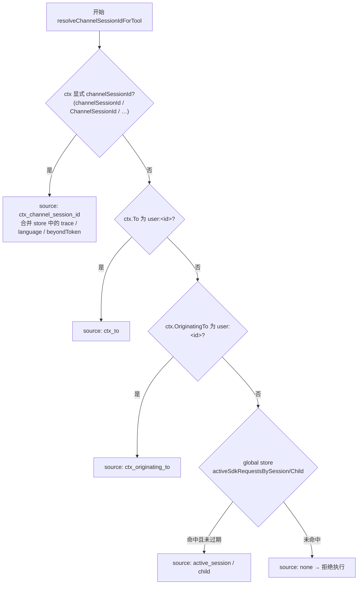
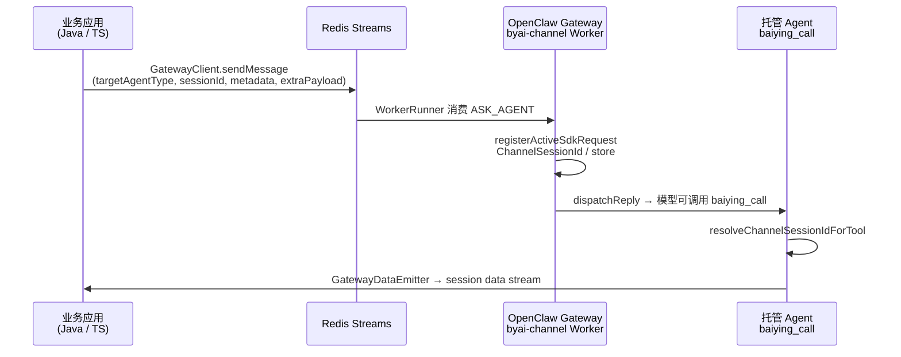

# baiying_call 与 byai-channel 消息元数据

本文说明 OpenClaw 托管 Agent 调用 **`baiying_call`** 工具时，对 **byai-channel** 入站消息元数据的依赖关系，以及如何通过 [**by-framework-ts**](https://github.com/beyonai/by-framework-ts)（npm 包 **`@byclaw/by-framework`**）向网关投递任务。

实现入口：

| 模块 | 路径 |
|------|------|
| 工具注册与执行 | `baiying-enhance/src/baiying-call-tool.ts` |
| Channel 会话解析 | `baiying-enhance/src/channel-session-resolve.ts` |
| 执行器上下文组装 | `baiying-enhance/src/resource-metadata.ts` |
| Channel 插件（写入元数据） | `byai-channel/src/sdk-message-processor.ts`、`session-context.ts` |

---

## 概述

`baiying_call` 根据当前托管 Agent 的关联资源（DOC / TOOLKIT / MCP / AGENT 等），在进程内调用 `src/executor/` 访问百应后端。**绝大多数执行路径要求存在有效的 gateway channel 会话 id**（`channelSessionId`），用于：

- MCP / HTTP 调用的 **`X-Session-Id`**（按请求隔离）
- DOC 异步检索的 **`channel-trace-id`** 路由与结果回写
- 与当前用户会话一致的 **`Beyond-Token`**（鉴权头透传）

若运行时无法解析到 `sessionId`，工具返回 `CHANNEL_SESSION_ID_REQUIRED`，不会继续调用执行器。

> **例外**：`get_doc_async_result`、`get_doc_async_readable`、`compose_doc_async_answer` 等 DOC 异步辅助 action 不强制 channel 会话，仅依赖本地 `docAsyncState` 中的任务记录。

---

## byai-channel 消息元数据

### 1. 硬性依赖与可选字段

| 字段 | 是否必填 | 用途 |
|------|----------|------|
| **channelSessionId**（gateway `sessionId`） | **是**（常规 `baiying_call`） | 写入 `resource_context.channel_session_id` 与 `openclaw_mcp_headers["X-Session-Id"]`；DOC/MCP/子 Agent 等下游 API 的会话隔离 |
| **channelTraceId**（gateway `traceId`） | 否（强烈建议） | 写入 `channel_trace_id` / `channel-trace-id`；DOC 异步任务关联、流式结果路由 |
| **language** | 否 | 执行器 `getCommonGatewayMetadata` → 下游请求 locale |
| **beyondToken** | 否（有登录态时由后端注入） | HTTP `Beyond-Token`；未提供时可回退环境变量 `BEYOND_TOKEN` |
| **requesterSessionKey** / **parentSessionKey** | 否 | OpenClaw `sessionKey`；子 Agent spawn 时记录父会话，便于共享 store 查找 |
| **sessionKey**（OpenClaw 路由键） | 隐式 | 用于从进程内 store 补全 trace / language / token |

**错误示例**（无 channel 会话）：

```json
{
  "success": false,
  "error_code": "CHANNEL_SESSION_ID_REQUIRED",
  "error": "baiying_call requires channel sessionId during runtime; cannot execute without channel session context"
}
```

### 2. 解析优先级（`resolveChannelSessionIdForTool`）

`baiying_call` 在每次 `execute()` 时调用 `resolveChannelSessionIdForTool(ctx, requesterSessionKey)`，`requesterSessionKey` 来自 OpenClaw 工具上下文（`ctx.sessionKey` / `SessionKey` / `session_id`，默认 `agent:main:main`）。



**显式 ctx 字段**（OpenClaw 可能转发到 tool ctx，大小写多种别名）：

| 语义 | 支持的 ctx 键名 |
|------|------------------|
| Gateway 会话 id | `channelSessionId`, `ChannelSessionId`, `channel_session_id`, `gatewaySessionId` |
| 追踪 id | `channelTraceId`, `ChannelTraceId`, `channel_trace_id`, `gatewayTraceId`, `traceId`, `trace_id` |
| 语言 | `language`, `Language`, `ChannelLanguage` |
| Beyond Token | `ChannelBeyondToken`, `BeyondToken` |
| 寻址（备用 sessionId） | `To`, `OriginatingTo` → 格式 `user:<sessionId>` |

**进程内共享 Store**（`byai-channel` 写入，`baiying-enhance` 只读）：

- 全局键：`__OPENCLAW_BYAI_CHANNEL_SESSION_CONTEXT_STORE__`（两边必须一致）
- `channelRequestContextsBySessionKey`：按 OpenClaw `sessionKey` 保存 `traceId`、`fields`（含 `sessionId`、`language`、`beyondToken`、`channelExtension`、`requesterSessionKey` 等）
- `activeSdkRequestsBySession` / `activeSdkRequestsByChild`：当前 SDK 请求活跃记录（TTL 15 分钟）

### 3. byai-channel SDK 入站时写入的 OpenClaw 字段

`deliverReplyToAgentViaSdk`（`byai-channel/src/sdk-message-processor.ts`）在收到 Redis `AskAgentCommand` 后，向 OpenClaw 构造入站上下文，**显式注入**供工具使用的 channel 元数据：

```typescript
const ctxPayload = {
  // …
  To: `user:${message.sessionId}`,
  OriginatingTo: `user:${message.sessionId}`,
  ChannelSessionId: message.sessionId,
  ChannelTraceId: message.traceId || "",
  SessionKey: sessionKey,
  // …
};
```

同时调用 `registerActiveSdkRequest`，将同一批信息写入共享 store（`session-context.ts`）：

| Store `fields` 键 | 来源 |
|-------------------|------|
| `sessionId` | `AskAgentCommand.header.sessionId` |
| `language` / `languageProvided` | `metadata.language` 或环境变量 `LANG` |
| `beyondToken` | `metadata["Beyond-Token"]` 或 `metadata.request_headers["Beyond-Token"]` |
| `channelExtension` | `metadata.channelExtension` |
| `requesterSessionKey` | 子 Agent 场景下由 spawn 逻辑写入 |

**SDK 入站消息类型**（`ByaiSdkInboundMessage`）：

| 字段 | 对应 gateway 协议 |
|------|-------------------|
| `sessionId` | `header.sessionId` |
| `traceId` | `header.traceId` |
| `messageId` | `header.messageId` |
| `language` | `metadata.language`（经 `resolveInboundLanguage`） |
| `beyondToken` | `metadata["Beyond-Token"]` |
| `channelExtension` | `metadata.channelExtension` |
| `extraPayload` | `body.extra_payload`（如 `agent_id`、`resource_list`） |

另：`byai-channel` 会将 `sessionId` 写入 OpenClaw state 目录 `identity/byai_session_id.txt`，供部分 legacy 执行路径读取；**`baiying_call` 主路径以 tool ctx + store 为准**。

### 4. 注入执行器 `resource_context`

`buildExecutorResourceContext`（`resource-metadata.ts`）将 channel 解析结果写入 `payload.resource_context`：

```json
{
  "root_agent": { "resourceId": "...", "resourceName": "..." },
  "selected_resource": { "resourceId": "...", "resourceType": "DOC", "..." },
  "session_key": "agent:baiying-agent-xxx:byai-channel:direct:...",
  "requester_session_key": "...",
  "parent_session_key": "...",
  "language": "zh_CN",
  "beyondToken": "<jwt>",
  "channel_session_id": "<gateway sessionId>",
  "channel_trace_id": "<traceId>",
  "openclaw_mcp_headers": {
    "X-Session-Id": "<gateway sessionId>",
    "channel-trace-id": "<traceId>"
  }
}
```

执行器各资源类型使用方式摘要：

| 资源类型 | channel 元数据用法 |
|----------|------------------|
| **DOC** | `resolveDocSessionId` ← `X-Session-Id` / `channel_session_id`；`channel-trace-id` 用于异步 SDK 与 Redis 流路由 |
| **MCP / TOOLKIT / TOOL** | `getCommonGatewayMetadata` 合并 `Beyond-Token`、`channel-trace-id` 到 `request_headers` |
| **AGENT（子 Agent SSE）** | `channel_session_id` 作为 `session_id`；`language` 影响提示与标题 |
| **OBJECT / VIEW（DataCloud MCP）** | 依赖 `X-Session-Id`；MCP URL 由 Redis 服务发现覆盖资源元数据中的静态 URL |

`getCommonGatewayMetadata` 还会按 `session_key` 再次读取共享 store，补全 `channel-trace-id` 与 `language`（与显式 `resource_context` 合并）。

### 5. Webhook 模式与 SDK 模式

| 模式 | 入站方式 | channelSessionId 来源 |
|------|----------|------------------------|
| **SDK（生产主路径）** | `@byclaw/by-framework` → Redis Stream → `ByaiSdkApp` | `header.sessionId` → `ChannelSessionId` + store |
| **Webhook** | HTTP `POST /webhook/byai-channel` | 仅 `registerWebhookContext`；**不自动写入** `ChannelSessionId` 到 tool ctx，需依赖 `To: user:<sessionId>` 或显式字段 |

集成方应优先使用 **SDK + metadata**，保证 `baiying_call` 与 DOC 异步链路会话一致。

### 6. 本地冒烟（不经过 byai-channel）

`scripts/test-baiying-call-chain.ts` 通过在 tool factory 的 ctx 中传入 `channel_session_id` 模拟 channel 上下文：

```bash
pnpm exec tsx scripts/test-baiying-call-chain.ts \
  <agentResourceId> <channelSessionId> "你的问题"
```

---

## 通过 by-framework-ts SDK 发送消息

[by-framework-ts](https://github.com/beyonai/by-framework-ts) 是面向 Node.js 的 **Redis Stream 异步 Agent 调度 SDK**（npm：**`@byclaw/by-framework`**）。OpenClaw 侧 `byai-channel` 以 **Worker** 身份消费 `AskAgentCommand`，百应 Java 后端以 **GatewayClient** 身份投递任务。

文档站：<https://beyonai.github.io/by-framework-docs>

### 1. 端到端数据流



### 2. Worker 与 agentType 约定

`byai-channel` 启动时（`sdk-app.ts`）：

- 读取环境变量 **`USER_CODE`**（与百应用户租户一致）
- 注册 worker：`workerId = byai-channel-worker-{userCode}-<random>`
- 订阅 agent type：**`BYCLAW_EXE_{userCode}`**

业务侧 `sendMessage` 的 **`targetAgentType`** 必须与 OpenClaw 进程上的 worker 一致（后端 `ParamService` 在沙箱场景下写入 `worker_agent_type`，或由 `TargetAgentTypeResolver` 解析）。

### 3. `GatewayClient.sendMessage` 参数

TypeScript（`@byclaw/by-framework`）核心参数：

| 参数 | 必填 | 说明 |
|------|------|------|
| `targetAgentType` | 是 | 例如 `BYCLAW_EXE_<userCode>` |
| `sessionId` | 是 | **即 `baiying_call` 所需的 channelSessionId** |
| `content` | 是 | 字符串或多模态 `BaiYingMessage[]` |
| `userCode` | 否 | 租户/用户编码 |
| `traceId` | 否 | 不传则自动生成；建议与业务 `userMessageId_answerMessageId` 对齐 |
| `metadata` | 否 | 写入协议 **`header.metadata`**，由 byai-channel 映射为 channel 字段 |
| `extraPayload` | 否 | 写入 **`body.extra_payload`**，影响路由与提示词 |
| `messageId` / `parentMessageId` | 否 | 消息去重与子任务关联 |
| `actionType` | 否 | 默认 `ASK_AGENT` |

### 4. `metadata`（header.metadata）与 baiying_call 映射

后端参考实现：`byclaw-be/.../gateway/route/RouteService.java`（`sendMessageWithWorkerRetry`）。

| metadata 字段 | byai-channel 行为 | baiying_call / 执行器 |
|---------------|-------------------|---------------------|
| `language` | `resolveInboundLanguage` → 入站 `language` | `resource_context.language` |
| `Beyond-Token` | `ByaiSdkInboundMessage.beyondToken` | `resource_context.beyondToken` → HTTP 头 |
| `request_headers` | 可含嵌套 `Beyond-Token` | 与上一致 |
| `channelExtension` | 写入 store `fields.channelExtension`；hook 可拼入系统提示 | 间接影响模型，不直接进入 executor |
| 其他自定义键 | 保存在 store `fields` | 仅当写入 `request_headers` 时可能被 `getCommonGatewayMetadata` 使用 |

**Java 侧典型组装**（节选）：

```java
Map<String, Object> metadata = JSON.parseObject(reqMetadata, Map.class);
metadata.put("language", ChatUtils.getLanguage());
metadata.put("Beyond-Token", jwtService.createJwt(loginInfo));
metadata.put("request_headers", Map.of("Beyond-Token", beyondToken));
if (chatDto.getChannelExtension() != null) {
    metadata.put("channelExtension", chatDto.getChannelExtension());
}
gatewayClient.sendMessage(targetAgentType, sessionId, messageContent,
    userCode, userName, actionType, parentMessageId, answerMessageId,
    traceId, params, metadata);
```

`channelExtension` 键约定见 `ChatChannelExtensionKeys`（如 `channelType`、`dingtalk.*` 等）。

### 5. `extraPayload`（body.extra_payload）

| 字段 | 作用 |
|------|------|
| `agent_id` / `agent_code` / `agent_name` | 指定托管 Agent；`agent_id` 会映射为 `baiying-agent-{id}` |
| `resource_list` | 用户 @ 的资源列表；byai-channel 在问题前插入 `<!-- remind_context -->`，并提示模型使用 **`baiying_call`** |
| `ext_params` | 扩展参数（如 `resumeFromSubAgent` 子 Agent 回传） |
| `worker_agent_type` | 后端路由目标 worker（Java `ParamService`） |

这些字段**不替代** `metadata` 中的 `sessionId` / `traceId`；会话隔离仍以 **`header.sessionId`** 为准。

### 6. TypeScript 发送示例

```typescript
import { GatewayClient, WorkerRegistry, createRedis, ActionType } from '@byclaw/by-framework';

const redis = createRedis({
  host: process.env.REDIS_HOST ?? 'localhost',
  port: Number(process.env.REDIS_PORT ?? 6379),
  db: Number(process.env.REDIS_DATABASE ?? 0),
  password: process.env.REDIS_PASSWORD,
});

const registry = new WorkerRegistry(redis);
const client = new GatewayClient(registry, redis);

const userCode = 'your-user-code';
const sessionId = '10049627'; // 业务会话 id → baiying_call channelSessionId
const traceId = `${userMessageId}_${answerMessageId}`;

const res = await client.sendMessage({
  targetAgentType: `BYCLAW_EXE_${userCode}`,
  sessionId,
  traceId,
  userCode,
  content: '请介绍鲸智百应平台',
  metadata: {
    language: 'zh_CN',
    'Beyond-Token': '<jwt-or-gateway-token>',
    request_headers: { 'Beyond-Token': '<jwt>' },
    channelExtension: { channelType: 'web' },
  },
  extraPayload: {
    agent_id: '10036261',
    resource_list: [
      { resourceId: '10001', resourceType: 'KG_DOC', resourceName: '产品手册' },
    ],
  },
});

console.log(res.message_id, res.trace_id);
await redis.quit();
```

**前置条件**：

1. Redis 可达，且 OpenClaw 已启动 `byai-channel`（`USER_CODE` 与 `targetAgentType` 一致）。
2. `baiying-enhance` 已同步对应托管 Agent 与资源快照。
3. `sessionId` 在业务侧保持稳定，以便 DOC 异步与 MCP 会话文件目录 `/by/.sessions/<sessionId>/` 一致。

### 7. 接收流式回复

Worker 侧通过 `GatewayDataEmitter` 写入 `byai_gateway:session:{sessionId}:data_stream`。业务应用通常在 `sendMessage` 成功后订阅同 session 的数据流（Java：`SessionStreamManager`；TS：监听 Redis stream 或使用 SDK 提供的消费示例）。

事件类型包括 `answerDelta`、`reasoningLogDelta`、`appStreamResponse`（结束）、`finalAnswer` 等（见 SDK `EventType` 枚举）。

### 8. 取消任务

```typescript
await client.cancelTask({
  messageId: res.message_id,
  sessionId,
  reason: 'user aborted',
  cancelMode: 'graceful',
});
```

`byai-channel` 按 `traceId` 查找 `ActiveSdkRequest` 并 `abort` 当前 OpenClaw run（`sdk-app.ts` `subscribeCancel`）。

### 9. 环境变量速查（OpenClaw Worker 侧）

| 变量 | 说明 |
|------|------|
| `USER_CODE` | byai-channel Worker 的 agent type 后缀 |
| `REDIS_HOST` / `REDIS_PORT` / `REDIS_DATABASE` / `REDIS_PASSWORD` | SDK 与 store 共用 |
| `BEYOND_TOKEN` | 无 channel token 时执行器鉴权回退 |
| `BAIYING_SESSION` | DOC 会话 id 回退（非 channel 主路径） |

---

## 相关文档

| 文档 | 内容 |
|------|------|
| [PLUGIN_OVERVIEW.zh-CN.md](./PLUGIN_OVERVIEW.zh-CN.md) | baiying-enhance 插件总览 |
| [byai-channel/README.md](../../byai-channel/README.md) | Channel Webhook 配置 |
| [10-byai-channel-redis-nogroup.md](../../../docs/deployment/10-byai-channel-redis-nogroup.md) | Redis Stream 消费组异常 |
| [by-framework-ts README](https://github.com/beyonai/by-framework-ts/blob/main/README.md) | SDK 安装与 API |
