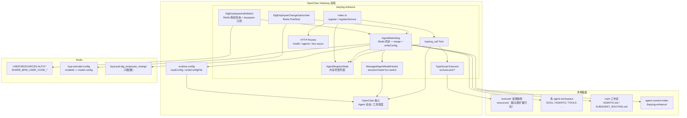
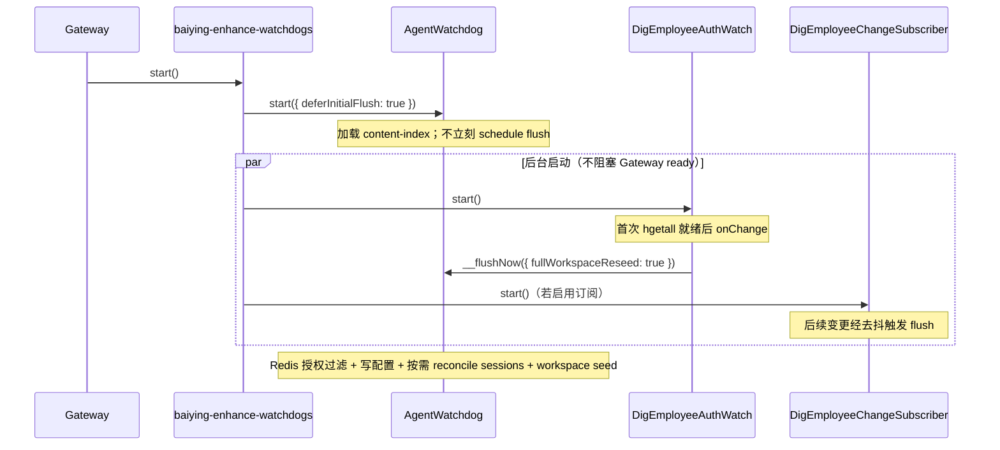
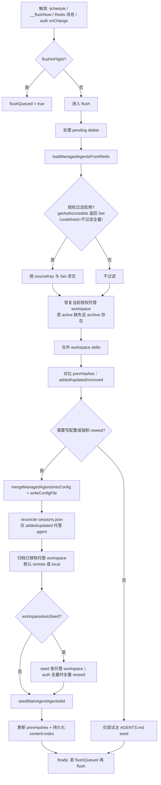
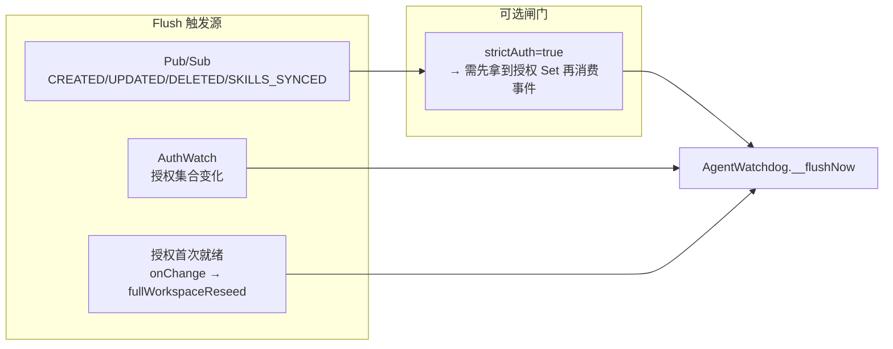
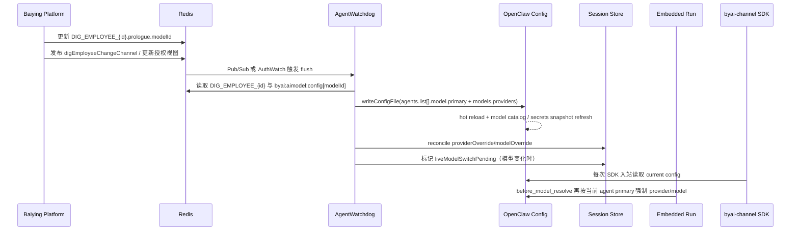
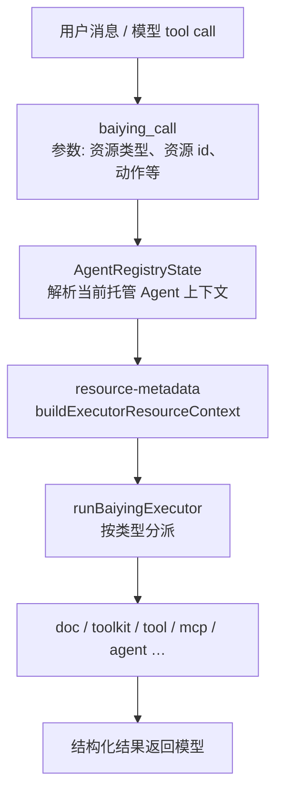

# Baiying Enhance（`baiying-enhance`）插件说明

本文档从整体视角说明本插件在 OpenClaw 网关中的职责、组件架构与主要数据流。实现入口为扩展根目录的 [`index.ts`](../index.ts)，配置清单为 [`openclaw.plugin.json`](../openclaw.plugin.json)。

---

## 1. 插件做什么（一句话）

**把 Redis 中的百应数字员工 JSON 同步为 OpenClaw 可运行的托管 Agent（`baiying-agent-*`），通过 `prologue.modelId` 从 Redis Hash `byai:aimodel:config` 解析模型服务（密钥用运行时 SecretRef，不写入提示词或配置明文），并在运行时通过工具 `baiying_call` 与内置 TypeScript 执行器访问知识库、Toolkit、MCP、下游 Agent 等资源；Agent JSON 变更由 Redis Pub/Sub（可选）与 dig-employee 授权视图驱动重新扫描，workspace skill 上传由 `fs.watch` 与短周期扫描自动感知。**

---

## 2. 核心能力

| 能力                         | 说明                                                                                                                                                                                                                                                                                                                                                                                                                         |
| ---------------------------- | ---------------------------------------------------------------------------------------------------------------------------------------------------------------------------------------------------------------------------------------------------------------------------------------------------------------------------------------------------------------------------------------------------------------------------- |
| **Agent 同步**               | 按授权 id 读取 Redis `DIG_EMPLOYEE_{resourceId}`，解析并适配为 OpenClaw `agents.list` 条目；若存在 `prologue.modelId`，再从 `byai:aimodel:config` 读取模型详情并写入托管 `models.providers`，写回当前生效配置文件（通常为 `openclaw.json`）。`aimodel` 临时不可用时保留上次成功同步的模型绑定。 |
| **模型密钥**                 | `byai:aimodel:config` 中的 `authToken` 不落盘到 `openclaw.json`；托管 provider 写入 exec SecretRef（默认 provider `baiying-aimodel-redis`），运行时再从 Redis 取 token。                                                                                                                                                                                                                                                     |
| **模型热切换**               | Redis Pub/Sub 或授权变更触发同步后，插件会热写 `agents` / `models`，并对已有 session 同步 `providerOverride` / `modelOverride` 与 `modelProvider` / `model`；模型变化时设置 `liveModelSwitchPending`，入站消息和每轮 `before_model_resolve` 再次按最新配置兜底对齐。                                                                                                                                                   |
| **授权过滤**                 | 通过 Redis 中 `USER_CODE` 关联的 dig-employee 授权集合，仅同步当前用户可见的数字员工；授权集合变化会触发全量工作区再种子化（`fullWorkspaceReseed`）。                                                                                                                                                                                                                                                                        |
| **Redis Pub/Sub**            | 订阅 `digEmployeeChangeChannel`（默认 `byai:pub:dig_employee_change`），合并去抖后触发与目录扫描一致的 flush（含 `DIG_EMPLOYEE_DELETED` 等）。                                                                                                                                                                                                                                                                               |
| **内容索引**                 | 可选持久化各 Agent 源 JSON 的 SHA-256（`agent-content-index-*.json`），减少网关重启后的无意义全量写盘。                                                                                                                                                                                                                                                                                                                      |
| **工作区种子**               | `workspaceAutoSeed`：由 `seedManagedAgentWorkspace` 为每个托管 Agent 创建目录并写入 `SOUL.md`、`AGENTS.md` 等；主 Agent 工作区另由 `main-workspace-seed` 维护 `AGENTS.md` 与 `SUBAGENT_ROUTING.md`。已有 `agents.list[].workspace` 会保留；新建托管 Agent 的默认 workspace 路径见 `resolveDefaultManagedWorkspacePath`（`main` 为 `<stateDir>/workspace/`，其余为 `<stateDir>/workspace-<agentId>/`）。                      |
| **取消授权归档**             | `workspaceArchiveOnUnauthorized` 默认开启，`workspaceArchiveBackend` 默认 `remote`：取消授权会上传到后端归档 API 的 `cancel_auth_latest.tar.gz`，成功后删除本地 active workspace；删除广播会上传 `del_latest.tar.gz` 并删除本地 workspace；重新授权只尝试恢复 `cancel_auth` 归档。显式配置 `workspaceArchiveBackend: "local"` 时保留旧的 `<dirname(stateDir)>/.baiying-workspaces/` 本地兼容模式。                           |
| **Workspace Skill 自动感知** | 默认扫描 `skills/<目录>/SKILL.md`，优先读取 `SKILL.md` frontmatter 的 `name` 作为真正写入 `agents.list[].skills` 的 skill filter 名称；只把当前 agent workspace 下的用户上传 skill 合并到该托管 Agent，不读取其它 agent workspace；main workspace 的 `workspace/skills` 仅在 `workspaceSkillIncludeMainShared: true` 时作为共享 skill 来源。兜底扫描只做 skill diff，不重新扫描 Agent JSON 目录，也不会触发托管 Agent 增删。 |
| **热重载协作**               | 默认将 `plugins.entries.baiying-enhance`、`agents` 与 `models` 作为热前缀；同步写托管 Agent、模型 provider、skills/tools 时不触发整进程重启。也可为其它 `plugins.entries.*` 注册热前缀（`configSyncHotPluginEntriesPrefixes`）。                                                                                                                                                                                           |
| **`baiying_call` 工具**      | 按 Agent JSON 中的关联资源列表，在进程内调用执行器（`src/executor/`）完成文档检索、工具调用、MCP、子 Agent 调用等。                                                                                                                                                                                                                                                                                                          |
| **HTTP 探针**                | 健康检查、当前内存注册表中的托管 Agent 列表、文档异步任务查询与完成回调。                                                                                                                                                                                                                                                                                                                                                    |

> **`agents.list[].skills`（托管子 agent）**：写回网关配置时，列表项**始终包含** `skills`。取值由 Agent JSON **根**上的 **`relSkills`**（非空字符串数组，优先）或根级 **`skills`**（兼容旧版）推导，并在 `workspaceSkillAutoEnable` 默认开启时合并 workspace 上传 skill（优先使用 `SKILL.md` frontmatter `name`）；二者皆无时为 **`[]`**。实现见 [`src/agent-adapter.ts`](../src/agent-adapter.ts) 与 [`src/workspace-skills.ts`](../src/workspace-skills.ts)。

---

## 3. 系统架构图

下图表示插件在 OpenClaw 网关进程内的静态分层与外部依赖关系。

---

## 4. 组件职责（与代码对应）

| 组件                            | 主要源文件                                                   | 职责摘要                                                                                                                                                                                                                   |
| ------------------------------- | ------------------------------------------------------------ | -------------------------------------------------------------------------------------------------------------------------------------------------------------------------------------------------------------------------- |
| **AgentWatchdog**               | `src/agent-watchdog.ts`                                      | 从 Redis 授权视图加载数字员工 → 恢复已归档 workspace → 合并 workspace skills → diff → `mergeManagedAgentsIntoConfig` → `writeConfigFile`；按需归档已移除 workspace、`seedManagedAgentWorkspace`、`seedMainAgentAgentsMd`。 |
| **DigEmployeeAuthWatch**        | `src/dig-employee-auth-watch.ts`                             | `USER_CODE` + `REDIS_*` 连接 Redis；定时 `hgetall` 刷新授权 id，并对 `USER:RESOURCES:AUTH:{userId}` 做 **keyspace 通知**（`pmessage`）；变化时 `onChange` → `__flushNow({ fullWorkspaceReseed: true })`。                  |
| **DigEmployeeChangeSubscriber** | `src/dig-employee-change-subscriber.ts`                      | 订阅频道，解析 `DigEmployeeChangeEvent`，合并去抖后 `flushNow`；`strictAuth` 时可要求在拿到授权集后再处理事件。                                                                                                            |
| **baiying_call**                | `src/baiying-call-tool.ts` + `src/executor/`                 | 根据当前托管 Agent 与资源元数据路由到 doc / toolkit / tool / mcp / agent 等执行路径。                                                                                                                                      |
| **HTTP**                        | `src/http-routes.ts`                                         | `/plugins/baiying-enhance/health`、`/agents`、`/doc-async/*`。                                                                                                                                                             |
| **路由种子**                    | `src/main-workspace-seed.ts`、`src/subagent-routing-seed.ts` | 主工作区 `AGENTS.md` 与子 agent 路由摘要 `SUBAGENT_ROUTING.md`。                                                                                                                                                           |

---

## 5. 服务启动与首次同步流程

`registerService` 的 `start` 阶段决定启动顺序（与 [`index.ts`](../index.ts) 一致）：**先启动 Watchdog（推迟首次 flush），再在后台启动授权监听与 Pub/Sub**；**首次完整同步由 dig-employee 授权首次就绪时的 `onChange` 触发**（`__flushNow({ fullWorkspaceReseed: true })`），网关 `start()` 本身不阻塞等待该同步完成。

---

## 6. 单次 Flush（同步）逻辑流程图

Flush 由 **去抖定时器**、**`__flushNow`**、**授权 onChange**、**Pub/Sub 回调** 等多源触发，内部通过 `flushInFlight` / `flushQueued` 串行化。

---

## 7. Redis Pub/Sub 与授权的关系（概念图）

---

## 8. 数字员工模型热切换流程

百应平台上调整数字员工使用的模型后，插件不要求整网关重启。核心生效链路如下：

要点：

- `prologue.modelId` 是百应侧数字员工到模型服务的唯一输入；模型 URL、`modelCode`、上下文窗口、`authToken` 等来自 Redis Hash `byai:aimodel:config`。
- `authToken` 只作为 exec SecretRef 的运行时来源，不写入数字员工提示词、`auth-profiles.json` 或 `openclaw.json` 明文。
- 已存在 session 由 `reconcileAgentSessionModelsAfterSync` 更新；新建或刚进入的 byai 会话由 `before_dispatch` 钩子补齐；每轮实际模型解析再由 `before_model_resolve` 兜底。
- `byai-channel` SDK worker 每次处理消息都读取 runtime current config，避免热重载后仍使用启动时捕获的旧 `OpenClawConfig`。
- 当前正在生成的 turn 不会中途换模型；模型变更通常从下一条入站消息或下一轮 embedded run 生效。

---

## 9. 模型调用 `baiying_call` 时的执行路径（简图）

文档类资源可能走异步通道，网关侧通过 `doc-async` HTTP 与 [`doc-async-state`](../src/doc-async-state.ts) 与外部完成方协作（见 [`http-routes.ts`](../src/http-routes.ts)）。

---

## 10. 主会话与子 Agent 编排（与 SUBAGENT_ROUTING）

主 Agent 默认模板（构建时内联到 `dist/index.js`）约定：**可先读 `SUBAGENT_ROUTING.md` 再调用 `agents_list`，再通过 `sessions_spawn` 委托子 agent**。路由摘要由每次 flush 后根据当前可见托管列表生成，详细说明见 [SUBAGENT_ROUTING_SCHEME.md](./SUBAGENT_ROUTING_SCHEME.md)。

---

## 11. 配置与环境变量（速查）

- **插件配置**：见 [`openclaw.plugin.json`](../openclaw.plugin.json) 中 `properties`（如 `agentConfigDir`、`digEmployeeChangeSubscribe`、`digEmployeeChangeChannel`、`mainAgentsMdMode` 等）。
- **Redis / 身份**：`DigEmployeeAuthWatch` 使用 `USER_CODE`、`REDIS_HOST`、`REDIS_PORT`、`REDIS_DATABASE` 等（详见 `src/dig-employee-auth-watch.ts`）。
- **Pub/Sub 开关**：配置项 `digEmployeeChangeSubscribe` 或环境变量 `BAIYING_DIG_EMPLOYEE_CHANGE_SUBSCRIBE=true`。

完整 JSON 示例与安装说明见根目录 [README.md](../README.md)。

---

## 12. HTTP 接口一览

| 方法 | 路径                                          | 说明                                       |
| ---- | --------------------------------------------- | ------------------------------------------ |
| GET  | `/plugins/baiying-enhance/health`             | 插件存活与当前注册 agent 数量              |
| GET  | `/plugins/baiying-enhance/agents`             | 内存中的托管 agent 列表摘要                |
| GET  | `/plugins/baiying-enhance/doc-async/tasks`    | 文档异步任务列表                           |
| POST | `/plugins/baiying-enhance/doc-async/complete` | 完成或失败回调（`task_id` / `message_id`） |

以上路由均需 **gateway** 认证。

---

## 13. 相关文档索引

| 文档                                                                                 | 内容                                        |
| ------------------------------------------------------------------------------------ | ------------------------------------------- |
| [README.md](../README.md)                                                            | 安装、配置示例、与官方文档站链接            |
| [BAIYING_CALL_CHANNEL_METADATA.md](./BAIYING_CALL_CHANNEL_METADATA.md)               | `baiying_call` 依赖的 byai-channel 元数据与 by-framework SDK 发消息 |
| [SUBAGENT_ROUTING_SCHEME.md](./SUBAGENT_ROUTING_SCHEME.md)                           | 主会话子 agent 路由与 `SUBAGENT_ROUTING.md` |
| [AGENT_JSON_WORKSPACE_MD_MAPPING.md](./AGENT_JSON_WORKSPACE_MD_MAPPING.md)           | Agent JSON 与各工作区 Markdown 字段映射     |
| [dig-employee-pubsub-client-migration.md](./dig-employee-pubsub-client-migration.md) | Pub/Sub 客户端迁移说明                      |

---

## 14. 术语

| 术语           | 含义                                                                                             |
| -------------- | ------------------------------------------------------------------------------------------------ |
| **托管 Agent** | `agents.list` 中以 `baiying-agent-` 为前缀、由本插件写入与维护的条目（`MANAGED_AGENT_PREFIX`）。 |
| **sourceKey**  | 百应侧数字员工资源 id（字符串），用于文件名 `AGENT_<id>.json` 及环境变量模板 `{sourceKey}`。     |
| **Flush**      | 一次「读盘 → 过滤 → 合并配置 → 写盘 → 可选 workspace 种子」的同步周期。                          |
