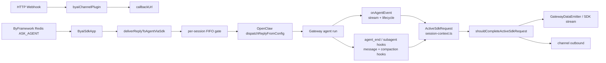
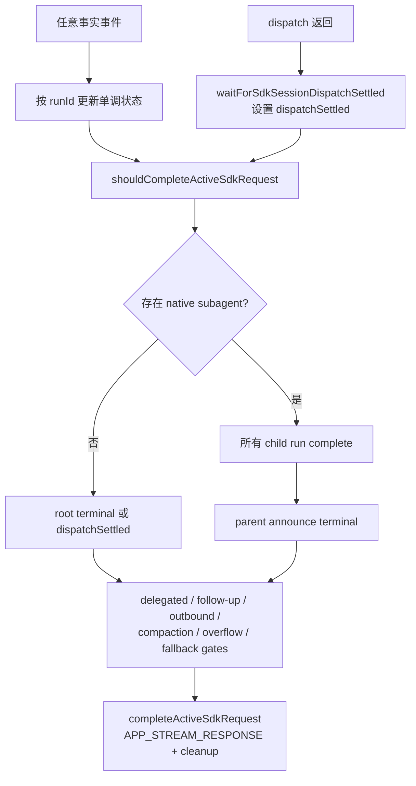

# byai-channel 维护者指南

`byai-channel` 是一个把 ByAI 的 Webhook/Redis 消息接入 OpenClaw Gateway 的自定义 channel。它的关键职责不是复刻普通 OpenClaw channel 的“这一轮 dispatch 返回即结束”，而是把 OpenClaw 的流式 agent events、hooks、原生 `sessions_spawn` 子 agent、外部委派任务和 SDK 输出拼成一次业务会话。

这份文档写给第一次维护该模块的 agent 和开发者。修改代码前先读本页，再按下面的源码阅读顺序定位 owner；如果只读 `channel.ts` 或只读 `sdk-message-processor.ts`，很容易把 transport 生命周期误当成业务生命周期。

## 先记住的四条不变量

1. **dispatch 返回不等于业务会话结束。** `dispatchReplyFromConfig` 返回后，agent event 队列、child run、outbound 投递或 follow-up 仍可能在运行。
2. **事件通道是独立的。** `onAgentEvent` 的 lifecycle 与 hook 的 `agent_end`/`subagent_ended` 没有跨通道等待关系，不能依赖它们的到达顺序。
3. **原生 subagent 必须按 runId 归并。** child run 的终态可能从四个互不等待的通道抵达：child lifecycle terminal、`agent_end`、`subagent_ended`、`subagent_progress phase=ended`。四者都收敛到 `markActiveSdkNativeChildRunTerminal`，首个抵达者推进状态、其余去重。同一个 child session 复用时，旧 run 的迟到事件不能清除新 run。
4. **旧完成门不能被绕过。** delegated work、delegated follow-up、outbound、compaction、overflow continuation、model fallback 都是独立门槛；native subagent 逻辑只能增加条件，不能删除这些判断。

## 推荐源码阅读顺序

| 顺序 | 文件                                                                                                                                                                                                       | 先回答的问题                                                                |
| ---- | ---------------------------------------------------------------------------------------------------------------------------------------------------------------------------------------------------------- | --------------------------------------------------------------------------- |
| 1    | [`index.ts`](./index.ts)                                                                                                                                                                                   | 插件如何注册 channel、hooks、agent events 和远程任务 watcher？              |
| 2    | [`src/channel.ts`](./src/channel.ts)                                                                                                                                                                       | channel 配置、Webhook outbound、SDK app 启停边界是什么？                    |
| 3    | [`src/sdk-app.ts`](./src/sdk-app.ts)                                                                                                                                                                       | Redis `ASK_AGENT` 消息如何变成 SDK 入站？如何 ack/cancel？                  |
| 4    | [`src/sdk-message-processor.ts`](./src/sdk-message-processor.ts)                                                                                                                                           | 如何路由 session、调用 `dispatchReplyFromConfig`、处理 overflow 和 settle？ |
| 5    | [`src/agent-event.ts`](./src/agent-event.ts)                                                                                                                                                               | 流式 assistant/thinking/tool/lifecycle 如何转换为 SDK 输出？                |
| 6    | [`src/hooks.ts`](./src/hooks.ts)                                                                                                                                                                           | hooks 如何记录 agent_end、outbound、compaction 和运行态事实？               |
| 7    | [`src/session-context.ts`](./src/session-context.ts)                                                                                                                                                       | ActiveSdkRequest 的状态 owner 和最终完成谓词是什么？                        |
| 8    | [`src/session-dispatch-gate.ts`](./src/session-dispatch-gate.ts)、[`src/session-dispatch-settle.ts`](./src/session-dispatch-settle.ts)、[`src/sdk-session-completion.ts`](./src/sdk-session-completion.ts) | 同一 session 如何串行、等待和收尾？                                         |
| 9    | [`src/remote-task-watch.ts`](./src/remote-task-watch.ts)、[`src/remote-followup.ts`](./src/remote-followup.ts)                                                                                             | 外部委派结果如何持久化、重试和唤醒原 session？                              |

## 运行时总览



插件入口在 [`index.ts`](./index.ts)。`registerCliMetadata` 只提供 channel 元数据；`registerFull` 才安装运行时订阅和服务：

- `replaceAgentEventSubscription` 订阅 `api.runtime.events.onAgentEvent`。
- `registerByaiHooks` 注册 channel 需要的 hooks。
- `registerContextSnapshotHook`、`registerByaiSessionStatusRoute`、`registerRemoteTaskWatchService` 注册辅助能力。
- `subagent_spawned`、`subagent_ended`、`subagent_progress` 由入口直接接收，因为它们是 OpenClaw 的全局事件/hook 边界。`subagent_progress` 是较新核才有的 hook；老核不认识该名字时只会 warn 并忽略注册，判定不依赖它。

`channel.ts` 的 `gateway.startAccount` 动态启动 [`ByaiSdkApp`](./src/sdk-app.ts)，并在 stop/abort 时停止它。channel 的配置与 SDK worker 是同一个插件，但两者的入站路径不同。

## 入站路径

### Redis SDK：消费 ASK_AGENT，再进入 OpenClaw dispatch

`ByaiSdkApp.start()` 会创建 worker、注册 Redis consumer group、启动 heartbeat，并注册 `ASK_AGENT` subscription。收到消息后，它会：

1. 校验 `content`、`sessionId`、`messageId`，无效消息直接 ack。
2. 保存 execution 记录，解析文本、附件、语言、trace、connector authorization 和 lane metadata。
3. 对 multi-agent batch 做 lane fan-out；各 lane 独立调用 `deliverReplyToAgentViaSdk`，但仍由各自的 sessionKey 控制并发。
4. 处理完成后 ack；失败时发送 SDK error state，再 ack，避免 Redis 消息永久悬挂。
5. cancel subscription 按 traceId 查找 `ActiveSdkRequest`，触发 abort，并释放被取消 dispatch 的 session gate。

SDK 输出通过 `GatewayDataEmitter` 发回 Redis/SDK，而不是依赖普通 channel 的最终 outbound。普通 channel 入口通常只能看到 root agent 的流；byai-channel 的 `onAgentEvent` 订阅能同时看到 root、native subagent 和各类 stream。

## 一次 SDK 业务会话

### 1. 建立路由和 ActiveSdkRequest

[`deliverReplyToAgentViaSdk`](./src/sdk-message-processor.ts) 先根据 session/user 和 lane metadata 解析 agent route，等待 managed agent 配置就绪，再生成 `sessionKey`。默认 `sessionKeyPerSessionId=false`；开启后会把 sessionId 纳入路由隔离。

进入同一 session 的处理前，`runSessionDispatchExclusive` 获取 per-session FIFO gate。这个 gate 防止 embedded run 在模型 I/O 期间释放 transcript lock 时，被第二个 dispatch 修改同一 session 文件。

gate 内通过 `registerActiveSdkRequest` 建立 request，关键关联字段是：

- `sessionKey`：OpenClaw transcript/session 的主关联键。
- `to`：SDK outbound 查找 request 的目标键。
- `sessionId`、`traceId`：前端流和诊断链路的标识。
- `boundRunIds`：已知属于该 SDK request 的 runId。
- `nativeChildRuns`：native subagent 的权威台账，按 child runId 索引，`terminalAt === undefined` 即仍在跑。判定统一走 `hasPendingNativeChildRun`，不另存一份 child session 集合。
- `rootRunsObservedWhileChildrenPending`：child 未闭合期间观测到的 root lifecycle start 次数，用于给早到的 announce 续跑抵账。
- `delegatedWorkToolCallIds`：外部委派尚未回灌的 tool call 集合。

### 2. 预构建 prompt snapshot

dispatch 前会调用 `buildPromptInjectionSnapshot` 并通过 `setPromptInjectionSnapshot` 暂存。`before_prompt_build` hook 优先读取这个 snapshot，避免在 hook 阶段重新做可能产生副作用的上下文构建。snapshot 可包含文件路由提示、语言、用户区段、group context、connector soft-control 和 lane 信息。

`contextSnapshot` 是另一个独立能力：打开后，`llm_input` hook 把最终模型输入写入当前 agent 的 sessions 目录，采用覆盖写入并限制字符串和数组大小。它用于调试“模型实际收到什么”，不是业务完成状态的一部分。

### 3. 创建并 dispatch

`runOneDispatch` 每次都会新建 envelope、dispatcher 和 reply options，但复用同一 `sessionKey`、`To`、emitter 和 abort signal。这样 overflow continuation 或其他 follow-up 可以是新的 OpenClaw run，而不会把不同 dispatch 的 reply context 混在一起。

`onAgentRunStart` 调用 `bindActiveSdkRequestRunId` 把 SDK 自己启动的 root run 绑到 request，并注册 agent-end promise。native subagent 产生的 parent announce 续跑是 direct-path 启动的、不经过这个 callback，它只会以 root lifecycle start 的形式出现——见下面的 announce 抵账。

### 4. dispatch 返回后的 settle

正常路径在 `finally` 调用 `waitForSdkSessionDispatchSettled`。它先标记 `dispatchSettled=true`，然后循环检查 `shouldCompleteActiveSdkRequest`；满足后调用 `completeActiveSdkRequest`，发出 `APP_STREAM_RESPONSE` 并清理 request。

context-overflow recovery 期间会把 settle 延后给 OpenClaw recovery 事件；overflow continuation 在同一个 session gate 内运行，并用 `overflowContinuePending` 覆盖截断 run 到续跑 run 的整个窗口。

## 流式事件和 hooks

### agent events：展示流与 lifecycle

入口收到 `onAgentEvent` 后先 `structuredClone`，再通过 [`agent-event-serial.ts`](./src/agent-event-serial.ts) 排队执行。这样 Redis/SSE 输出不会和 OpenClaw transcript 写入在同一同步 tick 中竞争。

[`src/agent-event.ts`](./src/agent-event.ts) 按 stream 处理：

| stream/phase          | 处理                                                                   | 是否决定业务结束                  |
| --------------------- | ---------------------------------------------------------------------- | --------------------------------- |
| `assistant`           | 增量去重后发 ANSWER_DELTA；child assistant 使用 reasoning/log 类型展示 | 否，只产出流                      |
| thinking/reasoning    | 发 reasoning start/delta/end                                           | 否                                |
| `tool` start/result   | 发工具标题、输入和输出；识别 message tool 与 delegated status          | delegated status 会增加独立完成门 |
| `lifecycle/start`     | 登记 root/announce run，取消已有 completion timer                      | 否，表示 run 开始                 |
| `lifecycle/end/error` | 登记 root 或 child terminal，并 schedule completion check              | 是候选事实，仍需所有门通过        |
| `compaction`          | 发压缩状态提示并维护 compaction gate                                   | 可能暂时阻塞结束                  |

assistant 事件按 runId 使用 incremental snapshot，避免累计文本重复发出。`message` 工具的 outbound 不从文本内容猜测，而是由 tool start 登记 pending message send，再由 `channel.ts` 的 `sendText` 消费该标记；未命中时抑制 agent 回复回声。

### hooks：事实记录，不负责猜顺序

[`src/hooks.ts`](./src/hooks.ts) 的 `agent_end` 会先保留现有 stopReason/length/aborted 错误归一化，再把结果交给：

- root run 的 agent-end promise，用于最终错误输出。
- `reportNativeChildRunTerminal(api, { childRunId: runId, source: "agent_end" })`，作为 child 终态事实之一。root run 的 runId 不在台账里，登记会自然落空。
- overflow length 检测和 continuation gate（当适用时）。

`message_sending`/`message_sent` 维护 `pendingOutboundCount`；compaction、model call 等 hooks 更新对应状态。不要把这些 hook 的执行顺序假定成 lifecycle 顺序。

## 业务完成状态机

### 普通 root request

没有 native subagent 时，root 完成信号保持旧语义：

- 已绑定 run：需要 `rootLifecyclePhase` 为 `end` 或 `error`。
- 没有启动 run：需要 `dispatchSettled`，覆盖 precheck-blocked 等没有 lifecycle 的路径。

### delegated work 是正交方向

`baiying_call` 返回 `DELEGATED_TASK_STATUS` 时，只有非 subagent session 的 tool call 才登记到 `delegatedWorkToolCallIds`。remote watcher 会把同一 requester session 的任务分组，等整组结果 ready 后：

1. 将结果安全写入结果文件。
2. 把完成门从 delegated work 平滑转移到 `awaitingFollowup`。
3. 用固定 idempotency key 调 `runtime.subagent.run` 唤醒 requester session。
4. 记录 pending follow-up runId，等 lifecycle start/end。
5. 只有回灌成功、follow-up terminal、所有其他门清空后才允许完成。

不要用 native child 的 pending 集合替代 delegated work 集合，也不要因为 native child 已经完成就清除 delegated tool call。

### 完成判定图



「parent announce terminal」这一半靠 announce 抵账实现，而不是靠等待窗口去猜：core 把 `subagent_ended` 推迟到 announce 投递记账之后才发（`src/agents/subagent-registry-lifecycle-completion.ts` 的 `shouldDeferEndedHook`、`src/agents/subagent-registry-lifecycle-cleanup.ts` 的 `didAnnounce` 分支），所以本 channel 常常先看到续跑、后看到 child 终态。

- child 还在跑时看到 root lifecycle start ⇒ 记入 `rootRunsObservedWhileChildrenPending`，它的终态由自己的 lifecycle 判据负责。
- 最后一个 child run 终态时若有抵账余额 ⇒ 抵扣，不 arm `awaitingFollowup`；否则才 arm 并启用 30 秒兜底。

`awaitingFollowup` 的 30 秒 stale 只是「announce 完全没发生」的最后防线（direct+steer 均失败、子 agent error 等），不能用它替代“所有 child + parent announce terminal”这一业务合同。

## Outbound、错误和恢复

### SDK 输出

SDK 直接由 `GatewayDataEmitter` 发 chunk/state。`agent-event.ts` 负责完整流式展示，`channel.ts` 的普通 `sendText` 主要处理 message tool 的明确发送，以及没有 active request 的 out-of-band emit。最终完成由 `APP_STREAM_RESPONSE` state 标记。

### compaction、overflow、model fallback

- **compaction**：`compactionRetryPending` 阻止过早收尾；展示 start/end notice。
- **overflow**：`agent_end` 识别 length/context pressure，`maybeContinueAfterOverflow` 在 session gate 内新建 dispatch；`overflowContinuePending` 必须覆盖整个续跑窗口。
- **model fallback**：失败 candidate 的 lifecycle error 不能立即完成；`fallback_step=next_fallback` 会取消该次 completion check，只有 fallback 成功或 chain exhausted 才重新检查。
- **dispatch error**：非 overflow 错误清掉 active request 并向 SDK 发 error state；overflow 错误交给 recovery 流程。

## 其他子系统地图

| 子系统             | 文件                                                          | 维护要点                                                                                      |
| ------------------ | ------------------------------------------------------------- | --------------------------------------------------------------------------------------------- |
| 配置/路由          | `src/config-schema.ts`, `src/config.ts`, `src/channel.ts`     | schema 默认值、account resolve、allowFrom 和 route 必须一致                                   |
| Webhook            | `src/webhook-handler.ts`                                      | 202 异步确认；callback URL 是 transport owner                                                 |
| prompt/context     | `src/prompt-injection-snapshot.ts`, `src/context-snapshot.ts` | snapshot 有界；hook 阶段避免重复副作用；context snapshot 覆盖写入                             |
| chat/group context | `src/chat-context-store.ts`, `src/group-chat-context.ts`      | 只注入有界、可识别的上下文；不要让 channel 猜 agent 行为                                      |
| 外部 connector     | `src/connector-authorization.ts`                              | 是 soft-control/prompt 信息，不是完成门                                                       |
| remote task        | `src/remote-task-watch.ts`, `src/remote-followup.ts`          | 任务按 requester 分组，结果文件原子写入，follow-up 有幂等键并有界重试                         |
| 运行态观测         | `src/telemetry/`                                              | 提供 busy/run/tool/subagent/outbound 计数；是否启用取决于入口接线，不应成为业务完成的唯一事实 |
| 诊断               | `src/diagnostics.ts`, `src/dispatch-error.ts`                 | traceId 保持跨 dispatch/follow-up 关联，错误文案统一映射                                      |

## 修改时的边界和检查清单

### 修改前

- 明确你改的是 transport、stream projection、state fact，还是 completion gate；不要在一个层里推断另一个层的事实。
- 如果改 session 生命周期，先读 `session-context.ts` 的所有 caller、sibling tests 和 `session-dispatch-settle.ts`。
- 如果改 OpenClaw hook/event 合同，先核对 core 的 hook types/source，不要只看 byai wrapper。

### 修改中

- 新状态优先记录事实发生处，再由 `shouldCompleteActiveSdkRequest` 读取。
- run 相关状态按 `runId` 去重；sessionKey 只能作为 request 定位键。
- 新增 child 终态通道时接到 `reportNativeChildRunTerminal`，不要在各 hook 里各写一份迁移逻辑。
- 新增 gate 必须说明谁置位、谁清除、异常路径如何释放、是否需要测试并发窗口。
- 保持 `delegatedWorkToolCallIds` 与 native subagent 状态正交。
- 不要在 `outbound.sendText` 里实现整个 SDK 收尾；它看不到完整的 agent event 流。
- 不要让 `subagent_ended -> parent follow-up` 成为隐含协议；两个通道没有等待关系。

### 修改后

最小状态机回归：

```bash
node scripts/run-vitest.mjs \
  extensions/byai-channel/src/session-context.native-subagent.test.ts \
  extensions/byai-channel/src/session-context.delegated-followup.test.ts \
  extensions/byai-channel/src/session-context.overflow.test.ts \
  extensions/byai-channel/src/session-context.compaction.test.ts \
  extensions/byai-channel/src/session-dispatch-settle.test.ts \
  extensions/byai-channel/src/sdk-session-completion.test.ts
```

如果改了入站 dispatch，再加：

```bash
node scripts/run-vitest.mjs extensions/byai-channel/src/sdk-message-processor.test.ts
```

如果改了 remote task，再加：

```bash
node scripts/run-vitest.mjs \
  extensions/byai-channel/src/remote-task-watch.test.ts \
  extensions/byai-channel/src/remote-task-watch.batch.test.ts \
  extensions/byai-channel/src/remote-followup.test.ts
```

最后做 `git diff --check`、定向格式检查和路径/符号存在性检查。完整 extensions typecheck/lint 可能被该用户模块当前已有的依赖边界或历史类型错误阻塞；遇到这类失败，要报告具体错误，不能把它归因于 session 状态机。

## 按症状排障

| 症状                                      | 先查                                                                                                         | 常见根因                                                         |
| ----------------------------------------- | ------------------------------------------------------------------------------------------------------------ | ---------------------------------------------------------------- |
| SDK 只收到 root 输出，看不到 child 流     | `index.ts` 订阅、`agent-event-serial.ts` 队列、`agent-event.ts` 的 sessionKey/runId 解析                     | 事件没有进入串行队列，或 child run binding 丢失                  |
| dispatch 已返回但前端迟迟不 done          | `session-dispatch-settle.ts`、`shouldCompleteActiveSdkRequest` 全部 gates                                    | child、announce、delegated、outbound 或 recovery gate 仍在等待   |
| 新 child run 被旧结束事件清掉             | `nativeChildRuns` 是否以 runId 查找；hook 是否传 `event.runId`                                               | 使用 childSessionKey 单键删除状态                                |
| subagent 结束后白等一个完整超时窗口       | `rootRunsObservedWhileChildrenPending` 抵账是否生效；child 终态是否只从 `subagent_ended` 一条通道抵达        | 依赖了 `subagent_ended -> parent follow-up` 这个不成立的隐含协议 |
| delegated 结果回来后过早收尾              | `delegatedWorkToolCallIds`、`markActiveSdkAwaitingDelegatedFollowup`、pending follow-up runId                | 清空 delegated 集合后没有先转移到 awaiting/follow-up gate        |
| assistant 文本重复                        | `agent-event.ts` 的 incremental snapshot 和 `channel.ts` pending message send                                | 把 outbound echo 当新 assistant 文本，或绕过 runId/text 去重     |
| 第一个请求正常，第二个同 session takeover | `session-dispatch-gate.ts` queue depth、`waitForSdkSessionDispatchSettled`                                   | dispatch 返回就释放 gate，未等 transcript/lifecycle 终态         |
| 模型上下文与预期不符                      | `context-snapshot`、`prompt-injection-snapshot`、`before_prompt_build` 日志                                  | snapshot 未在 dispatch 前建立，或 hook 又执行了副作用型构建      |

## 相关文件

- 部署和配置示例：[`README.md`](./README.md)
- 插件 metadata：[`openclaw.plugin.json`](./openclaw.plugin.json)
- package build/test：[`package.json`](./package.json)
- OpenClaw channel/plugin 公共契约：根目录 `extensions/AGENTS.md` 中列出的 SDK 文档

当本指南与源码不一致时，以当前源码和测试为准；修复行为后应同步更新本页的流程图、状态机公式和测试命令。
