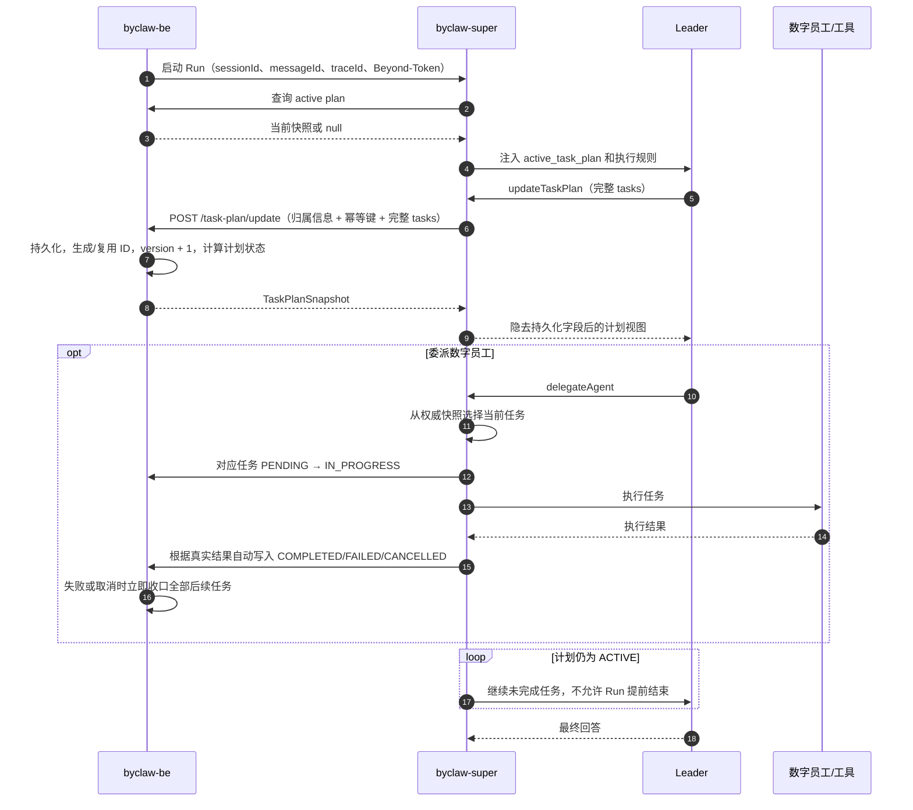
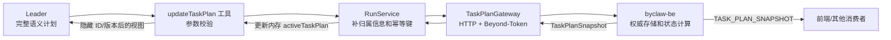
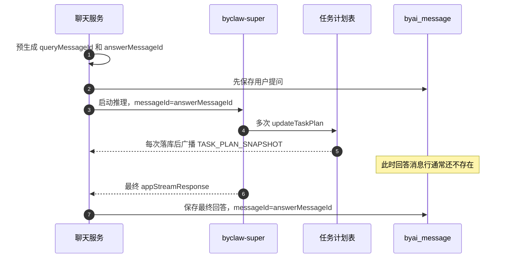
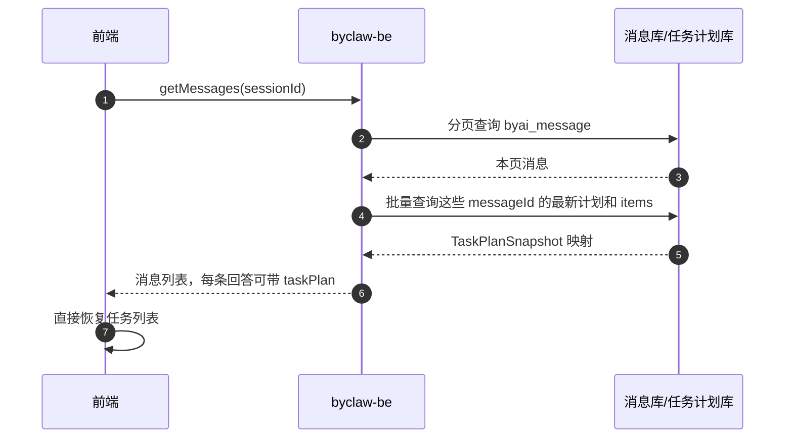

# `updateTaskPlan` 机制简述

> 注意：工具准确名称是 `updateTaskPlan`，不是 `updatePlanTask`。

## 一句话说明

Leader 用 `updateTaskPlan` 提交**完整、有序的任务列表**；`byclaw-super` 补充当前 Run 的归属信息并调用 `byclaw-be`；BE 持久化、生成 ID 和版本、计算计划总状态，再返回权威快照。

## 1. 数据结构

### Leader 提交的数据

模型只提交“计划语义”，不提交 `planId`、`taskId`、`version` 等持久化字段。

```ts
type TaskPlanUpdate = {
  title: string;
  explanation?: string;
  tasks: Array<{
    step: string;
    description?: string;
    status: TaskStatus;
    statusReason?: {
      code: string;
      message?: string;
    };
  }>;
};
```

每次更新都要发送完整 `tasks` 数组，不是只发送变化的任务。任务通过数组顺序对应 BE 返回的 `position`。

### BE 返回的权威快照

```ts
type TaskPlanSnapshot = {
  planId: string;
  version: number;
  title: string;
  status: PlanStatus;
  statusReason?: StatusReason;

  sessionId: string;
  messageId: string;
  turnId?: string;
  laneId?: string;
  traceId?: string;
  sourceRuntime: 'BYCLAW_SUPER' | 'OPENCLAW';
  sourceRunId: string;

  explanation?: string;
  createdAt?: string;
  updatedAt?: string;
  tasks: Array<{
    taskId: string;
    position: number;
    title: string;
    description?: string;
    status: TaskStatus;
    statusReason?: StatusReason;
    updatedAt?: string;
    startedAt?: string;
    completedAt?: string;
  }>;
};
```

字段归属：

- Leader 提交：`title`、`explanation`、任务内容和任务状态。
- `byclaw-super` 管：可信的 `sessionId/messageId/traceId/sourceRunId`、调用凭证和幂等键；在委派、取消、异常时也会自动补任务状态。
- `byclaw-be` 管：持久化、`planId/taskId/version`、时间字段和计划总状态。

## 2. 状态

### 计划状态

| 状态 | 含义 | 是否终态 |
|---|---|---:|
| `ACTIVE` | 计划仍在执行 | 否 |
| `CANCELLING` | 已发起停止，等待收口 | 否 |
| `COMPLETED` | 计划完成 | 是 |
| `FAILED` | 计划失败 | 是 |
| `CANCELLED` | 计划已取消 | 是 |

### 任务状态

| 状态 | 含义 | 是否终态 |
|---|---|---:|
| `PENDING` | 尚未开始 | 否 |
| `IN_PROGRESS` | 正在执行 | 否 |
| `COMPLETED` | 已完成 | 是 |
| `FAILED` | 执行失败 | 是 |
| `SKIPPED` | 已跳过 | 是 |
| `CANCELLED` | 已取消 | 是 |

BE 强制任务顺序执行：最多一个 `IN_PROGRESS`，终态任务不能回退，后一步开始后不能重定义或移除前面的任务。任一任务失败或取消时，BE 会立即收口后续任务并把计划推进到对应终态。消费者应以 BE 快照为准，不要自行推算计划总状态。

## 3. 正常执行时序



关键点：活动计划会阻止 Run 正常结束。Leader 如果没有推进计划，运行时最多连续提醒 3 次；仍无进展则 Run 失败，并触发计划异常收口。

## 4. 数据流



接口共三类：

- `loadActive`：Run 开始或恢复时加载当前活动计划。
- `update`：创建或整体替换计划；使用工具调用 ID 等作为幂等键。
- `cancel`：Run 停止后通知 BE 把活动计划收口为取消状态。

任务计划不通过聊天 Redis DataStream 流转；聊天输出与任务计划快照是两条独立通道。

## 5. 历史会话为什么看不到任务列表

### 5.1 实际根因

这不是“WS 返回了但没有持久化”。任务计划在广播前已经保存到三张独立表：

| 表 | 内容 |
|---|---|
| `byai_agent_task_plan` | 计划当前快照、所属 `sessionId/messageId`、状态和版本 |
| `byai_agent_task_item` | 当前完整任务列表 |
| `byai_agent_task_event` | 每个版本的审计事件和完整 payload |

改动前，真正断开的地方是历史消息查询：

1. `TASK_PLAN_SNAPSHOT` 由 `TaskPlanController` 在任务计划事务落库后直接广播，不进入聊天消息聚合器。
2. 聊天回答结束后，`MemoryMessageService` 把最终回答写入 `byai_message`。
3. `/byaiService/assiman/getMessages` 只分页查询 `byai_message`，然后补收藏信息。
4. 历史消息 DTO `ByaiMessageHotDtoDto` 没有 `taskPlan` 字段，查询过程也没有读取任务计划表。

所以实时页面能看到 WS 快照，重新进入会话后却只能恢复正文。丢的是**历史查询的组装链路**，不是任务计划数据。

### 5.2 为什么不能在收到快照时直接写进 `byai_message`

BE 在开始推理前就生成用户消息 ID 和模型回答消息 ID。计划使用的 `messageId` 是**模型回答消息 ID**，但此时最终回答行通常尚未写入 `byai_message`：



如果每个任务版本都同时更新 `byai_message`，会遇到回答行不存在、重复存储、并发覆盖和双数据源不一致的问题。

### 5.3 已落地的存储与返回方案

保持现有三张任务计划表作为唯一数据源，不把完整 task JSON 重复写入 `byai_message`。在 `getMessages` 返回历史消息时，用 `sessionId + messageId` 批量查询并组装最新计划快照。

推荐关联键：

```text
userId + sessionId + messageId
```

后端已经按下面方式实现：

1. `ByaiMessageHotDtoDto` 增加 `TaskPlanSnapshot taskPlan`，只扩展接口 DTO，不改 `ByaiMessage` 实体和消息表。
2. `TaskPlanApplicationService` 批量查询本页所有 `messageId` 的最新计划，再批量查询这些计划的全部 item，避免 N+1。
3. `MessageService.getMessages` 完成消息分页后，把计划快照按 `messageId` 填入对应的模型回答 DTO。
4. 删除单条消息或整个会话时，同步删除任务计划根记录；task item 和 event 由数据库外键级联清理。
5. 前端仍需在 `fetchMessageHandler` 中把 `taskPlan` 放入 `IMessage`；后续实时 WS 快照继续按 `planId + version` 覆盖它。

`getMessages` 返回结构示意：

```json
{
  "messageId": "11191775",
  "sessionId": "11191771",
  "messageContent": "最终回答……",
  "taskPlan": {
    "planId": "2091786786666377216",
    "version": 6,
    "status": "COMPLETED",
    "tasks": [
      {
        "taskId": "2091786786666377217",
        "position": 1,
        "title": "任务一",
        "status": "COMPLETED"
      }
    ]
  }
}
```

历史查询必须包含终态计划，不能只查询 `ACTIVE`。同一个回答理论上可能存在不同 `sourceRuntime` 的记录，返回规则应与现有 `TASK_PLAN_GET` 一致：选择 `updatedAt` 最新的一份。



`TASK_PLAN_GET` 可以继续保留，用于 WS 重连或单条快照刷新，但不建议历史页面对每条回答逐个查询。

这里不需要 `byclaw-super` 重新执行或补数据。后端历史查询和删除清理已经完成；前端还需要解析、恢复并渲染历史消息中的 `taskPlan`。

## 6. 自动状态处理

- 委派开始：对应任务是 `PENDING` 时，Super 自动改为 `IN_PROGRESS`。
- 委派成功：自动改为 `COMPLETED`，完成时间由 BE 在首次进入终态时生成。
- 委派失败：自动改为 `FAILED / DELEGATION_FAILED`。
- 委派超时：自动改为 `FAILED / DELEGATION_TIMEOUT`。
- 委派取消：自动改为 `CANCELLED / DELEGATION_CANCELLED`。
- 失败或取消：BE 立即关闭后续任务并把计划置为终态；Super 禁止继续委派或发起用户交互。
- 时间字段：`startedAt/completedAt` 只在首次状态迁移时写入，后续完整快照更新不会覆盖；任务内容和状态未变化时也不会刷新 `updatedAt`。
- 顺序保护：任务进入终态后不能回退；后一步开始后，前面已开始的任务不能改名、删除或修改状态。
- Run 异常：`IN_PROGRESS` 改为 `FAILED / RUN_FAILED`；未开始任务通常改为 `SKIPPED / RUN_ABORTED`，保证计划不会永久停留在执行中。
- 用户停止：Super 中止 Leader 和委派，再调用 BE 的 cancel 接口；最终计划状态以 BE 返回为准。

## 7. 代码入口

- 数据类型：`packages/by-conductor/src/domain/task-plan.ts`
- 工具定义：`packages/by-conductor/src/pi-leader-session.ts`
- 执行、委派联动和异常收口：`packages/by-conductor/src/application/run-service.ts`
- BE HTTP 网关：`app/business/task-plan.ts`
- Leader 上下文规则：`packages/by-conductor/src/context/processors/task-plan.ts`
- BE 计划持久化：`../byclaw-be/src/main/java/com/iwhalecloud/byai/state/application/service/taskplan/TaskPlanApplicationService.java`
- BE 历史消息查询：`../byclaw-be/src/main/java/com/iwhalecloud/byai/state/application/service/message/MessageService.java`
- BE 历史消息 DTO：`../byclaw-be/src/main/java/com/iwhalecloud/byai/state/domain/message/dto/ByaiMessageHotDtoDto.java`
