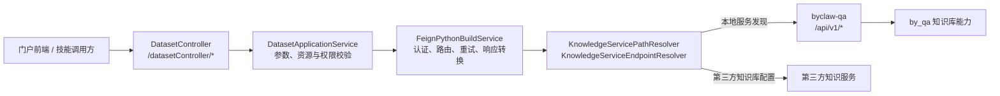

# 门户调用 byclaw-qa 接口总览

> 本文以当前工作区代码为准，梳理门户后端 `byclaw-be` 调用 `byclaw-qa` 的全部知识库接口、调用链、资源上下文和权限边界。它是门户侧集成说明，不替代 QA 服务自身的接口契约说明。[知识模块接口说明](./api.md)保留 QA 原生接口的请求与响应示例。

## 1. 结论与范围

门户知识库能力统一由 `DatasetController` 对外提供，再由 `DatasetApplicationService` 调用 `FeignPythonBuildService` 访问 byclaw-qa。当前门户实际接入 QA 的原生操作共 **21 个**，均使用 `POST`：

-   知识库：创建、更新、删除。
-   目录：创建、重命名、删除、列目录、路径通配。
-   文件：上传、更新、删除、读取、查看元数据、移动、引用关系、下载、格式转换、构建、构建状态。
-   检索：分块检索和文件级检索。

此外，`byclaw-qa/src/api.py` 还提供 **9 个按 `resourceId` 调用的包装接口**，面向 Agent/技能等需要直接以门户资源 ID 操作知识库的调用方。当前门户常规请求不直接使用其中的大多数接口：它将 `resourceId` 转为 QA 可识别的 `knCode`，并透传 `X-Byclaw-Resource-Id` 请求头；仅“知识构建”会改调专用的 `fileToMarkdownIndexByResourceId`。

本文不包含以下内容：

-   byclaw-qa 内部调用 `by_qa` 的实现细节；
-   不经过门户的 QA 私有接口；
-   知识资源以外的 QA 能力。

## 2. 调用架构



### 2.1 资源标识如何转换

门户和 QA 使用的主标识不同，调用前必须完成转换。

| 标识                   | 所在层             | 含义与用途                                                          |
| ---------------------- | ------------------ | ------------------------------------------------------------------- |
| `resourceId`           | 门户               | `ss_resource.resource_id`，前端、技能和权限系统使用的知识资源主键。 |
| `resourceCode`         | 门户               | `ss_resource.resource_code`，知识资源在 QA 侧对应的编码。           |
| `knCode`               | QA 原生接口        | QA 的知识库编码。门户向 QA 发请求时，通常由 `resourceCode` 填入。   |
| `X-Byclaw-Resource-Id` | 门户到 QA 的请求头 | 保留门户资源上下文，供资源级文件系统、异步任务和可观测链路使用。    |

门户会先校验用户是否可读或可管理 `resourceId`，再读取资源记录得到 `resourceCode`，最后以该值构造 QA 请求中的 `knCode`。因此，调用方不应把门户 `resourceId` 直接填入原生 `knCode` 字段。

### 2.2 两种路由模式

| 模式           | 判断条件                                                                      | 实际地址                                                               | 适用场景            |
| -------------- | ----------------------------------------------------------------------------- | ---------------------------------------------------------------------- | ------------------- |
| 本地 QA        | `dataset.system` 为空                                                         | 服务发现 `byclaw-qa-manager`，默认路径来自 `KnowledgeServiceOperation` | ByClaw 自建知识库。 |
| 第三方知识服务 | `dataset.system` 非空，且知识资源的 `target_content` 配置了服务地址和 OpenAPI | `target_content.domainURL` 加第三方声明的 `operationId` 路径           | 外部知识库接入。    |

第三方模式下，门户按 `operationId` 从 `target_content.resourceService[].openapiSchema.paths` 查找路径。资源未配置 `knCode` 时，部分无知识库上下文的操作会回退本地 QA；已配置 `knCode` 但第三方 OpenAPI 未声明该操作时，请求会失败，而不是静默改调其他路径。

## 3. 通信约定

### 3.1 QA 原生响应

除下载和文件流转换外，QA 原生接口统一返回：

```json
{
    "resultCode": "0",
    "resultMsg": "success",
    "resultObject": {}
}
```

`FeignPythonBuildService` 负责解析该响应；调用方通过 `DatasetApplicationService.assertPythonBuildSuccess` 将 `resultCode != 0` 转为业务异常。绝大多数文件、目录、构建和检索操作会执行这项校验。当前 `updateDataset` 与 `deleteDataset` 仅记录 QA 响应，未执行该断言，因此 QA 返回非零时仍应结合门户日志与资源状态核查一致性。下载接口成功时返回二进制流；门户会识别小型 JSON 错误响应，避免将错误信息当作文件下载。

### 3.2 门户到 QA 的请求头

| 请求类型   | 头部                                                                                                |
| ---------- | --------------------------------------------------------------------------------------------------- |
| JSON 请求  | `Content-Type: application/json`、`System-Code: BYAI`、`Beyond-Token: <门户按当前登录人签发的 JWT>` |
| 文件上传   | `System-Code: BYAI`、`Beyond-Token: <JWT>`，HTTP 客户端负责 `multipart/form-data` 边界              |
| 资源级调用 | 在上述基础上增加 `X-Byclaw-Resource-Id: <resourceId>`                                               |

`Beyond-Token` 不是前端直接传给 QA 的令牌。门户根据当前登录态创建 JWT 后再下传，QA 可据此恢复调用上下文。

### 3.3 路径规则

-   `directoryPath`、`filePath`、`sourcePath`、`targetDirectoryPath`、`targetFilePath` 均以 `/` 开头，不带知识库名称。
-   `sourcePath` 是列表；移动请求在门户中要求 `overwrite=false`，且 `targetDirectoryPath` 与 `targetFilePath` 必须二选一。
-   目录搜索和上传冲突检查不新增 QA 接口，门户通过 `listDir` 递归或单层查询实现。
-   原生接口路径以驼峰形式 `knowledgeItems` 为准，例如 `/api/v1/knowledgeItems/import`。不要使用旧文档中混入的 `/api/v1/knowledge-items/import` 作为门户到 QA 的标准路径。

## 4. 门户调用 QA 的完整接口清单

下表以 `KnowledgeServiceOperation` 为唯一枚举来源。所有原生 QA 请求均为 `POST`。

| 操作 ID                   | QA 原生路径                         | 门户入口或触发点                                                                   | 门户资源上下文                                                                                                  |
| ------------------------- | ----------------------------------- | ---------------------------------------------------------------------------------- | --------------------------------------------------------------------------------------------------------------- |
| `createKb`                | `/api/v1/knowledgeBases/create`     | `POST /datasetController/createDataset`                                            | 创建前没有 `resourceId`；QA 返回 `knCode` 后门户创建资源记录。                                                  |
| `updateKb`                | `/api/v1/knowledgeBases/update`     | `POST /datasetController/updateDataset`                                            | 使用资源的 `resourceCode` 作为 `knCode`；当前实现不附加资源 ID 请求头。                                         |
| `deleteKb`                | `/api/v1/knowledgeBases/delete`     | `POST /datasetController/deleteDataset`                                            | 校验管理权限，携带 `X-Byclaw-Resource-Id`。                                                                     |
| `createDir`               | `/api/v1/directories/create`        | `POST /datasetController/createFolder`                                             | `resourceId -> knCode`，携带资源 ID 请求头。                                                                    |
| `editDir`                 | `/api/v1/directories/update`        | `POST /datasetController/renameFolder`                                             | 同上。                                                                                                          |
| `listDir`                 | `/api/v1/listDir`                   | `queryDirAndFileByLevel`、`searchDirAndFile`、`checkUploadFileConflicts`、目录下载 | 同上；递归搜索和冲突检查由门户多次调用实现。                                                                    |
| `deleteDir`               | `/api/v1/directories/delete`        | `POST /datasetController/deleteFolder`                                             | 同上。                                                                                                          |
| `uploadFile`              | `/api/v1/knowledgeItems/import`     | `POST /datasetController/uploadFiles`；`buildKnowledgeFromDoc` 内部上传            | 同上；使用 multipart 上传。                                                                                     |
| `updateFile`              | `/api/v1/knowledgeItems/update`     | `POST /datasetController/knowledgeItems/update`                                    | 同上；使用 multipart 更新单个既有文件，成功后不自动构建。                                                       |
| `deleteFile`              | `/api/v1/knowledgeItems/delete`     | `POST /datasetController/removeFile`                                               | 同上。                                                                                                          |
| `readFile`                | `/api/v1/readFile`                  | `POST /datasetController/readFile`                                                 | 同上；门户将结果中的 `knCode` 回写为 `resourceId`。                                                             |
| `getFileMetadata`         | `/api/v1/knowledgeItems/metadata/get` | `POST /datasetController/knowledgeItems/metadata/get`                           | 同上；只读返回已入库元数据，`metadataFieldList` 省略时返回全部字段。                                            |
| `moveKnowledgeItems`      | `/api/v1/knowledgeItems/move`       | `POST /datasetController/moveKnowledgeItems`                                       | 同上。                                                                                                          |
| `knowledgeItemReferences` | `/api/v1/knowledgeItems/references` | `POST /datasetController/knowledgeItems/references`                                | 同上；未填写方向时门户默认 `inbound`。                                                                          |
| `glob`                    | `/api/v1/glob`                      | `POST /datasetController/glob`                                                     | 同上。                                                                                                          |
| `knowledgeSearch`         | `/api/v1/knowledgeItems/search`     | `POST /datasetController/knowledgeItems/search`                                    | 多资源检索：将 `resourceIdList` 转为 `knCodeList`，不附加单个资源 ID 请求头；结果反向映射。                     |
| `knowledgeFileSearch`     | `/api/v1/knowledgeItems/searchFile` | `POST /datasetController/knowledgeItems/searchFile`                                | 与分块检索相同，按多个资源做权限校验和标识转换。                                                                |
| `fileToMarkdown`          | `/api/v1/fileToMarkdown`            | `POST /datasetController/fileToMarkdown`                                           | 仅转换文件流，不绑定知识库；无 `knCode` 和资源 ID 请求头。                                                      |
| `knowledgeBuild`          | `/api/v1/fileToMarkdownIndex`       | `POST /datasetController/build`；`buildKnowledgeFromDoc` 内部构建                  | 有 `resourceId` 时实际改调 `/api/v1/fileToMarkdownIndexByResourceId`，请求体移除 `knCode` 并加入 `resourceId`。 |
| `downloadFile`            | `/api/v1/downloadFile`              | `GET /datasetController/download`（门户对外 GET，向 QA 仍为 POST）                 | 单文件下载携带资源 ID 请求头；目录下载先列目录，再逐文件下载。                                                  |
| `fileBuildStatus`         | `/api/v1/fileBuildStatus`           | `GET /datasetController/fileBuildStatus`（门户对外 GET，向 QA 仍为 POST）          | `resourceId -> knCode`，携带资源 ID 请求头。                                                                    |

说明：门户对外入口通常经网关暴露为 `/byaiService/datasetController/*`；上表列的是后端 Controller 的类内路径。

## 5. 分接口请求说明

### 5.1 知识库管理

| QA 路径                 | QA 请求字段                                   | 门户行为                                                                                                             |
| ----------------------- | --------------------------------------------- | -------------------------------------------------------------------------------------------------------------------- |
| `knowledgeBases/create` | `knName` 必填，`knDescription` 可选           | 门户先在 QA 创建知识库，取得 `knCode` 后保存 `ss_resource`、资源归属和目录等门户元数据。                             |
| `knowledgeBases/update` | `knCode` 必填，`knName`、`knDescription` 可选 | 门户先更新资源记录与开放资源目录，再调用 QA 更新；当前不对 QA 的非零 `resultCode` 执行断言。                         |
| `knowledgeBases/delete` | `knCode` 必填                                 | 先验证管理权限；门户将资源标记为已注销并反注册资源服务，再删除 QA 知识库；当前不对 QA 的非零 `resultCode` 执行断言。 |

门户创建示例：

```bash
curl -X POST "$PORTAL_BASE/datasetController/createDataset" \
  -H "Content-Type: application/json" \
  -H "Beyond-Token: $PORTAL_TOKEN" \
  -d '{
    "resourceBizType": "KG_DOC",
    "resourceName": "人力制度知识库",
    "resourceDesc": "公司制度与流程文档",
    "ownerType": "enterprise",
    "catalogId": 0,
    "type": "dataset"
  }'
```

### 5.2 目录与文件树

| QA 路径              | QA 请求字段                                       | 门户入口与约束                                                                      |
| -------------------- | ------------------------------------------------- | ----------------------------------------------------------------------------------- |
| `directories/create` | `knCode`、`directoryPath`、`directoryDescription` | `createFolder` 接收 `resourceId`、`directoryPath`、`directoryDescription`。         |
| `directories/update` | `knCode`、`directoryPath`、`directoryName`        | `renameFolder` 接收 `resourceId`、原目录 `directoryPath` 和新名称 `directoryName`。 |
| `directories/delete` | `knCode`、`directoryPath`                         | `deleteFolder` 接收 `resourceId`、`directoryPath`。                                 |
| `listDir`            | `knCode`、`directoryPath`                         | 单层列举；门户的递归搜索、上传冲突检查、目录下载均基于此接口组合实现。              |
| `glob`               | `knCode`、`pathRule`                              | 路径通配匹配，门户负责规则规范化。                                                  |

门户创建目录示例：

```bash
curl -X POST "$PORTAL_BASE/datasetController/createFolder" \
  -H "Content-Type: application/json" \
  -H "Beyond-Token: $PORTAL_TOKEN" \
  -d '{
    "resourceId": 10001,
    "directoryPath": "/人事/制度",
    "directoryDescription": "人事制度文件"
  }'
```

### 5.3 文件导入、读取、移动、引用与下载

| QA 路径                     | QA 请求字段                                                                            | 门户入口与约束                                                                                                                 |
| --------------------------- | -------------------------------------------------------------------------------------- | ------------------------------------------------------------------------------------------------------------------------------ |
| `knowledgeItems/import`     | `knCode`、`filePath`、`fileContent` 必填；`fileDescription`、`processFrontMatter` 可选 | `uploadFiles` 接收 `files`、`resourceId`、`directoryPath`、可选描述和 Front Matter 开关。门户为每个文件拼出 QA 的 `filePath`。 |
| `knowledgeItems/update`     | `knCode`、`filePath`、`fileContent` 必填；`fileDescription`、`processFrontMatter` 可选 | `knowledgeItems/update` 更新单个既有文件；门户校验管理权限并将 QA 返回的 `knCode` 回写为 `resourceId`。更新后需显式构建。      |
| `knowledgeItems/delete`     | `knCode`、`filePath`                                                                   | `removeFile` 的门户字段为 `resourceId`、`directoryPath`；这里的 `directoryPath` 实际传递待删除文件路径。                       |
| `readFile`                  | `knCode`、`filePath`，可选 `startLine`、`endLine`                                      | `readFile` 返回 Markdown 内容，可指定行范围。                                                                                  |
| `knowledgeItems/metadata/get` | `knCode`、`filePath` 必填；`metadataFieldList` 可选                                | `knowledgeItems/metadata/get` 接收门户 `resourceId`；只读返回 `metadata[字段名].valueType` 与 `value`。省略字段列表时由 QA 返回全部已入库元数据。 |
| `knowledgeItems/move`       | `knCode`、`sourcePath`、`targetDirectoryPath` 或 `targetFilePath`、`overwrite`         | 门户要求源路径非空、目标二选一，且当前不允许覆盖已有文件。                                                                     |
| `knowledgeItems/references` | `knCode`、`filePath`、`direction`                                                      | `direction` 仅可为 `inbound`、`outbound`、`all`；门户默认 `inbound`。                                                          |
| `downloadFile`              | `knCode`、`filePath`                                                                   | QA 返回原始文件流；门户对外接口是 `GET /download`。                                                                            |

门户上传示例：

```bash
curl -X POST "$PORTAL_BASE/datasetController/uploadFiles" \
  -H "Beyond-Token: $PORTAL_TOKEN" \
  -F "files=@./员工手册.pdf" \
  -F "resourceId=10001" \
  -F "directoryPath=/人事/制度" \
  -F "fileDescription=2026版员工手册" \
  -F "processFrontMatter=true" \
  -F "overwrite=false"
```

门户读取示例：

```bash
curl -X POST "$PORTAL_BASE/datasetController/readFile" \
  -H "Content-Type: application/json" \
  -H "Beyond-Token: $PORTAL_TOKEN" \
  -d '{
    "resourceId": 10001,
    "filePath": "/人事/制度/员工手册.md",
    "startLine": 1,
    "endLine": 50
  }'
```

门户查看文件元数据示例：

```bash
curl -X POST "$PORTAL_BASE/datasetController/knowledgeItems/metadata/get" \
  -H "Content-Type: application/json" \
  -H "Beyond-Token: $PORTAL_TOKEN" \
  -d '{
    "resourceId": 10001,
    "filePath": "/会议纪要/DataCloud平台需求确认会.md",
    "metadataFieldList": ["会议主题", "会议日期"]
  }'
```

不传 `metadataFieldList` 时，返回该文件全部已入库元数据。该接口不会更新元数据字段或文件内容。

门户更新示例：

```bash
curl -X POST "$PORTAL_BASE/datasetController/knowledgeItems/update" \
  -H "Beyond-Token: $PORTAL_TOKEN" \
  -F "resourceId=10001" \
  -F "filePath=/人事/制度/请假制度.md" \
  -F "fileContent=@./请假制度.md" \
  -F "fileDescription=2026 年更新版" \
  -F "processFrontMatter=true"
```

### 5.4 文件转换、知识构建与状态

| QA 路径               | QA 请求字段                  | 门户入口与约束                                                              |
| --------------------- | ---------------------------- | --------------------------------------------------------------------------- |
| `fileToMarkdown`      | multipart 字段 `fileContent` | 只做同步格式转换并回传 Markdown 文件流；不上传、不建索引、不切片。          |
| `fileToMarkdownIndex` | `knCode`、`filePath`         | 门户携带资源上下文时会重写为 `fileToMarkdownIndexByResourceId`，见第 6 节。 |
| `fileBuildStatus`     | `knCode`、`filePath`         | 查询单文件异步构建状态。                                                    |

`buildKnowledgeFromDoc` 是门户的编排入口：将 OpenClaw 生成的 Markdown 先通过 `knowledgeItems/import` 上传，再调用构建接口。它不是 QA 的独立原生接口。

门户触发构建示例：

```bash
curl -X POST "$PORTAL_BASE/datasetController/build" \
  -H "Content-Type: application/json" \
  -H "Beyond-Token: $PORTAL_TOKEN" \
  -d '{
    "resourceId": 10001,
    "directoryPath": "/人事/制度/员工手册.pdf"
  }'
```

### 5.5 检索

| QA 路径                     | QA 请求字段                                                                                    | 返回范围与门户处理                                                                                                    |
| --------------------------- | ---------------------------------------------------------------------------------------------- | --------------------------------------------------------------------------------------------------------------------- |
| `knowledgeItems/search`     | `query`、`knCodeList`、`topK`、`searchMode`；可选 `where`、`metadataFieldList`、`fileTypeList` | 分块检索。门户接收 `resourceIdList`，逐个校验可读权限，转换为 `knCodeList`；返回结果中的库标识再映射为 `resourceId`。 |
| `knowledgeItems/searchFile` | `query`、`knCodeList`、`topK`、`searchMode`；可选 `where`、`metadataFieldList`                 | 文件级语义检索，处理方式与分块检索一致。                                                                              |

`searchMode` 由 QA 约定为 `fullTextRecall`、`embedding` 或 `mixedRecall`。多资源检索不携带 `X-Byclaw-Resource-Id`，因为一次请求对应多个资源。

门户分块检索示例：

```bash
curl -X POST "$PORTAL_BASE/datasetController/knowledgeItems/search" \
  -H "Content-Type: application/json" \
  -H "Beyond-Token: $PORTAL_TOKEN" \
  -d '{
    "resourceIdList": [10001, 10002],
    "query": "员工年假有多少天",
    "topK": 5,
    "searchMode": "mixedRecall",
    "metadataFieldList": [],
    "fileTypeList": []
  }'
```

门户文件级检索示例：

```bash
curl -X POST "$PORTAL_BASE/datasetController/knowledgeItems/searchFile" \
  -H "Content-Type: application/json" \
  -H "Beyond-Token: $PORTAL_TOKEN" \
  -d '{
    "resourceIdList": [10001],
    "query": "年假制度",
    "topK": 10,
    "searchMode": "mixedRecall",
    "metadataFieldList": []
  }'
```

## 6. byclaw-qa 的 resourceId 包装接口

`byclaw-qa/src/api.py` 为不方便自行完成 `resourceId -> knCode` 转换的调用方提供以下接口。它通过 Redis 中的 `KG_DOC_{resourceId}` 查找知识库编码，并把部分响应中的 `knCode` 改写回 `resourceId`。

| QA 路径                                     | 请求核心字段                            | 当前门户是否直接调用 | 说明                                                                                 |
| ------------------------------------------- | --------------------------------------- | -------------------- | ------------------------------------------------------------------------------------ |
| `/api/v1/knowledgeItems/importByResourceId` | `resourceId`、`filePath`、`fileContent` | 否                   | 按资源上传，multipart。另有兼容别名 `/api/v1/knowledge-items/importByResourceId`。   |
| `/api/v1/fileToMarkdownIndexByResourceId`   | `resourceId`、`filePath`                | 是                   | 门户 `build` 在有资源 ID 时的实际下游路径；QA 在后台任务中保留调用令牌和资源上下文。 |
| `/api/v1/knowledgeItems/searchByResourceId` | `resourceIdList` 与原生检索字段         | 否                   | 按资源 ID 多库检索。另有兼容别名 `/api/v1/knowledge-items/searchByResourceId`。      |
| `/api/v1/directories/createByResourceId`    | `resourceId`、目录字段                  | 否                   | 创建目录。                                                                           |
| `/api/v1/directories/updateByResourceId`    | `resourceId`、目录字段                  | 否                   | 更新目录。                                                                           |
| `/api/v1/directories/deleteByResourceId`    | `resourceId`、目录字段                  | 否                   | 删除目录。                                                                           |
| `/api/v1/listDirByResourceId`               | `resourceId`、`directoryPath`           | 否                   | 获取目录内容。                                                                       |
| `/api/v1/readFileByResourceId`              | `resourceId`、`filePath`、行范围        | 否                   | 读取文件内容。                                                                       |
| `/api/v1/downloadFileByResourceId`          | `resourceId`、`filePath`                | 否                   | 下载原始文件。                                                                       |

注意：这些包装接口解决的是**标识转换和资源存储上下文**，不是门户权限校验的替代品。门户入口仍应作为外部调用的首选，因为它会根据当前用户进行读、写、管理权限判断。

## 7. 原生 QA 调试 curl

以下命令用于在可信服务网络内验证 QA 原生接口。真实生产调用应优先通过门户，不要把内部 QA 地址直接暴露给浏览器或不受控的技能。

```bash
export QA_BASE="http://byclaw-qa-manager:8088"
export QA_TOKEN="<门户签发的 Beyond-Token>"
export KN_CODE="knowledge-code"
export RESOURCE_ID="10001"

qa_json() {
  curl -X POST "$QA_BASE$1" \
    -H "Content-Type: application/json" \
    -H "System-Code: BYAI" \
    -H "Beyond-Token: $QA_TOKEN" \
    -H "X-Byclaw-Resource-Id: $RESOURCE_ID" \
    -d "$2"
}
```

### 7.1 知识库与目录

```bash
qa_json "/api/v1/knowledgeBases/create" '{"knName":"人力制度知识库","knDescription":"制度文档"}'
qa_json "/api/v1/knowledgeBases/update" "{\"knCode\":\"$KN_CODE\",\"knName\":\"人力制度知识库（新版）\",\"knDescription\":\"更新说明\"}"
qa_json "/api/v1/knowledgeBases/delete" "{\"knCode\":\"$KN_CODE\"}"

qa_json "/api/v1/directories/create" "{\"knCode\":\"$KN_CODE\",\"directoryPath\":\"/人事/制度\",\"directoryDescription\":\"制度文件\"}"
qa_json "/api/v1/directories/update" "{\"knCode\":\"$KN_CODE\",\"directoryPath\":\"/人事/制度\",\"directoryName\":\"管理制度\"}"
qa_json "/api/v1/directories/delete" "{\"knCode\":\"$KN_CODE\",\"directoryPath\":\"/人事/管理制度\"}"
qa_json "/api/v1/listDir" "{\"knCode\":\"$KN_CODE\",\"directoryPath\":\"/人事\"}"
qa_json "/api/v1/glob" "{\"knCode\":\"$KN_CODE\",\"pathRule\":\"/人事/**/*.md\"}"
```

### 7.2 文件操作

```bash
curl -X POST "$QA_BASE/api/v1/knowledgeItems/import" \
  -H "System-Code: BYAI" \
  -H "Beyond-Token: $QA_TOKEN" \
  -H "X-Byclaw-Resource-Id: $RESOURCE_ID" \
  -F "knCode=$KN_CODE" \
  -F "filePath=/人事/制度/员工手册.pdf" \
  -F "fileDescription=2026版员工手册" \
  -F "processFrontMatter=true" \
  -F "fileContent=@./员工手册.pdf"

curl -X POST "$QA_BASE/api/v1/knowledgeItems/update" \
  -H "System-Code: BYAI" \
  -H "Beyond-Token: $QA_TOKEN" \
  -H "X-Byclaw-Resource-Id: $RESOURCE_ID" \
  -F "knCode=$KN_CODE" \
  -F "filePath=/人事/制度/请假制度.md" \
  -F "fileDescription=2026 年更新版" \
  -F "processFrontMatter=true" \
  -F "fileContent=@./请假制度.md"

qa_json "/api/v1/knowledgeItems/delete" "{\"knCode\":\"$KN_CODE\",\"filePath\":\"/人事/制度/员工手册.pdf\"}"
qa_json "/api/v1/readFile" "{\"knCode\":\"$KN_CODE\",\"filePath\":\"/人事/制度/员工手册.md\",\"startLine\":1,\"endLine\":50}"
qa_json "/api/v1/knowledgeItems/metadata/get" "{\"knCode\":\"$KN_CODE\",\"filePath\":\"/会议纪要/DataCloud平台需求确认会.md\",\"metadataFieldList\":[\"会议主题\",\"会议日期\"]}"
qa_json "/api/v1/knowledgeItems/move" "{\"knCode\":\"$KN_CODE\",\"sourcePath\":[\"/人事/制度/员工手册.md\"],\"targetDirectoryPath\":\"/归档\",\"overwrite\":false}"
qa_json "/api/v1/knowledgeItems/references" "{\"knCode\":\"$KN_CODE\",\"filePath\":\"/归档/员工手册.md\",\"direction\":\"inbound\"}"

curl -X POST "$QA_BASE/api/v1/downloadFile" \
  -H "Content-Type: application/json" \
  -H "System-Code: BYAI" \
  -H "Beyond-Token: $QA_TOKEN" \
  -H "X-Byclaw-Resource-Id: $RESOURCE_ID" \
  -d "{\"knCode\":\"$KN_CODE\",\"filePath\":\"/归档/员工手册.md\"}" \
  --output "员工手册.md"
```

### 7.3 转换、构建与检索

```bash
curl -X POST "$QA_BASE/api/v1/fileToMarkdown" \
  -H "System-Code: BYAI" \
  -H "Beyond-Token: $QA_TOKEN" \
  -F "fileContent=@./员工手册.pdf" \
  --output "员工手册.md"

qa_json "/api/v1/fileToMarkdownIndex" "{\"knCode\":\"$KN_CODE\",\"filePath\":\"/归档/员工手册.md\"}"
qa_json "/api/v1/fileBuildStatus" "{\"knCode\":\"$KN_CODE\",\"filePath\":\"/归档/员工手册.md\"}"
qa_json "/api/v1/knowledgeItems/search" "{\"query\":\"年假制度\",\"knCodeList\":[\"$KN_CODE\"],\"topK\":5,\"searchMode\":\"mixedRecall\",\"metadataFieldList\":[],\"fileTypeList\":[]}"
qa_json "/api/v1/knowledgeItems/searchFile" "{\"query\":\"年假制度\",\"knCodeList\":[\"$KN_CODE\"],\"topK\":5,\"searchMode\":\"mixedRecall\",\"metadataFieldList\":[]}"
```

资源 ID 构建包装接口示例：

```bash
qa_json "/api/v1/fileToMarkdownIndexByResourceId" "{\"resourceId\":$RESOURCE_ID,\"filePath\":\"/归档/员工手册.md\"}"
```

## 8. 权限、异常与排查

### 8.1 权限边界

| 场景                                       | 门户处理                                                                         |
| ------------------------------------------ | -------------------------------------------------------------------------------- |
| 查看目录、读取文件、查看文件元数据、下载、检索 | 先校验知识资源的可读权限。多库检索会逐个校验 `resourceIdList`。              |
| 上传、建目录、重命名、删除、移动、触发构建 | 校验资源的管理权限。                                                             |
| 创建知识库                                 | 按门户资源创建规则校验归属、目录等元数据，并在 QA 创建成功后落门户资源记录。     |
| QA `*ByResourceId` 直连接口                | 负责 `resourceId -> knCode` 和资源存储上下文；不应被视为替代门户鉴权的公网接口。 |

### 8.2 常见问题

| 现象                             | 优先检查项                                                                                                             |
| -------------------------------- | ---------------------------------------------------------------------------------------------------------------------- |
| QA 返回“知识库不存在”            | 确认 `ss_resource.resource_code` 与 QA 的 `knCode` 一致，检查资源是否被删除或迁移。                                    |
| 请求到了错误的本地/第三方服务    | 检查 `dataset.system`，以及资源 `target_content.domainName`、`domainURL` 与 `resourceService` 中对应 `operationId`。   |
| 带资源 ID 的构建失败             | 检查最终是否调用 `/api/v1/fileToMarkdownIndexByResourceId`，请求体应含 `resourceId` 和 `filePath`，不应保留 `knCode`。 |
| 技能调用返回无权限或无数据       | 先确认调用的是门户封装接口；检查当前用户是否拥有资源可读权限、`resourceIdList` 是否包含无权限资源。                    |
| 文件元数据为空或缺字段           | 确认文件已经入库/构建，`filePath` 是知识库内完整路径；传入 `metadataFieldList` 时检查字段名称是否准确。                 |
| 上传成功但无法检索               | 上传只完成文件写入；需调用构建并轮询 `fileBuildStatus` 至完成后再检索。                                                |
| 修改或注销后门户与 QA 状态不一致 | 检查 `updateDataset`、`deleteDataset` 的 QA 调用日志和 `resultCode`；这两个流程当前未对 QA 非零响应执行成功断言。      |
| 下载获得 JSON 文本而非文件       | 查看 QA 返回的 `resultCode`、认证头、文件路径；门户会将小型 JSON 错误响应识别为失败。                                  |
| 路径 404                         | 原生路径使用 `knowledgeItems`，不是 `knowledge-items`；后者仅在两个 `ByResourceId` 兼容别名中存在。                    |

## 9. 代码事实来源

-   门户原生操作枚举：[KnowledgeServiceOperation.java](../../byclaw-be/src/main/java/com/iwhalecloud/byai/common/feign/client/KnowledgeServiceOperation.java)
-   门户 QA 客户端、请求头、资源构建重写与重试：[FeignPythonBuildService.java](../../byclaw-be/src/main/java/com/iwhalecloud/byai/common/feign/client/FeignPythonBuildService.java)
-   门户 Controller 入口：[DatasetController.java](../../byclaw-be/src/main/java/com/iwhalecloud/byai/state/interfaces/controller/dataset/DatasetController.java)
-   门户资源映射、权限与编排：[DatasetApplicationService.java](../../byclaw-be/src/main/java/com/iwhalecloud/byai/state/application/service/dataset/DatasetApplicationService.java)
-   QA resourceId 包装路由：[api.py](../../byclaw-qa/src/api.py)
-   QA 原生请求/响应契约：[知识模块接口说明](./api.md)
