# by-conductor 技术方案 (超级助手独立解耦)

> **项目定位**：by-conductor —— 像指挥家一样协调多个 Agent
> **文档状态**：V1.0
> **第一阶段范围**：独立 TypeScript 服务；超级助手（Leader）拥有自己的会话、记忆、上下文与工作空间，并能够调度 OpenClaw 中的数字员工。
> **核心原则**：第一阶段无缝接入现有 ByClaw，不大改 OpenClaw、`byai-channel`、`baiying-enhance` 和现有数字员工体系。

## 0. 方案摘要

by-conductor 是位于业务系统和执行引擎之间的 **Agent 编排运行时**：

- **Leader**：只理解目标、选择 Agent、拆解任务、观察结果、继续调度和汇总，不直接执行业务工具。
- **Agent**：完成具体工作。V1.0 的 Agent 就是已经同步到 OpenClaw 的数字员工。
- **Engine Connector**：屏蔽 OpenClaw、Hermes、Codex、Claude Code 等执行引擎的协议差异。V1.0 只实现 OpenClaw Connector。
- **by-framework**：继续承担 Worker 注册、可靠消息、执行记录、流式事件、取消和 Redis Stream 通信，不承担 Leader 的推理和业务编排。

V1.0 推荐采用下面的接入方式：

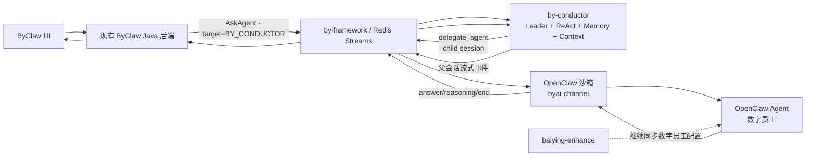

关键决策：

1. by-conductor 是新的独立 TypeScript 服务，部署在公共服务区，不放进 OpenClaw 沙箱。
2. V1.0 复用现有 `suas_superassist + ss_resource` 作为超级助手的业务身份、UI、权限和生命周期模型，不再新建 `Conductor_leader`。`suas_superassist` 保存用户超级助手配置，`ss_resource` 中现有 `{userCode}_main` 资源作为可路由的 Leader 资源。
3. by-conductor 不直接查询这两张业务表。现有 Java 后端增加 **Conductor 接入适配点**，把 Leader 配置快照、当前用户身份和数字员工权限快照通过 by-framework 交给 by-conductor。
4. V1.0 的 Agent 目录不复制数字员工数据。每次请求由现有后端把已做权限过滤的 `agent_list` 交给 by-conductor；后续再抽象独立 Agent Catalog。
5. 超级助手 调用 OpenClaw Agent 时必须使用独立子会话，不能把 OpenClaw Agent 的输出直接写入父会话流，否则子 Agent 的 `appStreamResponse` 会被现有后端误判为整个 Leader 回合结束。
6. `baiying-enhance` V1.0 保持不动，继续只服务 OpenClaw。
7. by-conductor 只独立保存 Thread、Run、Delegation、Context、Memory 和 Artifact 等运行时数据，不重复保存 Leader 的名称、头像、发布状态和业务权限。

---

## 1. 背景

### 1.1 系统现状

现有 ByClaw 已经围绕 OpenClaw 建立了完整的平台能力：

- OpenClaw 运行在云端 K3s 、opensandbox沙箱中。
- 数字员工保存在 ByClaw 业务数据库中。
- `baiying-enhance` 将数字员工、模型、技能、工作空间等配置同步到 OpenClaw。
- `byai-channel` 把 OpenClaw 的会话、Agent 事件和 ByClaw 消息协议连接起来。
- by-framework 通过 Redis Streams 提供 Worker 注册、可靠消息、执行状态、取消和流式事件传输。
- 前端与 Java 后端已经具备 WebSocket 会话、消息落库、停止回答、多设备广播和恢复能力。

这套架构可以很好地运行 OpenClaw，但当前“Agent 定义、会话通信、执行引擎、插件能力”相互耦合较深。如果未来直接把 Hermes、Codex、Claude Code 等引擎继续塞进当前链路，路由、状态和协议分支会快速膨胀。

### 1.2 by-conductor 定位

未来系统中，用户面对的对象应当是“合适的 Agent”，而不是“选择一个执行引擎”。同一个 Agent 可以在不同引擎中部署，Leader 只负责：

1. 理解用户目标；
2. 从当前用户可使用的 Agent 中选择合适对象；
3. 委派任务并观察执行结果；
4. 必要时继续调用其他 Agent；
5. 整合结果并回复用户。

by-conductor 因而需要成为一个可独立开源、可插拔、与 ByClaw 业务模型解耦的多 Agent 编排项目，而不是在现有 Java 后端中增加一组 OpenClaw 专用判断。

### 1.3 名词定义

| 名词 | 含义 |
|---|---|
| Leader | by-conductor 中只负责分析、路由、委派和汇总的 Agent。超级助手是默认 Leader，未来用户可以创建领域 Leader。 |
| Worker Agent | 真正执行任务的 Agent。V1.0 为 OpenClaw 上的数字员工。 |
| Execution Engine | Agent 的运行时，如 OpenClaw、Hermes、Codex、Claude Code。 |
| Engine Connector | 将某种执行引擎转换成 by-conductor 统一调用协议的连接器。 |
| Agent Catalog | 向 Leader 提供 Agent 身份、描述、能力、权限和运行位置的目录。 |
| Parent Session | 用户与 Leader 的 ByClaw 会话。 |
| Child Session | Leader 调用某个 Worker Agent 时创建的内部隔离会话。 |
| Delegation | Leader 对一个 Agent 的一次委派执行。 |

---

## 2. V1.0 目标与边界

### 2.1 第一阶段目标

V1.0 要实现一个可验证的闭环：

- 新建独立 TypeScript 服务 `by-conductor`。
- 复用现有登录初始化链路，为每个用户准备 `suas_superassist`，V1.0 不提供新的 Leader 创建、编辑、发布和授权管理页面。
- 超级助手 的业务元数据和权限继续由 ByClaw 的 `suas_superassist`、`ss_resource` 及现有权限体系管理；by-conductor 只管理运行态。
- 用户可以在现有聊天页面与默认 Leader 建立会话；在“超级助手/通用聊天”场景中未指定 `@数字员工` 时，后端默认路由到超级助手。
- 超级助手 具有 ReAct循环、记忆、会话、路由、编排能力。
- 超级助手 能获得当前用户有权使用的 OpenClaw 数字员工列表。
- 超级助手 能选择一个或多个数字员工，经过 by-framework 调用 OpenClaw。
- 能流式展示 超级助手 的编排进度和最终回答；不透传子 Agent 的原始 reasoning。
- 能停止 超级助手 回合，并级联停止正在运行的 OpenClaw Agent。
- 超级助手 有独立的 Thread、上下文压缩、短期记忆、长期记忆方向和工作空间。
- 产生的文件和中间产物有稳定存储位置，不依赖 by-conductor 容器本地盘。

### 2.2 第一阶段非目标

V1.0 明确不做：

- 不拆 `baiying-enhance`。
- 不改写数字员工同步到 OpenClaw 的主链路。
- 不让 Leader 直接调用 MCP、Skill、知识库、数据库或企业工具。
- 不接入 Hermes、Codex、Claude Code 的生产 Connector。
- 不建立复杂的自动引擎选择、成本调度、跨区域调度或竞价调度。
- 不把所有开源 Agent 框架同时作为生产依赖。
- 不在 by-conductor 服务中执行 Shell、CLI 或不可信代码。
- 不把现有 ByClaw 会话和消息表迁移到 by-conductor。
- 不提供 Leader 创建、编辑、发布、授权和专家团管理 UI；这些能力放到第二阶段。

### 2.3 验收标准

| 编号 | 验收内容 |
|---|---|
| A0 | 用户无需手工创建 Leader；现有登录初始化链路能幂等准备 `suas_superassist` 与 `{userCode}_main` 超级助手 资源。 |
| A1 | 超级助手 每次只能看到当前用户有权限使用的数字员工。 |
| A2 | 超级助手 能通过 by-framework 调用 OpenClaw 中指定的数字员工。 |
| A3 | OpenClaw Connector 能把子会话中的输出聚合为一个规范化 `AgentResult`，Leader 只观察成功/失败、最终结果和文件引用，不直接透传或持久化子 Agent 的原始 reasoning。 |
| A4 | 子 Agent 的终态不会提前结束父会话。 |
| A5 | 停止父回合后，Leader LLM 和全部活动 Delegation 都能被取消。 |
| A6 | 服务重启后可以恢复 Thread、Run 和已保存的工作空间引用；运行中任务至少能够被识别为待恢复或失败，不静默丢失。 |
| A7 | 普通数字员工的现有聊天链路、OpenClaw 直连页面和 `baiying-enhance` 行为不受影响。 |

---

## 3. 开源技术方向调研

本方案把开源框架都纳入候选技术池，通过统一 `AgentKernel` 接口隔离。这里的“都选上”表示 **全部作为可评估、可替换的实现方向**，不是把所有框架同时装入生产服务。

### 3.1 候选方案

| 方向 | 适合的能力 | 优点 | 注意点 | 在 by-conductor 中的定位 |
|---|---|---|---|---|
| [Mastra](https://github.com/mastra-ai/mastra) | Agent Loop、Memory、Thread、Context、Workspace、模型路由 | TypeScript 原生；能力比较完整；支持 PostgreSQL 记忆及 [S3 Workspace](https://mastra.ai/blog/introducing-remote-filesystems) | 框架能力较多；仓库含企业授权目录，开源项目必须只依赖 OSS Core | 完整型候选，适合快速搭建 V1.0 |
| [OpenAI Agents SDK for TypeScript](https://openai.github.io/openai-agents-js/) | 轻量 Agent Loop、Tool、Session、Tracing、Manager 模式 | 抽象少；MIT；Session 可扩展；支持自定义 `ModelProvider` | 生产存储、长期记忆仍需适配；Sandbox Agent 目前是 Beta | 轻量型候选，适合保持编排内核简单 |
| [VoltAgent](https://github.com/VoltAgent/voltagent) | Agent、Memory、Supervisor、Workflow、Workspace | MIT；多模型；多 Agent 能力完整 | Workspace API 仍标记为 Experimental | 完整型备选和对照 PoC |
| [Vercel AI SDK](https://ai-sdk.dev/docs/reference/ai-sdk-core/tool-loop-agent) | 模型统一接入、`ToolLoopAgent`、流式输出 | Provider 生态丰富；与 TypeScript Web 技术栈兼容好 | Session、持久记忆、Workspace 需要组合或自建 | 可作为模型适配层，也可作为最小 Agent Loop 实现 |
| [LangGraph.js](https://docs.langchain.com/oss/javascript/langgraph/persistence) | 状态图、Checkpoint、Thread、恢复、HITL | 状态与恢复能力强，复杂流程表达清晰 | 对 V1.0 偏重；其持久执行能力与 by-framework 有部分重叠 | 复杂编排方向，不作为首个实现的硬依赖 |
| [Inngest AgentKit](https://agentkit.inngest.com/concepts/networks) | Agent Network、Router、共享 State、耐久执行 | 网络和路由表达直观；适合长任务和事件驱动 | 引入额外 Durable Runtime；会与 by-framework 的任务机制重叠 | 后续长任务编排对照方案 |
| 自研轻量内核 | ReAct、Session SPI、Context Policy、Memory SPI | 依赖最少；协议完全由 by-conductor 控制 | 容易低估恢复、流式、压缩、可观测性成本 | 必须保留的长期兜底方案 |

#### 候选框架是否支持保存会话

支持，但必须区分“提供会话抽象”和“默认已经生产级落库”。V1.0 无论选择哪个 Kernel，Leader 会话的最终存储都应落到 by-conductor 的 PostgreSQL，而不是读取 OpenClaw 沙箱内的会话文件。

| 方向 | 会话/历史能力 | 生产持久化方式 | V1.0 判断 |
|---|---|---|---|
| Mastra | 原生 Memory，以 `resourceId + threadId` 管理消息、线程和上下文 | 配置 `@mastra/pg` 等 Storage Provider | 可直接支持，完整度高 |
| OpenAI Agents SDK TS | 原生 `Session` 接口；运行前加载历史，运行后保存新输入与输出；支持历史压缩 | 自带 `OpenAIConversationsSession`，或实现自定义 PostgreSQL Session；`MemorySession` 只适合开发 | 可直接支持，但若不希望把会话托管给模型厂商，应实现本地 PostgreSQL Session |
| VoltAgent | 原生 Conversation Memory、Working Memory 和 Workflow State | 使用 `PostgreSQLMemoryAdapter`，按 `userId + conversationId` 保存 | 可直接支持 |
| Vercel AI SDK | 提供消息格式、完成回调和恢复流能力，但不替应用选择数据库 | 应用在 `onFinish` 中自行写 PostgreSQL；活动流可结合 Redis | 能支持，但持久化代码需要自己组合 |
| LangGraph.js | 原生 Thread + Checkpoint，可按步骤恢复状态 | 使用 `PostgresSaver` 等持久化 Checkpointer | 支持最完整的运行恢复，但对 MVP 偏重 |
| Inngest AgentKit | Network State 保存单次运行内历史；History Adapter 可跨运行加载/保存会话 | 实现 PostgreSQL `HistoryConfig`；不要把单次 Network State 误当长期存储 | 能支持，需要接 History Adapter |
| 自研轻量内核 | 由 `ConversationStore` 自行定义 | PostgreSQL Repository | 能支持，但会话合并、压缩、恢复和迁移都由团队负责 |

因此，“当前 OpenClaw 有会话文件”不是选型前提。OpenClaw 会话文件只服务 OpenClaw Agent；Leader 会话由 `AgentKernel + ConversationStore` 管理，两者通过父子关联 ID 对账，不共享物理存储。

### 3.2 框架选型方式

V1.0 不在架构层锁死框架，而是定义下面的端口：

```ts
interface AgentKernel {
  run(input: LeaderRunInput, options: LeaderRunOptions): AsyncIterable<ConductorEvent>;
  resume(runId: string, input?: unknown): AsyncIterable<ConductorEvent>;
  cancel(runId: string, reason?: string): Promise<void>;
}

interface ConversationStore {
  load(threadId: string): Promise<ConversationContext>;
  append(threadId: string, items: ConversationItem[]): Promise<void>;
  compact(threadId: string, policy: ContextPolicy): Promise<ContextSummary>;
}

interface WorkspaceStore {
  list(workspaceId: string): Promise<WorkspaceEntry[]>;
  put(workspaceId: string, artifact: ArtifactInput): Promise<ArtifactRef>;
  get(ref: ArtifactRef): Promise<ReadableStream>;
}
```

框架实现可以是：

```text
MastraKernel
OpenAIAgentsKernel
VoltAgentKernel
AiSdkKernel
LangGraphKernel
CustomKernel
```

建议第 1 周用同一个 `delegate_agent` Mock 做 Mastra、OpenAI Agents SDK 和最小自研三组 Spike，对比：

- 流式事件是否容易规范化；
- AbortSignal 是否能贯穿模型和委派；
- Session/Thread 是否容易接 PostgreSQL；
- 上下文压缩是否可替换；
- 是否能阻止框架接管 by-framework 的可靠消息职责；
- 升级和许可证风险。

最终生产构建只启用一个 `AgentKernel`，其他实现作为实验包或示例保留。

### 3.3 ReAct、记忆和工作空间的实现方向

本方案只规定能力边界，不提前规定某个框架的具体 API：

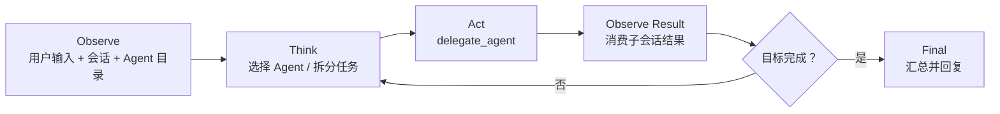

- **会话记忆**：按 Thread 保存最近消息和委派结果。
- **工作记忆**：保存当前目标、计划、已完成步骤、待处理问题和预算。
- **长期记忆**：按用户或 Leader 保存稳定偏好；V1.0 可以只预留接口。
- **上下文压缩**：最近 N 轮 + 滚动摘要 + 当前活动 Delegation；由框架或 `ContextPolicy` 实现。
- **Workspace**：保存计划、Agent 返回的文件引用和中间产物；Leader 不获得 Shell 权限。

---

## 4. 现有架构分析

### 4.1 当前主要通信关系

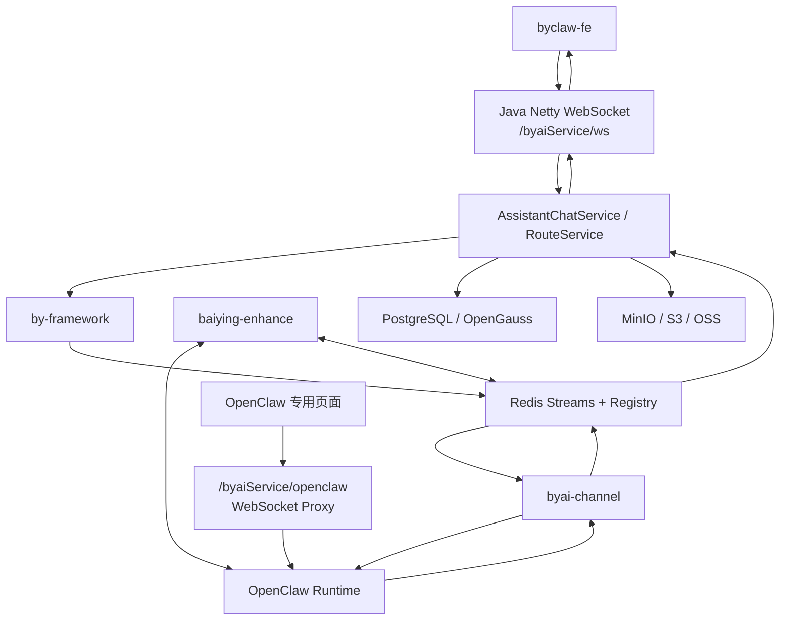

当前存在两条 WebSocket：

1. **业务聊天 WebSocket**：`byclaw-fe/src/utils/websocket.ts` 连接 Java `/byaiService/ws`，业务消息经过 Java、by-framework 和 `byai-channel`。
2. **OpenClaw 直连 WebSocket**：`byclaw-fe/src/utils/openClaw/openclawWebSocket.ts` 通过 `/byaiService/openclaw` 代理连接 OpenClaw Gateway，使用 `connect.challenge`、`hello-ok`、`chat.send`、`agent/chat` 事件。这条链路绕过 by-framework，V1.0 保持不变。

### 4.2 业务聊天完整时序

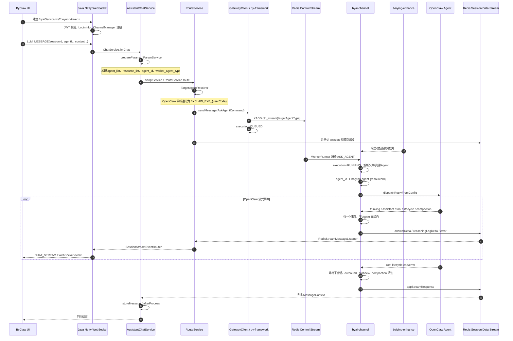

关键代码位置：

| 环节 | 代码 |
|---|---|
| 前端业务 WS | `byclaw-fe/src/utils/websocket.ts`、`byclaw-fe/src/hooks/useSseSender/useSend.ts` |
| Java WS 消息分发 | `byclaw-be/.../ws/handler/WebSocketHandler.java` |
| LLM 与停止入口 | `byclaw-be/.../ws/service/ChatService.java` |
| 参数与授权 Agent 列表 | `byclaw-be/.../chat/service/ParamService.java` |
| Gateway 路由 | `byclaw-be/.../gateway/route/RouteService.java` |
| 目标 Worker 解析 | `byclaw-be/.../chat/service/TargetAgentResolver.java` |
| Session Stream 消费 | `RedisStreamMessageListener.java`、`SessionStreamEventRouter.java` |
| OpenClaw Worker | `byclaw-exe/extensions/byai-channel/src/sdk-app.ts` |
| Agent/Session 选择 | `byai-channel/src/sdk-message-processor.ts` |
| OpenClaw 事件归一化 | `byai-channel/src/agent-event.ts` |
| 完成门 | `byai-channel/src/session-context.ts`、`sdk-session-completion.ts` |

### 4.3 现有停止流程

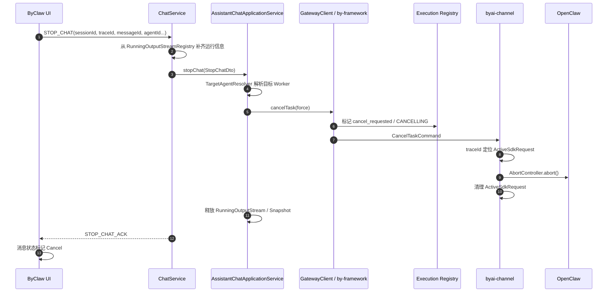

需要注意：当前前端停止是“尽力发送”，并会先在本地把消息标记为 Cancel；Java 在发出取消请求后立即清理运行快照并返回 ACK。by-conductor 接入后，取消必须增加 **父 Run 到全部活动子 Delegation 的级联映射**，否则只能停止 Leader LLM，不能保证 OpenClaw 子任务停止。

### 4.4 by-framework 的角色

by-framework 在当前系统中是 **Agent 通信与可靠执行总线**，不是业务编排框架。

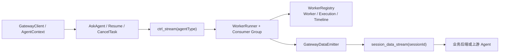

它提供：

- Worker 注册、Agent Type 声明、心跳和在线探测；
- 基于 Redis Stream 的 `ASK_AGENT`、`RESUME`、`CANCEL_TASK`；
- Consumer Group、Pending 消息和 ACK；
- Session 级 Execution Registry、messageId/executionId 映射和状态时间线；
- `GatewayDataEmitter` 流式事件；
- 父子 message、source/target agent type、trace 信息；
- 取消请求和级联取消基础；
- History、Tracing、Workspace 等基础扩展点。

#### by-framework 通信对象

| 通信对象 | 主要生产者 | 主要消费者 | 承载内容 | 在当前链路中的作用 |
|---|---|---|---|---|
| `ctrl_stream(agentType)` | Java `GatewayClient`、上游 Agent | 声明该 Agent Type 的 `WorkerRunner` | `ASK_AGENT`、`RESUME` 等控制指令 | 将业务请求路由到一类 Worker；当前 OpenClaw 目标通常是 `BYCLAW_EXE_{userCode}`。 |
| `worker_ctrl_stream(workerId)` | Gateway、Registry/取消逻辑 | 指定 Worker 实例 | `CANCEL_TASK` 等定向控制指令 | 已知某次执行所在 Worker 后，向具体实例发送取消或控制消息。 |
| `session_data_stream(sessionId)` | `GatewayDataEmitter`、执行 Worker | Java Session Listener 或上游 Leader | `answerDelta`、reasoning、error、`appStreamResponse` | 按会话传回流式结果；by-conductor 的父会话与每个子会话必须使用不同 Stream。 |
| Worker Registry | Worker 心跳与注册器 | Gateway、路由和运维探针 | Agent Type、Worker ID、在线状态、负载/时间信息 | 判断目标 Agent Type 是否可用，以及定位 Worker。 |
| Execution Registry / Timeline | Gateway、Worker、取消逻辑 | Gateway、Worker、诊断和恢复逻辑 | session/message/execution 映射、状态与事件时间线 | 做状态查询、幂等、取消定位和问题对账；不能替代业务结果校验。 |

核心消息的关联键也要区分：`sessionId` 表示事件流归属，`messageId` 表示一次消息，`executionId` 表示一次执行，`traceId` 用于跨层追踪。当前 `byai-channel` 存在把 `traceId` 当作 executionId 使用的约定，by-conductor 应在 adapter 内兼容，不能把这个约定扩散到领域模型。

#### by-framework AgentState

| 状态 | 是否终态 | 含义 |
|---|---:|---|
| `STARTING` | 否 | Worker/Agent 正在准备运行。 |
| `QUEUED` | 否 | 指令已写入目标控制流，等待 Worker 消费。 |
| `CALLING_AGENT` | 否 | 当前 Agent 正在发起另一个 Agent 调用。 |
| `WAITING_AGENT` | 否 | 当前 Agent 已委派，等待下游 Agent 返回。 |
| `WAITING_USER` | 否 | 执行暂停，等待用户输入或审批。 |
| `RESUMED` | 否 | 从等待状态恢复执行。 |
| `CANCELLING` | 否 | 已收到取消请求，正在传播和清理。 |
| `CANCELLED` | 是 | 已取消。 |
| `COMPLETED` | 是 | 正常完成。 |
| `FAILED` | 是 | 执行失败。 |

> 实现中还会把 Execution Registry 记录为 `RUNNING`。`RUNNING` 不是当前 `AgentState` 枚举值，而是 Registry 的执行状态，表示 Worker 已领取消息并开始处理。by-conductor 的协议层应统一这个差异，不能假设所有状态都来自同一枚举。

#### 发送与取消 API 返回状态

| 状态 | 含义 |
|---|---|
| `SUCCESS` | 操作成功。 |
| `QUEUED` | 消息已成功进入队列，不代表业务已完成。 |
| `CANCEL_REQUESTED` | 取消请求已经登记或投递。 |
| `NOT_FOUND` | 找不到目标执行。 |
| `ALREADY_FINISHED` | 执行已经终止，无需再次取消。 |
| `FAILED` | 操作失败。 |
| `SESSION_MISMATCH` | 会话与目标执行不匹配。 |
| `AGENT_TYPE_UNAVAILABLE` | 目标 Agent Type 无可用 Worker。 |
| `WORKER_NOT_ONLINE` | 指定 Worker 不在线。 |
| `REGISTRY_NOT_SET` | Worker Registry 未配置。 |

#### 流式 EventType

| 事件 | 用途 |
|---|---|
| `answerDelta` | 面向用户的回答增量。 |
| `reasoningLogStart` / `reasoningLogDelta` / `reasoningLogEnd` | 思考、工具、子 Agent 执行过程。 |
| `appStreamResponse` | 当前展示流终止信号。 |
| `finalAnswer` | 框架抽取的最终回答。 |
| `taskCreate` / `stepComplete` / `taskStop` | 任务和步骤类事件。 |

#### 当前实现中需要关注的点

1. `byai-channel` 自己保存一条 `RUNNING` Execution，并用 `traceId` 作为 executionId，取消依赖这个约定。
2. SDK 处理成功和异常路径都会 ACK；异常捕获后没有明确返回 `FAILED` 时，Worker 的默认归一化结果可能仍为 `COMPLETED`。by-conductor 不能只依赖 ACK 或 Registry 终态判断 Agent 业务成功，必须同时读取 `error` 与 `appStreamResponse`。
3. Java Session Stream Listener 收到事件后立即 ACK，因此消息落到业务上下文后的后续处理需要幂等和可恢复。
4. `byai-channel` 通过 `identity/byai_session_id.txt` 暴露当前 sessionId，多个并发会话存在共享文件竞争风险；V1.0 不扩大这个用法。
5. `appStreamResponse` 是“展示流完成”，不是 Redis 消息 ACK，也不等于每一个外部副作用都已提交。

### 4.5 数字员工创建并进入 OpenClaw 的链路

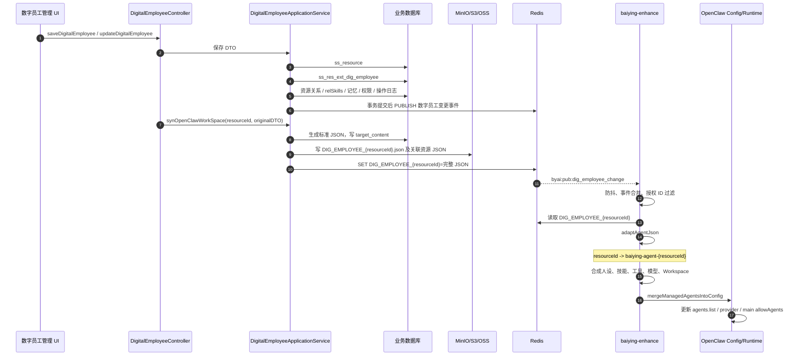

创建和更新的主要数据：

| 数据 | 作用 |
|---|---|
| `ss_resource` | 数字员工统一资源身份、归属、状态、实现类型和 Worker 类型。 |
| `ss_res_ext_dig_employee` | 数字员工人设、集成信息及 `target_content` 快照。 |
| `ss_resource_rel_detail` 等关系表 | 数字员工与技能、工具、知识库等资源关系。 |
| `au_privilege_grant` | 数字员工管理、使用等权限。 |
| 记忆配置/记忆库关系 | 数字员工自己的业务记忆规则。 |
| `DIG_EMPLOYEE_{resourceId}` | OpenClaw 沙箱读取的完整数字员工 JSON。 |
| `byai:pub:dig_employee_change` | 创建、更新、删除、技能同步通知。 |
| `baiying-agent-{resourceId}` | `baiying-enhance` 生成的 OpenClaw Agent ID。 |

#### 当前超级助手与默认数字员工的关系

代码中已经存在两层超级助手模型，复用时必须保留各自语义：

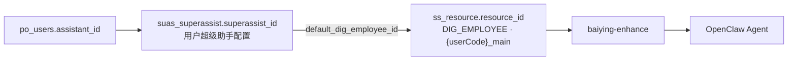

- `suas_superassist` 已有名称、头像、简介、配置、状态、企业、默认知识库和默认数字员工字段；
- `superassist_id` 优先来自 `po_users.assistant_id`，历史数据中常等于 `user_id`，但不能假设永远相等；
- 登录初始化通过 `createDefaultResourcesIfNotExists()` 补齐超级助手、个人知识库与默认数字员工；
- `{userCode}_main` 是真实 `DIG_EMPLOYEE` 资源，创建、权限、配置 JSON 与 OpenClaw 同步都复用数字员工主链路；
- `default_dig_employee_id` 可以被“设置默认数字员工”功能修改，因此它不适合作为 by-conductor Leader 的稳定身份。

当前同步顺序存在一个小窗口：业务事务提交后会发布变更事件，而 Controller 随后才调用 `synOpenClawWorkSpace` 写入最新 Redis JSON。`baiying-enhance` 的防抖、重扫和 Watchdog 通常可以最终修复，但后续 Agent Catalog 抽象时应采用版本号或 Outbox，避免收到事件却读到旧快照。

### 4.6 `byai-channel` 与 `baiying-enhance` 的边界

| 插件 | 当前职责 | V1.0 决策 |
|---|---|---|
| `baiying-enhance` | 把 ByClaw 数字员工、模型、技能、Workspace 转成 OpenClaw 配置；提供 `baiying_call`；维护 OpenClaw 运行配置 | 保持 OpenClaw 专用，不迁移、不抽离 |
| `byai-channel` | 注册 `BYCLAW_EXE_{userCode}` Worker；把 AskAgent 转成 OpenClaw 入站；把 OpenClaw 事件转成 by-framework 流；取消 OpenClaw Run | 保持现状，作为 V1.0 OpenClaw Connector 的引擎侧适配器 |

两个插件目前还通过冷启动 readiness、OpenClaw 运行配置和全局 session context 协作。V1.0 不尝试切断这些内部依赖，只在它们外部新增 by-conductor。

---

## 5. by-conductor V1.0 接入方案

### 5.1 设计原则

1. **复用业务身份**：`suas_superassist` 继续表示用户超级助手，`ss_resource` 中 `{userCode}_main` 继续作为其资源身份和聊天目标。
2. **运行态独立**：by-conductor 不拥有 Leader 主数据，只接收不可变 `LeaderProfileSnapshot`；Thread、Run、Delegation、Memory 与 Artifact 独立落库。
3. **权限仍归 ByClaw**：Leader 与数字员工权限都由 ByClaw 计算，by-conductor 只执行本次请求携带的授权快照。
4. **每次运行重新校验 Agent 权限**：不能因为 Leader 创建时绑定过数字员工，就永久获得调用权。
5. **父子会话隔离**：用户会话与每一次 Agent Delegation 使用不同 sessionId。
6. **by-framework 单一通信总线**：V1.0 不再引入另一套任务队列或 Durable Workflow。
7. **Leader 不执行**：除 `delegate_agent` 外不暴露业务 Tool、MCP 或 Shell。
8. **框架可替换**：Agent 框架、记忆实现和工作空间实现通过端口隔离。

### 5.2 V1.0 逻辑架构

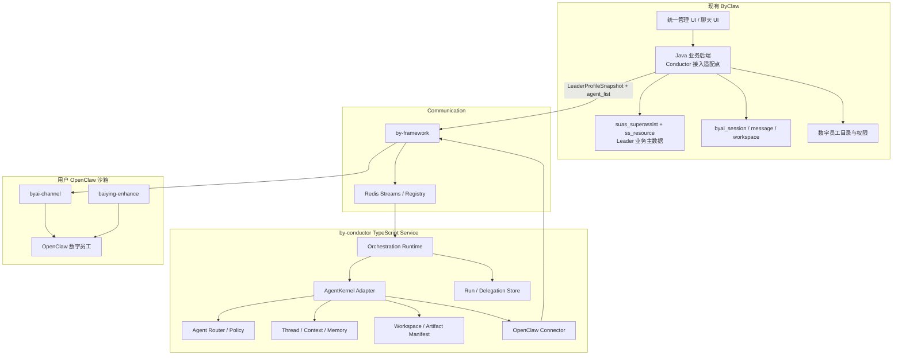

### 5.3 服务与代码边界

建议新增顶层模块：

```text
by-conductor/
├── apps/
│   ├── api/                 # 健康检查、运行态查询；不提供 Leader 主数据 CRUD
│   └── worker/              # by-framework Worker、Run Runtime
├── packages/
│   ├── domain/              # LeaderRef/ProfileSnapshot、Thread、Run、Delegation 领域模型
│   ├── agent-kernel/        # AgentKernel SPI
│   ├── kernel-mastra/       # 候选实现
│   ├── kernel-openai/       # 候选实现
│   ├── kernel-voltagent/    # 候选实现
│   ├── kernel-ai-sdk/       # 候选实现
│   ├── kernel-langgraph/     # 候选实现
│   ├── kernel-custom/       # 自研兜底
│   ├── by-framework-adapter/# Worker、Emitter、取消、Session Stream
│   ├── connector-openclaw/  # OpenClaw Agent 调用语义
│   ├── persistence-pg/      # PostgreSQL
│   └── workspace-object/    # MinIO/S3/OSS
└── docs/
```

V1.0 可以先合并 `apps/api` 和 `apps/worker` 为一个进程，但代码包保持边界，后续可独立扩缩容。

### 5.4 V1.0 默认超级助手与现有 UI 的接入

V1.0 不做 Leader 管理页面。用户进入现有通用聊天页面后，无需创建、编辑或发布 Leader，系统直接提供一个默认超级助手。

#### 默认 Leader 如何创建

现有代码已经有完整的幂等初始化链路，不需要再调用 by-conductor 创建 Leader：

1. 登录时 `LoginApplicationService.ensureSuperassistInfo()` 检查超级助手配置；
2. 缺失时调用 `SuasSuperassistApplicationService.createDatasetIfNotExists()`；
3. `createDefaultResourcesIfNotExists()` 创建或补齐 `suas_superassist`、默认个人知识库和默认超级助手数字员工；
4. 默认超级助手资源通过 `DigitalEmployeeApplicationService.saveDigitalEmployee()` 保存到 `ss_resource`，稳定编码为 `{userCode}_main`；
5. 当前 `suas_superassist.default_dig_employee_id` 指向默认数字员工，`AssistantChatService.applyDefaultPersonalAssistant()` 在请求未指定 Agent 时会把它设置到 `agentId`。

V1.0 在这条链路上做小幅扩展：

- 在 `suas_superassist` 增加稳定的 `conductor_resource_id`，指向 `{userCode}_main`；
- 存量数据按 `create_user/userCode + resource_code={userCode}_main` 回填；
- `{userCode}_main` 继续保留 `resource_biz_type=DIG_EMPLOYEE` 以复用现有 UI、权限和生命周期，`impl_type=ASK_AGENT`，但将 `worker_agent_type` 设置为 `BY_CONDUCTOR`；
- `default_dig_employee_id` 保持现有“用户选择的默认数字员工”语义，不把它改造成 Leader 外键，避免用户切换默认数字员工时丢失超级助手身份；
- 将 `applyDefaultPersonalAssistant()` 调整为：通用聊天且没有结构化 Agent 引用时，优先解析 `conductor_resource_id`，显式 `@Agent` 时保持原逻辑。

`{userCode}_main` 第一阶段仍可能被 `baiying-enhance` 同步到 OpenClaw，以保证插件链路不改；Java 与 by-conductor 不再把它作为可委派 Worker Agent，并从 `agent_list` 中排除自身，避免 Leader 调用自己形成递归。后续拆分 Agent 能力层时，再引入明确的 `LEADER` 资源类型并停止这份冗余同步。

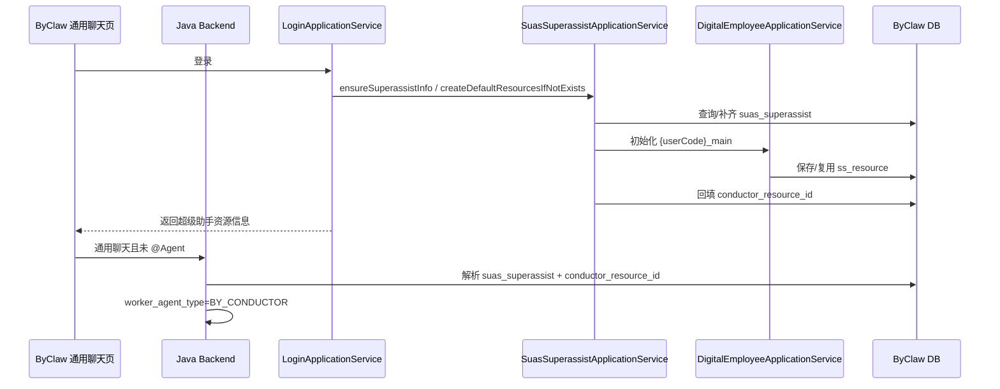

#### “不 @ Agent，默认走超级助手”的路由规则

不能只靠搜索消息中的普通 `@` 字符判断，否则会误伤邮件地址、自然语言和数字员工专属会话。后端应结合 **页面/会话模式** 与已经结构化解析的数字员工引用做最终判断：

| 场景 | 是否有结构化数字员工引用 | V1.0 路由 |
|---|---:|---|
| 通用聊天/超级助手会话 | 否 | 解析 `suas_superassist.conductor_resource_id`，路由 `BY_CONDUCTOR` |
| 通用聊天 | 是，用户显式选择或 `@数字员工` | 保持现有数字员工/多 Agent 直连链路 |
| `{userCode}_main` 超级助手详情/历史会话 | 否 | 根据其 `worker_agent_type` 继续 `BY_CONDUCTOR` |
| 其他数字员工专属详情页或其历史会话 | 否或是 | 保持原 `BYCLAW_EXE_{userCode}` 链路 |
| `SUPER_ASSISTANT` 父会话继续追问 | 否 | 根据会话绑定的 `superassist_id` 继续 `BY_CONDUCTOR` |

前端只需要做最小配合：

- 通用聊天页面不需要新建 Leader，也可以继续在未选择 Agent 时发送 `agentId=null`；如增加 `targetKind: "SUPER_ASSISTANT"`，它只作为显式提示，最终路由仍由后端与会话数据校验；
- 用户显式选择数字员工时，继续发送现有资源引用/占位符；
- 流式展示、停止按钮和历史会话 UI 尽量复用现有实现；
- 普通数字员工页面和请求字段保持不变。

```json
{
  "type": "LLM_MESSAGE",
  "sessionId": "123456",
  "targetKind": "SUPER_ASSISTANT",
  "agentId": null,
  "chatContent": "帮我完成本周销售复盘"
}
```

第二阶段再增加 Leader/专家团管理页，届时继续复用 `ss_resource` 的卡片、头像、发布和授权能力，并扩展 `suas_superassist` 配置字段；by-conductor 仍只提供运行态查询，不成为 Leader 主数据管理服务。

### 5.5 如何接入现有权限

权限分为两个对象：

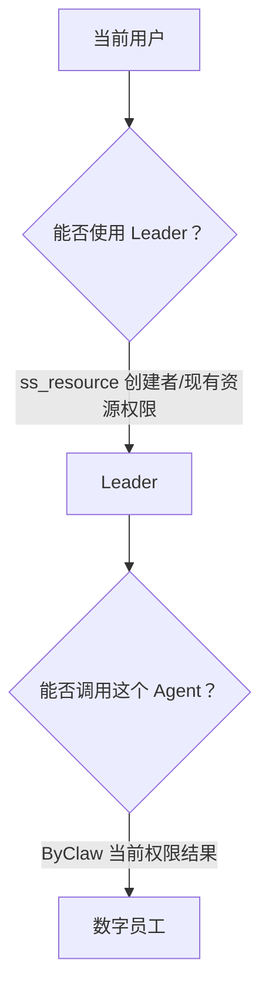

#### Leader 自身权限

V1.0 不新建 `Conductor_leader_acl`。`{userCode}_main` 已经是 `ss_resource`，创建时也会经过 `ensureCreatorDefaultPrivileges()`，因此继续复用现有资源权限、创建者权限、租户和上下架规则。Java 在生成 `LeaderProfileSnapshot` 前完成校验，by-conductor 再使用签名 ActorContext 校验快照中的用户、企业和 Leader 引用是否一致。

第二阶段创建自定义 Leader 时，也沿用 `ss_resource` 的 `USE/MANAGE/PUBLISH` 等现有权限与授权抽屉；`suas_superassist_resource_privilege` 可继续承载超级助手已有的资源访问关系。by-conductor 不保存业务 ACL，避免同一 Leader 出现两套授权事实。

#### 数字员工调用权限

V1.0 直接复用 `ParamService` 已有逻辑：

1. Java 后端根据当前登录用户计算 `AuthContextBo`；
2. 获取有权限的 `DIG_EMPLOYEE` ID；
3. 移除低评分、未上架或配置不完整的 Agent；
4. 过滤 Agent 关联资源权限；
5. 排除当前 `conductor_resource_id`，防止超级助手把自己当作执行 Agent；
6. 将结果放入 `extraPayload.agent_list`；
7. by-conductor 只允许从本次 `agent_list` 中选择 Agent。

这使 V1.0 不需要 by-conductor 查询 `ss_resource`、`au_privilege_grant` 或 `USER:RESOURCES:AUTH:*` Redis Key。

后续将这段能力抽成正式 Agent Catalog API：

```http
POST /internal/v1/agent-catalog/query
Authorization: Service-JWT ...
X-Actor-Context: signed-user-context

{
  "tenantId": "...",
  "userId": "...",
  "requiredCapabilities": [],
  "engine": null
}
```

无论 Leader 创建时是否配置了固定 Agent，运行时都必须与当前授权目录取交集，解决权限撤销问题。

### 5.6 如何接入现有会话流程

这里存在三种不同含义的“会话”，不能共用一个存储：

| 会话层级 | 谁使用 | 当前/建议存储 | 作用 |
|---|---|---|---|
| ByClaw 父业务会话 | 前端、Java 后端、用户 | `byai_session` 与消息表 | 会话列表、用户消息、最终回答、停止和多端恢复，是 UI 事实来源。 |
| Leader Thread | by-conductor 与 Leader LLM | 候选框架的 Session/Thread 接口 + by-conductor PostgreSQL | 保存 Leader 多轮上下文、摘要、工作记忆和委派结果，是编排事实来源。 |
| OpenClaw 子执行会话 | `byai-channel` 与 OpenClaw Agent | 独立 child sessionId；OpenClaw 可在沙箱内维护自己的 SessionKey/JSONL 文件 | 只服务一次 Agent Delegation 的引擎上下文和事件流。 |

如果“现有会话直接读取 OpenClaw 会话文件”指 OpenClaw Agent 恢复自己的上下文，这个理解是成立的；如果指 ByClaw 前端会话列表和最终消息，则不成立，它们仍由 Java 业务会话与消息表维护。by-conductor 不读取 OpenClaw 会话文件，也不把它当成 Leader 的历史库。

独立子会话解决的是 **事件流隔离和 OpenClaw 上下文隔离**，并不等于要在 by-conductor 再保存一份完整的子 Agent 对话。Connector 只需把子流聚合成 `AgentResult`，在 `Conductor_delegation` 保存结果摘要、终态和 Artifact 引用；原始 OpenClaw 会话仍是执行引擎私有数据。

现有 `ConversationObjectType.SUPER_ASSISTANT` 已经存在。父会话直接绑定 `suas_superassist`，执行路由再通过 `conductor_resource_id` 找到 `ss_resource`：

```text
byai_session.object_type = SUPER_ASSISTANT
byai_session.object_id   = suas_superassist.superassist_id

suas_superassist.conductor_resource_id -> ss_resource.resource_id
ss_resource.worker_agent_type          = BY_CONDUCTOR
```

`AssistantChatService.createGroupChatSession()` 需要根据超级助手目标写入 `SUPER_ASSISTANT + superassist_id`，不能因为内部解析出了 `conductor_resource_id` 就把父会话错误记成普通 `DIGITAL_EMPLOYEES` 会话。by-conductor 使用 `external_leader_id=superassist_id` 和 `external_session_id=byai_session.session_id` 建立弱引用，不拥有或生成 Leader ID。

会话责任划分：

| 数据 | 归属 | 说明 |
|---|---|---|
| Leader 名称、头像、简介、业务配置 | ByClaw `suas_superassist` | Leader 业务配置事实来源。 |
| Leader 资源身份、发布和权限 | ByClaw `ss_resource` 与现有权限表 | 通过 `conductor_resource_id` 关联。 |
| 会话列表、用户消息、最终展示消息 | ByClaw `byai_session` / message 表 | 继续作为用户界面的事实来源。 |
| Leader Thread、上下文摘要、工作记忆 | by-conductor | 服务于推理和恢复，不代替业务消息表。 |
| 父会话绑定 | `Conductor_thread.external_session_id` | 关联 ByClaw sessionId。 |
| Agent 子会话 | `Conductor_delegation.child_session_id` | 内部使用，不进入用户会话列表。 |
| 文件展示关系 | ByClaw `byai_session_workspace` | 用于现有 UI 展示。 |
| 文件内容与内部产物 | MinIO/S3/OSS + `Conductor_artifact` | by-conductor 保存 Manifest 和引用。 |

### 5.7 为什么只传 Token 不够，以及 Java 后端具体要做什么

#### 结论

用户 Token 当然可以用来证明“这个请求是谁发的”，但它不能替代现有 Java 后端在聊天链路里的职责。V1.0 **不需要新部署一个名为 BFF 的服务**，也不需要建立一套通用网关；只需在现有 Java 后端中增加 Conductor 接入适配代码。

直接把用户 Token 交给 by-conductor，只能解决身份认证，不能自动解决下面四件事：

1. **父会话与消息落库**：现有 WebSocket、`byai_session`、消息表、`appStreamResponse` 收尾仍在 Java 侧；
2. **数字员工授权结果**：Token 本身不包含经过 `ParamService/AuthContextBo` 过滤后的完整 `agent_list`，by-conductor 又不应查询 ByClaw 业务表；
3. **默认路由**：同一句没有 `@Agent` 的消息，在通用聊天页应走超级助手，在数字员工专属页应保持原链路，必须结合页面/会话上下文判断；
4. **停止与恢复**：现有 `RunningOutputStreamRegistry`、`STOP_CHAT_ACK`、父 execution 定位和消息补偿都在 Java 侧，by-conductor 无法只凭 Token 接管。

如果让 by-conductor 直接校验 ByClaw Token、查询权限 API、创建 ByClaw 会话和写 ByClaw 消息表，反而会把登录、权限和会话领域重新耦合进开源项目。因此建议：

- 浏览器继续只把原 Token 发给现有 ByClaw Java 后端；
- Java 完成现有登录校验，从登录态取得可信 `tenantId/userId/userCode`；
- Java 生成短时、不可篡改的 `ActorContext` 和 `LeaderProfileSnapshot`，放入 by-framework `extraPayload`；
- 若后续开放运行态查询 HTTP API，Java 到 by-conductor 再使用 **Service JWT 或 mTLS**；
- 不把原始用户 Token 放入 Redis Stream、Prompt、Trace 或 by-conductor 数据库。

```json
{
  "actor_context": {
    "tenantId": "10001",
    "userId": "20001",
    "userCode": "zhangsan",
    "issuedAt": 1784160000,
    "expiresAt": 1784160300,
    "signature": "..."
  },
  "leader_profile": {
    "source": "BYCLAW",
    "superassistId": "20001",
    "resourceId": "31001",
    "configVersion": 3,
    "name": "超级助手",
    "instructions": "...",
    "orchestrationConfig": {}
  }
}
```

如果未来公司的统一 Token 是标准 JWT，且 by-conductor 可以通过稳定 JWKS 独立验签，可以把原 Token 作为直接认证的备选方案；但 Java 侧的会话、权限快照、路由和停止适配仍然不能因此删除。

#### Java 后端改造清单

| 编号 | 改造点 | 后端要做什么 | 不做什么 |
|---|---|---|---|
| J1 | 请求模型 | V1.0 可继续接收 `agentId=null`；可选增加 `targetKind=SUPER_ASSISTANT` 作为前端显式提示 | 不要求前端生成新的 Leader ID |
| J2 | 登录初始化 | 扩展 `createDefaultResourcesIfNotExists()`：找到/创建 `{userCode}_main` 后回填 `suas_superassist.conductor_resource_id`，并确保其 Worker 类型为 `BY_CONDUCTOR` | 不调用 by-conductor 创建业务 Leader，不重复建设 Leader 表 |
| J3 | 聊天目标判断 | 调整 `applyDefaultPersonalAssistant()`：通用聊天无结构化 Agent 引用时解析 `conductor_resource_id`；显式 `@Agent` 保持原路由 | 不再把可变的 `default_dig_employee_id` 当作 Leader 身份 |
| J4 | 父会话 | 创建/复用 `object_type=SUPER_ASSISTANT`、`object_id=superassist_id` 的 `byai_session`，继续保存用户消息和最终回答 | 不因内部使用了 `resourceId` 就把父会话记成普通数字员工会话 |
| J5 | 快照封装 | 从 `suas_superassist + ss_resource` 生成 `LeaderProfileSnapshot`；复用 `ParamService/AuthContextBo` 生成 `agent_list` 并排除 `conductor_resource_id` | 不把业务表查询能力下沉给 by-conductor，不允许 Leader 调用自身 |
| J6 | 身份封装 | 生成短时签名 `ActorContext`，由 by-conductor 校验租户、用户、时效和请求 ID | 不转发原始 Token 给 LLM 或写入日志 |
| J7 | Worker 路由 | 增加 `BY_CONDUCTOR` Agent Type；优先读取 `ss_resource.worker_agent_type`，且不追加 `userCode`，路由到公共 Worker Pool | 不修改其他数字员工的 `BYCLAW_EXE_{userCode}` 规则 |
| J8 | 流式收尾 | Java 只监听父 session；只有 by-conductor 发出的父 `appStreamResponse` 才触发本回合 `storeMessage/afterProcess` | 不订阅或落库 OpenClaw child session 的原始事件 |
| J9 | 停止 | 在 `RunningChatInfo` 中保存本回合真实 target/execution；STOP 时按运行快照向 `BY_CONDUCTOR` 发送 CancelTask | 不根据停止请求时是否有 `@Agent` 重新计算路由 |
| J10 | 回归与契约测试 | 覆盖登录幂等初始化、无 `@` 默认路由、显式 `@Agent` 原路由、切换默认数字员工、父终态、停止、权限和普通数字员工回归 | 不在第一阶段增加新的 Leader 管理页面 |

Leader 请求的核心分支可以收敛为：

```text
if isGeneralChat && structuredAgentRefs.isEmpty():
    superassist = loadCurrentUserSuasSuperassist()
    leaderResource = loadResource(superassist.conductorResourceId)
    targetKind = SUPER_ASSISTANT
    agentId = leaderResource.resourceId       # 仅用于内部路由
    workerAgentType = leaderResource.workerAgentType  # BY_CONDUCTOR
    session = getOrCreateSuperAssistantSession(superassist.superassistId)
    extraPayload.leader_profile = snapshot(superassist, leaderResource)
    extraPayload.agent_list = currentUserAuthorizedAgents()
        .excluding(leaderResource.resourceId)
    extraPayload.actor_context = sign(currentActor)
else:
    保持现有数字员工/多 Agent 逻辑
```

这组代码在职责上是“防腐适配”，但在部署上仍然就是现有 Java 服务中的若干类，例如可以放到 `state/domain/conductor/` 与现有聊天路由中，不必成立新的微服务。

### 5.8 复用后的数据模型

#### ByClaw 业务主数据：复用 `suas_superassist`

现有字段已经覆盖 `superassist_id`、名称、头像、简介、`prologue`、状态、创建者、企业、默认知识库和默认数字员工。V1.0 建议只增加下面字段：

| 新增字段 | 类型建议 | 说明 |
|---|---|---|
| `conductor_resource_id` | `BIGINT` | 稳定指向 `{userCode}_main` 的 `ss_resource.resource_id`；与可变的 `default_dig_employee_id` 分离。 |
| `leader_instructions` | `TEXT` | Leader 的角色边界、委派原则和汇总要求；不建议复用已有展示/开场配置 `prologue`。 |
| `orchestration_config` | `JSONB` 或数据库等价 JSON 类型 | 框架驱动、模型引用、路由、上下文、记忆和工作空间策略；不保存密钥。 |
| `config_version` | `INT DEFAULT 1` | 生成 `LeaderProfileSnapshot`、缓存失效和审计对账。 |
| `update_user` / `update_time` | `BIGINT` / `TIMESTAMP` | 补齐配置更新审计。 |

密钥、Token 和生产连接串只保存 Secret Reference。若当前数据库不适合 JSONB，可先使用 `TEXT` 保存带 `schemaVersion` 的 JSON，但所有读写必须经过统一 DTO 校验。

#### ByClaw 资源身份：复用 `ss_resource`

第一阶段无需为 `ss_resource` 增加字段，直接复用现有能力：

| 字段 | V1.0 用法 |
|---|---|
| `resource_id` | Leader 的可路由资源 ID，即 `conductor_resource_id`。 |
| `resource_code` | 继续使用稳定编码 `{userCode}_main`。 |
| `resource_biz_type` | 第一阶段保持 `DIG_EMPLOYEE`，避免大面积改动现有 UI/权限枚举。 |
| `resource_name/resource_desc/avatar` | Leader 展示摘要；详细人设以 `suas_superassist` 为准。 |
| `resource_status/publish_type/owner_type/com_acct_id` | 继续承担生命周期、归属和租户隔离。 |
| `impl_type` | `ASK_AGENT`。 |
| `worker_agent_type` | 设置为 `BY_CONDUCTOR`，使现有路由自然进入 by-conductor Worker。 |

`suas_superassist_sub_agent` 可继续作为用户关注、订阅、置顶或后续 Leader 固定 Agent 范围的候选关系表；V1.0 不把它当成最终授权依据，真实可调用集合仍以每次请求的 `agent_list` 为准。

#### by-conductor 只保存运行时表

| 表 | 主要字段 | 用途 |
|---|---|---|
| `Conductor_thread` | `thread_id, tenant_id, user_id, source_system, external_leader_id, external_resource_id, external_session_id, source_config_version, summary, status` | Leader Thread；外部引用 `suas_superassist`、`ss_resource` 和 ByClaw session。 |
| `Conductor_run` | `run_id, thread_id, parent_trace_id, status, kernel_driver, leader_profile_snapshot, context_snapshot, started_at, finished_at` | 一次 Leader 回合；保存当时的配置快照用于审计，不成为主数据。 |
| `Conductor_delegation` | `delegation_id, run_id, agent_ref, child_session_id, child_trace_id, message_id, execution_id, status, result_ref, error` | 每次 Agent 委派和取消定位。 |
| `Conductor_workspace` | `workspace_id, thread_id, storage_provider, root_uri, quota, retention_policy` | 工作空间元数据。 |
| `Conductor_artifact` | `artifact_id, workspace_id, delegation_id, object_uri, name, mime_type, size, checksum, visibility` | 文件和中间产物 Manifest。 |

不再创建 `Conductor_leader`、`Conductor_leader_acl` 和 `Conductor_leader_agent_ref`，避免名称、头像、状态、配置和权限形成双写。

推荐外部引用格式：

```text
byclaw:superassist:{superassistId}
byclaw:dig-employee:{resourceId}
```

以后可自然扩展：

```text
hermes:agent:{agentId}
codex:profile:{profileId}
claude-code:profile:{profileId}
```

### 5.9 Leader 如何知道 OpenClaw Agent

V1.0 使用现有 `agent_list` 作为本回合的 Agent Catalog Snapshot：

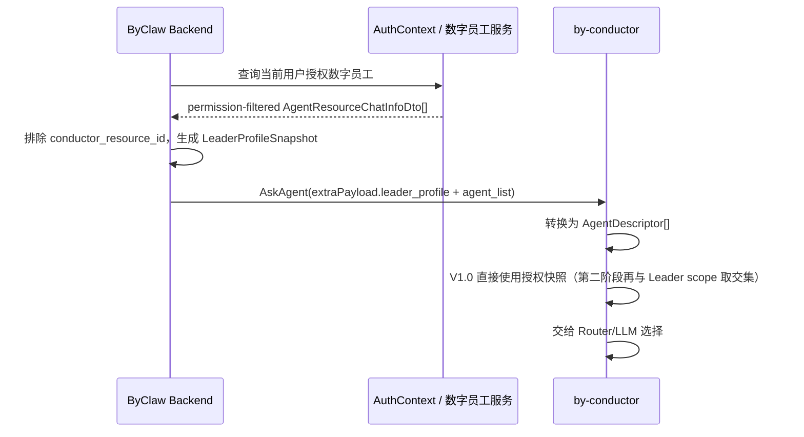

by-conductor 内部只需要的 Agent 描述：

```ts
type AgentDescriptor = {
  ref: string;
  externalId: string;
  name: string;
  description?: string;
  instructions?: string;
  capabilities?: string[];
  engine: "openclaw";
  runtimeTarget: string;
  available: boolean;
};
```

V1.0 的 `runtimeTarget` 在运行时由 Connector 根据用户上下文生成 `BYCLAW_EXE_{userCode}`，不能固化到 Leader 配置中。

### 5.10 Leader 调用 OpenClaw Agent 的时序

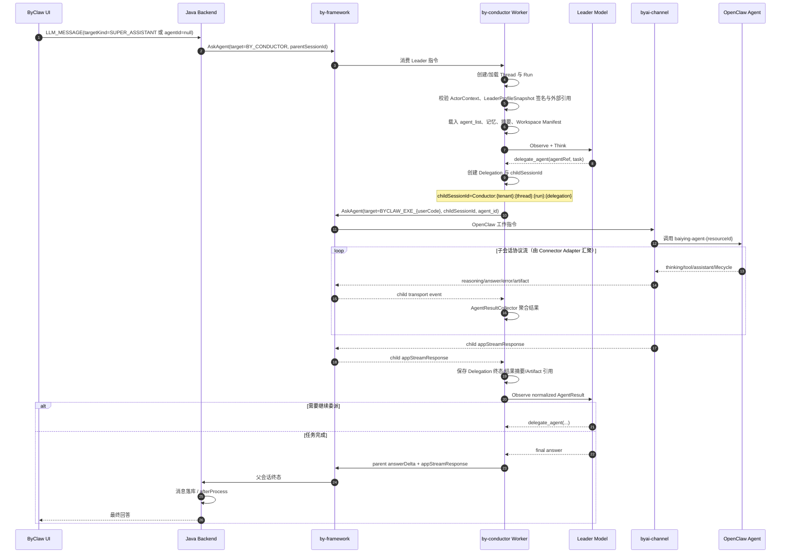

为什么必须使用子会话：

- Java 后端只监听父 `sessionId` 的数据流。
- OpenClaw Agent 的 `appStreamResponse` 是子任务完成，不应结束 Leader 回合。
- OpenClaw Connector 的协议适配器必须持续读取子流直到终态，才能形成 `AgentResult`；Leader 领域逻辑只观察规范化结果，不需要阅读或展示每条原始 reasoning。
- 每个 Delegation 都需要独立 execution/message/trace，才能可靠取消和审计。

### 5.11 by-framework 在 by-conductor 中的用法

#### 北向：Leader 作为 Worker

- 注册 Agent Type：`BY_CONDUCTOR`。
- 多副本组成公共 Worker Pool，通过 tenant/user context 实现逻辑隔离。
- 接收 `ASK_AGENT`、`RESUME`、`CANCEL_TASK`。
- 父会话流由 `GatewayDataEmitter` 输出。

#### 南向：Leader 作为调用方

- 目标 Agent Type：V1.0 为 `BYCLAW_EXE_{userCode}`。
- `extraPayload.agent_id` 使用数字员工 `resourceId`。
- 每个 Delegation 建立独立 child session data stream。
- `AgentResultCollector` 在协议层读取 `answerDelta`、`error`、Artifact 引用和 `appStreamResponse`，聚合为 `AgentResult`；`reasoning*` 默认丢弃或只用于受控诊断，不进入 Leader Prompt 和父消息。
- 按 `messageId + executionId + childSessionId` 保存取消定位信息。

这里的“读取/消费”只是 Connector 必须完成的消息协议动作，不代表 by-conductor 要把 OpenClaw 的全部过程当成自己的业务数据。Leader 真正使用的最小结果建议为：

```ts
type AgentResult = {
  delegationId: string;
  status: "SUCCEEDED" | "FAILED" | "CANCELLED" | "TIMED_OUT";
  answer?: string;
  error?: { code?: string; message: string };
  artifacts?: ArtifactRef[];
  usage?: Record<string, number>;
};
```

#### 不使用的能力

- V1.0 不让 by-framework 的 `WorkspaceManager` 成为 Leader 持久工作空间的唯一实现。
- 不把 by-framework History 当作长期记忆事实库。
- 不用 Task Group 自动代替 Leader 的 ReAct 判断。
- 不让框架的默认 `COMPLETED` 覆盖真实业务 error。

### 5.12 路由、调度和编排

V1.0 路由分两级：

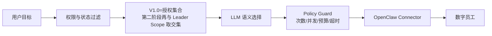

路由策略方向：

- **硬过滤**：V1.0 包含权限、上架状态、在线状态和租户；第二阶段增加 Leader 限定范围。
- **软选择**：名称、简介、能力描述与当前任务的语义匹配。
- **策略保护**：最大 ReAct 轮数、最大 Delegation 数、最大并发、单 Agent 超时、总 Token/时间预算。
- **V1.0 默认**：串行委派；可以一次选择多个 Agent，但由 Leader 逐个观察结果。数据模型保留并行能力。
- **失败处理**：同一 Agent 最多一次可控重试；不可用时让 Leader选择其他 Agent；禁止无限自循环。

### 5.13 by-conductor 运行状态

| by-conductor 状态 | 对应含义 | 可映射的 by-framework 状态 |
|---|---|---|
| `CREATED` | Run 已创建，尚未进入队列 | — |
| `QUEUED` | 等待 by-conductor Worker | `QUEUED` |
| `RUNNING` | Leader 模型正在推理 | Registry `RUNNING` |
| `DELEGATING` | 正在创建并发送 Agent 调用 | `CALLING_AGENT` |
| `WAITING_AGENT` | 等待一个或多个子 Agent | `WAITING_AGENT` |
| `SYNTHESIZING` | 已获得结果，Leader 正在汇总 | `RUNNING` |
| `WAITING_USER` | 等待用户补充、确认或审批 | `WAITING_USER` |
| `CANCELLING` | 正在停止 Leader 和子任务 | `CANCELLING` |
| `CANCELLED` | 已停止 | `CANCELLED` |
| `COMPLETED` | 最终回答已发送并完成 | `COMPLETED` |
| `FAILED` | 不可恢复失败 | `FAILED` |
| `TIMED_OUT` | 超过总运行时限 | 对外归一为 `FAILED`，metadata 标记 timeout |

### 5.14 停止与级联取消

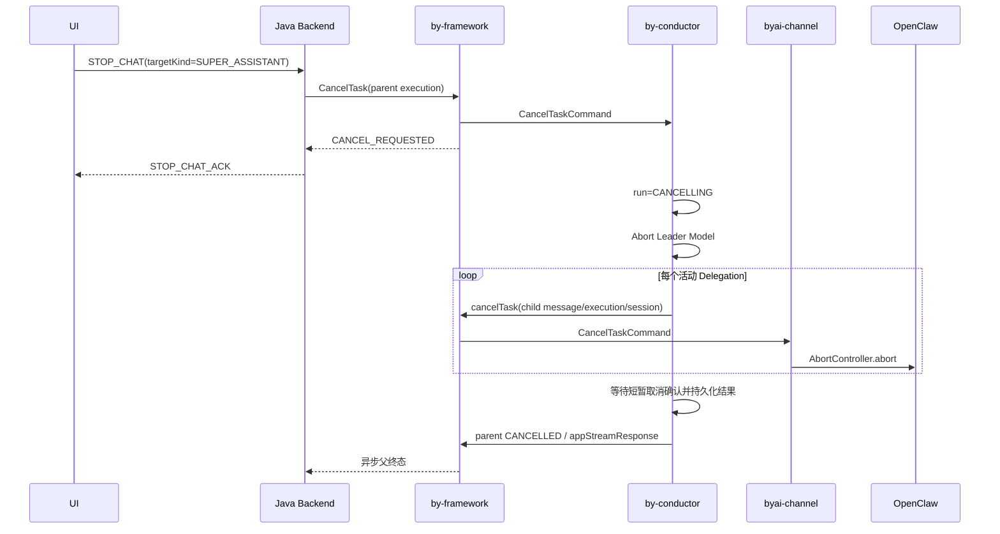

取消应满足：

- 幂等：重复 STOP 不报错；
- 有界等待：不能无限等待下游确认；
- 可审计：记录 requestedBy、reason、cancelMode 和每个子任务结果；
- 晚到事件隔离：取消后的子 Agent 增量不再写入父回答，但可以记录到诊断日志；
- 服务重启恢复：处于 `CANCELLING` 的 Run 启动后继续清理。

### 5.15 会话、上下文、记忆和工作空间存储

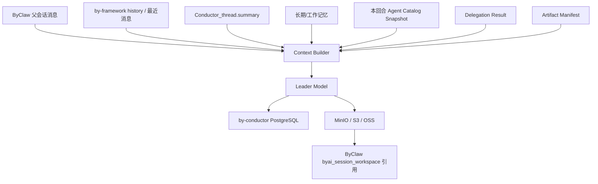

#### PostgreSQL

保存：

- Thread、Run、Delegation，以及每个 Run 使用的 `LeaderProfileSnapshot`；
- 当前计划和工作记忆；
- 上下文摘要、压缩版本和 Token 统计；
- Workspace/Artifact Manifest；
- 框架自身需要的 Session/Memory/Checkpoint 表。

建议使用独立数据库或至少独立 schema `by_Conductor`，by-conductor 是唯一写入者。

#### Redis

只保存：

- by-framework Worker、Execution、Control Stream、Session Data Stream；
- 短期运行锁、幂等键、活跃 Run 索引；
- 可重建缓存。

Redis 不作为长期会话和文件事实库。

#### MinIO/S3/OSS

建议对象前缀：

```text
by-conductor/{tenantId}/superassists/{superassistId}/threads/{threadId}/
├── inputs/
├── delegations/{delegationId}/
├── artifacts/
├── summaries/
└── manifests/
```

保存：

- 用户上传但需要在多个 Agent 之间传递的文件；
- Agent 返回文件的复制或稳定引用；
- 中间报告、计划、结构化结果；
- Workspace 快照和 Manifest。

#### 本地文件系统

by-conductor 容器本地盘只允许作为临时 staging：

```text
/tmp/by-conductor/{runId}/
```

完成、取消或超时后清理。Leader 不获得 Shell 工具，因此 V1.0 不需要为 by-conductor 自身建立执行沙箱。

### 5.16 部署与安全

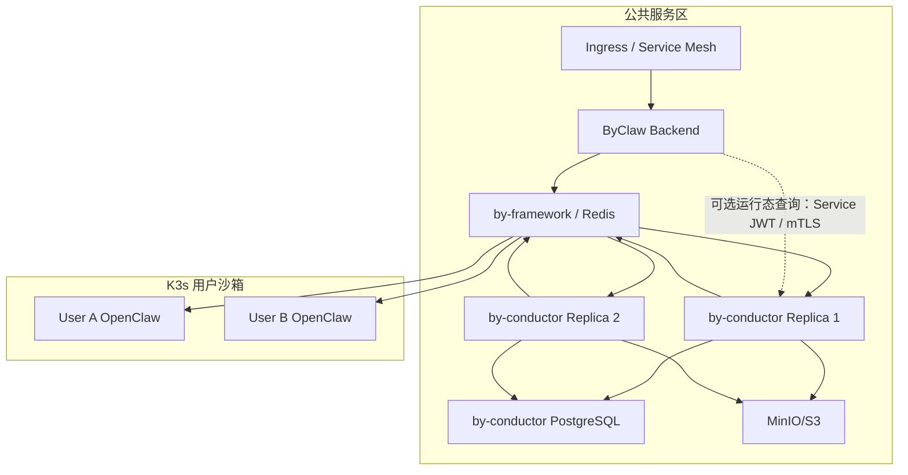

安全要求：

- by-conductor 无 Shell、无 Docker Socket、无宿主机目录挂载。
- 聊天指令通过 by-framework 传输签名 Actor Envelope 与 Leader Snapshot；只有可选的运行态 HTTP 查询使用 Service JWT 或 mTLS。
- 用户上下文使用短期签名 Actor Envelope，不把原始用户 Token 交给 LLM。
- 模型密钥和对象存储密钥使用 Secret Manager/K8s Secret，只保存引用。
- 所有查询带 `tenant_id + user_id`，数据库开启行级隔离约束或统一 Repository Guard。
- Agent 调用必须校验 `agent_list` Snapshot，不允许模型构造任意 `resourceId`。
- Workspace 对象路径禁止用户输入直接拼接，使用服务端生成 ID。
- Prompt、上下文、Agent 输出和日志需要分类脱敏；`Beyond-Token` 不进入 trace 和模型输入。

---

## 6. 实施计划

考虑 AI 辅助开发，V1.0 日历周期压缩为 **2 周（10 个工作日）**：第 1 周交付可用 MVP，第 2 周集中做容错、恢复、上下文与灰度收口。

以下负责人均为占位假名，项目启动时替换为实际人员：

- `@王强`：后端，主责 by-conductor TypeScript；
- `@张伟`：后端，主责现有 ByClaw Java 接入；
- `@李娜`：前端，主责现有聊天页面接入；
- `@赵磊`：基础设施，主责 PostgreSQL、Redis、K8s、Secret 与可观测性。

要在一周内得到 MVP，必须锁定以下范围：只启用一个 `AgentKernel`、只接 OpenClaw、默认串行委派、只提供系统默认 Leader、不做 Leader CRUD/发布/ACL UI、不展示子 Agent 原始 reasoning、工作空间先实现 Manifest 与对象存储基础上传/引用。

### 6.1 周计划

| 周期/编号 | 工作项 | 主责 / 配合 | 完成标志与前置依赖 |
|---|---|---|---|
| 第 1 周 D1 / M1-01 | 冻结 `ActorContext`、`AgentDescriptor`、`AgentResult`、父/子 session、事件与取消契约 | `@王强` / `@张伟` | 契约文档、JSON Schema、示例消息评审通过；后续前后端以此为准 |
| 第 1 周 D1 / M1-02 | 建立 by-conductor TypeScript monorepo、配置、健康检查、日志和基础测试 | `@王强` | 本地可启动，`/health` 通过，CI 能跑单测 |
| 第 1 周 D1 / M1-03 | 建立 migration：扩展 `suas_superassist`；建立 by-conductor Thread、Run、Delegation、Artifact 运行时表 | `@王强`、`@张伟` / `@赵磊` | migration 可重复执行；不创建新的 Leader/ACL 主数据表 |
| 第 1 周 D1 / M1-04 | Java 增加 `BY_CONDUCTOR` 类型、`SUPER_ASSISTANT` 目标解析和路由骨架 | `@张伟` | 编译通过；普通数字员工路由单测不回归 |
| 第 1 周 D1 / M1-05 | 准备开发环境 PostgreSQL schema、Redis ACL、Service Secret、K8s 基础清单 | `@赵磊` | by-conductor 开发实例可访问依赖；Secret 不写入仓库 |
| 第 1 周 D2 / M1-06 | 扩展现有登录初始化：回填 `conductor_resource_id`，将 `{userCode}_main` 路由到 `BY_CONDUCTOR` | `@张伟` | 新老用户登录均幂等；切换 `default_dig_employee_id` 不影响 Leader 身份 |
| 第 1 周 D2 / M1-07 | Java 完成 `LeaderProfileSnapshot`、签名 `ActorContext` 与 `SUPER_ASSISTANT` 父会话创建 | `@张伟` / `@王强` | 首次发送复用现有超级助手，并正确绑定 `superassist_id` |
| 第 1 周 D2 / M1-08 | 选定一个生产 Kernel，实现最小 ReAct 与唯一工具 `delegate_agent` | `@王强` | Mock Agent 可完成“委派一次并汇总”的闭环 |
| 第 1 周 D2 / M1-09 | 前端复用现有超级助手入口；可选补充 `targetKind=SUPER_ASSISTANT` | `@李娜` / `@张伟` | 无 `@` 请求进入 Conductor；显式 `@Agent` 与专属页面保持原链路 |
| 第 1 周 D3 / M1-10 | 注册 `BY_CONDUCTOR` Worker，接收父 AskAgent 并输出父流 | `@王强` | Java 能收到 Leader 的父 `answerDelta/appStreamResponse` |
| 第 1 周 D3 / M1-11 | 实现 OpenClaw Connector、独立 child session 和 `AgentResultCollector` | `@王强` | 指定数字员工可被调用；子流能聚合为规范化结果；原始 reasoning 不写父消息 |
| 第 1 周 D3 / M1-12 | Java 接入 `agent_list` 权限快照、父流落库与终态处理 | `@张伟` | Leader 只看到授权 Agent；仅父终态触发 `storeMessage/afterProcess` |
| 第 1 周 D3 / M1-13 | 联调 by-framework Redis Stream、Worker Registry 与开发环境部署 | `@赵磊` / `@王强` | Worker 在线可见，父/子 Stream 可追踪，无跨租户 Key 冲突 |
| 第 1 周 D4 / M1-14 | 完成串行多轮委派、Thread/Run/Delegation 持久化及最小上下文装载 | `@王强` | Leader 可调用一个或多个 Agent 后汇总；进程重启后历史 Thread 可读取 |
| 第 1 周 D4 / M1-15 | 完成父 STOP 到 Leader LLM 与活动 child execution 的级联取消 | `@王强` / `@张伟` | STOP 立即 ACK；父 Run 与子 Delegation 最终进入取消终态 |
| 第 1 周 D4 / M1-16 | 前端复用流式、停止和历史展示，补充超级助手名称/头像默认展示 | `@李娜` | 聊天、刷新历史、停止三条主路径可用 |
| 第 1 周 D5 / M1-17 | Happy Path E2E、显式 `@Agent` 回归、无权限/Agent 离线冒烟 | `@张伟` / `@王强`、`@李娜`、`@赵磊` | A0-A5 与 A7 的主路径通过；形成已知问题清单 |
| 第 1 周 D5 / M1-18 | 部署 MVP 环境并演示验收 | `@赵磊` / 全员 | 用户无需创建 Leader，可在现有页面无 `@` 调用超级助手并得到 OpenClaw Agent 汇总结果 |
| 第 2 周 D6 / H2-01 | 错误、超时、无输出、重复消息、幂等与单次可控重试 | `@王强` / `@张伟` | 各异常有确定终态；不重复委派、不重复父回答 |
| 第 2 周 D7 / H2-02 | by-conductor/OpenClaw/Redis 重启恢复、`CANCELLING` 清理、晚到事件隔离 | `@王强` / `@赵磊` | 运行中任务可识别为恢复或失败；取消后的增量不污染父回答 |
| 第 2 周 D8 / H2-03 | 上下文窗口、滚动摘要、基础 Memory 接口和 Token 预算 | `@王强` | 长会话不会无限增长；摘要和最近消息可重建上下文 |
| 第 2 周 D8 / H2-04 | Workspace Manifest、MinIO/S3 上传、Artifact 引用与 UI 展示 | `@王强`、`@赵磊` / `@李娜`、`@张伟` | 文件不依赖容器本地盘；父会话可展示授权文件引用 |
| 第 2 周 D9 / H2-05 | 权限撤销、租户隔离、并发限流、安全日志与 Secret 检查 | `@张伟` / `@王强`、`@赵磊` | 越权用例失败；Token 不进入 Prompt/Redis/日志；并发受策略控制 |
| 第 2 周 D9 / H2-06 | Trace/Metric/告警和父 Run—Delegation—execution 关联查询 | `@赵磊` / `@王强`、`@张伟` | 能按 traceId 定位父子链路、耗时、失败和取消 |
| 第 2 周 D10 / H2-07 | 全量回归、基础压测、灰度/回滚演练、运维与接口文档收口 | `@张伟` / 全员 | A0-A7 全部通过；形成测试报告、灰度清单和回滚步骤 |

第一周的“可用”定义是主链路可演示、普通数字员工不回归；第二周结束才是 V1.0 可灰度验收。若第一周 D3 仍未打通 child session，必须停止增加 Memory/Workspace 功能，优先保证通信闭环。

### 6.2 测试重点

- Leader 无权限、Agent 无权限、权限运行中撤销；
- 存量用户登录回填、新用户初始化、重复登录，以及切换 `default_dig_employee_id` 后 Leader 路由不变；
- `agent_list` 排除 `conductor_resource_id`，Leader 不能调用自身；
- by-conductor 重启、OpenClaw 沙箱重启、Redis 短时断线；
- 子 Agent 正常、错误、超时、无输出、只输出 reasoning；
- 父停止、子停止、重复停止、晚到事件；
- 同一用户多会话、同一会话连续发送、多个用户并发；
- `appStreamResponse` 只结束正确层级；
- 文件跨父子会话引用及租户隔离；
- 普通数字员工聊天和 OpenClaw 直连链路不回归。

---

## 7. 后续架构拆分规划

### 7.1 目标分层

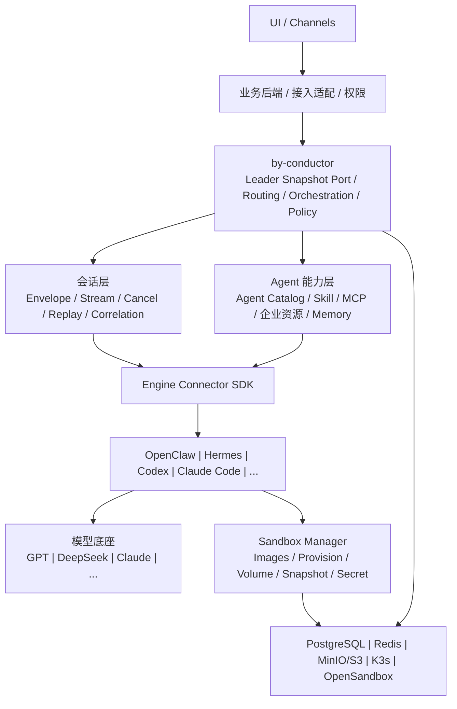

### 7.2 调度/编排层规划

by-conductor 后续可逐步增加：

- 用户自定义 Leader 和领域 Leader；
- Leader 调用 Leader 的层级编排；
- Agent 选择策略、能力匹配、成本/延迟/质量策略；
- 并行、竞争、投票、审阅、仲裁等多 Agent 模式；
- Plan-and-Execute、HITL、审批和长任务；
- Run Replay、Checkpoint、评测和可观测性；
- 开源 Connector SDK 和 AgentKernel SPI。

开源版不强制宿主使用 ByClaw 表结构，而是定义 `LeaderProfileProvider` 端口；ByClaw 适配器从 `suas_superassist + ss_resource` 生成 Snapshot，其他使用者可以接自己的 Leader Registry。

by-conductor 的核心领域应只认识 `AgentRef`、`Delegation` 和规范化事件，不认识 `SsResource`、OpenClaw SessionKey 或某个 CLI 参数。

### 7.3 Agent 能力层与 `baiying_call` 拆分

建议分四步：

1. 从 `baiying-enhance` 中提取资源类型 Schema、Capability Resolver、鉴权上下文和执行结果协议，先形成无 OpenClaw 依赖的 TypeScript Package。
2. 把 DOC、MCP、OBJECT、VIEW、TOOLKIT、TOOL、PAGE 等执行器迁入独立 `capability-gateway` 服务或 SDK。
3. `baiying_call` 退化为 OpenClaw Tool Adapter，通过 HTTP/MCP 调用 Capability Gateway。
4. 其他 Engine Connector 可以把同一能力暴露成 MCP、Function Tool 或引擎原生工具，不再复制实现。

V1.0 中 by-conductor 不直接调用 Capability Gateway，保持“Leader 只调度 Agent”的边界。

### 7.4 会话层拆分

从当前 Java、by-framework 和 `byai-channel` 中逐步抽出通用会话协议：

- `ConversationEnvelope`：用户、租户、会话、消息、Trace、附件；
- `AgentEvent`：answer、reasoning、tool、artifact、state、error；
- `SessionCorrelation`：父子 session、run、delegation、trace；
- `Cancellation`：优雅/强制、级联、幂等；
- `Replay`：断线恢复、stream cursor、去重；
- `TerminalPolicy`：何时可以结束父流；
- `Backpressure`：缓冲、限流和大结果引用。

`byai-channel` 最终只保留 OpenClaw 的 SessionKey、Agent Event 和 Plugin Hook 适配；Java 后端只保留业务消息落库和 UI 推送。

### 7.5 执行引擎 Connector

统一 Connector 接口方向：

```ts
interface EngineConnector {
  listAgents(ctx: ActorContext): Promise<EngineAgent[]>;
  start(request: EngineRunRequest): AsyncIterable<EngineEvent>;
  cancel(handle: EngineRunHandle, reason?: string): Promise<void>;
  resume?(handle: EngineRunHandle, input: unknown): AsyncIterable<EngineEvent>;
  health(): Promise<ConnectorHealth>;
}
```

各引擎实现：

| Connector | 推荐部署位置 | 接入方式 |
|---|---|---|
| OpenClaw Connector | Connector 控制面在 by-conductor；`byai-channel` 在 OpenClaw 沙箱 | by-framework + Redis Stream |
| Hermes Connector | 沙箱内 Sidecar/Adapter | 优先 HTTP/WS/A2A；必要时封装 CLI |
| Codex Connector | 沙箱内 Connector Daemon | 将 SDK/CLI/ACP 等可用能力包装为网络服务和标准事件 |
| Claude Code Connector | 沙箱内 Connector Daemon | 将 SDK/CLI 等能力包装为网络服务和标准事件 |
| Generic CLI Connector | 执行引擎同一沙箱 | `spawn` 子进程、PTY、stdout/stderr 解析、取消和文件映射 |

by-conductor 永远不跨网络直接 `spawn` 另一个沙箱中的 CLI。CLI 只由沙箱内 Connector 启动，控制面通过统一网络协议或 by-framework 与 Connector 通信。

### 7.6 沙箱管理

后续建设独立 Sandbox Manager：

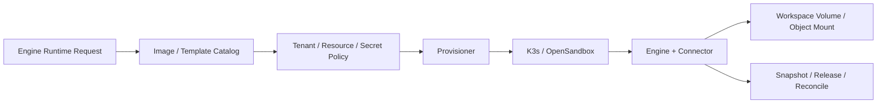

需要统一管理：

- 按引擎和版本维护 Dockerfile、基础镜像和 Connector 版本；
- 镜像能力标签，如 `openclaw`、`hermes`、`codex`、`claude-code`、`browser`、`gpu`；
- CPU、内存、GPU、磁盘、网络和运行时限额；
- Secret 只在启动时注入，不进入镜像和 Workspace；
- Workspace Volume、对象存储挂载和快照；
- 启动、心跳、租约、休眠、恢复、释放和对账；
- 镜像漏洞扫描、签名、SBOM 和灰度升级；
- 根据 Agent/任务按需选择并启动最小镜像组合。

---

## 8. 风险与应对

| 风险 | 影响 | 应对 |
|---|---|---|
| Agent 框架锁定 | 后续难以替换模型、Memory 或 Loop | `AgentKernel`、`ConversationStore`、`WorkspaceStore` SPI；生产只启用一个实现。 |
| 父子终态混淆 | 子 Agent 完成导致父回答提前结束 | 强制 child session；by-conductor 只向 parent session 发父终态。 |
| 权限漂移 | Leader 调用已经撤权的 Agent | 每次运行使用当前 `agent_list`；固定 Agent 范围只作上限。 |
| ACK 与业务成功混淆 | 消息已确认但执行实际失败 | 同时检查 error、终态和结果；修正 adapter 的显式 FAILED 返回。 |
| 双份会话数据 | ByClaw 与 by-conductor 状态不一致 | ByClaw 消息是 UI 事实；by-conductor Thread 是运行事实；通过 external_session_id 和 trace 对账。 |
| 文件泄露 | 父子 Workspace 或租户路径串用 | 服务端 ID、对象存储前缀隔离、签名 URL、Artifact ACL。 |
| by-conductor 单点 | 所有 Leader 不可用 | 无状态 Worker 多副本；Run/Thread 落 PG；Redis 锁和幂等。 |
| OpenClaw 沙箱离线 | Delegation 长时间排队或失败 | Worker 在线探测、启动进度、单次重拉、超时和替代 Agent。 |
| 数字员工事件早于 JSON 更新 | OpenClaw 读到旧配置 | 短期保留 Watchdog 重扫；后续 Outbox + configVersion。 |
| `default_dig_employee_id` 与 Leader 身份混淆 | 用户切换默认数字员工后，无 `@` 路由意外改变 | 新增稳定 `conductor_resource_id`；两者禁止共用语义。 |
| `suas_superassist` 与 `ss_resource` 关联失效 | 无 `@` 请求无法找到 Leader Worker | 登录时幂等自愈、数据库索引/约束、按 `{userCode}_main` 回填并告警。 |
| Leader 配置运行中被修改 | 同一 Run 前后使用不同策略 | 每个 Run 固化 `LeaderProfileSnapshot + config_version`；下一 Run 才加载新配置。 |
| Leader 形成无限委派循环 | 成本和时间失控 | maxTurns、maxDelegations、总预算、重复任务检测和熔断。 |

---

## 9. V1.0 最终建议

第一版应把重点放在一个稳定闭环，而不是一次完成所有分层：

1. 新建独立 `by-conductor` TypeScript 服务和独立运行时 PostgreSQL schema。
2. 定义框架无关的 AgentKernel，保留 Mastra、OpenAI Agents SDK、VoltAgent、AI SDK、LangGraph 和自研方向；第 1 周 PoC 后生产只启用一个。
3. 复用 `suas_superassist + ss_resource` 作为 Leader 主数据；为 `suas_superassist` 增加 `conductor_resource_id`、指令、编排配置和版本字段，不创建 `Conductor_leader/ACL`。
4. Java 扩展现有登录初始化与聊天接入：`{userCode}_main.worker_agent_type=BY_CONDUCTOR`，父会话使用 `SUPER_ASSISTANT + superassist_id`；不新增独立 BFF 服务和默认 Leader HTTP Client。
5. 前端第一阶段复用现有超级助手入口；`targetKind=SUPER_ASSISTANT` 可选，Leader 创建、编辑、发布和授权管理放到第二阶段并继续使用 ByClaw 资源体系。
6. Java 生成 `LeaderProfileSnapshot` 和现有权限过滤后的 `agent_list`，排除 `conductor_resource_id`，不建立新的数字员工同步副本。
7. by-conductor 通过 by-framework 调用 `BYCLAW_EXE_{userCode}`，每次 Delegation 使用独立 child session。
8. OpenClaw Connector Adapter 负责把子流汇聚成 `AgentResult`；Leader 只观察规范化结果、继续 ReAct，并只向父 session 发最终 `appStreamResponse`。
9. Leader 名称、头像、状态、权限和配置留在 ByClaw；会话与消息继续保存在 ByClaw；Leader Thread/Memory/Run 在 by-conductor；文件内容在 MinIO/S3，现有会话工作区保存展示引用。
10. `baiying-enhance`、`byai-channel` 和 OpenClaw 直连 WebSocket 第一阶段不改。

这条路径的改动集中在“新增服务 + 两侧薄适配”，能先验证“Leader 调用 OpenClaw Agent”的产品价值，同时为后续开源和多执行引擎接入保留清晰边界。

---

## 10. 代码依据与外部参考

### 10.1 当前项目关键代码

- `byclaw-fe/src/utils/websocket.ts`
- `byclaw-fe/src/utils/openClaw/openclawWebSocket.ts`
- `byclaw-fe/src/hooks/useSseSender/useSend.ts`
- `byclaw-fe/src/hooks/useChat/index.ts`
- `byclaw-be/src/main/java/com/iwhalecloud/byai/state/domain/ws/handler/WebSocketHandler.java`
- `byclaw-be/src/main/java/com/iwhalecloud/byai/state/domain/ws/service/ChatService.java`
- `byclaw-be/src/main/java/com/iwhalecloud/byai/state/domain/chat/service/ParamService.java`
- `byclaw-be/src/main/java/com/iwhalecloud/byai/state/domain/chat/service/TargetAgentResolver.java`
- `byclaw-be/src/main/java/com/iwhalecloud/byai/manager/entity/superassist/SuasSuperassist.java`
- `byclaw-be/src/main/java/com/iwhalecloud/byai/manager/entity/resource/SsResource.java`
- `byclaw-be/src/main/java/com/iwhalecloud/byai/manager/application/service/superassist/SuasSuperassistApplicationService.java`
- `byclaw-be/src/main/java/com/iwhalecloud/byai/manager/application/service/login/LoginApplicationService.java`
- `byclaw-be/src/main/java/com/iwhalecloud/byai/gateway/route/RouteService.java`
- `byclaw-be/src/main/java/com/iwhalecloud/byai/state/domain/chat/service/SessionStreamEventRouter.java`
- `byclaw-be/src/main/java/com/iwhalecloud/byai/state/domain/ws/handler/RedisStreamMessageListener.java`
- `byclaw-be/src/main/java/com/iwhalecloud/byai/manager/application/service/digitemploy/DigitalEmployeeApplicationService.java`
- `byclaw-be/src/main/java/com/iwhalecloud/byai/manager/application/service/digitemploy/event/DigEmployeeChangeEventPublisher.java`
- `byclaw-exe/extensions/byai-channel/src/sdk-app.ts`
- `byclaw-exe/extensions/byai-channel/src/sdk-message-processor.ts`
- `byclaw-exe/extensions/byai-channel/src/agent-event.ts`
- `byclaw-exe/extensions/byai-channel/src/session-context.ts`
- `byclaw-exe/extensions/baiying-enhance/src/dig-employee-change-subscriber.ts`
- `byclaw-exe/extensions/baiying-enhance/src/agent-watchdog.ts`
- `byclaw-exe/extensions/baiying-enhance/src/agent-adapter.ts`
- `byclaw-exe/extensions/baiying-enhance/src/agent-registry.ts`

### 10.2 开源框架参考

- [Mastra GitHub](https://github.com/mastra-ai/mastra)
- [Mastra Agent Memory](https://mastra.ai/blog/agent-memory-guide)
- [Mastra Workspaces](https://mastra.ai/blog/introducing-mastra-workspaces)
- [Mastra Remote Filesystems](https://mastra.ai/blog/introducing-remote-filesystems)
- [OpenAI Agents SDK for TypeScript](https://openai.github.io/openai-agents-js/)
- [OpenAI Agents SDK Sessions](https://openai.github.io/openai-agents-js/guides/sessions/)
- [OpenAI Agents SDK Models](https://openai.github.io/openai-agents-js/guides/models/)
- [VoltAgent](https://github.com/VoltAgent/voltagent)
- [VoltAgent PostgreSQL Memory](https://voltagent.dev/docs/agents/memory/postgres/)
- [VoltAgent Workspace](https://voltagent.dev/docs/workspaces/filesystem/)
- [Vercel AI SDK ToolLoopAgent](https://ai-sdk.dev/docs/reference/ai-sdk-core/tool-loop-agent)
- [Vercel AI SDK Chatbot Message Persistence](https://ai-sdk.dev/docs/ai-sdk-ui/chatbot-message-persistence)
- [LangGraph.js Persistence](https://docs.langchain.com/oss/javascript/langgraph/persistence)
- [Inngest AgentKit Networks](https://agentkit.inngest.com/concepts/networks)
- [Inngest AgentKit History](https://agentkit.inngest.com/concepts/history)
