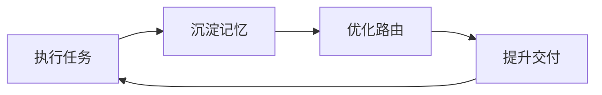
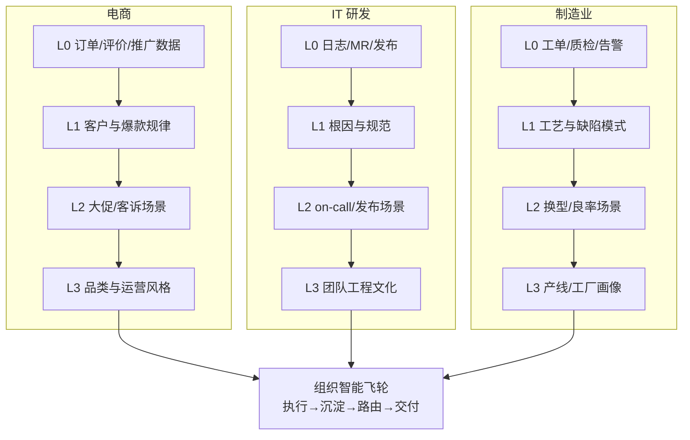
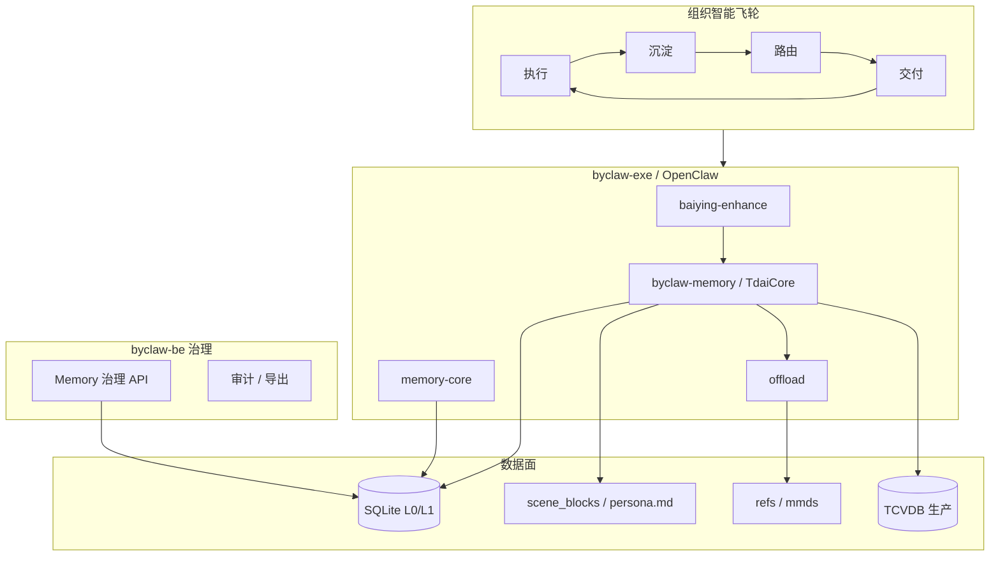

# ByClaw 企业级 Agent OS — Memory 子系统深度技术方案

> **版本**：v1.1（深度研究稿 + 行业场景）
> **日期**：2026-05-26
> **研究方法**：全程使用 Codegraph 对 [TencentDB-Agent-Memory](https://github.com/Tencent/TencentDB-Agent-Memory) 与 [OpenClaw](https://github.com/openclaw/openclaw) 源码索引分析（非手工 grep 抽样）
> **关联材料**：[`baiying-enhance-work-summary.html`](../reports/baiying-enhance-work-summary.html)、[`byclaw-agent-os-memory-solution.html`](../reports/byclaw-agent-os-memory-solution.html)

---

## 目录

1. [执行摘要](#1-执行摘要)
2. [记忆分层：理论与 TencentDB 实现](#2-记忆分层理论与-tencentdb-实现)
3. [SQLite 多层记忆：工程实践](#3-sqlite-多层记忆工程实践)
4. [数据结构与 DDL 参考](#4-数据结构与-ddl-参考)
5. [写入 / 召回 / 流水线](#5-写入--召回--流水线)
6. [短期记忆：Offload 与 OpenClaw 文件记忆](#6-短期记忆offload-与-openclaw-文件记忆)
7. [数据飞轮：个人 → 团队 → 组织 → 企业](#7-数据飞轮个人--团队--组织--企业)
8. [行业业务场景设计（电商 / IT 研发 / 制造业）](#8-行业业务场景设计电商--it-研发--制造业)
9. [OpenClaw memory-core 深度对照](#9-openclaw-memory-core-深度对照)
10. [ByClaw 统一架构与模块规划](#10-byclaw-统一架构与模块规划)
11. [治理、迁移与运维](#11-治理迁移与运维)
12. [实施路线图与风险](#12-实施路线图与风险)
13. [源码索引](#13-源码索引)

---

## 1. 执行摘要

### 1.1 问题定义

企业 Agent 的 Memory 不是「把聊天记录塞进向量库」，而是：

- **分层**：证据（L0）→ 原子事实（L1）→ 场景（L2）→ 画像（L3），每层信息密度与可变性不同；
- **异构存储**：SQLite/向量库存海量行；Markdown/Mermaid 存人类可读结构；
- **飞轮**：执行 → 沉淀 → 路由 → 交付，形成组织智能复利；
- **生命周期**：同一套机制从个人会话扩展到团队、部门、企业租户。

TencentDB-Agent-Memory 在 OpenClaw 上以插件形式验证了该路径（Token 节省最高 61%、PersonaMem +59%）。OpenClaw `memory-core` 则提供 **Workspace 文件切片索引** 的另一条记忆轨。ByClaw 需要 **融合二者**，并接入 `baiying-enhance` 的多 Agent 与 `byclaw-be` 治理面。

### 1.2 核心结论（可落地）

| 维度 | 推荐方案 |
|------|----------|
| 长期记忆内核 | 以 TencentDB `TdaiCore` + `VectorStore`（SQLite/sqlite-vec）为默认；生产可迁 TCVDB |
| 短期 / 长任务 | TencentDB `offload`（Mermaid + refs）+ OpenClaw short-term promotion |
| Agent 私有知识 | OpenClaw `memory/**/*.md` 索引（`MemoryIndexManager`） |
| 一致性 | `checkpoint.json` 文件锁 + per-session `runner_states` / `pipeline_states` 分权 |
| 企业扩展 | 在 L0/L1 行上增加 `tenant_id` / `org_id` / `team_id` / `user_id`；L2/L3 用 `profiles` 集合同步 |

---

## 2. 记忆分层：理论与 TencentDB 实现

### 2.1 四层语义模型

汇报材料与 TencentDB README 一致，将记忆分为：

```
                    ┌─────────────────────────────────────┐
                    │  L3 Persona · persona.md            │
                    │  用户/团队/组织画像、风格、路由偏好      │
                    └──────────────────┬──────────────────┘
                                       │ 抽象、低频重写
                    ┌──────────────────▼──────────────────┐
                    │  L2 Scenario · scene_blocks/*.md    │
                    │  可复用业务流程（客户分析、日报、研发计划）│
                    └──────────────────┬──────────────────┘
                                       │ LLM 聚合 L1
                    ┌──────────────────▼──────────────────┐
                    │  L1 Atom · l1_records + l1_vec      │
                    │  persona / episodic / instruction     │
                    └──────────────────┬──────────────────┘
                                       │ LLM 抽取 + 判重
                    ┌──────────────────▼──────────────────┐
                    │  L0 Trace · l0_conversations + l0_vec │
                    │  逐条消息、工具上下文、可审计证据        │
                    └─────────────────────────────────────┘
```

**设计要点**（源码注释 `sqlite.ts` 文件头）：

- L0/L1 在 **同一 SQLite 文件** 内用 **关系表 + vec0 虚表 + FTS5** 三轨索引；
- L2/L3 以 **文件系统** 为主（`scene_blocks/`、`persona.md`），可选 `pullProfiles` / `syncProfiles` 上云；
- **渐进式披露**：Recall 默认注入 L3 + L2 导航 + Top-K L1；需要证据时再 `tdai_conversation_search` 下钻 L0。

### 2.2 L1 原子类型（v3 Schema）

`l1-writer.ts` 定义三种 `MemoryType`，取代旧版四分类：

| type | 含义 | 典型例子 | priority 语义 |
|------|------|----------|---------------|
| `persona` | 稳定偏好、身份、风格 | 「汇报用表格不用散文」 | 0–100，越高越重要 |
| `episodic` | 带时间范围的事件 | 「5 月拜访阿里谈 Q2 收入」 | 可附 `activity_start/end` |
| `instruction` | 可执行 SOP / 指令 | 「日报先发钉钉群 X」 | 可为 -1 表示全局强指令 |

每条 Atom 字段（`MemoryRecord`）：

- `id`, `content`, `type`, `priority`, `scene_name`
- `source_message_ids[]` — 溯源到 L0
- `metadata` — episodic 时间等
- `timestamps[]` — merge 历史
- `sessionKey`, `sessionId` — 多租户扩展锚点

### 2.3 L2 场景块与 L3 画像

**L2 — `SceneExtractor`**：

- 输入：一批 L1 记录（API 或本地 SQLite 查询）；
- 输出：`scene_blocks/{filename}.md` + `.metadata` 索引；
- 副作用：`updateSceneNavigation()` 在 `persona.md` 尾部维护场景目录（可被 `PersonaGenerator` 整体重写）。

**L3 — `PersonaGenerator` + `PersonaTrigger`**：

触发优先级（`persona-trigger.ts`）：

1. `request_persona_update` — Agent 显式请求；
2. 冷启动：已有 scene 文件但 `persona.md` 正文为空；
3. 恢复：`last_persona_at > 0` 但 persona 正文丢失；
4. 首次 scene 提取完成；
5. 间隔：`memories_since_last_persona >= triggerEveryN`（默认 50）。

生成时只读 **自上次 persona 以来变更的 scene**，避免全量重算。

### 2.4 Profile 同步（L2/L3 的企业化雏形）

`profile-sync.ts` 将本地 L2/L3 文件映射为 `ProfileRecord`：

- `buildProfileStableId(scope, type, filename)` → `profile:v1:{sha256}`
- 当前 `PROFILE_SCOPE = "global"` — **单 dataDir 一份画像**
- TCVDB `syncProfiles` 使用 **乐观锁**：`baselineVersion` 与远端 `version` 不一致则跳过，防止覆盖

这是扩展到 **团队/组织/企业** 的关键扩展点（见第 7 章）。

---

## 3. SQLite 多层记忆：工程实践

### 3.1 为什么是「一库多层」而不是「每层一库」

TencentDB `VectorStore` 选择 **单库多表**（`initSchema`）的原因：

| 优势 | 说明 |
|------|------|
| 原子事务 | `BEGIN` → 写 `l1_records` + 删插 `l1_vec` + 更新 `l1_fts` → `COMMIT` |
| 联合运维 | 一份 WAL、`busy_timeout=5000`、备份/迁移简单 |
| 游标迁移 | `queryL1RecordsCursor(afterId)` 分页迁 TCVDB |
| 降级一致 | `degraded` 标志一次切换，全层只读 meta |

**代价**：库文件随 L0 增长变大的 — 用 `LocalMemoryCleaner` + `deleteL0Expired` / `deleteL1Expired` 按本地自然日保留。

### 3.2 PRAGMA 与并发（生产必读）

`VectorStore` 构造函数（`sqlite.ts`）：

```sql
PRAGMA busy_timeout = 5000;
PRAGMA journal_mode = WAL;
PRAGMA cache_size = -65536;      -- 64MB page cache
PRAGMA mmap_size = 134217728;    -- 128MB mmap 上限
PRAGMA wal_autocheckpoint = 1000;
```

**含义**：

- 多进程（Gateway + OpenClaw Agent）同时写时靠 WAL + busy_timeout 重试，而非失败；
- `checkpoint.json` 用 **独立文件锁**（`withFileLock`），与 DB 锁正交 — 避免 L0 游标竞态。

### 3.3 三轨索引：Meta + vec0 + FTS5

每一层（L0/L1）都是 **三轨并行**：

| 轨 | 技术 | 用途 |
|----|------|------|
| 关系表 | `l1_records` / `l0_conversations` | 精确过滤、排序、过期删除、迁移 |
| 向量 | `l1_vec` / `l0_vec`（sqlite-vec `vec0`） | 语义召回；`distance_metric=cosine` |
| 全文 | `l1_fts` / `l0_fts`（FTS5） | 关键词 / hybrid；中文用 jieba `tokenizeForFts` |

**vec0 限制**（代码注释）：

- **不支持 `ON CONFLICT`** → upsert 语义 = `DELETE` + `INSERT`；
- embedding 维度变更 → `dropVectorTables()` + `needsReindex`；
- `embedding_meta` 表记录 provider/model/dimensions，变更时自动触发重建。

**FTS v2 迁移**：

- 索引列存 **分词后** `content`；`content_original` UNINDEXED 存原文用于展示；
- v1→v2 检测 `pragma_table_info` 无 `content_original` 则 drop FTS 表 + `rebuildFtsIndex()`。

### 3.4 写入路径：同步 meta，异步 vector（可选）

`IMemoryStore` 接口（`types.ts`）：

- `supportsDeferredEmbedding`：为 true 时 L0 可先写 meta，后台 `updateL0Embedding`；
- `upsertL0` / `upsertL1`：事务内 meta + vec + fts；vec 为零向量或表未就绪时 **meta-only**（不丢证据）。

### 3.5 与 JSONL 双写

L1 仍写 `records/YYYY-MM-DD.jsonl`（`l1-writer`），SQLite 为主、JSONL 为：

- 人类可读备份；
- VectorStore 降级时的 fallback（`l1-reader.readMemoryRecords`）；
- 跨版本工具链兼容。

**原则**：读路径优先 `queryMemoryRecords` → SQLite；写路径 **SQLite 成功才算提交**。

---

## 4. 数据结构与 DDL 参考

### 4.1 TencentDB SQLite 核心表（摘自 `initSchema`）

#### embedding_meta

```sql
CREATE TABLE IF NOT EXISTS embedding_meta (
  key TEXT PRIMARY KEY,
  value TEXT NOT NULL
);
```

#### L1 — 关系表 + 索引

```sql
CREATE TABLE IF NOT EXISTS l1_records (
  record_id TEXT PRIMARY KEY,
  content TEXT NOT NULL,
  type TEXT DEFAULT '',
  priority INTEGER DEFAULT 50,
  scene_name TEXT DEFAULT '',
  session_key TEXT DEFAULT '',
  session_id TEXT DEFAULT '',
  timestamp_str TEXT DEFAULT '',
  timestamp_start TEXT DEFAULT '',
  timestamp_end TEXT DEFAULT '',
  created_time TEXT DEFAULT '',
  updated_time TEXT DEFAULT '',
  metadata_json TEXT DEFAULT '{}'
);

CREATE INDEX idx_l1_type ON l1_records(type);
CREATE INDEX idx_l1_session_key ON l1_records(session_key);
CREATE INDEX idx_l1_session_id ON l1_records(session_id);
CREATE INDEX idx_l1_scene ON l1_records(scene_name);
CREATE INDEX idx_l1_session_updated ON l1_records(session_id, updated_time);
CREATE INDEX idx_l1_sessionkey_updated ON l1_records(session_key, updated_time);
```

#### L1 — vec0 + FTS5

```sql
CREATE VIRTUAL TABLE l1_vec USING vec0(
  record_id TEXT PRIMARY KEY,
  embedding float[D] distance_metric=cosine,
  updated_time TEXT DEFAULT ''
);

CREATE VIRTUAL TABLE l1_fts USING fts5(
  content,
  content_original UNINDEXED,
  record_id UNINDEXED,
  type UNINDEXED,
  priority UNINDEXED,
  scene_name UNINDEXED,
  session_key UNINDEXED,
  session_id UNINDEXED,
  ...
);
```

#### L0 — 关系表

```sql
CREATE TABLE IF NOT EXISTS l0_conversations (
  record_id TEXT PRIMARY KEY,
  session_key TEXT NOT NULL,
  session_id TEXT DEFAULT '',
  role TEXT NOT NULL DEFAULT '',
  message_text TEXT NOT NULL,
  recorded_at TEXT DEFAULT '',
  timestamp INTEGER DEFAULT 0
);

CREATE INDEX idx_l0_session ON l0_conversations(session_key);
CREATE INDEX idx_l0_timestamp ON l0_conversations(timestamp);
```

#### L0 — vec0 + FTS5

结构同 L1，向量列名为 `message_text` / `message_text_original`。

### 4.2 checkpoint.json 状态机（非 SQL，但决定 SQL 写入范围）

`Checkpoint` 全局字段：

| 字段 | 用途 |
|------|------|
| `last_captured_timestamp` | 全局最新消息时间（统计） |
| `total_processed` | 累计处理消息数 |
| `last_persona_at` / `memories_since_last_persona` | L3 触发 |
| `scenes_processed` | L2 进度 |
| `request_persona_update` | Agent 请求刷新 L3 |

**Per-session 分权**（避免 Pipeline 与 Runner 互相覆盖）：

```typescript
// Runner 独占 — L0 游标、L1 游标、scene 连续性
runner_states[sessionKey]: {
  last_captured_timestamp,
  last_l1_cursor,
  last_scene_name,
}

// Pipeline 独占 — 对话计数、L2 时间、warmup
pipeline_states[sessionKey]: {
  conversation_count,
  last_extraction_time,
  warmup_threshold,  // 1→2→4→…→everyN
  l2_last_extraction_time,
  ...
}
```

`captureAtomically()` 在文件锁内：读游标 → `recordConversation` → 推进 `last_captured_timestamp`，消除并发 `agent_end` 重复 L0。

### 4.3 OpenClaw memory-core Schema（文件切片模型）

`packages/memory-host-sdk/src/host/memory-schema.ts`：

```sql
CREATE TABLE meta (key TEXT PRIMARY KEY, value TEXT NOT NULL);

CREATE TABLE files (
  path TEXT PRIMARY KEY,
  source TEXT NOT NULL DEFAULT 'memory',
  hash TEXT NOT NULL,
  mtime INTEGER NOT NULL,
  size INTEGER NOT NULL
);

CREATE TABLE chunks (
  id TEXT PRIMARY KEY,
  path TEXT NOT NULL,
  source TEXT NOT NULL DEFAULT 'memory',
  start_line INTEGER NOT NULL,
  end_line INTEGER NOT NULL,
  hash TEXT NOT NULL,
  model TEXT NOT NULL,
  text TEXT NOT NULL,
  embedding TEXT NOT NULL,  -- 也可外置 vec 表
  updated_at INTEGER NOT NULL
);

CREATE VIRTUAL TABLE chunks_fts USING fts5(text, id UNINDEXED, path UNINDEXED, ...);
CREATE VIRTUAL TABLE chunks_vec USING vec0(id TEXT PRIMARY KEY, embedding FLOAT[D]);

CREATE TABLE embedding_cache (
  provider, model, provider_key, hash,
  embedding TEXT, dims, updated_at,
  PRIMARY KEY (provider, model, provider_key, hash)
);
```

**语义差异**：

| TencentDB | OpenClaw memory-core |
|-----------|----------------------|
| 记忆单位 = **对话消息 / LLM 抽取原子** | 记忆单位 = **文件行块 chunk** |
| 按 session 增量 capture | 按文件 mtime watch / sync |
| L2/L3 显式场景与画像 | 靠 `MEMORY.md` + dated `memory/YYYY-MM-DD.md` |
| hybrid 在 DB 层 | hybrid 在 `MemoryIndexManager.search` |

二者 **互补**：TencentDB 回答「用户说过什么、偏好什么」；OpenClaw 回答「工作区里写了什么」。

---

## 5. 写入 / 召回 / 流水线

### 5.1 Turn 生命周期（Hook 契约）

| 阶段 | OpenClaw Hook | TencentDB 入口 | 行为 |
|------|---------------|----------------|------|
| Prompt 前 | `before_prompt_build` | `handleBeforeRecall` | L3 persona + scene 导航 + L1 hybrid；**5s 超时跳过** |
| 工具后 | `after_tool_call` | offload 模块 | 缓冲 tool pair |
| LLM 输入 | `llm_input` | `llm-input-l3` | 超窗压缩、MMD 注入 |
| Turn 末 | `agent_end` | `handleTurnCommitted` | `performAutoCapture` |
| 会话末 | `session_end` | `handleSessionEnd` | flush L1 idle |

### 5.2 Capture 详解（L0）

`performAutoCapture` 步骤：

1. `CheckpointManager.captureAtomically` — 文件锁内读 per-session 游标；
2. `recordConversation` — 双层防重：
   - **位置切片**：`originalUserMessageCount` 只取本轮新消息；
   - **时间游标**：`afterTimestamp` 严格 `>`；
3. 质量过滤后逐条 `upsertL0`（可 defer embedding）；
4. `scheduler.notifyConversation` — 递增 `conversation_count`。

冷启动：`pluginStartTimestamp` 作为游标下限，防止首次 `agent_end` 灌入全量历史。

### 5.3 Pipeline：L1 → L2 → L3

`MemoryPipelineManager` 三队列 **串行**（`SerialQueue`）：

```
notifyConversation
    → [L1 Queue] idleTimeout | conversation_count >= threshold | warmup 1,2,4,…,N
        → createL1Runner → extractL1Memories
            → shouldExtractL1 质量门
            → callLlmExtraction 场景切分
            → batchDedup（向量/FTS 候选 + LLM 判重）
            → applyDecisions → upsertL1
    → [L2 Queue] delayAfterL1 + minInterval + maxInterval
        → SceneExtractor.extract
    → [L3 Queue] PersonaTrigger.shouldGenerate
        → PersonaGenerator.generateLocalPersona
        → syncProfiles（TCVDB）
```

**Warmup**（新 session）：L1 阈值从 1 开始，每次成功 L1 后翻倍，直至 `everyNConversations`（默认 5），加快冷启动沉淀。

**失败重试**：L1 失败 30s 后重试，最多 5 次/session。

### 5.4 Recall 详解

`performAutoRecall`：

- `Promise.race` + `timeoutMs`（默认 5000）；
- 策略：`keyword` | `embedding` | `hybrid`（配置 `RecallConfig`）；
- 输出：
  - `prependContext` — 动态 L1 条（每轮变化）；
  - `appendSystemContext` — L3 + scene 导航 + tools guide（利于 prompt cache）；
- 格式化：`- [type|scene] content (活动时间: …)`（`formatMemoryLine`）。

### 5.5 L1 判重（batchDedup）

两阶段（`l1-dedup.ts`）：

1. **候选召回**：有向量 → `findCandidatesByVector`；否则 FTS → `findCandidatesByFts`；
2. **LLM 批量裁决**：`store | update | merge | skip`，支持 `target_ids[]` 与 `merged_*` 字段。

无候选则 fast-path 全部 `store`。

---

## 6. 短期记忆：Offload 与 OpenClaw 文件记忆

### 6.1 Offload 分层（长任务 Token）

| 层级 | 产物 | 注入 |
|------|------|------|
| Raw | `refs/{id}.md` | 不注入 |
| L1 | `offload-*.jsonl` 步骤摘要 | 管道消费 |
| L1.5 | 边界 settled | 门控 L2 |
| L2 | `mmds/*.mmd` | 轻量 Mermaid + `node_id` |
| L3 | `llm-input-l3` patch | 删/换 tool 消息 |

`SessionRegistry`：per `sessionKey` 一个 `OffloadStateManager`（LRU 20），隔离状态。

`reclaimer`：按 `retentionDays` 清理 jsonl/refs/mmds + orphan refs。

### 6.2 OpenClaw short-term promotion

`short-term-promotion.ts`：

- 跟踪每次 `memory_search` 的 recall 统计（频次、query 多样性、新近性）；
- `rankShortTermPromotionCandidates` 打分；
- `applyShortTermPromotions` 写入长期 `memory/*.md`；
- 与 `dreaming` 联动清理污染片段。

适合 **数字员工高频复用的工作区知识**，与 TencentDB L1 **用户/业务事实** 并存。

---

## 7. 数据飞轮：个人 → 团队 → 组织 → 企业

### 7.1 飞轮四阶段（与汇报对齐）



| 阶段 | 数据层 | ByClaw 落点 |
|------|--------|-------------|
| 执行任务 | L0 Trace + Offload | 对话、工具、审批、交付物 |
| 沉淀记忆 | L1→L2→L3 | Pipeline 异步抽取 |
| 优化路由 | L3 + 场景标签 | Main Agent `SUBAGENT_ROUTING`、调度评测 |
| 提升交付 | Recall + 晋升 | hybrid 召回、promotion、更低 Token |

### 7.2 生命周期_scope 模型（ByClaw 扩展设计）

TencentDB 现状：

- `session_key` / `session_id` 写在 L0/L1 每行；
- `ProfileRecord` 的 `scope` 固定 `"global"`（per `dataDir`）；
- Gateway API 已有 `user_id` 参数（Hermes / `client.py`）；
- TCVDB 文档含 `agent_id`（从 `sessionKey` 解析）。

**ByClaw 建议增加逻辑 scope 链**（不改变「分层」本质，只增加索引维度）：

```
enterprise (tenant_id)
  └── organization (org_id)
        └── team (team_id)
              └── user (user_id)
                    └── agent (agent_id) · session (session_key)
```

#### 7.2.1 各层职责

| Scope | 记忆内容 | 存储建议 | Recall 策略 |
|-------|----------|----------|-------------|
| **Personal** | 用户偏好、口吻、个人 SOP | L1 `persona` + L3 用户 persona 文件 | 默认注入当前 user |
| **Team** | 项目组术语、共享客户、协作规范 | L2 scene `team:{id}:*` + L1 `scene_name` 前缀 | 用户属于 team 时合并 |
| **Organization** | 部门 KPI、合规、流程 | L2/L3 org 级 `persona.md` | 同 org 数字员工共享 |
| **Enterprise** | 租户级模型路由、禁则、全局词典 | 配置 + L1 `instruction` priority=-1 | 全租户强制 prepend |

#### 7.2.2 SQLite 行级扩展（DDL 演进）

在 `l1_records` / `l0_conversations` 增加可空列（向后兼容）：

```sql
ALTER TABLE l1_records ADD COLUMN tenant_id TEXT DEFAULT '';
ALTER TABLE l1_records ADD COLUMN org_id TEXT DEFAULT '';
ALTER TABLE l1_records ADD COLUMN team_id TEXT DEFAULT '';
ALTER TABLE l1_records ADD COLUMN user_id TEXT DEFAULT '';
ALTER TABLE l1_records ADD COLUMN agent_id TEXT DEFAULT '';

CREATE INDEX idx_l1_tenant_updated ON l1_records(tenant_id, updated_time);
CREATE INDEX idx_l1_team_scene ON l1_records(team_id, scene_name);
```

Recall 时 **强制** `WHERE tenant_id = ?`，再按 visibility 规则 OR `team_id` / `org_id`。

#### 7.2.3 Profile 多 scope 同步

扩展 `buildProfileStableId`：

```typescript
buildProfileStableId(scope: string, type: "l2" | "l3", filename: string)
// scope 示例: "user:10001" | "team:sales-east" | "org:finance" | "tenant:byai"
```

`listLocalProfiles` 扫描：

- `personas/user/{userId}.md`
- `personas/team/{teamId}.md`
- `scene_blocks/`（现有，可加 team 子目录）

`syncProfiles` 乐观锁按 scope 分集合，避免团队画像覆盖个人画像。

#### 7.2.4 飞轮在企业层的闭环

1. **个人**会话产生 L0 → L1；
2. **Team** 管理员触发「提升团队场景」：将高 `priority` 且 `scene_name` 匹配的 L1 merge 到 team L2；
3. **Org** 审批 `instruction` 类型晋升为企业级禁则/规范；
4. **Enterprise** 运营看板：飞轮 KPI（L1 写入率、recall 命中率、Token 节省、路由准确度）。

与 `baiying-enhance` 衔接：

- `USER:RESOURCES:AUTH` → 决定可见 agent 与 memory scope；
- 授权撤销 → 导出该 user/team 相关 L0–L3 + 删库；
- Main Agent 路由读取 **org 级 L3** + **user 级 L3** 合并。

### 7.3 权限与可见性矩阵（建议）

| 角色 | L0 读 | L1 读 | L2/L3 读 | L1 晋升到 Team | 企业 instruction |
|------|-------|-------|---------|----------------|------------------|
| 普通用户 | 本人 session | 本人 + team 共享 | 本人 + team + org | 申请 | 只读 |
| 团队负责人 | 本 team | 本 team | 本 team L2/L3 | 批准 | 只读 |
| 组织管理员 | 本 org 审计采样 | 本 org | 本 org | 批准 org 级 | 提议 |
| 平台管理员 | 租户合规导出 | 租户 | 租户 | 配置 | 写入 |

---

## 8. 行业业务场景设计（电商 / IT 研发 / 制造业）

本章用三个典型行业里的**真实业务话术**对照 Memory 分层与 Agent OS 飞轮，说明系统如何帮助企业「越做越懂行、越做越快、越做越稳」。技术名词与第 2–7 章一致；场景可与 [`baiying-enhance` 工作汇报](../reports/baiying-enhance-work-summary.html) 中「一呼百应」多数字员工协作叙事衔接。

### 8.0 读场景前的对照表

| 行业 | 典型长任务 | 最易爆 Token 的环节 | L0 证据 | L1 原子 | L2 场景 | L3 画像 | 飞轮价值一句话 |
|------|------------|---------------------|---------|---------|---------|---------|----------------|
| **电商** | 大促复盘、客诉、选品 | 订单/评价/竞品抓取 | 对话+工具日志 | 客户偏好、爆款规律 | 「大促复盘」「客诉升级」 | 品类运营风格、价格带策略 | 复购与转化经验可复用，不必每次重教 |
| **IT 研发** | 需求→开发→发布→值班 | 日志/PR/CI 全文 | MR、告警、发布记录 | 技术栈、故障根因 | 「上线发布」「on-call」 | 团队工程规范、质量门禁 | 故障不再重复踩坑，新人接入更快 |
| **制造业** | 订单交付、质检、设备维保 | 传感器/质检报告全文 | 工单、检验单、维保记录 | 工艺参数、缺陷模式 | 「换型生产」「OEE 提升」 | 工厂/产线画像、合规红线 | 老师傅经验数字化，跨班次不断档 |

---

### 8.1 电商零售：从「一次性客服」到「会记忆的运营中枢」

#### 8.1.1 业务背景与痛点（无 Memory 时）

- 大促后运营要复盘：GMV、退款率、爆款——每次都要运营口头描述规则，Agent 重新查数、重新理解「我们店卖什么」。
- 客诉升级：上周处理过同类问题，但换了一个值班同学/新会话，AI 又从零开始道歉模板，无法引用「已补偿 20 元券」的证据。
- 多角色协作（运营、客服、供应链）靠微信群同步，**组织经验停在人脑和 Excel**，无法被数字员工继承。

#### 8.1.2 场景 A：大促后「一呼百应」复盘（对齐汇报案例结构）

**用户（运营总监）一句话：**

> 帮我看下 618 大促 Top10 SKU 的退款原因，对比去年同期，给出下周补货和定价建议，并把结论发到运营钉钉群。

**Main Agent 拆解与数字员工分派：**

| Step | 子任务 | 数字员工 | Memory 如何用 |
|------|--------|----------|----------------|
| 1 | 拉取大促订单与退款明细 | 数据/经营分析员工 | L0：本次 SQL/API 工具返回；Offload：大结果集进 `refs`，上下文只留 Mermaid「SKU→退款率」 |
| 2 | 竞品与去年同期对比 | 市场分析员工 | Recall L1：`episodic`「去年 618 主推价格带 99–129」；L2 场景「大促复盘」 |
| 3 | 生成补货与定价建议 | 品类运营员工 | L3：该用户「偏好表格+三句话结论」；团队 L3「本店主打性价比女装」 |
| 4 | 钉钉群推送 | 个人助理员工 | L1 `instruction`：「经营结论发群需 @总监」 |

**分层沉淀示例（执行后自动发生）：**

| 层级 | 本场景沉淀什么 | 业务价值 |
|------|----------------|----------|
| **L0** | 每次查数参数、返回行数摘要、用户确认的「采纳/不采纳」 | 审计：为何当时建议降价 5% |
| **L1** | `episodic`「618 女装 Top3 退款主因：尺码偏小」；`instruction`「大促复盘结论必须含同比」 | 下次同类问题 Recall 即得，少 2–3 轮澄清 |
| **L2** | 场景块「大促复盘_v3.md」：步骤模板（拉数→对比→建议→发群） | 新运营上岗直接走场景，不必重新写 Prompt |
| **L3** | 更新「运营总监」画像：决策风格偏保守定价 | Main Agent 路由时优先找「偏数据」而非「偏创意」的员工 |

**飞轮在该场景的运转：**

```text
执行任务 → 多 Agent 拉数/分析/发群（L0 留证）
    → 沉淀 → 退款规律、复盘 SOP 进 L1/L2（组织资产）
    → 优化路由 → 下次「双 11 复盘」自动匹配「大促复盘」场景 + 数据型员工
    → 提升交付 → 第 2 次复盘耗时从 40 分钟级 → 10 分钟级，且结论格式一致
```

#### 8.1.3 场景 B：客诉升级与合规

**用户：**「客户订单 8829103 投诉发错货，查物流、判责、给补偿方案，要符合我们 7 天无理由但拆封不退政策。」

- **Recall**：L1 `instruction`（企业级，tenant）：「拆封食品类不退」；L1 `episodic`：该客户历史补偿记录（若权限允许）。
- **L0 下钻**：客服对话 + 物流 API 原始回包可按 `record_id` 追溯，避免 AI 「编造已退款」。
- **组织成长**：同类客诉 L2 场景「错发/漏发处理」；团队级 L3 统一话术边界，减少合规风险。

#### 8.1.4 电商企业的持续价值（3–12 个月）

| 阶段 | 现象 | 指标方向 |
|------|------|----------|
| 第 1 月 | 单点会话「能记住偏好」 | 平均对话轮次下降、重复提问减少 |
| 第 3 月 | 场景块覆盖大促/客诉/选品 | 新运营上手周期缩短 |
| 第 6 月 | 企业 L3 + 团队 L2 成型 | 跨店/跨品类复制模板，人效提升 |
| 第 12 月 | 飞轮进调度与 KPI | 复盘类任务自动化率、客诉一次解决率上升 |

---

### 8.2 IT 研发：从「每次 onboarding 重教规范」到「会记忆工程文化的交付体系」

#### 8.2.1 业务背景与痛点

- 需求评审、编码、CR、CI、上线、on-call 链条长；**日志与 PR diff 极易撑爆上下文**（适合 Offload + Mermaid 任务图）。
- 故障复盘写在 Confluence，但 Agent 读不到或读不全；同样根因半年后再犯。
- 微服务多、数字员工多（架构、开发、测试、SRE），缺少统一的「团队工程记忆」。

#### 8.2.2 场景 A：线上告警 → 定位 → 热修 → 复盘（长任务）

**用户（Tech Lead）：**

> 生产订单服务 P99 延迟飙到 2s，帮你看最近发布、相关告警和 trace，定位根因，给出热修建议和 MR 要点，并写一段复盘提纲。

| 环节 | 技术映射 | 说明 |
|------|----------|------|
| 拉日志/trace/发布记录 | L0 + Offload | 原始日志进 `refs/{node_id}.md`；上下文只保留 Mermaid「发布 v2.3.1 → 延迟上升」 |
| 关联历史故障 | L1 hybrid Recall | `episodic`「2025-Q3 Redis 连接池耗尽导致同类延迟」 |
| 输出 MR 规范 | OpenClaw memory-core | 索引 `CONTRIBUTING.md` / `memory/adr-*.md` 中的编码规范 |
| 复盘结构 | L2 场景「on-call 延迟类」 | 固定：现象→时间线→根因→行动项→防再发 |
| 团队习惯 | L3「后端二组」画像 | 倾向先回滚再查因；Main Agent 路由到 SRE 员工 |

**分层沉淀示例：**

- **L1 `instruction`**：「生产热修必须先经 Tech Lead 文字确认」（可走审批流）。
- **L1 `episodic`**：「订单服务慢查询与 `idx_order_status` 缺失有关」。
- **L2**：更新场景「生产延迟排查」，纳入检查清单（发布 diff、连接池、慢 SQL）。
- **L3**：团队画像补充「该组默认 JDK21 + Spring Boot 3.4」。

**飞轮价值：** 第三次类似告警时，Agent **先 Recall 历史根因模式**，排查路径从 2 小时缩短到 20 分钟；新人 on-call 可读 L2 场景当 runbook。

#### 8.2.3 场景 B：需求到发布（多 Agent + 工作区记忆）

**用户：**「根据 PRD-4821 实现积分抵扣，要符合现有结算服务接口，补单测，并更新发布检查清单。」

| 数字员工 | 工作 | Memory |
|----------|------|--------|
| 架构员工 | 读 PRD、对照现有 API | memory-core 检索 `docs/architecture/settlement.md` |
| 开发员工 | 改代码、跑单测 | L0 记录测试失败栈；Offload 长测试日志 |
| 测试员工 | 回归用例 | L1「积分与优惠券互斥」业务规则 |
| 发布员工 | 生成检查清单 | L2 场景「结算域小版本发布」 |

**组织级成长：** 结算域 L2/L3 不断加厚 → 同域第二个需求（「运费模板」）时，**重复澄清减少 60%+**（与 WideSearch/SWE-bench 类评测中「长 Session 累积」问题同构）。

#### 8.2.4 IT 企业的持续价值

| 价值维度 | 无 Agent OS | 有 Memory 飞轮 |
|----------|-----------|----------------|
| 故障重复率 | 靠人记 | L1 根因库 + L2 runbook |
| 新人上手 | 2–4 周 | L2 场景 + L3 团队画像缩短 |
| Token/成本 | 日志灌上下文 | Offload 省 30–60%（与插件 benchmark 同量级思路） |
| 合规审计 | 难还原 AI 建议依据 | L0 完整证据链 |

---

### 8.3 制造业：从「老师傅口头带徒」到「产线不断档的知识底座」

#### 8.3.1 业务背景与痛点

- 订单变更多、换型频繁；工艺参数、质检标准在纸质 SOP 与老师傅经验中，**跨班次、跨厂区不一致**。
- 设备维保、OEE、良率分析依赖大量时序数据与报告 PDF，Agent 若全文塞进上下文不可持续。
- 安全与质量红线（必检项、禁操作）必须 **企业级强制 Recall**，不能依赖个人会话。

#### 8.3.2 场景 A：急单插单 + 换型 + 首件检验

**用户（计划员）：**

> 客户 A 订单提前两周交货，产线 3 要从型号 X 换到型号 Y，帮我排产冲突、列出换型检查项，并提醒质检做首件五件全检。

| Step | 执行 | Memory 层 |
|------|------|-----------|
| 排产 | APS/MES 工具调用 | L0 工具结果；Offload 长排产表 |
| 换型 | 工艺员工 | Recall L2「换型生产」；L1「型号 Y 模具需预热 40min」 |
| 质检 | 质量员工 | L1 `instruction`（企业）：「首件五件全检未签字不得批量」 |
| 通知 | 助理 | 班组 L3：夜班偏好短信+车间大屏 |

**沉淀后：**

- L2 场景「换型生产_钣金线」增加本次异常：「型号 Y 预热不足导致首件毛刺」。
- L3「3 号产线」画像：瓶颈在热处理炉，Main Agent 后续自动避免把急单排到炉前无缓冲。

#### 8.3.3 场景 B：良率下降根因分析（证据链至关重要）

**用户：**「上周 3 号线良率从 99.1% 降到 97.8%，看质检记录、工艺变更、设备告警，给出可能原因排序和验证实验建议。」

- **L0**：每份质检报告、MES 导出、设备告警原文可下钻（满足 ISO 追溯）。
- **L1**：`episodic`「97.8% 与刀具批次 B-202 时间重合」；合并更新而非重复条。
- **L2**：「良率异常分析」场景供工艺工程师复用。
- **企业 L3**：工厂级「质量红线」——Agent 不得建议跳过必检项。

**飞轮：** 验证实验完成后，结果写回 L1 → 下次类似良率波动 **自动提示「先查刀具批次」**，形成 **PDCA 闭环**。

#### 8.3.4 制造业的持续价值（跨班次 / 跨工厂）

| Scope | 场景 | 价值 |
|-------|------|------|
| **Personal** | 计划员偏好「甘特图+风险红字」 | 个人效率 |
| **Team** | 3 号线班组共用 L2 换型/质检场景 | 班次交接不断档 |
| **Org** | 钣金事业部 L3 工艺纪律 | 多产线复制 |
| **Enterprise** | 集团安全 instruction | 全工厂强制 Recall |

12 个月后，企业得到的不是「一个聊天机器人」，而是 **可审计、可复用、可下发的工艺与质量知识库**，直接支撑 OEE、良率、交付周期等经营指标。

---

### 8.4 三行业横向对照：同一套 Agent OS，不同的「记忆主产」



| 对比项 | 电商 | IT 研发 | 制造业 |
|--------|------|---------|--------|
| **最需要 Offload 的环节** | 大表订单、评价爬取 | 日志/trace/CI 全文 | 质检报告、时序数据 |
| **最需要 memory-core 的环节** | 活动 SOP 文档 | 架构/ADR/CONTRIBUTING | 设备手册、纸质 SOP 电子化 |
| **企业级 instruction 示例** | 促销合规、价保规则 | 生产变更审批、禁止 force push | 禁跳过必检、禁带病开机 |
| **飞轮 KPI 建议** | 复盘周期、客诉一次解决率 | MTTR、重复故障数 | 良率、换型时间、OEE |

---

### 8.5 对企业「持续成长、持续创造价值」的归纳

三个行业的共同点：**价值不是「多聊几次就更聪明」这么简单**，而是：

1. **执行阶段**：数字员工 + 工具把事做完，L0 留证、Offload 控成本（能撑住长任务）。
2. **沉淀阶段**：L1/L2 把偶发经验变成可检索、可合并的原子与场景（组织资产入账）。
3. **路由阶段**：L3 + 场景索引让 Main Agent 「派对人、用对模板」（规模化的协作）。
4. **交付阶段**：Recall 在 5s 内注入关键记忆，越用越少问重复问题、越少幻觉（客户可感知的「更懂我」）。

对 CEO/CTO 可讲的一句话：

> **Agent OS + Memory 飞轮，把「人走了经验没了」变成「事做完经验留下」；电商赚复购和效率，IT 赚稳定交付，制造赚质量与交付确定性——技术栈相同，价值落在各自经营指标上。**

与 ByClaw 落地衔接：`baiying-enhance` 负责把 **企业已有数字员工队伍** 接进运行时；本章场景中的「经营/研发/工艺/质检」等角色，对应 Redis 中的 `DIG_EMPLOYEE_*` 与角色模板；Memory 子系统负责让这支队伍 **带记忆上岗、越用越值钱**。

---

## 9. OpenClaw memory-core 深度对照

### 9.1 架构角色

| 组件 | 职责 |
|------|------|
| `MemoryIndexManager` | 内置 SQLite 索引：sync 文件 → chunks → vec + fts |
| `QmdMemoryManager` | 外部 QMD 索引，失败则 `FallbackMemoryManager` |
| `short-term-promotion` | Session recall 统计 → 晋升 markdown |
| `dreaming` | 会话语料反思 |
| `temporalDecay` | 按路径日期或 mtime 衰减分数 |

### 9.2 检索算法（`MemoryIndexManager.search`）

1. 若无索引 → `sync({ force: true })` 引导；
2. FTS-only 降级：关键词 AND → 拆词 OR → 合并去重；
3. Hybrid：keyword + vector → `mergeHybridResults` + `applyTemporalDecayToHybridResults`；
4. `onSearch` 触发异步 sync 脏数据。

### 9.3 与 TencentDB 的分工（ByClaw）

| 场景 | 用 TencentDB | 用 OpenClaw memory-core |
|------|------------|-------------------------|
| 用户说过的偏好/事实 | ✅ L1 | ❌ |
| 工具日志超长 session | ✅ Offload | ⚠️ session corpus 辅助 |
| Agent 工作区 SOUL/AGENTS | ❌ | ✅ 文件索引 |
| 跨会话「记住这个 API 用法」写在 MEMORY.md | ⚠️ 可抽 L1 | ✅ 直接索引 |
| 企业合规审计逐条对话 | ✅ L0 | ⚠️ session 文件 |

**配置建议**：同一 Agent 可同时启用，但 **namespace 分离** — `dataDir/memory-tdai` vs `workspace/.memory/index.sqlite`。

---

## 10. ByClaw 统一架构与模块规划

### 10.1 逻辑架构图



### 10.2 模块清单

#### `byclaw-memory` 插件（新建）

- 包装 `TdaiCore` + `OpenClawHostAdapter`；
- 配置：`MemoryTdaiConfig`（`storeBackend`, `pipeline`, `recall`, `persona`, `offload`）；
- Tools：`byclaw_memory_search`, `byclaw_conversation_search`；
- 扩展：`tenant_id` / `org_id` / `team_id` / `user_id` 注入写路径。

#### `baiying-enhance` 扩展

- Agent 注册：初始化 `{dataDir}`；
- `session-agent-id` 对齐 `sessionKey`；
- 撤销授权：并行 memory 导出 + 删除；
- 可选：L3 擅长领域 → 更新 `SUBAGENT_ROUTING.md`。

#### `byclaw-be`

| API | 说明 |
|-----|------|
| `GET /manager/memory/stats` | 各 scope L0–L3 计数 |
| `GET /manager/memory/atoms` | 分页查 L1，支持 scope 过滤 |
| `POST /manager/memory/export` | 合规导出含 L0 |
| `DELETE /manager/memory/scopes/{scope}` | 按租户/用户删除 |
| `GET /manager/memory/audit` | recall/capture/promotion 日志 |

### 10.3 配置示例（企业 tenant）

```jsonc
{
  "plugins": {
    "byclaw-memory": {
      "enabled": true,
      "scope": {
        "tenantId": "${BYAI_TENANT_ID}",
        "inheritTeamFrom": "user.memberships"
      },
      "storeBackend": "sqlite",
      "pipeline": {
        "everyNConversations": 3,
        "l1": { "idleTimeoutSeconds": 120 },
        "l2": { "delayAfterL1Seconds": 30, "minIntervalSeconds": 300 },
        "persona": { "triggerEveryN": 50 }
      },
      "recall": { "strategy": "hybrid", "timeoutMs": 5000, "maxResults": 5 },
      "offload": { "enabled": true, "retentionDays": 14 },
      "memoryCleanup": { "retentionDays": 90, "cleanTime": "03:00" }
    }
  }
}
```

---

## 11. 治理、迁移与运维

### 11.1 保留与清理

- `LocalMemoryCleaner`：按 **本地自然日** 删 JSONL 分片 + 调 `deleteL0Expired` / `deleteL1Expired`；
- Offload `reclaimer`：jsonl/refs/mmds；
- 企业策略：租户级 retention 覆盖默认 90 天。

### 11.2 SQLite → TCVDB 迁移

`migrate-sqlite-to-tcvdb`：

- 层：`l0`, `l1`, `l2`, `l3`（`ALL_MIGRATION_LAYERS`）；
- 分页游标：`queryL1RecordsCursor` / `queryL0RecordsCursor`；
- Profile：`pullProfiles` → `syncProfiles`；
- 写 OpenClaw 配置 `storeBackend: tcvdb` + manifest 重写。

### 11.3 可观测指标

| 指标 | 来源 |
|------|------|
| `capture.l0.count` / `capture.ms` | auto-capture |
| `pipeline.l1/l2/l3.duration` | PipelineManager |
| `recall.timeout` / `recall.hits` | auto-recall |
| `offload.tokens_saved` | L3TriggerReport |
| `store.degraded` | VectorStore |
| `flywheel.promotion.count` | OpenClaw promotion |

### 11.4 风险与对策

| 风险 | 对策 |
|------|------|
| SQLite 单库过大 | 按 tenant 分库；L0 积极过期；冷归档到对象存储 |
| vec 维度变更 | `embedding_meta` + `needsReindex` |
| 并发重复 L0 | `captureAtomically` + 位置切片 |
| Recall 阻塞 | 5s 超时；L3 放 system append |
| 团队/个人画像冲突 | Profile `scope` + 乐观锁 |
| 双插件记忆冲突 | 分 dataDir；工具命名区分 |

---

## 12. 实施路线图与风险

| 阶段 | 周期 | 交付 | 验收 |
|------|------|------|------|
| **P0** | 2 周 | 集成 memory-tencentdb；验证 SQLite 三轨与 Pipeline | PersonaMem 类场景；无重复 L0 |
| **P1** | 4 周 | `byclaw-memory` + baiying 联调；scope 列预留 | 完整 Hook；治理 API 只读 |
| **P2** | 6 周 | TCVDB；offload；tenant 分库 | Token 节省可观测；撤销清理 |
| **P3** | 8 周+ | 团队/组织 Profile；飞轮看板 | 生命周期 recall 正确；路由 KPI |

---

## 13. 源码索引

### TencentDB-Agent-Memory

| 主题 | 路径 |
|------|------|
| SQLite 三轨 | `src/core/store/sqlite.ts` — `initSchema`, `upsertL1`, `upsertL0` |
| 存储接口 | `src/core/store/types.ts` — `IMemoryStore` |
| L1 类型/判重 | `src/core/record/l1-writer.ts`, `l1-dedup.ts`, `l1-extractor.ts` |
| L0 录制 | `src/core/conversation/l0-recorder.ts`, `hooks/auto-capture.ts` |
| Recall | `src/core/hooks/auto-recall.ts` |
| Checkpoint | `src/utils/checkpoint.ts` — `captureAtomically`, split states |
| Pipeline | `src/utils/pipeline-manager.ts`, `pipeline-factory.ts` |
| L2/L3 | `src/core/scene/scene-extractor.ts`, `persona-*.ts` |
| Profile 同步 | `src/core/profile/profile-sync.ts` |
| 配置 | `src/config.ts` — `MemoryTdaiConfig` |
| Offload | `src/offload/*` |
| 迁移 | `scripts/migrate-sqlite-to-tcvdb/*` |

### OpenClaw

| 主题 | 路径 |
|------|------|
| Schema | `packages/memory-host-sdk/src/host/memory-schema.ts` |
| 检索 | `extensions/memory-core/src/memory/manager.ts` — `search` |
| Sync/索引 | `extensions/memory-core/src/memory/manager-sync-ops.ts` |
| 晋升 | `extensions/memory-core/src/short-term-promotion.ts` |
| QMD 回退 | `extensions/memory-core/src/memory/search-manager.ts` |
| sqlite-vec | `packages/memory-host-sdk/src/host/sqlite-vec.ts` |
| Embedding 缓存 | `extensions/memory-core/src/memory/manager-embedding-cache.ts` |

### ByClaw

| 主题 | 路径 |
|------|------|
| 插件样板 | `byclaw-exe/extensions/baiying-enhance/` |
| 会话 Agent | `src/session-agent-id.ts` |

---

## 结语

TencentDB-Agent-Memory 给出了一套 **可运行的分层记忆工程范本**：SQLite 上 **关系 + vec0 + FTS5** 三轨、文件系统承载 L2/L3、Checkpoint 分权、Pipeline 异步飞轮。OpenClaw memory-core 补充 **Workspace 知识索引与晋升**。ByClaw 的下一步是在此之上注入 **企业生命周期 scope**，与百应数字员工和治理面打通，使 Memory 真正成为组织级 Agent OS 的 **数据飞轮中心**。
