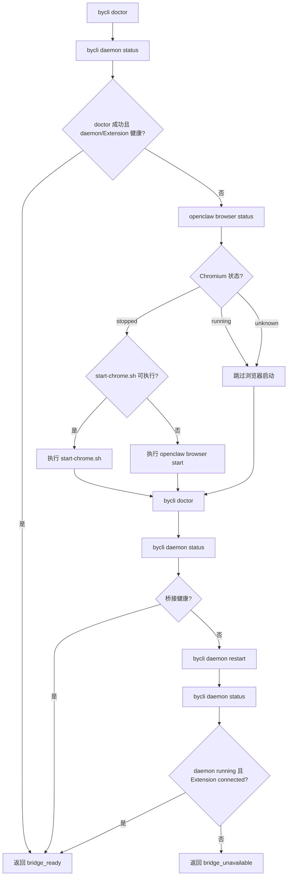
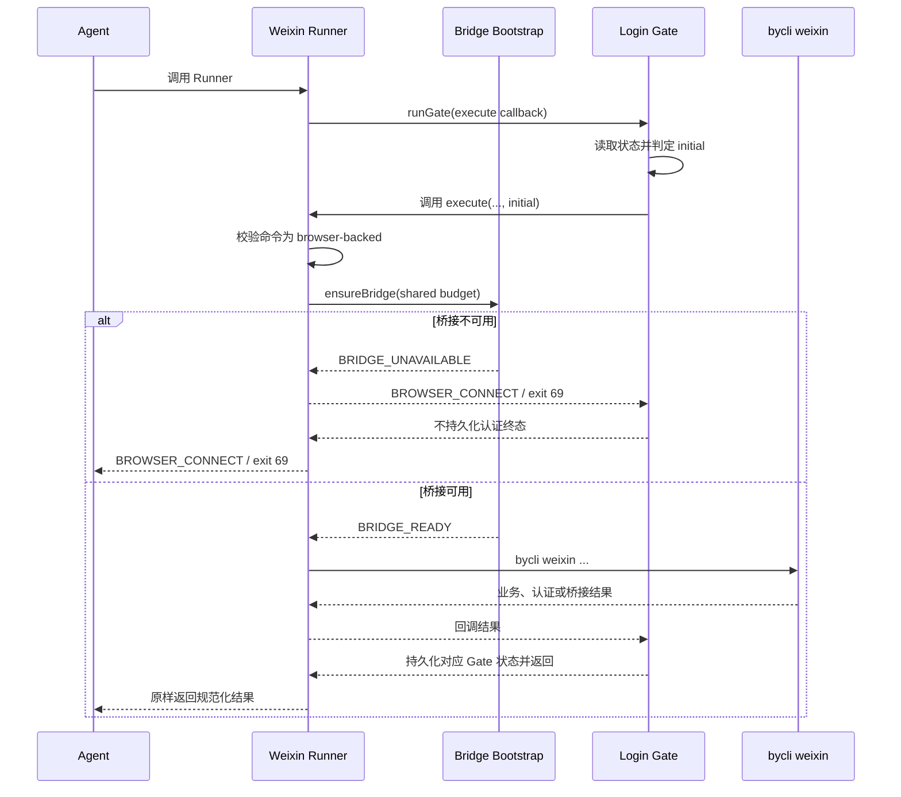

# byCLI 微信浏览器桥接引导设计

## 1. 文档状态

- 状态：已完成两轮闭环自审，待用户确认
- 日期：2026-09-01
- 范围：OpenClaw 托管环境中的 byCLI 浏览器桥接恢复、浏览器型微信命令的强制执行入口，以及
  `knowledge-collection/hot_discovery` 对统一桥接入口的复用
- 不包含：Adapter 修复、微信业务命令实现、Chrome 扩展实现、数据库或部署规格变更

## 2. 背景

浏览器型 `bycli weixin` 命令依赖三层运行状态：

1. OpenClaw 托管 Chromium 正常运行；
2. byCLI daemon 正常运行；
3. Chrome Extension 已与 daemon 建立连接。

现有 `bycli` Skill 已规定完整的桥接恢复顺序：`bycli doctor` 后立即检查
`bycli daemon status`；桥接异常时检查托管 Chromium；仅在 Chromium 未运行时执行
`/usr/local/bin/start-chrome.sh` 或标准浏览器启动；复检仍失败时最多执行一次 daemon restart。

问题在于，这套约束主要存在于 Markdown 指令中。Agent 需要自行组合多条命令并解释每一步结果，容易出现以下偏差：

- 遇到 `BROWSER_CONNECT` 后直接要求用户扫码、打开桌面 Chrome 或检查扩展；
- 未检查托管 Chromium 状态，因而无法判断是否应该执行 `start-chrome.sh`；
- 执行 `bycli doctor` 后没有立即执行 `bycli daemon status`；
- 将错误信息中的 profile 名称误认为用户桌面 Chrome profile；
- 微信命令绕过 `weixin-login-gate.mjs`，或在人工验证确认后的重跑前再次执行预检。

仓库已有一份可执行的 `ensureBridge()` 实现，但它位于
`knowledge-collection/hot_discovery` 的内部集成文件中，普通 byCLI 和微信任务不能稳定复用。
此外，`references/autofix.md` 仍将 `BROWSER_CONNECT` 描述为直接提示用户处理的硬停止，
与主 Skill 的自动恢复要求冲突。

### 2.1 术语

- **微信登录与人工验证门禁（Login Gate）**：仓库内的 `weixin-login-gate.mjs`，不是微信官方服务。
  它负责限制登录、扫码、验证码和环境验证后的重跑次数。
- **桥接（Bridge）**：Chromium、byCLI daemon 与 Chrome Extension 之间可供 byCLI 使用的连接状态。
- **首次执行（initial）**：当前操作指纹没有 Gate 状态时，Gate 首次允许执行回调。
- **确认重跑（confirmed-rerun）**：操作处于 `waiting-confirmation`，且用户明确表示人工验证已完成后，
  Gate 允许的唯一一次重跑。

## 3. 目标

本设计需要达到以下结果：

1. 将桥接状态机从提示词约束下沉为可执行、可测试的统一入口。
2. 浏览器型微信命令首次执行前必然完成桥接预检和恢复。
3. `start-chrome.sh` 始终保持条件执行：只有 Chromium 未运行且脚本可执行时才调用。
4. 首次 `BROWSER_CONNECT` 不进入人工认证流程，也不消耗微信登录 Gate 的确认重跑预算。
5. 人工验证期间保持浏览器上下文冻结；明确确认后的唯一重跑不得执行桥接预检。
6. `knowledge-collection/hot_discovery` 与直接 byCLI 任务复用同一套桥接状态机，避免规则漂移。
7. 同一次 Runner 调用的首次预检和命令后恢复共享恢复预算，daemon restart 合计最多执行一次。
8. 最终只有在适用且预算允许的浏览器恢复、复检和一次 daemon restart 均未恢复桥接后，才返回需要用户处理的
   `bridge_unavailable`；恢复锁超时单独返回瞬态 `bridge_recovery_busy`。

## 4. 非目标

- 不修改 `start-chrome.sh` 的 Chrome、Xvfb、CDP proxy 或 profile lock 行为。
- 不把桥接恢复并入 Adapter 或微信业务命令内部。
- 不使用 `bycli browser open/state` 进行预热或健康检查。
- 不在人工验证等待期主动检查、刷新或重启浏览器组件。
- 不自动重试非 `BROWSER_CONNECT` 的业务失败、认证失败、限频或写入失败。
- 不修改 Docker 镜像中的 Chrome 启动方式、端口或扩展安装方式。
- 不在本次设计中为所有 raw browser 多步会话增加强制 Runner；它们仍通过统一 bridge CLI 完成一次会话级预检。
  本次从机制上强制闭环的范围是浏览器型微信命令和 hot-discovery。

## 5. 方案比较

### 方案 A：继续只强化 Skill 文案

在 `SKILL.md`、`weixin.md` 和 eval 中重复强调恢复顺序。

优点是改动小；缺点是仍依赖 Agent 正确阅读、排序和执行命令，无法从机制上避免本次问题。
该方案不采用。

### 方案 B：把桥接逻辑直接并入微信登录 Gate

由 `weixin-login-gate.mjs` 同时负责桥接恢复、命令执行和人工验证状态。

优点是微信路径只有一个入口；缺点是把运行环境恢复和认证预算耦合在同一模块，增加状态机复杂度，
通用 byCLI 与 hot-discovery 仍难以复用。该方案不采用。

### 方案 C：独立桥接组件，并由微信 Runner 组合执行

新增通用 `bridge-bootstrap.mjs` 和微信专属 `weixin-browser-runner.mjs`。前者只负责桥接，
后者通过 Login Gate 提供的执行回调编排桥接预检与微信命令。Login Gate 先读取当前操作阶段，
只有在允许执行时才调用 Runner 的回调，因此等待人工确认、终态和已完成操作都不会触发预检。
Gate 继续只持久化人工验证状态，但需要识别首次 `BROWSER_CONNECT`，避免错误地将其记录为认证终态。

该方案职责最清晰、可独立测试，也可供 hot-discovery 复用，因此选用方案 C。

## 6. 总体架构

```text
Agent / knowledge-collection
          │
          ├── 通用浏览器型 byCLI ──> bridge-bootstrap CLI ──> bycli command
          │
          └── 浏览器型 Weixin ────> weixin-browser-runner
                                           │
                                           └── weixin-login-gate
                                                      │ 仅在 Gate 允许执行时调用回调
                                                      ▼
                                              bridge-bootstrap
                                                      │
                                                      ▼
                                               bycli weixin ...
```

组件职责如下：

| 组件 | 职责 | 不负责 |
|------|------|--------|
| `bridge-bootstrap.mjs` | 检查并恢复 Chromium、daemon、Extension 桥接；消费调用方传入的恢复预算 | 登录、人工验证、微信命令重试 |
| `weixin-browser-runner.mjs` | 向 Gate 提供阶段感知的执行回调；校验命令模式；编排 bridge 与微信命令 | 持久化认证状态、解释微信业务结果 |
| `weixin-login-gate.mjs` | 先判定操作阶段，再决定是否调用执行回调；维护人工验证状态、确认重跑预算和操作指纹 | 启动 Chromium、重启 daemon |
| `start-chrome.sh` | 幂等启动托管 Chromium 及其运行依赖 | 判断是否需要启动、判断 Extension 是否连接 |

## 7. `bridge-bootstrap.mjs` 设计

### 7.1 调用方式

模块同时提供 JavaScript API 和 CLI：

```bash
node /app/skills/bycli/scripts/bridge-bootstrap.mjs --format json
```

JavaScript API：

```js
const budget = createRecoveryBudget({ maxBrowserStarts: 1, maxDaemonRestarts: 1 });
const result = await ensureBridge({ run, fileExists, budget });
```

`run` 和 `fileExists` 支持依赖注入，便于单元测试覆盖全部状态分支。预算对象由上层逻辑操作创建，
在首次预检和命令后恢复之间复用；`ensureBridge()` 不得自行重置预算。

运行时 CLI 使用绝对路径。模块内部通过 `import.meta.url` 解析同目录文件，不依赖 Agent 当前工作目录。
所有外部命令使用参数数组配合 `spawn`/`execFile` 执行，不经过 shell 拼接。

### 7.2 固定状态机



不可变约束：

- 每次 `bycli doctor` 后必须立即执行 `bycli daemon status`，即使 doctor 失败。
- Chromium 状态正常时不得执行任何浏览器启动命令。
- 只有 Chromium 未运行时才判断 `start-chrome.sh` 是否可执行。
- `start-chrome.sh` 不可用时回退到 `openclaw browser --browser-profile openclaw start`。
- `unknown` 状态不得执行浏览器启动命令；它只允许继续复检和剩余的 daemon 恢复动作。
- 同一调用方预算内，浏览器启动和 daemon restart 分别最多执行一次。
- 不执行 raw browser 的 `open`、`state`、`bind` 或 TAB 操作。
- 不停止任务开始前已存在的 Chromium 或 daemon。
- 即使浏览器启动或 daemon restart 命令本身失败，也必须执行规定的后续只读复检，并在最终结果中保留
  归一化失败原因。

### 7.3 并发与恢复预算

bridge 恢复操作影响共享 Chromium、daemon 和 Extension，因此所有恢复调用使用同一容器级文件系统锁目录：

```text
${BYCLI_CONFIG_DIR:-/by/.bycli}/bridge-bootstrap.lock
```

锁的行为：

1. 初始 `doctor → daemon status` 是只读检查，可以在获取恢复锁前执行。
2. 检查异常后获取恢复锁；获得锁后必须重新执行 `doctor → daemon status`，避免重复恢复已经被其他任务修好的桥接。
3. 使用原子 `mkdir` 获取锁；锁目录内只保存随机 owner token、PID、`/proc` 进程启动标识和创建时间，
   不保存命令、URL、profile、Cookie 或其他任务数据。
   锁目录和父级目录权限为 `0700`，owner 元数据文件权限为 `0600`。
4. 同一时间只有锁持有者可以启动 Chromium 或重启 daemon。
5. 等待者按条件轮询，最多等待 60 秒；超时返回 `BRIDGE_RECOVERY_BUSY` / exit 69，不自行执行第二套恢复。
6. 正常和异常路径在 `finally` 中校验 owner token 后释放锁，禁止删除其他进程接管的锁。
7. 若 owner PID 不存在，或 `/proc` 启动标识与记录不一致，则通过原子 rename 抢占陈旧锁；只有 rename 成功者可以清理。
   无法证明陈旧时不得强删，等待超时后返回 busy。
8. 锁顺序固定为 Login Gate 操作锁在外、bridge 恢复锁在内；bridge 代码不得反向获取 Gate 锁，避免死锁。

恢复预算记录 `browserStartsUsed` 和 `daemonRestartsUsed`。微信 Runner 在一个逻辑调用中只创建一个预算对象；
首次预检和命令后恢复共享该对象。若预算已经耗尽，bridge 仍执行只读检查，但不得再次执行对应恢复动作。

### 7.4 超时

| 操作 | 单次超时 |
|------|----------|
| `bycli doctor` | 30 秒 |
| `bycli daemon status/restart` | 30 秒 |
| `openclaw browser ... status` | 30 秒 |
| `start-chrome.sh` 或标准 browser start | 60 秒 |
| 获取 bridge 恢复锁 | 60 秒 |

命令超时必须转成结构化诊断，不得抛出未处理异常或无限等待。上层微信业务命令继续使用其自身超时，
不计入 bridge 的单命令超时。

### 7.5 Chromium 状态判定

优先解析 `openclaw browser ... status` 的结构化字段；若当前版本只提供文本输出，使用集中维护的兼容解析器。
状态必须归一化为：

- `running`
- `stopped`
- `unknown`

`unknown` 不得被表述为“确认未运行”，也不得触发 `start-chrome.sh` 或标准 browser start。
bridge 继续执行 `doctor → daemon status` 复检，并在预算允许时执行一次 daemon restart；最终仍异常时返回
`BRIDGE_UNAVAILABLE`，并在 `diagnostics.browserStatus` 中保留 `unknown`。这会牺牲部分自动恢复率，但能保证
“只在确认 Chromium 未运行时启动”的安全边界。

### 7.6 输出契约

成功：

```json
{
  "ok": true,
  "code": "BRIDGE_READY",
  "browserState": "running",
  "reason": null,
  "actions": ["daemon_restart"],
  "daemonState": "running",
  "extensionState": "connected",
  "checks": 3,
  "budget": {
    "browserStartsUsed": 0,
    "daemonRestartsUsed": 1
  }
}
```

最终失败：

```json
{
  "ok": false,
  "code": "BRIDGE_UNAVAILABLE",
  "browserState": "running",
  "reason": "EXTENSION_DISCONNECTED",
  "actions": ["daemon_restart"],
  "daemonState": "running",
  "extensionState": "disconnected",
  "checks": 3,
  "budget": {
    "browserStartsUsed": 0,
    "daemonRestartsUsed": 1
  }
}
```

CLI 成功退出码为 `0`；最终桥接失败使用 `69`。输出不得包含 Cookie、token、profile 中的用户标识、
完整环境变量或其他凭据。

`reason` 至少区分：`BROWSER_STATUS_UNKNOWN`、`BROWSER_START_FAILED`、`DAEMON_UNAVAILABLE`、
`EXTENSION_DISCONNECTED`、`RECOVERY_BUDGET_EXHAUSTED` 和 `RECOVERY_LOCK_TIMEOUT`。`actions` 按实际执行顺序
记录，避免单个 `recoveryAction` 无法表达“启动浏览器后又重启 daemon”的情况。原始 stdout/stderr 仅用于本地
调试，并在进入结构化输出前去除凭据、用户标识和不受控长度内容。

主失败原因按最终可操作性排序：`DAEMON_UNAVAILABLE` → `EXTENSION_DISCONNECTED` →
`BROWSER_START_FAILED` → `RECOVERY_BUDGET_EXHAUSTED` → `BROWSER_STATUS_UNKNOWN`。例如浏览器状态未知但最终明确
Extension 断开时，`reason` 使用 `EXTENSION_DISCONNECTED`，浏览器未知只放入 `diagnostics`，避免错误指导用户。

bridge CLI 的内部状态码与 Runner 的对外错误码分层：

| bridge CLI 状态 | 退出码 | Runner 对外结果 |
|-----------------|--------|-----------------|
| `BRIDGE_READY` | 0 | 继续执行，无错误 |
| `BRIDGE_UNAVAILABLE` | 69 | `error.code=BROWSER_CONNECT`，`details.bridgeCode=BRIDGE_UNAVAILABLE` |
| `BRIDGE_RECOVERY_BUSY` | 69 | `error.code=BROWSER_CONNECT`，`details.bridgeCode=BRIDGE_RECOVERY_BUSY` |

这样保持 byCLI 既有 typed error 兼容性，同时让调用方能够区分最终不可用与并发恢复繁忙。

## 8. `weixin-browser-runner.mjs` 设计

### 8.1 调用方式

首次执行：

```bash
node /app/skills/bycli/scripts/weixin-browser-runner.mjs \
  --state-dir '<absolute-state-dir>' \
  -- bycli weixin user-info \
  --site-session persistent --keep-tab true -f json
```

用户明确确认人工验证完成后的唯一重跑：

```bash
node /app/skills/bycli/scripts/weixin-browser-runner.mjs \
  --state-dir '<absolute-state-dir>' \
  --verification-confirmed true \
  -- bycli weixin user-info \
  --site-session persistent --keep-tab true -f json
```

Skill 不再指导 Agent 直接调用 `weixin-login-gate.mjs`。Gate 成为 runner 的内部组成部分。
Runner 必须校验 `--state-dir` 为绝对路径，并校验 `--` 后的参数严格以
`bycli weixin <command>` 开头；命令通过参数数组执行，禁止 shell 拼接。

conditional 命令的浏览器分支必须在 Runner 参数区显式传入 `--selected-mode browser`，该参数不转发给 byCLI，
也不参与微信操作指纹。浏览器必需命令可以省略该参数；API-only 命令即使传入该参数也必须被拒绝。

### 8.2 Gate 优先决策

Runner 不得根据是否出现 `--verification-confirmed` 自行推断当前阶段。它调用 Gate 的 `runGate()`，并提供
阶段感知的执行回调：

```js
runGate({
  stateDir,
  argv,
  verificationConfirmed,
  execute: (argv, context) => executeWeixin(argv, context),
});
```

Gate 在持有当前操作锁时先读取状态，再执行以下决策：

| Gate 状态 | 行为 | 是否调用 Runner 回调 |
|-----------|------|----------------------|
| 无状态 | 标记本次为 `initial`，允许执行 | 是 |
| `waiting-confirmation` 且未明确确认 | 直接返回 `explicit-verification-confirmation-required` | 否 |
| `waiting-confirmation` 且明确确认 | 先持久化 `rerun-consumed`，标记为 `confirmed-rerun` | 是，且仅一次 |
| `rerun-consumed` / `terminal` | 返回 `login-gate-rerun-exhausted` | 否 |
| `complete` | 返回 `operation-already-complete` | 否 |

因此，普通“重试”、终态请求和已完成请求只读取本地 Gate 状态，不运行 structured help、doctor、daemon、
browser lifecycle 或底层微信命令。

`--verification-confirmed true` 本身不能把无状态操作变成确认重跑：只有当前指纹已经是
`waiting-confirmation` 时，Gate 才产生 `confirmed-rerun`；无状态操作即使携带该参数仍按 `initial` 执行完整校验和预检。

### 8.3 首次执行



桥接预检发生在 Gate 已允许执行之后，但预检失败时 Gate 不得创建或终态化认证状态文件。用户恢复浏览器或扩展后，
同一业务操作仍可重新执行。Gate 操作锁覆盖本次回调，bridge 恢复锁只覆盖共享恢复临界区，二者锁顺序固定。

### 8.4 命令模式校验

只有浏览器必需或已经明确选择浏览器分支的 conditional 微信命令可以进入 Runner。命令校验在 Gate 允许执行后的
回调内部进行，确保等待人工确认期间不会调用任何 byCLI 命令，包括 structured help。

Runner 读取当前安装版本的结构化 help：

- `browser: true`：允许执行；
- `browser: conditional`：仅当 Runner 收到 `--selected-mode browser` 时允许；不得根据环境变量是否存在、
  命令参数或凭据值自行推断；
- `browser: false` 或缺少浏览器能力：返回 `ARGUMENT`，且不执行 bridge；
- structured help 无法解析：失败关闭，返回 `COMMAND_CAPABILITY_UNKNOWN`，不得猜测。

API-only 命令继续直接执行，不进入 Runner、bridge 或 Login Gate。命令模式校验结果不写入认证状态。
读写属性同样只接受 structured help 中当前版本明确声明的 access/operation 元数据；实现时以实际 schema 的规范字段为准，
不得从帮助文本中的自然语言标签或命令名称解析。字段缺失、未知或矛盾时一律按“不可自动重跑”处理。

### 8.5 命令执行期间再次出现 `BROWSER_CONNECT`

首次执行在预检成功后仍可能因竞态返回 `BROWSER_CONNECT`。此结果必须满足以下规则：

1. Gate 不把首次 `BROWSER_CONNECT` 写成登录 `terminal`，也不返回 `AUTH_REQUIRED`。
2. Runner 使用首次预检的同一恢复预算再次执行 `bridge-bootstrap`，不得重新获得完整预算。
3. 恢复成功后，只有 structured help 标记为只读的命令可以自动重跑一次。
4. 对写命令或无法确认只读性的命令，Runner 完成桥接恢复但不自动重跑，返回
   `BRIDGE_RECOVERED_RETRY_REQUIRES_APPROVAL`；后续重跑必须由用户明确授权。
5. 只读命令第二次仍返回 `BROWSER_CONNECT` 时，Runner 返回 `bridge_unavailable`，不再重试。
6. 其他错误不触发桥接恢复或自动重跑。

自动恢复仅适用于 byCLI 明确返回的 typed `BROWSER_CONNECT` / exit 69。自动重跑还必须同时满足命令被结构化
help 明确标记为只读。不得通过 profile 名称、普通超时文本、未知异常或命令名称猜测为可安全重跑。

写命令的用户授权不是人工验证确认，不得使用 `--verification-confirmed`。Runner 返回
`BRIDGE_RECOVERED_RETRY_REQUIRES_APPROVAL` 后结束当前调用；用户明确授权后，Agent 重新调用同一 Runner，
该调用具有新的恢复预算。由于首次调用已经完成桥接恢复，新调用通常只执行健康检查；若桥接再次异常，仍按新调用的
单次恢复预算处理。Login Gate 不为 bridge-only 失败写入认证状态。

Runner 对该状态返回 exit `1` 和 `error.code=RETRY_APPROVAL_REQUIRED`，并在 details 中保留
`bridgeCode=BRIDGE_RECOVERED_RETRY_REQUIRES_APPROVAL`。Agent 只有在已向用户说明“原写命令尚未重跑”并获得明确
肯定答复后才可重新调用；用户回复“重试”可以作为本提示的授权，但绝不能转换成
`--verification-confirmed true`。

### 8.6 人工确认后的重跑

当命令已经进入 `waiting-confirmation`，用户明确确认验证完成后：

1. Gate 先识别 `waiting-confirmation`，在调用 Runner 回调前持久化 `rerun-consumed`。
2. Gate 向回调传入 `context.attemptKind = "confirmed-rerun"`。
3. Runner 不执行 structured help、`bridge-bootstrap` 或任何额外预检，直接执行原命令一次。
4. 无论返回认证失败、`BROWSER_CONNECT` 或其他错误，都不得再次预检或重跑。
5. 该分支保留现有 TAB、daemon 与浏览器上下文。

该规则优先于桥接自动恢复，避免在人工验证上下文中重启 daemon 或改变浏览器状态。

## 9. Login Gate 的最小调整

`weixin-login-gate.mjs` 不负责执行桥接恢复，但需要正确区分桥接错误与认证状态：

- `runGate()` 调用执行回调时增加只读上下文参数：`attemptKind` 只能是 `initial` 或 `confirmed-rerun`。
- 执行回调增加内部字段 `commandExecuted` 和 `stateDisposition`。`stateDisposition` 只能是 `classify` 或
  `no-auth-state`，默认值为 `classify`；两者均不写入用户可见输出或 Gate 状态文件。
- structured help 校验失败或 bridge 预检失败返回 `commandExecuted: false, stateDisposition: "no-auth-state"`。
- 底层命令已经执行、但 Runner 最终返回 bridge-only 结果时，包括最终 `BROWSER_CONNECT` 和
  `BRIDGE_RECOVERED_RETRY_REQUIRES_APPROVAL`，返回 `commandExecuted: true, stateDisposition: "no-auth-state"`。
- `initial` 且 `stateDisposition: "no-auth-state"` 时，Gate 原样透传结果且不创建认证状态。这覆盖
  `ARGUMENT`、`COMMAND_CAPABILITY_UNKNOWN`、`BRIDGE_RECOVERY_BUSY`、`BRIDGE_UNAVAILABLE` 和上述命令后桥接结果。
- 首次执行返回 typed `BROWSER_CONNECT` / exit 69 时，将结果透传给 runner，不创建或终态化登录状态。
- 已进入确认重跑时，仍按现有规则预先消费唯一重跑预算；此时任何结果都是该次重跑的终态。
- `AUTH_REQUIRED`、登录 `TIMEOUT`、CAPTCHA、MFA 和环境验证继续进入现有 human gate。
- 其他业务失败继续遵循当前 Gate 终态策略，本设计不扩大其重试范围。

这样既保持 Gate 的认证职责，也避免参数校验或桥接故障污染认证状态。`commandExecuted` 和
`stateDisposition` 不能由 CLI 用户传入，只能由同进程内的 Runner 回调返回；Gate 对直接 CLI 旧调用继续使用
`classify` 默认值，防止调用方伪造执行阶段绕过 Gate。`confirmed-rerun` 忽略 `no-auth-state`，始终保持已消费终态。

## 10. 错误和用户交互语义

| 状态 | Agent 行为 | 是否请求用户操作 |
|------|------------|------------------|
| `BRIDGE_READY` | 继续执行目标命令 | 否 |
| Chromium 未运行，启动后恢复 | 继续执行目标命令 | 否 |
| Extension 断开，daemon restart 后恢复 | 继续执行目标命令 | 否 |
| `BRIDGE_UNAVAILABLE` | 停止浏览器动作并报告最终状态 | 是，检查托管 Chrome 和扩展 |
| `BRIDGE_RECOVERY_BUSY` | 停止本次调用，不启动第二套恢复 | 否；稍后重新发起任务 |
| `BRIDGE_RECOVERED_RETRY_REQUIRES_APPROVAL` | 保留恢复结果，不自动重跑写命令 | 是，确认是否重新执行写命令 |
| `AUTH_REQUIRED` / 人工验证 | 保留上下文并结束当前轮 | 是，在现有 TAB 完成验证 |
| 确认重跑再次失败 | 返回原始终态，不再预检或重跑 | 视原始错误说明 |

用户消息不得暴露 Skill 内部步骤编号或完整诊断输出。应只说明可操作的最终状态，例如：

> 托管浏览器已经启动，但 byCLI 扩展仍未连接。请检查当前 Chromium 中的 byCLI 扩展是否已安装并启用，完成后再重试。

不得因为错误中出现随机 profile 名称就提示用户打开桌面 Chrome。

Runner 是其内部 bridge 恢复预算的唯一所有者。Runner 返回的 `BROWSER_CONNECT` 若包含
`details.bridgeCode=BRIDGE_UNAVAILABLE` 或 `BRIDGE_RECOVERY_BUSY`，外层 Agent 不得再手工执行 doctor、browser start、
daemon restart 或再次调用 bridge CLI；前者按最终不可用提示用户，后者报告存在并发恢复并结束本次调用。
只有未经过 Runner 的通用 byCLI 命令返回普通 `BROWSER_CONNECT` 时，才由 Skill 调用统一 bridge CLI。

## 11. 文件变更

### 11.1 新增

| 文件 | 作用 |
|------|------|
| `middleware/openclaw/skills/bycli/scripts/bridge-bootstrap.mjs` | 通用桥接状态机及 CLI |
| `middleware/openclaw/skills/bycli/scripts/bridge-bootstrap.test.mjs` | 桥接状态机单元测试 |
| `middleware/openclaw/skills/bycli/scripts/weixin-browser-runner.mjs` | 微信桥接与登录 Gate 编排器 |
| `middleware/openclaw/skills/bycli/scripts/weixin-browser-runner.test.mjs` | 微信执行分支和重试边界测试 |
| `middleware/openclaw/tests/test_bycli_skill.py` | 跨 Skill/reference 一致性契约测试 |

### 11.2 修改

| 文件 | 修改内容 |
|------|----------|
| `middleware/openclaw/skills/bycli/SKILL.md` | 将手工桥接阶梯改为统一脚本入口；通用命令和微信命令分别指向正确 runner；禁止对 Runner 已终结的 bridgeCode 再做外层恢复 |
| `middleware/openclaw/skills/bycli/references/weixin.md` | 将浏览器型命令入口改为 `weixin-browser-runner.mjs`；保留确认重跑不预检规则 |
| `middleware/openclaw/skills/bycli/references/autofix.md` | 删除首次 `BROWSER_CONNECT` 直接提示用户的冲突规则，改为统一桥接恢复 |
| `middleware/openclaw/skills/bycli/scripts/weixin-login-gate.mjs` | typed `BROWSER_CONNECT` 首次透传且不消费认证终态；确认重跑保持终态语义 |
| `middleware/openclaw/skills/bycli/scripts/weixin-login-gate.test.mjs` | 覆盖 bridge 错误与认证预算隔离 |
| `middleware/openclaw/skills/bycli/evals/evals.json` | 增加 `user-info`、随机 profile、首次 exit 69 的事故回归 eval |
| `middleware/openclaw/skills/knowledge-collection/references/online-search/references/hot_discovery/scripts/bycli_integration.mjs` | 通过稳定 CLI 契约调用统一 bridge，删除重复状态机，不跨 Skill 直接导入源文件 |
| `middleware/openclaw/skills/knowledge-collection/references/online-search/references/hot_discovery/scripts/bycli_integration.test.mjs` | 验证委托统一 bridge 后的集成行为 |

### 11.3 不修改

- `middleware/openclaw/start-chrome.sh`
- `middleware/openclaw/start-chrome.test.sh`
- `middleware/openclaw/Dockerfile*`
- `deploy/migrations/versions/`
- `deploy/middleware/initdb/`

镜像已经复制整个 `middleware/openclaw/skills/` 目录，并已安装、授权
`/usr/local/bin/start-chrome.sh`，因此无需部署和数据库变更。

## 12. 测试策略

### 12.1 Bridge 单元测试

至少覆盖：

1. 初始桥接健康，不执行恢复命令。
2. doctor 失败时仍立即执行 daemon status。
3. Chromium 已运行但 Extension 断开，跳过 `start-chrome.sh`，最终执行一次 daemon restart。
4. Chromium 未运行且脚本可执行，执行 `start-chrome.sh`。
5. Chromium 未运行且脚本不可执行，执行标准 OpenClaw browser start。
6. 冷启动后恢复成功，不重启 daemon。
7. 冷启动后仍失败，只重启一次 daemon。
8. 最终失败返回 exit 69 和 `BRIDGE_UNAVAILABLE`。
9. 状态未知时不执行浏览器启动，保留 `BROWSER_STATUS_UNKNOWN`，且不宣称“确认未运行”。
10. 首次预检和命令后恢复共享预算，合计不超过一次 browser start 和一次 daemon restart。
11. 两个并发调用只有锁持有者执行恢复；等待者获得锁后先复检，不重复启动或重启。
12. owner 进程消失时可以安全接管陈旧锁；owner 仍存活或身份无法确认时不得删除锁。
13. 恢复锁超时返回 `BRIDGE_RECOVERY_BUSY`，锁在异常路径也能释放。
14. 每条外部命令命中规定超时后返回结构化错误。
15. 任意分支均不调用 `bycli browser open/state`。

### 12.2 微信 Runner 测试

至少覆盖：

1. Gate 先判定状态，仅在允许执行时调用 Runner 回调；首次允许执行的回调先 bridge、后微信命令。
2. bridge 最终失败时底层微信命令不执行，Gate 不写认证状态。
3. 首次只读命令返回 `BROWSER_CONNECT`，使用共享剩余预算恢复并只重跑一次。
4. 首次写命令返回 `BROWSER_CONNECT`，恢复 bridge 后返回需用户授权，不自动重跑。
5. 写命令的授权提示和最终 `BROWSER_CONNECT` 均使用 `stateDisposition=no-auth-state`，允许用户授权后重新发起，
   但不污染 Login Gate 状态。
6. 第二次 `BROWSER_CONNECT` 后停止，不提示扫码或进入认证 Gate。
7. `AUTH_REQUIRED` 进入等待确认，不触发桥接恢复。
8. 普通“重试”、终态和 complete 状态均不执行 help、bridge 或底层命令。
9. 明确确认后的重跑通过 `attemptKind=confirmed-rerun` 跳过 help 和 bridge，只执行原命令一次。
10. 确认重跑返回 `BROWSER_CONNECT` 时不恢复、不重跑，并忽略 `no-auth-state` 标记保持终态。
11. 无状态操作错误携带 `--verification-confirmed true` 时仍按 initial 执行，不能跳过 help 或 bridge。
12. API-only 微信命令在 Gate 回调内被 Runner 拒绝，不调用 bridge 或底层微信命令，并返回 `no-auth-state`。
13. structured help 缺失或不可解析时失败关闭，不猜测命令模式或读写属性。
14. conditional 命令缺少 `--selected-mode browser` 时无副作用失败，API-only 命令不能用该参数绕过拒绝。
15. `--state-dir` 非绝对路径、命令前缀不匹配和未知 Runner 参数均在无副作用情况下返回 `ARGUMENT`。

### 12.3 文档和 Eval 契约测试

检查以下不变量：

- `SKILL.md`、`weixin.md` 和 `autofix.md` 不得对首次 `BROWSER_CONNECT` 给出冲突行为。
- 浏览器型微信命令示例统一使用 `weixin-browser-runner.mjs`。
- eval 明确要求随机 profile 不能触发桌面 Chrome 推断。
- eval 明确区分“检查 Chromium 状态”和“执行 `start-chrome.sh`”。
- eval 覆盖等待人工确认时普通“重试”不得触发 bridge 预检。
- eval 覆盖 Runner 已返回最终 bridgeCode 时，外层 Agent 不得再次执行恢复阶梯。
- 静态契约测试只验证文档和 eval 内容；行为闭环由 Runner/Gate 单元测试和镜像 smoke test 证明，
  不把静态字符串断言当作运行时保证。

## 13. 验证命令

实施后至少运行：

```bash
node --test middleware/openclaw/skills/bycli/scripts/bridge-bootstrap.test.mjs
node --test middleware/openclaw/skills/bycli/scripts/weixin-browser-runner.test.mjs
node --test middleware/openclaw/skills/bycli/scripts/weixin-login-gate.test.mjs
node --test middleware/openclaw/skills/knowledge-collection/references/online-search/references/hot_discovery/scripts/bycli_integration.test.mjs
python -m unittest middleware/openclaw/tests/test_bycli_skill.py
python -m unittest middleware/openclaw/tests/test_agent_reach_skill.py
python -m unittest middleware/openclaw/tests/test_knowledge_collection_skill.py
sh middleware/openclaw/start-chrome.test.sh
```

条件允许时，在 OpenClaw 镜像中补充一次真实 smoke test：

1. 停止托管 Chromium，运行微信 Runner，确认调用 `start-chrome.sh` 并恢复桥接。
2. 保持 Chromium 运行但断开 Extension，确认不执行启动脚本，只进行允许的一次 daemon restart。
3. 触发人工验证并明确确认，确认第二次执行前没有 doctor、daemon 或 browser lifecycle 命令。
4. 在等待人工确认时发送普通“重试”，确认没有 structured help、doctor、daemon、browser lifecycle 或微信命令。
5. 并发启动两个 Runner，确认只有一个恢复执行者，另一个在锁后复检并复用结果。

## 14. 发布与回滚

### 14.1 发布顺序

1. 先加入 bridge 和 Runner 及其测试。
2. 接入微信命令路径。
3. 将 hot-discovery 切换为调用统一 bridge CLI；不得从 knowledge-collection 目录跨 Skill 相对导入 bycli 源文件。
4. 最后更新 Skill、reference 和 eval，确保文档描述与可执行行为同时生效。
5. 构建 OpenClaw 镜像并完成 smoke test。

### 14.2 兼容性

- `weixin-login-gate.mjs` 的既有 CLI 在一个发布周期内保留，但 Skill 不再直接使用。
- 旧调用方仍可工作；新 Runner 使用相同 `--state-dir` 和 `--verification-confirmed` 参数。
- 不改变现有操作指纹算法和状态文件中的敏感信息保护。

### 14.3 回滚

如果命令后自动恢复或重跑出现问题，优先关闭该分支，仅保留 Runner 的 Gate 优先决策和首次 bridge 预检；
不得回滚为“直接调用 Gate 且无预检”，因为这会重新引入本设计要消除的问题。若整个 Runner 必须回滚，
应整体回滚到上一镜像版本并明确记录该版本仍存在已知桥接缺口，而不是在当前版本中恢复相互矛盾的 Skill 规则。
任何回滚都不得恢复 `autofix.md` 中“首次桥接错误直接要求用户操作”的旧规则。

## 15. 风险与缓解

| 风险 | 缓解措施 |
|------|----------|
| 文本版 browser status 在不同版本中格式变化 | 集中解析、保留 `unknown`、用 fixture 覆盖已知版本 |
| 多任务同时尝试启动 Chromium | 复用 `start-chrome.sh` 现有文件锁和幂等检查 |
| 多任务同时重启 daemon 影响共享任务 | 本次实现即加入共享恢复锁；锁内复检后才允许一次 restart；不执行 stop |
| `BROWSER_CONNECT` 被错误识别 | 只接受 typed code 或 exit 69，不根据普通错误文本和 profile 名推断 |
| 人工验证期间误执行预检 | Runner 根据 Gate 状态和确认分支强制跳过 bridge，并用测试锁定 |
| 自动重跑写命令产生重复副作用 | 写命令和未知读写属性一律不自动重跑；只读属性来自结构化 help，不从命令名猜测 |
| hot-discovery 与 byCLI 主路径再次漂移 | 两者调用同一 bridge CLI 契约，并由跨文件契约测试校验 |
| 普通“重试”先触发预检再被 Gate 拦截 | Gate 必须先判定状态，只有允许执行时才调用包含预检的回调 |
| bridge 输出泄露 profile 或凭据 | 结构化字段白名单、长度上限和脱敏测试；用户回复只使用归一化状态 |
| Runner 返回 exit 69 后外层 Skill 再次恢复 | Runner 输出 bridgeCode 标记预算所有权；Skill 和 eval 禁止二次恢复 |

## 16. 验收标准

实现满足以下条件时可以验收：

1. 复现 `bycli weixin user-info` 的首次 `BROWSER_CONNECT` 时，系统先自动完成桥接恢复，不立即要求用户扫码或检查桌面 Chrome。
2. Chromium 正在运行时，日志和测试均能证明未执行 `start-chrome.sh`。
3. Chromium 未运行时，优先调用可执行的 `start-chrome.sh`，否则使用标准 OpenClaw 启动命令。
4. 每个 doctor 后都紧接 daemon status。
5. 同一次 Runner 调用最多执行一次 browser start 和一次 daemon restart，最终失败才返回 `bridge_unavailable`。
6. 随机 profile 名不会改变恢复路径或用户提示。
7. `unknown` 浏览器状态不会触发 `start-chrome.sh` 或标准 browser start。
8. 等待人工确认期间的普通“重试”没有任何 help、bridge 或底层微信命令调用。
9. 人工验证确认后的唯一重跑前没有任何 help、bridge 预检或恢复动作。
10. 首次桥接错误不会写入或消耗微信人工验证终态。
11. 首次写命令的 `BROWSER_CONNECT` 不会自动重跑；只读命令最多自动重跑一次。
12. bridge-only 失败和写命令授权结果不会污染 Login Gate 状态，用户授权后可以重新发起。
13. 两个并发恢复调用不会重复启动 Chromium 或重启 daemon，陈旧锁也能安全恢复。
14. Runner 返回最终 bridgeCode 后，外层 Agent 不会再次执行桥接恢复。
15. 通用 bridge、微信 Runner、Gate 和 hot-discovery 的自动化测试全部通过。
