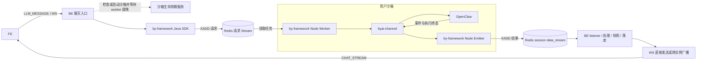

# 聊天链路日志与沙箱刷屏审计

审计日期：2026-09-21。范围：byclaw-fe → byclaw-be → 沙箱内 by-framework / byai-channel → OpenClaw，以及 Redis → BE → WS → FE 返回链路。

本文是当前工作区源码审计与整改方案；不是线上配置快照，尚未修改运行代码。频率来自代码默认值和仓库配置，环境覆盖、浏览器节流、任务耗时会改变实际频率。文中的建议阈值不是当前实现。

**最新范围调整：实施以[请求链路日志精简方案](chat-request-logging-plan.md)为准：一个requestId、约12条关键节点日志、正常后台静默。下文详细日志矩阵、周期摘要、逐工具日志和扩展观测开关是前版备选方案，不再作为必做项；源码审计和配置事实仍供查阅。**

## 0. 先按实际进程边界拆开链路

沙箱是 worker、channel、OpenClaw 的运行载体；普通聊天并不是 BE 把消息同步 HTTP 转发给“沙箱服务”，再由沙箱服务逐层转发。by-framework 在 BE 有 Java SDK，在沙箱内有 Node worker / emitter，Redis 位于这两端之间。



入口的 [RouteService:214](/Users/tangs/iwhalecloud/ByClaw/byclaw-be/src/main/java/com/iwhalecloud/byai/gateway/route/RouteService.java:214) 先建立会话消费运行态，接着等待 worker 就绪，再调用 Gateway。已有在线 worker 会走快路径；启动慢才进入沙箱创建/等待。就绪等待外层最多 5 轮，每轮传入 1 分钟 worker 等待参数，另有启动本身的耗时；这是代码常量，不能误写成一个已经存在的可调配置。[WorkerRouteReadinessService:38](/Users/tangs/iwhalecloud/ByClaw/byclaw-be/src/main/java/com/iwhalecloud/byai/gateway/route/WorkerRouteReadinessService.java:38)

上述是用户沙箱直达路径。实际 `targetAgentType` 如果是 BY_SUPER，还需在请求队列和用户 worker 之间展开主任务、delegation、子会话及恢复汇总。必须记录路由结果与 parent/child 关系，不能把 OpenClaw 子任务完成当作整个页面请求完成。当前工作区代码、镜像和已部署代码版本也要分别记录。

v2 的请求流可能是 `byai_gateway:v2:ctrl:agent_type:BYCLAW_EXE_<userCode>`，也可能路由至 `byai_gateway:v2:ctrl:worker:{<workerId>}`；返回流是 `byai_gateway:v2:session:{<sessionId>}:data_stream`。记录实际 stream key 和路由选择，不能仅按 session data_stream 排查请求是否被领取。Node 的 request ACK 与 BE 的 response ACK 是两个不同消费组、不同语义的动作。长工具运行期间 request PEL 中有记录可以是正常执行，须结合 execution 状态判断。

### 0.1 每个模块负责的证据

| 模块 | 必须回答的问题 | 记录所有者和关键字段 |
|---|---|---|
| FE | 何时发起、何时收到终态、为何未应用、何时完成状态提交？ | `useSend / websocket / chatRuntime`；clientRequestId、pageId、connectionId、received/applied 时间、drop/defer reason、visibility |
| BE 聊天入口 | 是否收到请求，分配了什么业务身份，路由到哪个 worker？ | WS ChatService / ScriptService / RouteService；sessionId、traceId、ask/answerMessageId、targetAgentType、BE instanceId |
| 沙箱生命周期 | 启动/复用是否耗时，哪个 sandbox 对应哪个 worker，是否等待其他启动者？ | readiness 外层记开始/结果，Service 记真实生命周期变化；operationId、sandboxId、workerId、created/reused、waitMs、attempt |
| Java by-framework | 请求实际何时写进 Redis，写入的请求流 ID 是什么？ | SDK `sendMessage` 的 XADD 结果；requestStreamId、requestMessageId、redisWriteMs。现有 SendResponse.messageId 是业务 ID，不能替代 Stream ID |
| Node by-framework | 请求何时取出、排队多久、哪个 worker 处理，结果何时真正入流？ | runner / emitter；requestStreamId、consumer、deliveryAttempt、queueWaitMs、responseStreamId、XADD outcome、request ACK outcome |
| channel / OpenClaw | OpenClaw 何时开始/结束，channel 是否仍在排队或等待完成条件？ | channel 调度、core 事件入口、全局事件队列、完成门；runId、sessionKey、root/child、queueWaitMs、gateReason、pending 数量 |
| BE 返回链路 | 结果没取到，还是取到后卡在锁、快照、落库或 WS？ | listener / processor / ScriptService / 统一 WS 出口；streamId、consumerReceivedAt、lockWaitMs、persistMs、writeFuture outcome、consumer owner、连接归属实例 |

生命周期后台扫描用 `operationId`，不伪造聊天 trace；由某次聊天触发启动时，额外绑定该聊天 trace。复用沙箱不代表新启动一次 OpenClaw，应记录 processBootId / worker 启动时间以区分进程复用和重启。

### 0.2 关联 ID 沿用现有字段，再补明确映射

- FE 已有 `clientRequestId=queryMsgId_answerMsgId`，多 agent lane 各有自己的 clientRequestId；保留 `turnId/laneId`。FE 的消息 ID 与 BE 数据库 messageId 分开命名。
- 新会话的 `pending_<clientRequestId>` 只是 FE 本地占位。BE 建立真实 session / 业务 trace 后，记录一次 `chat.identity.bound`，绑定 clientRequestId、sessionId、traceId、ask/answerMessageId；不把占位值写成真实 sessionId。
- BE 每个 WS 帧生成的 REQUEST_ID、业务 traceId、OTel MDC 的 trace_id 是三套身份。现有 RequestContextUtil 只写 ThreadLocal，不能假定 logback 前缀已经串起聊天链路。
- FE 现有 connectionSeq 是页面局部身份；BE Netty channelId 是另一套。新增 pageId 后通过握手/回包映射，记录 `pageId/feConnectionId/nettyChannelId/connectionInstanceId`，不要直接将两者当同一个 connectionId。
- Redis 请求 ID 命名 `requestStreamId`，返回流 ID 命名 `streamId`；业务 messageId 保持原义。Java SDK 必须扩展返回/观测接口暴露 XADD ID，Node runner 必须将其带入诊断上下文。
- 当前普通单路 clientRequestId 主要保留在 BE context，不能声称已经统一传到 channel；lane 模式已有相关 metadata。普通请求也需补兼容透传，暂未透传时可通过 BE 的 trace 映射关联。
- 跨 Redis、异步线程和进程显式传递上述上下文；不能只靠 MDC/ThreadLocal。日志上下文、WS delivery metadata、框架 metadata 采用有版本的兼容扩展，不把调试字段拼入用户问题或答案正文。

身份来源：[FE getClientRequestId](/Users/tangs/iwhalecloud/ByClaw/byclaw-fe/src/hooks/useChat/index.ts:137)、[WS发送](/Users/tangs/iwhalecloud/ByClaw/byclaw-fe/src/hooks/useSseSender/useSend.ts:62)、[BE trace生成](/Users/tangs/iwhalecloud/ByClaw/byclaw-be/src/main/java/com/iwhalecloud/byai/state/domain/chat/service/ScriptService.java:145)、[ThreadLocal](/Users/tangs/iwhalecloud/ByClaw/byclaw-be/src/main/java/com/iwhalecloud/byai/common/log/util/RequestContextUtil.java:38)。

## 1. 已确认的刷屏来源和频率

### 1.1 前端触发的沙箱活动

| 触发器 | 当前频率与范围 | 现有日志与放大因素 | 建议 |
|---|---|---|---|
| 主 WS NOTIFICATION | 每个打开的 WS 连接每 6 秒，10 次/分钟；不依赖正在聊天 | BE WebSocketHandler 每帧 3 条 DEBUG；NotificationService 每次调用用户沙箱 heartbeat；成功再 1 条 DEBUG，无运行沙箱则 1 条 WARN | 健康探活不逐条打日志；按实例每 60 秒聚合计数/错误/耗时。连接变化单独记。普通无沙箱不要持续 WARN |
| 侧栏 sandbox 状态 | 稳态 30 秒；STARTING/RELEASING 5 秒；首次/手动刷新另计 | getSandboxInfo 主要读缓存、DB、worker registry；不能把每次调用都算成 OpenSandbox 远程查询 | 无变化不打 INFO；状态变化和慢查询记录摘要 |
| 沙箱页 HTTP heartbeat | 可见时每 60 秒，隐藏停止，恢复可见立即一次 | 与 WS heartbeat 叠加，同样进入 SandboxService；源码注释误写 15 分钟 | 保活功能保留，成功计数汇总；修正误导注释 |
| 沙箱页 URL 就绪查询 | 首次立即，后续 5 秒一次；本轮最多 10 次查询 | queryResourceDetail，是就绪查询而非保活 | 每轮只留 started / ready / failed / timeout，含 attempts、durationMs |
| 沙箱管理页列表 | 默认 autoRefresh=true，每 10 秒；无 visibility 限制 | 每个管理页 6 次/分钟列表查询，不等于每次远程探测 | 正常请求不记正文，慢/失败单独记录 |
| 当前聊天 runningStatus | 每 30 秒；仅 FE 认为该 session 正在运行才请求 | online / 可见时额外检查；正常没有结果日志 | 正常无变化汇总；状态不一致、恢复结果必须记录 |
| 侧栏批量 runningStatus | 每 30 秒，对已加载真实会话一次批量请求 | 与当前聊天轮询独立叠加 | 可共享查询；不逐 session 输出健康日志 |

代码：

- [WS timer](/Users/tangs/iwhalecloud/ByClaw/byclaw-fe/src/utils/websocket.ts:240)、[WS 每帧日志](/Users/tangs/iwhalecloud/ByClaw/byclaw-be/src/main/java/com/iwhalecloud/byai/state/domain/ws/handler/WebSocketHandler.java:79)、[通知入口调用沙箱 heartbeat](/Users/tangs/iwhalecloud/ByClaw/byclaw-be/src/main/java/com/iwhalecloud/byai/state/domain/notification/service/NotificationService.java:390)。
- [侧栏状态周期](/Users/tangs/iwhalecloud/ByClaw/byclaw-fe/src/layout/sider/components/SandboxStatus/useSandboxStatus.ts:7)、[HTTP heartbeat](/Users/tangs/iwhalecloud/ByClaw/byclaw-fe/src/pages/sandbox/useHeartbeat.ts:7)、[就绪查询](/Users/tangs/iwhalecloud/ByClaw/byclaw-fe/src/pages/sandbox/index.tsx:72)、[管理页刷新](/Users/tangs/iwhalecloud/ByClaw/byclaw-fe/src/pages/manager/pages/SandboxMgr/index.tsx:482)。
- [当前聊天状态检查](/Users/tangs/iwhalecloud/ByClaw/byclaw-fe/src/hooks/useChat/index.ts:445)、[侧栏批量状态检查](/Users/tangs/iwhalecloud/ByClaw/byclaw-fe/src/layout/sider/components/WorkspaceSider/index.tsx:196)、[sandboxInfo 读缓存/DB](/Users/tangs/iwhalecloud/ByClaw/byclaw-be/src/main/java/com/iwhalecloud/byai/gateway/sandbox/service/SandboxService.java:1111)。

量级：默认业务包 DEBUG 开启，C 个健康在线连接，仅主 WS 入口和沙箱 heartbeat 就约为 **40 × C 条日志/分钟**。100 个连接约 4,000 条/分钟，尚未计 SQL、通知业务、定时任务和输出到多个 appender 的重复。单例只限定一个标签页，多标签/多设备分别计算。这里是源代码调用量估算，不是现场实测。

NOTIFICATION 无通知时可能直接返回，不保证有响应。不能据此实现“没有 NOTIFICATION 回包就断线”的探活；应使用真正的带序号 ping/pong。当前 FE 没有生产 HEARTBEAT 定时发送者。

### 1.2 BE 沙箱后台任务

下表周期均是 **fixedDelay：上一次执行结束后等待 60 秒**，并非每分钟整点。四类任务默认 enabled=true，共用 sandbox-job- 前缀的 4 线程调度器。

| 任务 | 首次延迟 / 后续默认周期 | 现有逐次日志 | 精确去噪动作 |
|---|---|---|---|
| SandboxCleanupJob | 启动后 35 秒 / 60 秒 | 空任务也有 Job 开始+完成 2 INFO；有候选再加 Service 开始/完成、每页记录列表、每个候选及释放的多层日志 | 删除 Job 无条件开始；只保留一层结果摘要。无变化累计 5 分钟汇总；实际释放保留操作结果 |
| SandboxRenewJob | 20 秒 / 60 秒 | 每轮固定输出续约汇总和 cron 预启动汇总 2 INFO；候选才有 Service 明细 | 去掉 Service/Job 重复汇总；正常续约按批汇总，失败单独记录 |
| SandboxReconcileJob | 50 秒 / 60 秒 | 空轮也 1 INFO；有记录时 Service 开始+完成，Job 再完成；每组 1 INFO、每个健康沙箱“状态已同步”1 INFO | 健康逐记录日志取消；只有状态发生变化才 INFO；批次输出 changed/unchanged/failed/durationMs |
| SandboxCronPrewarmJob | 5 秒 / 60 秒 | 获得扫描锁后每轮 1 INFO 大汇总，无拉起也输出；锁未拿到 1 DEBUG | 空轮聚合；真正拉起保留一条结果；锁竞争计数，不逐次打印 |

配置键：`sandbox.cleanup.fixed-delay`、`sandbox.renew.fixed-delay`、`sandbox.reconcile.fixed-delay`、`sandbox.cron-prewarm.fixed-delay`，各自也有 initial-delay。源码与部署配置默认均为 60000ms。

代码：[CleanupJob:28](/Users/tangs/iwhalecloud/ByClaw/byclaw-be/src/main/java/com/iwhalecloud/byai/gateway/sandbox/job/SandboxCleanupJob.java:28)、[RenewJob:28](/Users/tangs/iwhalecloud/ByClaw/byclaw-be/src/main/java/com/iwhalecloud/byai/gateway/sandbox/job/SandboxRenewJob.java:28)、[ReconcileJob:28](/Users/tangs/iwhalecloud/ByClaw/byclaw-be/src/main/java/com/iwhalecloud/byai/gateway/sandbox/job/SandboxReconcileJob.java:28)、[CronPrewarmJob:38](/Users/tangs/iwhalecloud/ByClaw/byclaw-be/src/main/java/com/iwhalecloud/byai/gateway/sandbox/job/SandboxCronPrewarmJob.java:38)、[调度器](/Users/tangs/iwhalecloud/ByClaw/byclaw-be/src/main/java/com/iwhalecloud/byai/gateway/sandbox/config/SandboxJobSchedulerConfiguration.java:16)。

多 BE 实例都有调度。Reconcile 和 CronPrewarm 有分布式锁，但只是防同时执行；错峰获取并释放锁并不保证全局一分钟仅执行一轮。Cleanup/Renew 所示入口没有整轮分布式扫描锁。不能简单把单实例日志估算当作集群总量。

### 1.3 BE 每个沙箱操作内部又会打什么

| 具体位置 | 当前触发和日志量 | 建议 |
|---|---|---|
| SandboxService:940–967 | 每次用户 heartbeat；正常 1 DEBUG；无记录每次 1 WARN；部分更新失败还有 WARN | 成功只计数；无沙箱在普通保活场景属于可预期状态，记 outcome=no_active_sandbox 指标；活跃任务预期有沙箱却缺失时，状态迁移 WARN 并限频 |
| SandboxService:904–937 + RunningStateRedisSubscriber:100 | 每个有效 busy snapshot；无沙箱先 Service WARN，再 Subscriber WARN，至少重复 2 条 | 由入口统一记录一次失败，带 workerId/userCode/reason；成功合并计数。实际消息发布周期未由当前已接线代码证实 |
| SandboxService:1361 / 1415 | 清理/续约每页把全部记录列表打印为 INFO；页大小 100 | 页级统计 DEBUG，移除正常记录列表。异常样例最多 5 项 |
| SandboxService:1646 / 1722 | 一致性每组 1 INFO；健康沙箱每记录 1 INFO | 只有真实变更记录 before/after；unchanged 只计数 |
| SandboxService:1843 | 内部发现无变更直接 return，但外层 :1722 仍记录“已同步” | 返回 changed/noop/conflict，日志依据返回结果，避免“已同步”误导 |
| SandboxService:1428 / 1458 → StandardSandboxLifecycleService:204 / 210 → OpenSandboxRuntimeProvider:145 | 每次正常 OpenSandbox 远端续约共 5 条 INFO，另有 client 2 DEBUG；不是每次页面 heartbeat 都远端续约 | 保留操作所有者一条 completed/failed，带 durationMs、旧/新到期时间；内层健康成功降为按 trace 可开启 DEBUG |
| WhaleAgentSandboxRuntimeProvider:207 / 217 | WhaleAgent 续约 Provider 自身 2 INFO，整条正常路径约 6 INFO，底层另计 | 同上 |
| StandardSandboxLifecycleService:244 + OpenSandboxRuntimeProvider:165 / WhaleAgentSandboxRuntimeProvider:238 | 每次显式远端详情查询至少 Provider+Lifecycle 2 INFO；Client 另打请求/响应 | 健康查询无 INFO；慢请求/错误记录摘要。不要与侧栏 DB/缓存查询混淆 |
| OpenSandboxClient:600 / 624 | 每次远端请求/响应 DEBUG，含完整 response body；部分入口还先打一遍 GET/POST | 单条结束摘要：operation/status/duration/bytes；完整正文只允许限时诊断且脱敏、截断 |
| SandboxService:1489–1528 | RenewJob 内另一路 cron 预启动：每轮扫描 Redis nextRunTime；未到窗口每用户 DEBUG；命中后调用 launch（可能只是复用）并打印“成功” | 区分 created/reused/already_running；没有动作只聚合计数，避免每分钟重复“预启动成功” |
| SandboxService:420 / 434、StandardSandboxLifecycleService:76–163、各 Provider create/reuse | 每次启动/复用逐层 INFO，无固定周期；预启动会放大 | 对一次操作使用同一 operationId；INFO 保留 requested/ready/failed，其余步骤仅诊断 DEBUG；明确 created 与 reused |
| SandboxService:535 | 启动时 endpoint 探测等待 2 秒，最多 60 次尝试（120秒参数计算）；未就绪 DEBUG | started / ready / timeout + attempts，慢等待每 30 秒最多一条，不逐探测输出 |
| OpenSandboxClient:549 | 默认探测间隔 2秒、总超时参数 60秒；每失败/未就绪一条 DEBUG | 同上；实际总耗时还包括请求时长，不能承诺精确60秒 |
| SandboxService:564 | worker registry 等待间隔 100ms，默认等待参数 1分钟 | 本方法只记开始DEBUG与就绪INFO/超时WARN，没有逐次日志；不要把100ms轮询直接算成100ms刷屏 |

正常一次一致性检查，若扫描到 N 条健康记录、G 个分组，Service/Job 直接 INFO 约 **N + G + 3** 条，未计远程 HTTP、孤儿分支、异常、其他实例。例如 N=100、G=20，约123条/轮。报告列表虽限制20个样例，但逐记录日志并未受此限制。

核心证据：[心跳](/Users/tangs/iwhalecloud/ByClaw/byclaw-be/src/main/java/com/iwhalecloud/byai/gateway/sandbox/service/SandboxService.java:940)、[双重 busy WARN](/Users/tangs/iwhalecloud/ByClaw/byclaw-be/src/main/java/com/iwhalecloud/byai/gateway/sandbox/service/RunningStateRedisSubscriber.java:100)、[续约内层](/Users/tangs/iwhalecloud/ByClaw/byclaw-be/src/main/java/com/iwhalecloud/byai/gateway/sandbox/runtime/StandardSandboxLifecycleService.java:199)、[Provider](/Users/tangs/iwhalecloud/ByClaw/byclaw-be/src/main/java/com/iwhalecloud/byai/gateway/sandbox/runtime/OpenSandboxRuntimeProvider.java:132)、[无变更仍输出](/Users/tangs/iwhalecloud/ByClaw/byclaw-be/src/main/java/com/iwhalecloud/byai/gateway/sandbox/service/SandboxService.java:1715)、[请求响应正文](/Users/tangs/iwhalecloud/ByClaw/byclaw-be/src/main/java/com/iwhalecloud/byai/gateway/sandbox/client/OpenSandboxClient.java:600)、[report样例上限](/Users/tangs/iwhalecloud/ByClaw/byclaw-be/src/main/java/com/iwhalecloud/byai/gateway/sandbox/service/SandboxLifecycleJobReport.java:12)。

### 1.4 channel / OpenClaw 的噪音与非噪音

| 来源 | 当前频率与语义 | 建议 |
|---|---|---|
| byai-channel onAgentEvent | 每个抵达 handler 的 OpenClaw 事件完整 JSON INFO；在串行队列出队后、去重和匹配上下文之前 | 默认不逐 token 打 INFO；记录首事件、生命周期、tool开始结束、终态；增量按60秒窗口汇总 count/firstSeq/lastSeq/最大排队时间 |
| channel sendText/sendMedia、问题/注入提示词日志 | 每次回调/请求输出，混用console和logger，正文多行 | 删除分隔线和正常正文；统一logger与结构化字段 |
| dispatch finished / settled | 每请求；分别代表dispatch返回和完成门判断，不代表Redis成功 | 改用准确阶段名，保留waitMs/rootLifecyclePhase/queueDepth，补pendingChildren/gateReason，增加发出终态的实际结果日志 |
| cron nextRunTime同步 | 启动立即，后续60秒；任务added/updated/removed也触发；成功无日志、失败warn | 保持成功静默；同错误按指纹限频，恢复记录一次 |
| remote task watch | 启动立即，每轮结束后默认3秒再查；任务Redis poll默认block 500ms/任务；未配置Redis每轮console skipped，异常每轮ERROR | 未配置启动只记一次并停止无效空扫；正常空轮保持安静；异常限频、恢复一次，任务状态改变正常记录 |
| framework worker在线租约心跳 | 默认启动立即+每5秒；正常无日志、异常每轮ERROR | 健康无日志；记录错误首次/持续汇总/恢复；它不等于busy stats发布，不要混淆 |
| framework任务/control循环 | control默认block 2秒；异常后等1秒重试，两个循环可分别输出ERROR | 按Redis错误指纹限频、保留失败计数与lastSuccessAt；不把正常block误认为处理延迟 |
| baiying-enhance skills同步 | 默认500ms扫描；正常内容不变直接return；变更INFO、相同失败去重；配置缺少managed agent分支会INFO并全量同步 | 健康状态保持安静；配置持续漂移造成的重复INFO要限频 |
| managed-agent config等待 | 每100ms检查，最长60秒；只有开始、成功waitedMs或超时日志 | 保留并补trace/session，避免逐轮打印 |
| session dispatch settle | 每1秒检查，最长30分钟；等完才打印waitMs/rootLifecyclePhase/queueDepth | 增加等待开始、原因变化和每60秒最多一次持续等待摘要；无需逐秒日志 |
| deferred framework completion | 每100ms检查，最长30分钟；等待中无进展日志，超时才抛异常 | 同上；记录prepared与terminal written的区别 |
| completion debounce | 正常200ms、root error 1500ms、overflow 5000ms；门条件不满足直接返回 | 记录门条件变化，不能只打印session completed而没有实际终态写入结果 |
| telemetry Redis stats实现 | 代码默认30秒，但当前入口未发现registerTelemetry调用；不能据此认定线上发布频率 | 启动时记录实际启用的producer/interval，避免“有文件即已启用”的误判 |
| OpenClaw启动脚本 | start-openclaw.sh 固定带 --verbose | 将verbose做环境开关，生产默认关闭；先保留所需生命周期/工具/终态审计事件再降噪 |

核心证据：[每事件完整日志](/Users/tangs/iwhalecloud/ByClaw/byclaw-exe/extensions/byai-channel/src/agent-event.ts:588)、[串行队列](/Users/tangs/iwhalecloud/ByClaw/byclaw-exe/extensions/byai-channel/src/agent-event-serial.ts:37)、[dispatch/settle](/Users/tangs/iwhalecloud/ByClaw/byclaw-exe/extensions/byai-channel/src/sdk-message-processor.ts:762)、[已有diagnostic](/Users/tangs/iwhalecloud/ByClaw/byclaw-exe/extensions/byai-channel/src/diagnostics.ts:118)。

周期证据：[cron同步](/Users/tangs/iwhalecloud/ByClaw/byclaw-exe/extensions/byai-channel/src/cron.ts:87)、[remote watch](/Users/tangs/iwhalecloud/ByClaw/byclaw-exe/extensions/byai-channel/src/remote-task-watch.ts:824)、[skills同步](/Users/tangs/iwhalecloud/ByClaw/byclaw-exe/extensions/baiying-enhance/src/agent-watchdog.ts:464)、[settle](/Users/tangs/iwhalecloud/ByClaw/byclaw-exe/extensions/byai-channel/src/session-dispatch-settle.ts:10)、[deferred](/Users/tangs/iwhalecloud/ByClaw/byclaw-exe/extensions/byai-channel/src/sdk-message-processor.ts:927)、[debounce](/Users/tangs/iwhalecloud/ByClaw/byclaw-exe/extensions/byai-channel/src/sdk-session-completion.ts:11)、[OpenClaw verbose](/Users/tangs/iwhalecloud/ByClaw/middleware/openclaw/start-openclaw.sh:18)。framework频率来自本地安装的1.5.3依赖，需核对部署版本，整改必须在框架正式源码/版本完成，不直接修改node_modules。

完成门应逐项记录阻塞原因：rootLifecycle、pending native child、delegated工具、pending outbound、awaiting followup、followupRunStarted、compactionRetry、overflowContinue、modelFallback、task plan pending；参见[session-context:1435](/Users/tangs/iwhalecloud/ByClaw/byclaw-exe/extensions/byai-channel/src/session-context.ts:1435)。当前已有session dispatch gate的queueDepthBefore/gateWaitMs日志应保留，但它与全局agent-event队列不同，不能拿一个等待时间代替另一个。此次约10分钟终态已入Redis，不能再凭30分钟完成等待默认值认定本次根因。

## 2. 日志输出规则：保留什么、移除什么

保持保活、续约、清理等业务执行频率；调整日志频率与内容。仅降低全局日志等级，仍会留下大量现有INFO，并丢掉排障细节，不能代替以下逐点整改。

- 生产业务默认 INFO；聊天阶段事件使用固定logger/category `chat.delivery`，沙箱后台使用 `sandbox.lifecycle`。结构化同一schema，通过category过滤，必要时分独立文件。
- 取消健康逐心跳/逐token/逐正常沙箱记录INFO；计数与耗时进入metrics，健康后台每5分钟一条实例级摘要。
- 沙箱创建、释放、重启、真实状态变化立即INFO；错误首次立即WARN/ERROR；相同 `(instanceId, sandboxId, operation, reason)` 60秒内只打一次并累计suppressedCount，持续故障每5分钟汇总，恢复立即INFO。任务终态失败不采样。
- Service负责一次业务操作结果；Provider/HTTP client提供受控DEBUG，避免相同成功在三层重复；堆栈只由最终负责该失败的边界打印一次。
- 正文默认不进运行日志；记录payloadBytes/eventCount。错误样例截断且脱敏；不输出token、URL query凭据、完整环境配置。
- 日志统一单行JSON，固定event和reason枚举。DEBUG按session/trace定向开启并自动过期，例如15分钟；增量详细日志有条数/大小上限。
- 修正logback的DEBUG文件命名/过滤语义，明确全量日志与error视图的关系。日志字段不可把业务traceId与OTel trace_id混为一谈，也不可把Redis streamId叫messageId。

## 3. 从 WS 请求到最终显示必须记录的时间线

字段规则：`timestamp` 为UTC ISO毫秒，`tsMs` 为epoch毫秒；本进程 `durationMs` 用单调时钟计算。跨机器比较需确认时钟同步，浏览器时钟偏差用ping/pong估计，不把客户端时间减Redis时间直接当网络延迟。

关联字段：`clientRequestId` 从FE发起，BE生成/解析 `traceId` 后记录映射；再关联 `sessionId/messageId/runId/workerId/sandboxId/streamId`。跨实例带 `instanceId/buildVersion`，跨标签带 `pageId/connectionId`。当前不可获得的字段省略并在后续绑定，不伪造同名ID。

| 建议事件名 | 插入点 | 次数/必须记录的时间和结果 |
|---|---|---|
| fe.chat.request.started / ws.submitted | useSend、ws.send调用之后 | 每轮各1；connectWaitMs、requestAgeMs、bufferedAmount。submitted仅指进入浏览器发送队列 |
| be.chat.request.received | WebSocketHandler的聊天分支 | 每请求1；与心跳日志分开，绑定clientRequestId/traceId |
| be.sandbox.ready.started / completed / failed | RouteService等待worker/启动沙箱外层 | 需要沙箱就绪时各1；created/reused、operationId、workerReadyWaitMs、sandboxId；开始日志能暴露卡在未完成的调用 |
| be.gateway.submit.started / completed / failed | gateway send调用边界 | 每请求；durationMs、workerId、请求流消息ID、结果，不用“发送成功”泛指OpenClaw已执行 |
| framework.request.xadd.completed / failed | Java SDK XADD真实结果 | 每请求；requestStreamId、requestMessageId、traceId、redisWriteMs；需SDK正式版本提供，当前业务返回值不含Redis ID |
| framework.request.received / handler.started / ack.completed / failed | Node runner领取任务、调用handler和ACK边界 | 每任务；requestStreamId、consumer、attempt、queueWaitMs、handlerMs；request ACK只代表框架请求消费语义，不代表结果送达FE |
| channel.request.received / dispatch.started | SDK request handler、dispatch边界 | 每轮1；traceId/runId映射、queueWaitMs |
| channel.agent.event.enqueued / processing | core事件回调与全局队列执行入口 | 生命周期/终态必记，增量汇总；enqueuedAt、queueDepth、queueWaitMs，不能用handler日志时间冒充事件产生时间 |
| openclaw.run.started / tool.started / tool.completed / run.ended | OpenClaw hooks或channel观察到的对应事件 | 每run/每tool各1；toolCallId、工具名、durationMs、结果；不写工具参数/结果正文；事件名称标明observed层 |
| channel.completion.wait.started / completed / timeout | dispatch后完成门/settle处 | 每轮；gateReason、pendingChildren、pendingTools、rootLifecyclePhase、waitMs。重复等待每60秒最多汇总一次 |
| framework.response.xadd.started / completed / failed | Node emitter内finalAnswer及appStreamResponse的真正XADD边界 | 两种终态各记录；channel传诊断上下文，框架检查pipeline逐命令结果，记录返回streamId、redisWriteMs、payloadBytes；不能以emit调用前日志代替完成 |
| be.stream.received | RedisStreamMessageListener入口 | 首条和终态不采样；streamId、eventType、producerTs、consumerReceivedAt、consumerLagMs、consumerName |
| be.stream.processing.started / completed / failed | StreamRecordProcessor锁前/锁内/返回 | 终态必记；lockWaitMs、routeMs、snapshotMs、processMs、decision=handled/ignored/pending、reason |
| be.message.persist.started / completed / failed | storeMessage/resolveMemory实际持久化边界 | 每终态；messageId、durationMs、outcome；不要只在异常时输出，否则无法看到正在卡住的持久化 |
| be.ws.write.requested / completed / skipped / failed | 原连接与广播发送统一出口 | 每终态、每目标connection；channelActive/isWritable、writeQueueMs、结果、route=direct/local_broadcast/remote_broadcast。必须监听ChannelFuture；completed不表示浏览器已收到 |
| be.stream.ack.completed / failed | 实际XACK后 | 终态；streamId、ackCount、durationMs。ACK语义是后端处理，不是浏览器交付 |
| fe.chat.terminal.received | onmessage解析后、业务路由之前 | 每终态1；trace/stream/connection、receivedAt |
| fe.chat.event.deferred / dropped | 水位线、恢复buffer、context缺失分支 | 终态不采样；reason、lastAppliedStreamId、bufferCount。增量只汇总 |
| fe.chat.terminal.applied | complete+flush之后 | 每终态1；receiveToApplyMs、messageState；仅代表应用到状态，不能冒充已绘制 |
| fe.chat.terminal.rendered / be.chat.delivery.confirmed | React提交相关终态后、确认回执到BE | 最多一次/目标终态；renderCommitMs、visibilityState、traceId+streamId+connectionId。后台标签标明不可见，不声称用户看见 |
| ws.disconnected / reconnect.scheduled / reconnected / chat.reconciled | 连接事件和状态/快照校正 | 每状态变化；closeCode、retry、offlineMs、lastReceivedAgeMs、readyState、serverRunning、localRunning、action |

关键现有插入点：[FE WS](/Users/tangs/iwhalecloud/ByClaw/byclaw-fe/src/utils/websocket.ts:177)、[FE终态](/Users/tangs/iwhalecloud/ByClaw/byclaw-fe/src/hooks/useChat/chatRuntime.ts:474)、[BE listener](/Users/tangs/iwhalecloud/ByClaw/byclaw-be/src/main/java/com/iwhalecloud/byai/state/domain/ws/handler/RedisStreamMessageListener.java:70)、[BE processor](/Users/tangs/iwhalecloud/ByClaw/byclaw-be/src/main/java/com/iwhalecloud/byai/state/domain/chat/service/StreamRecordProcessor.java:93)、[持久化后发送终态](/Users/tangs/iwhalecloud/ByClaw/byclaw-be/src/main/java/com/iwhalecloud/byai/state/domain/chat/service/ScriptService.java:424)、[WS输出](/Users/tangs/iwhalecloud/ByClaw/byclaw-be/src/main/java/com/iwhalecloud/byai/state/domain/ws/manager/NettyArrayOutputStream.java:32)。

FE日志需要有界本地缓冲+批量上报；断网时存小容量近期诊断记录，恢复后补交，附clientObservedAt/serverReceivedAt。终态回执幂等；没有回执只能判定“未确认”，结合断线状态分类，不能直接判定发送失败。终态校正/回执不能放进无界重试。

## 4. 长时间没回复：让日志主动指出最后进展

建议采用以下可配置阈值，观测与业务取消分开，不因静默日志自动终止长工具：

| 观测 | 初始建议阈值/频率 | 输出 |
|---|---|---|
| 请求已提交却无首事件 | 30秒首次提示 | `chat.first_event.waiting`，最后成功阶段、worker就绪状态、请求年龄；仍等待最多每60秒更新 |
| 有运行态但没有业务进展 | 60秒 | `chat.progress.stalled`，阶段、lastProgressAt/idleMs、activeTool/child、最近streamId；同原因每5分钟再次汇总，恢复时一条resumed |
| 已进入终态处理但还没发WS | 5秒 | 记录正在等待snapshot/persist/lock/write哪一步，相关startedAt与elapsedMs；不依赖调用返回才记录耗时 |
| BE写完终态但未收到应用确认 | 在线且页面可见时5秒 | `chat.delivery.unconfirmed`；结合connection状态和重连历史，不误判离线用户；发起有界状态校正 |
| FE终态收到但无法应用 | 当次立即 | WARN reason=context_missing/stale_stream/restore_in_progress，保留该终态元信息，触发恢复 |
| 真正pong超时 | 例如6秒ping、20秒无pong，需与后台节流策略配套 | ws.stale，记录pingSeq/lastPongAt/visibility/online；恢复可见主动探活并做会话校正 |

心跳只能证明连接或worker活跃，不能刷新业务lastProgressAt来掩盖某条请求卡死。终态已入Redis后还要明确consume、persist、write、apply分别的最后成功点。

consumer观察需区分：未读取积压（group lag）、已读取未ACK（PEL）、业务处理失败、已ACK未确认前端交付。只看pending总数不够。保持低基数聚合metrics；只在受影响trace的超时诊断里补streamId、owner、pendingIdleMs、deliveryCount，不把sessionId当全局metrics标签。

示例仅展示未来日志格式，不是本次事故实测：

```json
{"event":"be.stream.received","tsMs":1789899201600,"sessionId":"10013739","traceId":"ae1c25fb867692a82174650ced0cdb63","messageId":"10018412","streamId":"1789899201591-0","eventType":"appStreamResponse","instanceId":"be-a","consumerLagMs":9}
{"event":"be.message.persist.started","tsMs":1789899201601,"traceId":"ae1c25fb867692a82174650ced0cdb63","streamId":"1789899201591-0","operationId":"persist-1"}
{"event":"chat.progress.stalled","tsMs":1789899261601,"traceId":"ae1c25fb867692a82174650ced0cdb63","stage":"persist","operationId":"persist-1","elapsedMs":60000,"lastSuccessStage":"stream.received"}
```

## 5. 实施顺序与验收

1. 先加入chat.delivery关键阶段、终态receive/apply、相关ID映射，避免降噪后连现有稀疏证据也消失；随后关闭业务默认DEBUG和OpenClaw常驻verbose。
2. 同时修改上述高频沙箱日志：健康逐条移除、重复汇总合并、后台5分钟摘要、真实状态变化与失败限频保留。业务任务周期不随之关闭。
3. 对Redis写入、BE消费、持久化、WS回调建立时间链；为缺上下文/水位线/缓冲等终态分支记录reason。终态不采样。
4. 接通FE有界上报与应用确认，再加入无进展诊断；不得仅增加console而声称已有集中可查询链路。
5. 验收：健康100连接时不再产生约4,000条/分钟的心跳明细；健康N沙箱一致性检查不再线性输出N条；一次正常续约不再多层重复记录成功；用一个trace能串起全部关键节点。
6. 故障验证：模拟consumer暂停、持久化阻塞、异步WS失败、断网重连换BE实例、context缺失、旧水位线、长工具仍活跃。每例必须从日志直接得到最后成功阶段与当前等待原因；慢工具不能误判为已失败。

本次事件的已知锚点仍为2026-09-20北京时间18:13:21.591终态入Redis。该历史事件缺少其后各阶段日志，以上源码审计不能反向证明当时在哪一层卡住。

## 6. 配置问题：配置来源、实际作用、整改边界

### 6.1 先确认实际加载的是哪一份

| 部署环节 | 当前读取来源 | 容易误判的地方 / 应如何记录 |
|---|---|---|
| BE 本地启动 | `byclaw-be/config/application.properties`，其中 `logging.config=config/logback.xml` | 相对路径受工作目录影响；启动记录已解析的配置路径和有效等级 |
| Standalone BE | `deploy/standalone/docker-compose.yml` 从根 `.env` 注入环境，将 `deploy/config` 挂到 `/app/config` | 只改开发目录不代表部署变化；Spring 环境变量仍可覆盖 properties，修改环境须重启进程 |
| K3s BE | 从 `deploy/config` 生成 `byclaw-be-config` ConfigMap，挂到 `/app/config`；另注入环境 | ConfigMap 更新、Pod 环境、Logback XML 扫描是三回事，不能承诺改文件 10 秒全生效 |
| BE Java SDK | `GatewayConfig`：同名 JVM system property → 环境变量 → classpath `gateway-config.PROPERTIES` → 默认 | 不自动绑定 Spring `spring.redis.*`；源码“复用已有参数”的注释不等于共享配置对象/连接池 |
| BE 创建沙箱 | 环境优先、系统属性补缺；spec 声明的 key 可被系统配置和用户配置覆盖，再补运行身份/服务参数 | 普通环境变量受 `spec.env` 声明约束。新增诊断变量只配在 BE 上可能进不了容器；记录注入后的白名单摘要和配置来源 |
| 沙箱内 OpenClaw | `OPENCLAW_CONFIG_FILE`，默认 `/by/.openclaw/openclaw.json`；文件不存在才从镜像初始化文件复制 | 已有持久化配置可能继续生效，升级镜像不保证替换它。SQL 模板、镜像默认值均不等于当前容器文件 |
| FE | 编译后的静态资源 | NODE_ENV 是构建期选择；改容器环境不能假定已经发布的 JS 变化 |

证据：[Standalone 挂载](/Users/tangs/iwhalecloud/ByClaw/deploy/standalone/docker-compose.yml:30)、[K3s配置生成](/Users/tangs/iwhalecloud/ByClaw/deploy/k3s/render-manifests.sh:200)、[Java SDK入口](/Users/tangs/iwhalecloud/ByClaw/byclaw-be/src/main/java/com/iwhalecloud/byai/state/config/GatewayClientConfig.java:24)、[沙箱环境合并](/Users/tangs/iwhalecloud/ByClaw/byclaw-be/src/main/java/com/iwhalecloud/byai/gateway/sandbox/service/SandboxLaunchContextFactory.java:232)、[spec约束与强制参数](/Users/tangs/iwhalecloud/ByClaw/byclaw-be/src/main/java/com/iwhalecloud/byai/gateway/sandbox/runtime/StandardSandboxLifecycleService.java:345)、[OpenClaw bootstrap](/Users/tangs/iwhalecloud/ByClaw/middleware/openclaw/runtime-bootstrap.sh:8)。不在本次日志梳理中编辑迁移 SQL。

### 6.2 日志等级、输出和留存

| 位置 / 已有参数 | 现状 | 影响及建议 |
|---|---|---|
| `logging.level.com.iwhalecloud` | 开发配置 `${LOGGING_LEVEL_COM_IWHALECLOUD:DEBUG}`；部署文件默认直接 `DEBUG` | root INFO 不会压住它。生产设 INFO，并修改健康沙箱 INFO 日志调用；仅调等级不能完成去噪 |
| Java framework logger | 包名 `com.iwhaleai.byai.framework` | 与业务包 `com.iwhalecloud` 不同，需单独配置。JAR 中的 `LOG_LEVEL/LOG_USE_JSON/LOG_FILE` 数据类未接入此 BE Logback 启动路径，不能当有效开关 |
| `logback.xml debug=true` | Logback 自身状态诊断 | 建议关闭；不是业务 DEBUG 总开关 |
| `scan=true / scanPeriod=10 seconds` | XML使用 `springProperty`，同时启用原生热重载 | 本地 Boot 3.5.14 / Logback 1.5.18 实现显示原生重载采用普通 JoranConfigurator，Spring 扩展有兼容风险。生产优先关闭扫描、以受控重启验证；不等于已证明现场发生重载故障 |
| `_DEBUG.log` filter | onMatch、onMismatch 都 ACCEPT | 实际接收所有到达的等级，名称误导；改名 app.log 或设置符合用途的过滤规则，避免误认为只有 DEBUG |
| ASYNC_ERROR filter位置 | ERROR过滤只在内部文件appender，外层无过滤 | INFO/WARN先进入异步队列再被丢掉，浪费排队和callerData；在入队前过滤 |
| 两个 AsyncAppender | queueSize=512，discardingThreshold=0，未设neverBlock；本地1.5.18默认neverBlock=false | 队列满时业务线程进入 BlockingQueue.put 等待。先去噪、监测队列和sink耗时，再确定有界输出/溢出策略；不能只改neverBlock=true就声称终态证据可靠 |
| `includeCallerData=true` | 入队前调用线程提取调用者信息；pattern没有显示行号等字段 | 建议关闭无收益的提取；耗时字段由业务边界显式记录 |
| root STDOUT + 两路文件 | stdout同步；同一事件可能被多个出口重复收集 | 定义唯一采集主出口，过滤/文件按category组织；stdout或磁盘背压可拖慢业务，需监测，不能认定为本次根因 |
| maxHistory=7、totalSizeCap=100MB | 每个rolling policy容量受100MB上限限制 | “7天”不是保留7天的保证，高流量可提前淘汰。建议关键链路集中留存至少7天，容量按实测流量定，记录采集丢弃/延迟 |
| `websocket.log-level` | 注释写INFO，实际属性默认DEBUG；Netty LoggingHandler位于HTTP编解码前；当前 `io.netty=INFO` 会抑制该DEBUG原始日志 | 不要为了“降噪”把handler等级改成INFO，反而可能打开原始I/O日志。显式禁用常驻原始帧记录，用业务阶段日志替代 |
| OpenClaw `--verbose` | start-openclaw.sh和cubesandbox入口固定带参数 | 需先改脚本/镜像入口增加开关，生产默认关闭；当前没有可直接设false的环境开关 |
| channel / Node SDK console | 多处直接console；没有统一日志等级/采样注入 | BE调INFO、设普通LOG_LEVEL不能控制它们；需要正式框架logger接口和channel统一包装 |
| FE monitoring / tracker | monitoring主要上报异常；tracker是10条/5秒行为埋点；没有聊天交付schema | 新增结构化链路上报或扩展已认证的上报接口；只加console无法集中排查，正常阶段也不应伪装成异常 |
| Node Redis trace | `BY_FRAMEWORK_OBSERVABILITY_ENABLED=true`，`BY_FRAMEWORK_TRACE_REDIS_ENABLED=true`；TTL默认900秒，sampleRate=1，maxSpans=1000 | 默认15分钟短期trace不足以独自支撑40分钟后的事故回溯；TTL与日志保留分别规划。增大span数也不能代替缺失阶段日志 |
| Java Redis trace | 本地SDK RedisTraceWriter硬编码900秒 | Node TTL变量不会自动调整Java；需要框架正式版本改造或集中日志补足 |
| Node OTEL / Langfuse | 解析 `BY_FRAMEWORK_OTEL_ENABLED` 默认false；Langfuse开关fallback BYAI_LANGFUSE_ENABLED默认true | 默认SpanRecorder只装Redis exporter，未发现按两开关自动安装其他exporter；不能声称开启变量就会导出 |
| channel telemetry | 默认30秒的实现存在，但没有发现registerTelemetry入口调用 | 不把配置文件中的enabled当已生效；BE sandbox.health默认false是另一套能力，不应混为一谈 |

证据：[开发等级](/Users/tangs/iwhalecloud/ByClaw/byclaw-be/config/application.properties:146)、[部署等级](/Users/tangs/iwhalecloud/ByClaw/deploy/config/application.properties:145)、[Logback](/Users/tangs/iwhalecloud/ByClaw/byclaw-be/config/logback.xml:2)、[WS属性](/Users/tangs/iwhalecloud/ByClaw/byclaw-be/src/main/java/com/iwhalecloud/byai/state/domain/ws/config/WebSocketProperties.java:49)、[FE异常上报](/Users/tangs/iwhalecloud/ByClaw/byclaw-fe/src/utils/monitoring.ts:93)、[FE行为埋点](/Users/tangs/iwhalecloud/ByClaw/byclaw-fe/src/utils/tracker/index.ts:32)、[trace配置与exporter](/Users/tangs/iwhalecloud/ByClaw/byclaw-exe/extensions/byai-channel/node_modules/@byclaw/by-framework/dist/trace/span_recorder.js:96)。Logback阻塞行为由本地1.5.18 jar反编译核实，不是事故时线程栈证据。

### 6.3 Redis 三端必须对齐，不能只看一个 redis 配置

当前源码支持 Redis Cluster，不能概括为“只支持单机”。但支持拓扑不等于配置一致，也不等于 pending 自动恢复。

| 项目 | BE Spring响应消费者 | BE Java by-framework SDK | 沙箱 Node by-framework |
|---|---|---|---|
| 拓扑选择 | `spring.redis.cluster.nodes`非空优先，其次sentinel、host/port；不按REDIS_MODE选择 | 显式REDIS_MODE优先；缺失仅依据REDIS_CLUSTER_HOST推断 | 显式REDIS_MODE优先；缺失可据HOST/NODES/Spring节点配置推断 |
| Cluster节点 | properties通过REDIS_CLUSTER_HOST映射 | REDIS_CLUSTER_HOST优先REDIS_CLUSTER_NODES | HOST→NODES→spring.data.redis.cluster.nodes→spring.redis.cluster.nodes |
| key schema | session key调用Java框架Constants构造 | 显式REDIS_KEY_SCHEMA_VERSION优先；否则仅根据CLUSTER_HOST有无推断v2/v1 | 显式schema优先；通常cluster→v2，standalone→v1；兼容alias也会补schema |
| 数据库 | spring.redis.database，仓库映射REDIS_DATABASE，默认0 | REDIS_DATABASE优先旧REDIS_DB，默认0 | 专用变量优先、兼容Spring变量；默认0 |
| 连接池 / 客户端 | Jedis独立池；自定义 `spring.redis.pool.*` | 独立SDK池，不共享Spring工厂 | ioredis基础连接，task/control各duplicate阻塞连接 |
| 默认容量 | max-active=500、max-idle=125、min-idle=50、max-wait=3000ms | 本地standalone池硬编码50/10/5；timeout默认5000ms | runner maxConcurrency=50、fetchCount=10，channel未覆盖；不是50个独立Redis连接 |

明确整改：

1. 显式统一 `REDIS_MODE`、`REDIS_CLUSTER_HOST`、`REDIS_DATABASE` 和 `REDIS_KEY_SCHEMA_VERSION`，并验证三端最终实际生成的 key。当前事故用v2返回流，不能改schema“试试看”。Cluster使用DB0；单机也可以显式使用v2。
2. `REDIS_CLUSTER_NODES`单独存在、MODE/schema缺失时，Java与Node推断可能不同；Spring消费者又只从仓库的HOST映射拿节点。要核对注入和最终值，而不是只看变量名相似。
3. `spring.redis.pool.*` 才是这份自定义池读取的前缀，不可按常见Spring示例只改 `spring.redis.jedis.pool.*` 或lettuce配置。日志里调 `io.lettuce.core` 也不能控制实际Jedis客户端。
4. BE每session的阻塞读取可能占用连接，虚拟线程不等于连接无限。记录active/idle/waiters/borrowWaitMs/borrowTimeout和activeListeners；测得借连接等待后再评估独立读取池或容量，不盲目放大max-active。
5. Node已经为阻塞读取分离连接，不能把其BLOCK2000直接说成挡住emitter。应记录实际xadd耗时、队列等待及ioredis重连状态。
6. Java启动目前打印RedisConnectionConfig对象，类没有toString覆写，实际是class@hash，缺少有效诊断信息；Node sdk-app:725完整JSON则可能暴露凭据。两处均替换为白名单配置摘要。

证据：[Spring客户端](/Users/tangs/iwhalecloud/ByClaw/byclaw-be/src/main/java/com/iwhalecloud/byai/state/common/redis/RedisConfiguration.java:93)、[池参数](/Users/tangs/iwhalecloud/ByClaw/byclaw-be/src/main/java/com/iwhalecloud/byai/state/common/redis/RedisProperties.java:14)、[Node兼容配置](/Users/tangs/iwhalecloud/ByClaw/byclaw-exe/extensions/shared/src/redis-compat.ts:127)、[Node独立连接](/Users/tangs/iwhalecloud/ByClaw/byclaw-exe/extensions/byai-channel/node_modules/@byclaw/by-framework/dist/runner.js:100)。JavaSDK细节由本机0.2.10-SNAPSHOT jar反编译核实，线上需对照实际构件。

### 6.4 时间参数、恢复条件和版本问题

| 参数 / 分支 | 当前值及是否可配 | 对长时间没回复的意义 |
|---|---|---|
| BE Stream BLOCK / socket | `byclaw.session-stream.poll-timeout-millis`默认2000；`spring.redis.read-timeout`默认5000，毫秒 | readTimeout应大于BLOCK并留网络余量；不合理时当前只WARN。BLOCK不是每条消息固定延迟 |
| BE读取批次 | `byclaw.session-stream.read-batch-size=100` | 调大不能解决同session业务处理/落库阻塞，应先观测处理和排队耗时 |
| BE listener lease | TTL120秒，续租30秒，硬编码 | owner变化/续租失败需记录；lease健康不等于事件在前进 |
| BE恢复扫描 / idle | 30秒扫描、stale和pending idle均180秒，硬编码 | 活跃live listener没有登记ACK failure时跳过常规claim；不是所有ERROR/MISSING_CONTEXT都保证3分钟重投。需单独设计恢复，调一个阈值不能补该路径 |
| Node request恢复 | 当前runner只读`>`，未见XPENDING/XCLAIM/XAUTOCLAIM恢复 | 异常未ACK可留PEL；NOGROUP重建不等于恢复pending，需观测request PEL与execution进展 |
| `BYAI_CHANNEL_CONSUMER_GROUP_SUFFIX` | 已有可选配置 | 非空路径会创建显式group，并在启动/相关恢复设置ID为`$`；可能跳过已有未投递历史，不能作为随意重置消费的开关。默认无suffix不走此逻辑 |
| channel settle / deferred | 默认最长30分钟；分别1秒/100ms检查，当前调用使用代码默认 | 必须补等待开始/原因/摘要；不要为了消除40分钟现象先盲目缩短业务超时 |
| 沙箱poll /启动等待 | `byclaw.sandbox.poll-interval=2s`、`poll-timeout=60s`；另一endpoint探测最多60次×2秒；worker readiness最多5轮 | 这些是不同等待段，记录各自phase和attempt；不能统一叫“沙箱超时60秒” |
| 四类沙箱后台任务 | fixedDelay默认60000ms，enabled默认true | 调日志级别/摘要周期即可先降噪，不能靠关闭续租或清理来减少日志 |
| FE通知 / 重连 | 6秒NOTIFICATION；重连2/4/8/16/30秒封顶，源码常量 | 没有可靠pong deadline；恢复可见时OPEN/CONNECTING也可能被认为无需重连。需要连接健康与会话校正日志，而非仅改重连间隔 |
| BE WS reader idle | `websocket.idle-timeout=60`秒；writer/all默认0；日志文案写死60秒 | 挂起的浏览器可能停发心跳，被服务端断开；记录实际配置值和断开原因。writer/all即便设值，当前handler只处理READER_IDLE |
| Nginx普通聊天WS | 仓库主模板继承proxy read/send 6000秒 | 模板1800秒那段是novnc，不是普通聊天；外部LB/Ingress实际值仍须核对，不能把别的location套过来 |
| data_stream留存 | Node emit每次EXPIRE默认7天；BE结束清理默认24小时、MAXLEN10000，且检查pending | 与trace 900秒是不同数据；不同端后续写入/清理可改变TTL，不能承诺固定7天 |
| 框架版本 | BE Java0.2.10-SNAPSHOT；插件Node1.5.3；镜像全局工具链验证1.5.2 | 编号不同不直接证明协议不兼容；应记录实际解析模块路径/版本、JAR构件校验、镜像digest、schemaVersion，避免查错代码 |

证据：[BE读取参数](/Users/tangs/iwhalecloud/ByClaw/byclaw-be/src/main/java/com/iwhalecloud/byai/state/domain/chat/service/SessionStreamManager.java:122)、[lease](/Users/tangs/iwhalecloud/ByClaw/byclaw-be/src/main/java/com/iwhalecloud/byai/state/domain/chat/service/SessionStreamLeaseService.java:21)、[恢复条件](/Users/tangs/iwhalecloud/ByClaw/byclaw-be/src/main/java/com/iwhalecloud/byai/state/domain/chat/service/SessionStreamRecoveryService.java:129)、[suffix路径](/Users/tangs/iwhalecloud/ByClaw/byclaw-exe/extensions/byai-channel/src/sdk-app.ts:368)、[WS idle处理](/Users/tangs/iwhalecloud/ByClaw/byclaw-be/src/main/java/com/iwhalecloud/byai/state/domain/ws/handler/WebSocketHandler.java:65)、[nginx WS](/Users/tangs/iwhalecloud/ByClaw/deploy/config/nginx-standalone.conf.tpl:71)、[插件SDK](/Users/tangs/iwhalecloud/ByClaw/byclaw-exe/extensions/byai-channel/package.json:11)、[全局工具链](/Users/tangs/iwhalecloud/ByClaw/middleware/openclaw/verify-runtime-toolchain.sh:9)。

### 6.5 拟新增的诊断配置：以下当前尚未实现

先定义语义再落具体env/property命名，避免复制一串变量后误以为已经生效。

| 拟新增能力 | 初始建议 |
|---|---|
| 链路事件logger与schema | 单行JSON；schemaVersion；chat.delivery / sandbox.lifecycle分类，终态/错误不采样 |
| 常规增量摘要 | 60秒窗口，只记count、首末序号/时间、最大queueWait，不记逐token正文 |
| 健康沙箱后台摘要 | 5分钟实例级窗口；真实变化立即记 |
| 相同故障限频 | 首次立即，同指纹60秒内合并，5分钟持续摘要，恢复一次；保留suppressedCount |
| 定向诊断 | 按trace/session开启DEBUG，15分钟自动到期，条数/大小上限；不全局常驻DEBUG |
| 长等待观测 | 无首事件30秒、无业务进展60秒；终态处理/在线交付未确认5秒；与取消业务的超时分离 |
| FE交付诊断 | 有界缓冲、批量上报、断网补交、应用回执幂等；上报走独立诊断通道，避免依赖正在故障的聊天WS |
| OpenClaw verbose开关 | 修改两类启动入口后生产默认false；同时保留明确的生命周期/tool/终态记录 |
| 日志sink健康 | 队列深度、写入耗时、丢弃数、collector延迟；避免日志自身阻塞业务或静默丢证据 |

所有进程启动/配置版本变更时输出一次 `runtime.observability.config`：service/instance/bootId/buildVersion/imageDigest、实际SDK版本、配置来源标识、有效logger等级、Redis clientRole/topology/db/schema/endpointFingerprint、consumerGroup、BLOCK/readTimeout、池上限、traceTTL、各exporter实际启用状态、日志采集目的地、沙箱spec版本。只允许白名单，密码、token、完整URL和完整配置对象均不进入摘要。关键不一致应在启动/就绪检查中明确报错，不能等聊天超时才猜。

## 7. 一次请求应如何从日志定位

完成上述整改后，用clientRequestId查BE的identity绑定，再按traceId展开父子执行；拿到终态streamId后对齐以下事实。持续等待事件必须携带最近成功阶段和正在执行的operationId。

| 最后可证明的阶段 | 下一步缺失时查什么 |
|---|---|
| FE ws.submitted | BE是否收到、连接是否半开/重连、是否落到不同实例 |
| BE request.received | 沙箱ready等待、Gateway XADD调用及池借用是否卡住 |
| request XADD成功 | 请求group lag / PEL、worker owner、并发/调度队列、请求是否真正开始 |
| OpenClaw root结束 | channel全局事件队列、子任务/工具/出站消息/续跑完成门、response XADD |
| response XADD成功 | BE listener owner、响应group lag / PEL、读取/连接池错误 |
| BE stream.received | session锁、事件路由、快照、持久化，逐阶段started/finished对齐 |
| BE ws.write completed | 目标connection实例、跨实例广播、代理/网络、FE terminal.received；write完成不等于收妥 |
| FE terminal.received | context匹配、restore缓冲、水位线/去重、JS处理和状态提交 |
| FE applied但未确认 | 回执/日志上报是否离线补交、页面visibility；不把未回执直接判作未显示 |

应优先交付的最小闭环是：**请求身份映射 + 两端XADD结果 + BE终态消费/处理/WS写回调 + FE终态received/applied与上报**。沙箱逐点降噪和有效配置摘要同批落实。pending恢复、半开连接探活、终态补偿属于行为修复，需要各自故障测试，不能包装成只改日志或配置即可完成。
