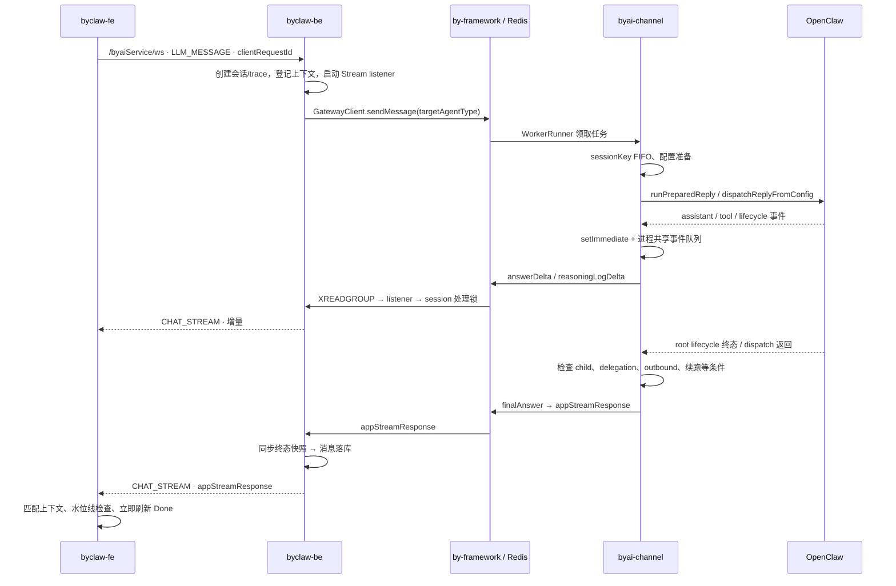

# 聊天 WebSocket 最终消息延迟：链路与排查手册

分析日期：2026-09-20。对象：OpenClaw 已有完整回答，但 ByClaw 前端约 20 分钟后才收到最终消息。

本文基于当前工作区源码和本地安装的 `@byclaw/by-framework@1.5.3`。尚未取得异常 sessionId、线上日志、浏览器 WS 帧或部署版本，因此以下内容是已验证的代码路径与条件性风险，不是这次事故的根因判定。没有修改运行代码或线上配置。

## 1. 先区分三个“完成”

1. **模型正文写完**：最后一个 assistant delta 已生成，或 transcript 已经保存答案。
2. **执行请求完成**：OpenClaw dispatch、子任务、channel 完成条件全部满足，worker 写出 `finalAnswer` 与 `appStreamResponse`。
3. **页面完成**：后端完成终态处理，将 `CHAT_STREAM / appStreamResponse` 发到浏览器，前端成功匹配会话并更新状态。

这三个时间不相等。排查需要同时记录“最后正文何时出现”和“loading/停止按钮何时结束”。`finalAnswer` 是框架最终答案快照；普通前端聊天明确以 `appStreamResponse` 为完成信号，不能把前者直接当作页面结束。

证据：[前端完成判断](../../byclaw-fe/src/hooks/useSseSender/chatStream.ts#L174)、[终态立即刷新](../../byclaw-fe/src/hooks/useChat/chatRuntime.ts#L474)、[worker 最终事件顺序](../../byclaw-exe/extensions/byai-channel/src/sdk-app.ts#L653)。

## 2. 请求与返回链路



主路径证据：

- FE 发出 `LLM_MESSAGE`：[useSend.ts](../../byclaw-fe/src/hooks/useSseSender/useSend.ts#L70)。
- BE WS 分发：[WebSocketHandler.java](../../byclaw-be/src/main/java/com/iwhalecloud/byai/state/domain/ws/handler/WebSocketHandler.java#L94)；创建 `CHAT_STREAM` 输出：[ChatService.java](../../byclaw-be/src/main/java/com/iwhalecloud/byai/state/domain/ws/service/ChatService.java#L94)。
- BE 先启动运行态/listener，再发送 Gateway；WS 分支异步返回：[RouteService.java](../../byclaw-be/src/main/java/com/iwhalecloud/byai/gateway/route/RouteService.java#L214)。
- channel WorkerRunner 和 emitter：[sdk-app.ts](../../byclaw-exe/extensions/byai-channel/src/sdk-app.ts#L738)；调用 OpenClaw：[sdk-message-processor.ts](../../byclaw-exe/extensions/byai-channel/src/sdk-message-processor.ts#L683)。
- Redis 消费与 ACK：[RedisStreamMessageListener.java](../../byclaw-be/src/main/java/com/iwhalecloud/byai/state/domain/ws/handler/RedisStreamMessageListener.java#L69)。
- BE 路由与终态快照：[SessionStreamEventRouter.java](../../byclaw-be/src/main/java/com/iwhalecloud/byai/state/domain/chat/service/SessionStreamEventRouter.java#L146)。
- 终态落库后写回发起端：[ScriptService.java](../../byclaw-be/src/main/java/com/iwhalecloud/byai/state/domain/chat/service/ScriptService.java#L424)。
- FE 全局订阅：[useGlobalChatRuntime.ts](../../byclaw-fe/src/hooks/useGlobalChatRuntime.ts#L55)。

### 必须确认的两条分支

**BY_SUPER 分支**：请求可能先进入 BY_SUPER，再委派给 `BYCLAW_EXE_<userCode>`。这时上图 B 与 C 之间还多了一层主任务；OpenClaw 子任务结束后，要经过框架 Resume 回调、delegation 结算、主任务恢复/汇总、外层终态投递。子任务终态不能结束外层前端请求。

实际路由以 [TargetAgentResolver](../../byclaw-be/src/main/java/com/iwhalecloud/byai/state/domain/chat/service/TargetAgentResolver.java#L48) 的输出和日志为准。`byclaw.route-by-super-to-user-sandbox` 源码默认 false，另外还有 resume/system-param/runtime 重定向，不能仅凭页面上的 Agent 名称判断。

委派与回调证据：[OpenClaw connector](../../byclaw-super/packages/connectors/openclaw-by-framework/src/index.ts#L14)、[callback completion 合同](../../byclaw-super/packages/connectors/by-framework-common/src/index.ts#L70)、[Resume 结算](../../byclaw-super/app/worker/by-framework-resume-command-handler.ts#L286)。应额外串联 `runId / delegationId / childSessionId / requestMessageId / parentMessageId`，不要只按一个 trace 过滤。

**OpenClaw 直连页面分支**：`openclaw/sendHelper.ts` 使用另一套 `OpenClawWebSocketClient.sendChat`。它确实有 20 分钟超时，但触发时执行 cancel + reject，并不是延迟投递成功答案。本文主线是 `/byaiService/ws`。先用浏览器 Network 中的实际 WS URL 与发出帧类型确认路径。[代码](../../byclaw-fe/src/hooks/useSseSender/openclaw/sendHelper.ts#L97)

## 3. 用时间点把 20 分钟切开

| 时间点 | 含义 | 当前证据 / 缺口 |
|---|---|---|
| T0 | 浏览器发出 LLM_MESSAGE | DevTools WS Frames；保留 clientRequestId |
| T1 | BE 收到并完成 Gateway 发布 | WS 入口日志、`Gateway SDK 消息发送成功`；需补齐同一行 trace/targetAgentType |
| T2 | channel 收到任务并开始 dispatch | `message.received`、`message.dispatch.started`、`onAgentRunStart` |
| T3 | OpenClaw 最后正文 / root lifecycle 终态 | 必须区分 transcript、core 事件产生时间、channel 处理时间 |
| T4 | channel 完成条件满足 | `session dispatch settled`、`sdk session completed`；注意后者在 defer 模式仅代表 prepared |
| T5a | emitter 构建事件 | Redis envelope 的 timestamp；这是生产侧时钟 |
| T5b | Redis 接受终态 XADD | Stream ID 的毫秒部分；通常代表 Redis 写入时间 |
| T6 | BE listener 收到终态 | 当前没有统一逐事件耗时日志，建议补点；PEL/指标只能辅助判断 |
| T7a / T7b | BE 终态快照、落库开始/结束 | 当前没有完整分段耗时；现场线程栈、DB 锁与慢 SQL 可补证 |
| T8 | BE 调用 WS writeAndFlush / 写完成 | 当前没有统一 ChannelFuture 结果日志 |
| T9 | 浏览器收到 WS frame | DevTools Frames 时间 |
| T10 | 前端应用事件并渲染 Done | 当前没有统一 apply/drop 原因日志 |

时间比较前校对容器、BE、Redis、浏览器时钟。Stream ID 在 Redis 时间回退等场景可能保持单调而不完全等于墙钟，不能用它证明毫秒级精度；20 分钟级差距仍应结合相邻记录和时钟偏差判断。

最有用的判定：

- **T3 → T5b 大**：定位 OpenClaw dispatch 尾部、channel 队列/完成门、Redis 发出；BY_SUPER 场景还需比较子/主终态。
- **T5a 早、T5b 晚**：怀疑 emitter 发出期间等待 Redis；需用写入耗时确认，并排除时钟偏差。
- **T5b → T6 大**：定位 Redis listener、消费者 owner、连接/读取异常、PEL、前序消息积压。
- **T6 → T8 大**：定位 BE 同 session 锁、快照、同步 DB 保存、跨实例广播。
- **T8 → T9 大**：首先确认 T8 是写完成而不是仅调用；再查 Netty 排队、连接、LB/代理与浏览器暂停。
- **T9 → T10 大**：定位前端身份匹配、恢复缓冲、水位线/去重、JS 主线程和渲染。

## 4. 有代码依据的等待点

### A. FE：连接未恢复，或收到事件但没有应用

- 每 6 秒发送 `NOTIFICATION`，没有回包超时检测。`ensureConnected` 看到 OPEN/CONNECTING 就退出，不能主动识别半开连接。`onerror` 停心跳，但重连主要由 `onclose` 调度。[websocket.ts](../../byclaw-fe/src/utils/websocket.ts#L189)
- 重连间隔上限 30 秒，但“间隔上限”不是“必定 30 秒恢复”；网络持续失败、未触发 close、页面挂起都可能更久。[重连代码](../../byclaw-fe/src/utils/websocket.ts#L448)
- 30 秒运行态轮询在后端没有 running 时，只清理 restored 会话。本页新发起的请求若丢失终态，不保证由这轮询修复；重连后的 reconcile 路径会更全面地查询快照/历史。这可以形成“长期 loading，重连后突然完成”。[轮询](../../byclaw-fe/src/hooks/useChat/index.ts#L445)、[重连对账](../../byclaw-fe/src/hooks/useChat/index.ts#L652)
- 前端按 clientRequestId/lane/trace/session 关联上下文；恢复中会缓冲，找不到 context 时可能直接返回。终态到达 Network 并不等于成功更新消息。[chatRuntime.ts](../../byclaw-fe/src/hooks/useChat/chatRuntime.ts#L488)
- 增量合并刷新间隔仅 30ms，终态立即 flush。不能把正常前端节流解释成 20 分钟。[chatRuntime.ts](../../byclaw-fe/src/hooks/useChat/chatRuntime.ts#L478)

### B. BE：终态要经过快照和落库；发送也没有浏览器 ACK

- `PythonSseService` 对 `appStreamResponse` 只累积关联资源，不立即写回发起端；`ScriptService.storeMessage` 调用 `resolveMemory` 成功后才发送最终响应。因此“Redis 终态已到”仍不足以证明“前端最终帧已发”。[累积终态](../../byclaw-be/src/main/java/com/iwhalecloud/byai/state/domain/chat/service/PythonSseService.java#L155)、[同步保存](../../byclaw-be/src/main/java/com/iwhalecloud/byai/state/domain/chat/service/ScriptService.java#L975)
- `StreamRecordProcessor` 在 session 锁内路由、终态持久化。同会话其他 trace 的历史落库/慢处理也可能阻塞后续终态。[处理锁](../../byclaw-be/src/main/java/com/iwhalecloud/byai/state/domain/chat/service/StreamRecordProcessor.java#L93)
- 终态 `flushNow` 同步写 Redis 快照，且可能等待同一 PendingState 的锁；非终态快照线程在该锁内也执行 save。DB 之前还有一个 Redis/快照等待段。[快照锁](../../byclaw-be/src/main/java/com/iwhalecloud/byai/state/domain/chat/service/RunningChatSnapshotWriteBehind.java#L79)
- 发起端 `NettyArrayOutputStream` 只检查 isActive 并调用 writeAndFlush，不观察返回的 ChannelFuture；inactive 则不发送。Redis ACK 代表后端处理确认，不代表浏览器收到。[发送实现](../../byclaw-be/src/main/java/com/iwhalecloud/byai/state/domain/ws/manager/NettyArrayOutputStream.java#L32)
- 跨实例广播经 Redis Pub/Sub，本地推送和 publish 都没有浏览器接收 ACK。重连到另一 BE 实例后尤其要检查该分支，不应只看原实例。[广播](../../byclaw-be/src/main/java/com/iwhalecloud/byai/state/domain/ws/service/MultiDeviceBroadcastService.java#L198)
- WebSocket 业务 executor 默认 8 个线程。入口同步依赖变慢可能挤压入站请求/通知处理，需用线程栈证实；它不是已经回答之后所有延迟的统一解释。[线程池](../../byclaw-be/src/main/java/com/iwhalecloud/byai/state/common/config/NettyConfig.java#L137)

### C. Redis 消费：读取新消息与恢复 pending 是两回事

- listener 使用 consumer group 的 lastConsumed、手动 ACK，读取错误继续轮询。XREADGROUP 的 2 秒 BLOCK 是等待新数据的上限，不是每个消息固定等待 2 秒。[消费请求](../../byclaw-be/src/main/java/com/iwhalecloud/byai/state/domain/chat/service/SessionStreamManager.java#L458)
- ERROR/MISSING_CONTEXT 留在 PEL，不等于下轮读取新消息时会自动再投递。[listener](../../byclaw-be/src/main/java/com/iwhalecloud/byai/state/domain/ws/handler/RedisStreamMessageListener.java#L69)
- recovery 每 30 秒扫描，stale heartbeat 与 pending idle 阈值均为 180 秒，但不是所有 PEL 都保证三分钟恢复：本机 live listener 存在且没有登记 ACK failure 时，`manageLocalRecoveryCtx` 直接返回；定向 claim 只覆盖明确的 ACK 重试耗尽记录。业务处理 ERROR/MISSING_CONTEXT 也会 pending，应核对其是否进入实际恢复路径，不能仅看 listener 存在就认为健康。[恢复判断](../../byclaw-be/src/main/java/com/iwhalecloud/byai/state/domain/chat/service/SessionStreamRecoveryService.java#L129)
- running 标记每 60 秒续租，listener lease 每 30 秒续租。它们证明管理任务活跃，不证明某条消息持续前进。[续租](../../byclaw-be/src/main/java/com/iwhalecloud/byai/state/domain/chat/service/SessionStreamManager.java#L391)
- 存在另一项恢复风险：`tryBeginPersist` 在实际保存前置位，当前上下文中没有重置路径。失败后的同上下文重试可能跳过保存；这更接近终态丢失/恢复异常，不能据此声称存在固定 20 分钟重试。[闸门](../../byclaw-be/src/main/java/com/iwhalecloud/byai/state/domain/chat/service/ChatProcessContext.java#L250)

### D. channel：事件排队、完成条件、外层聚合

- OpenClaw 事件订阅立即复制事件，再 setImmediate 入队；core 结束和 channel 处理结束可明显分离。`onAgentEvent` 日志写在 handler 内部，已经是出队后的时间，不能用这行日志单独证明 core 何时发出了事件。[订阅](../../byclaw-exe/extensions/byai-channel/index.ts#L41)、[处理日志](../../byclaw-exe/extensions/byai-channel/src/agent-event.ts#L588)
- 所有事件与完成检查使用一个进程共享 Promise 队列，并非按 session 隔离；排在前面的 Redis emit 不返回，会阻塞后面的 lifecycle 和其他会话事件。队列本身没有任务 deadline。[共享队列](../../byclaw-exe/extensions/byai-channel/src/agent-event-serial.ts#L37)、[await emit](../../byclaw-exe/extensions/byai-channel/src/session-context.ts#L800)
- 完成门要求 root 终态、native child 全终态、delegatedWork 清空、pending follow-up 清空、pendingOutbound=0、无进行中的 follow-up/compaction/fallback/overflow/task-plan continuation。绑定过 run 时，dispatchSettled 不能替代 root lifecycle。[完整判据](../../byclaw-exe/extensions/byai-channel/src/session-context.ts#L1418)
- `awaitingFollowup` 有 30 秒 stale 判据，但它只是被检查时放行的条件，并非独立定时完成器；普通 settle 每秒轮询，恢复分支则等待事件完成检查。不能把 30 秒看成所有完成路径的绝对上限。[完成检查](../../byclaw-exe/extensions/byai-channel/src/sdk-session-completion.ts#L48)
- 同 sessionKey FIFO lease 直到最终事件发送完才释放；后一个请求可被前一个请求尾部拖住。默认 sessionKeyPerSessionId 为 false，排查时必须比较实际 sessionKey，不要假设浏览器 sessionId 就是 FIFO key。[FIFO 调用](../../byclaw-exe/extensions/byai-channel/src/sdk-message-processor.ts#L409)
- 多路业务结果聚合后才发送 `finalAnswer`，随后 finalize 各 lane。单路先回答不能证明批量请求可结束。[聚合](../../byclaw-exe/extensions/byai-channel/src/sdk-app.ts#L643)
- 本地 SDK emitter 使用 pipeline 执行 XADD + EXPIRE，没有 channel 层端到端写入 deadline；当前 emitter 也没有检查 pipeline 每条命令的错误项。单条命令失败时是否被当成发送成功需要故障注入验证，不能只看 Promise 完成。源码位置：`byclaw-exe/extensions/byai-channel/node_modules/@byclaw/by-framework/dist/emitter.js:52`。生产版本必须另行核对。
- Runner 已为阻塞读取 duplicate 独立连接，因此“poll BLOCK 一定占住 emitter 连接”在当前安装版本不成立。其他 Redis 等待仍需查具体 emit 耗时。[初始化](../../byclaw-exe/extensions/byai-channel/src/sdk-app.ts#L742)

### E. OpenClaw：正文结束后 dispatch 仍可能在收尾

channel await 的是 `runPreparedReply → withReplyDispatcher → dispatchReplyFromConfig`，不是只等待最后一个 token。应区分 core root terminal、`agent_end` hook、dispatcher 返回三个时间。

本机相邻 OpenClaw 源码版本为 2026.7.2，其中 `src/auto-reply/dispatch-dispatcher.ts:30` 的 settle 会 await dispatcher.waitForIdle，再执行 settled tasks；这支持“正文生成结束不等于 dispatch 返回”的合同，但不能证明生产镜像内的具体行为。仓库 Dockerfile 默认 OpenClaw 版本为 2026.6.6，实际部署还可能覆盖。现场需提供镜像 digest、OpenClaw 版本和插件版本，再对照相同版本的 core。

## 5. 20 分钟相关配置核对

| 位置 | 当前源码值 | 能否直接解释本次现象 |
|---|---|---|
| 普通聊天前端增量刷新 | 30ms，终态立即 flush | 不能 |
| 普通聊天 WS 重连间隔 | 最高 30 秒 | 不是总恢复上限 |
| 前端恢复态轮询 | 30 秒 | 只修复部分恢复场景 |
| OpenClaw 直连 helper | 20 分钟 | 仅另一条路径；行为是取消并报错 |
| BE HTTP SSE 无事件等待 | 5 分钟 | WS 分支提前返回，不经过该循环 |
| BE Redis poll | 默认 2 秒；read timeout 默认 5 秒 | 非消息固定延时 |
| BE pending 恢复 | 扫描 30 秒；stale/idle 180 秒 | 存在适用条件，非保证恢复上限 |
| channel 正常 settle / deferred completion | 30 分钟 | 不是固定 20 分钟；超时不代表成功最终回答 |
| channel agent_end 等待 | 10 秒 | 单独不能解释 20 分钟 |
| BY_SUPER 委派默认值 | firstActivity 5 分钟、idle 15 分钟、callback 0 | 不能简单相加得到固定 20 分钟；需核对实际环境变量与阶段 |
| 仓库 nginx 主模板 | proxy read/send 6000 秒 | 不是 20 分钟；生产 LB/Ingress 配置尚未取得 |
| 仓库一份 openGauss 配置 | lockwait_timeout=1200s | 仅条件线索；未证明线上使用该文件/DB，超时通常报错而非成功回包 |

BY_SUPER 默认值见 [config-defaults.ts](../../byclaw-super/app/config/config-defaults.ts#L26)。openGauss 条件线索见 [postgresql.conf](../../deploy/middleware/official-opengauss-data-compatible/data/postgresql.conf#L710)。旧分析文档中的“前端通用 SSE 20 分钟”不能直接套用到当前普通 WS 路径。

## 6. 现场最短排查流程

### 第一步：确认路径与身份

保留以下字段：异常时间范围（含时区）、浏览器实际 WS URL 的路径、sessionId、clientRequestId、traceId、answerMessageId、实际 targetAgentType、workerId、OpenClaw sessionKey/runId、部署版本。若有 BY_SUPER，再加外层 runId/delegationId/childSessionId。URL 中的 token 不进入排查记录。

### 第二步：先看浏览器，不从所有日志同时搜起

DevTools → Network → WS → `/byaiService/ws` → Messages，启用保留日志。

- 记录最后 answerDelta 和 appStreamResponse 到达时间。
- 若 appStreamResponse 早已到达但页面晚结束：直接查前端 apply/drop，不再优先查模型。
- 若 20 分钟后只有 runningSnapshot/history HTTP 请求带回答案，没有终态 WS 帧：这是恢复/刷新补齐，不是“最终 WS 消息延迟到达”。
- 同时查看连接 close/error/reconnect、页面是否后台/睡眠。用同浏览器其他会话或另一个已授权客户端判断是否只影响单个连接。

### 第三步：按 sessionId 读取 Redis 终态

使用已安装的 `by-read-redis-datastream` 技能脚本。它加载指定 repo 的环境，自动派生 v1/v2 key；先取有界窗口：

```bash
node /Users/tangs/.codex/skills/by-read-redis-datastream/scripts/read_datastream.mjs SESSION_ID \
  --repo /Users/tangs/iwhalecloud/ByClaw --limit 200 --content-limit 80
```

确认 trace 后再过滤；目标超出 200 条窗口时才扩展：

```bash
node /Users/tangs/.codex/skills/by-read-redis-datastream/scripts/read_datastream.mjs SESSION_ID \
  --repo /Users/tangs/iwhalecloud/ByClaw --trace TRACE_ID --all --content-limit 80
```

重点看 `redisId / event / sourceAgentType / traceId / messageId / parentMessageId`，只需要事件元数据，不需要输出完整 reasoning 内容。脚本当前不展示 envelope.timestamp；若要比较 T5a/T5b，需要从已授权的原始 Stream 导出中保留 timestamp，或后续给诊断脚本补该字段，不能把 redisId 同时当作两者。

若同 session 有多个生产者，按 sourceAgentType 与 trace 分组：BYCLAW_EXE 的终态、BY_SUPER 的外层终态不能混用。无终态记录也不立即等于未发送，要检查实际 key schema、保留/裁剪、查询窗口与 childSessionId。

### 第四步：按 Redis 是否已有正确终态分流

**Redis 中没有或很晚才有正确终态：**

1. 对齐 core root lifecycle 与 channel `onAgentEvent`；后者可能已排队很久。
2. 搜 `dispatch finished`、`session dispatch settled`、`settle deferred`、`ignored stale root lifecycle terminal`。
3. `waitMs` 很大：检查完成门；`dispatch finished` 本身很晚：检查 OpenClaw dispatch 尾部及配置/续跑。
4. `session dispatch dequeued` 的 gateWaitMs 大表示进场排队；该日志在被包装 task 返回后才输出，日志时间不是实际取得 gate 的时间。
5. 若其他 session 同时停流，优先查 channel 共享事件队列和 Redis emit。
6. BY_SUPER 分支加查 `child_agent_dispatch`、`已受理子 Agent 调度`、`已持久化子 Agent Resume 回调并唤醒原 Run`，确认子终态是否已经结算到外层。

**Redis 中早已有正确终态：**

1. 查对应 BE 实例的 listener owner/lease、consumer group `byai_conversation_service_group`、该记录是否 pending、读取错误和 dispatch 错误。通过运维只读 XINFO/XPENDING 视图核对；pending 仅表明未 ACK，不能单独证明没推送。
2. 查 `Redis Stream 消息暂不 ACK`、`terminal 事件持久化失败`、`ACK 重试耗尽`、`已接管 Session Stream`、`lease 续租失败`。
3. 连续取 BE 线程栈，定位同 session 的处理锁、快照 Redis 调用、数据库保存；同时查 DB 阻塞会话和慢 SQL。
4. 若消息已落库，查 Netty 写结果与跨实例广播；确认浏览器连接所在实例，而非只查消息执行实例。
5. 结合 `/byaiService/chat/runningStatus`、`/byaiService/chat/runningSnapshot` 的响应与历史消息判断后端投递和页面恢复是否分离。不要反复刷新页面覆盖现场。

已有可辅助指标：`byclaw.session.stream.received`、`read.error`（reason）、`dispatch.duration`、`dispatch.error`、`missing_context`、`pending.total`、`ack.failure`、`listener.active`。这些是聚合指标，不带具体 trace，不能替代时间线。[指标定义](../../byclaw-be/src/main/java/com/iwhalecloud/byai/state/domain/chat/service/SessionStreamMetrics.java#L39)

## 7. 最小可观测性补点建议（本轮未实现）

统一关联字段：`sessionId, traceId, clientRequestId, messageId, sourceAgentType, targetAgentType, workerId, instanceId, runId, sessionKey, streamId, eventType`。BY_SUPER 再加 delegationId。日志只记元数据、字节数和耗时，不记 token、完整 prompt 或 reasoning。

| 层 | 建议新增节点 | 解决的问题 |
|---|---|---|
| FE | ws_receive、event_apply、event_drop(reason)、connectionId、lastReceiveAt、visibility | 区分已收未渲染与根本未收到 |
| BE | stream_received、session_lock_acquired、snapshot_start/end、persist_start/end | 精确拆分读取、锁、Redis 快照、DB 等待 |
| BE WS | write_enqueued、write_completed(success/cause)、isActive/isWritable、channelId | 区分调用发送、实际写完成；仍不等于浏览器接收 |
| channel | core_event_received、queue_enqueued/dequeued、queueWaitMs、queueDepth | 检测全局队头阻塞，保留真正 core 接收时间 |
| channel | completion_blocked(blocker 列表、数量、年龄、activeRootRunId) | 不再只看到 30 分钟后 settle 超时 |
| emitter | emit_start/end、eventType、duration、XADD 返回 ID、pipeline 命令错误 | 检测 Redis 写入等待与假成功 |
| BY_SUPER | 子派发、Resume 收到、结算、外层恢复、外层最终投递 | 把子完成与主完成分开 |

完成门诊断至少包括 native pending run IDs、delegated toolCallIds、pendingDelegatedFollowupRunId、pendingOutboundCount、rootLifecyclePhase、awaitingFollowupSince、followupRunStarted、compactionRetryPending、overflowContinuePending、modelFallbackPending 和 task-plan pending。记录状态变化，持续阻塞时低频汇总，不对每个 token 打详细日志。

建议先补这组观测，再针对被时间线证实的段修复。不要先把全链路 timeout 缩短或看到任意子任务终态就关闭前端，那会把延迟变成截断/丢消息。

## 8. 本轮交付与验证边界

- 已完成 FE → BE → Gateway/Redis → channel → OpenClaw 接口与返回路径静态分析，并覆盖 BY_SUPER 和 OpenClaw 直连分支。
- 已核对前端结束条件、后端终态落库顺序、Redis 读取/恢复、channel 队列/完成门，以及本地 SDK emitter/runner 合同。
- 只新增本文，未修改生产代码、未改配置、未操作数据库或 Redis、未暂存或提交文档。未运行应用测试，因为没有行为变更。
- 本轮没有异常实例的运行数据，未复现 20 分钟延迟。确定具体事故根因所需的下一份证据是：同一请求的浏览器最后正文/终态时间，以及 Redis 正确 trace/source 下的终态 Stream ID；随后按第 3 节定位下一段。
