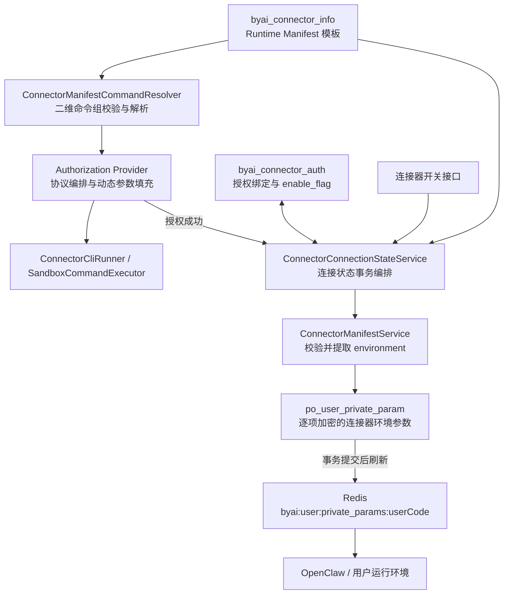

# 连接器 Runtime Manifest 对接设计

## 1. 文档信息

- 状态：环境参数物化与二维命令组驱动均已实现
- 更新日期：2026-08-10
- 实现基准：当前 `develop`；`runtime.commands` 二维命令组已进入生产执行路径
- 关联设计：[连接器统一授权架构设计](./connector-authorization-architecture.md)
- 适用范围：钉钉 DWS、飞书 Lark CLI、企业微信 WeCom CLI 以及后续 CLI 型连接器

## 2. 背景与目标

`byai_connector_info.runtime_manifest` 描述连接器的 CLI 命令、凭证目录、运行环境、并发锁和 Skill 映射。
Manifest 不保存 token、refresh token、App Secret 等秘密；真实凭证仍由 CLI 的原生凭证目录管理。

渠道 Manifest 是平台模板，用户运行时不需要获得完整 Manifest JSON。OpenClaw 用户运行环境需要
`authStorage.environment` 中经过平台校验的环境参数；后端授权 Provider 需要经过平台命令策略校验的
`runtime.commands`。因此本设计采用“渠道模板 + 后端命令目录 + 用户环境参数物化”：

1. 每个有效渠道在 `byai_connector_info` 中维护一份最新 `runtime_manifest`；
2. 用户连接或开启连接器时，将 Manifest 的 `authStorage.environment` 按字段物化到
   `po_user_private_param`；
3. 用户关闭连接器时保留这些参数，但将其标记为 `DISABLED`，使其不进入 Redis；
4. 连接器再次开启时以最新 Manifest 重新校验、更新和恢复参数；
5. 连接器托管参数不能由个人参数接口修改、启停或删除。
6. 后端在启动任何授权 CLI 前，将二维命令组解析为不可变命令目录；Provider 选择命令并填充受控动态参数。

## 3. 核心模型

| 层级 | 存储位置 | 数量关系 | 职责 |
| --- | --- | --- | --- |
| 渠道模板 | `byai_connector_info.runtime_manifest` | 每个渠道一份 | 保存平台发布的完整运行协议 |
| 后端命令目录 | 请求内存 / 授权 Provider 上下文 | 每次授权或校验一份 | 保存已校验的 argv 模板，不单独持久化 |
| 用户环境参数 | `po_user_private_param` | 每个用户、每个连接器、每个环境变量一条 | 保存用户运行时实际需要的环境值 |
| 运行缓存 | Redis `byai:user:private_params:{userCode}` | 每个用户一份聚合数据 | 向用户运行环境分发所有启用参数 |

`byai_connector_info.runtime_manifest` 是模板的唯一数据库来源；`po_user_private_param` 是模板中环境字段
在具体用户启用状态下的物化结果，不是可独立维护的 Manifest 副本。

`byai_connector_auth` 只保存用户与连接器的授权绑定、`enable_flag`、授权模式、账号摘要和凭证引用。
`enable_flag` 是用户是否开启连接器的业务开关。当前实现中，`expire_time` 不参与连接器列表、消息
`authConnectorList`、`/connector/enable` 开关接口或环境参数启停；但通用授权记录 `save/update` 校验仍会拒绝
“`expire_time` 早于当前时间且 `enable_flag=Y`”的请求。该校验属于现有授权记录校验行为，不影响消息
metadata 和连接器开关查询。

## 4. 总体架构



组件职责：

1. `ConnectorManifestCanonicalizer` 校验 Manifest，并规范化二维 `runtime.commands` 和
   `authStorage.environment`；
2. `ConnectorManifestCommandResolver` 根据 Provider 命令契约生成不可变命令目录并填充受控占位符；
3. `ConnectorManifestService` 负责环境参数的冲突预检、加密、幂等写入、恢复和停用；
4. `ConnectorConnectionStateService` 在同一事务中更新授权绑定和用户环境参数；
5. `UserPrivateParamApplicationService` 负责数据库密文与 Redis 明文缓存，并保护连接器托管记录；
6. Provider 选择 action 和命令索引、编排平台协议并报告授权结果，不直接写个人参数。

## 5. 数据模型

### 5.1 `byai_connector_info`

```sql
ALTER TABLE byai.byai_connector_info
    ADD COLUMN runtime_manifest TEXT,
    ADD COLUMN skill_code VARCHAR(64);
```

`runtime_manifest` 与 `auth_config`、`request_config` 生命周期不同：

- `auth_config`：不构成 CLI argv 的 Provider 参数，例如授权超时和输出上限；
- `request_config`：连接器公共请求配置；
- `runtime_manifest`：连接器运行发现协议，也是 CLI argv 模板的唯一数据库来源。

`skill_code` 保存 OpenClaw Skill 路由编码，例如 `dws`、`fws`、`wecomcli`，并必须与
`runtime_manifest.skill.code` 一致。消息发送属于高频链路，直接读取 `skill_code`，不读取和解析完整
Manifest；Manifest 继续作为运行协议和环境参数物化的权威来源。

连接或开启连接器前，Manifest 必须通过结构、连接器编码、命令、路径、环境字段和敏感信息校验。缺失或
无效时返回稳定的平台配置错误，授权绑定与用户参数不得出现部分提交。

### 5.2 `po_user_private_param`

连接器托管参数使用：

```text
param_key          = runtime_manifest.authStorage.environment 的字段名
param_value_cipher = 对应字段值的加密结果
param_source       = CONNECTOR
source_ref         = byai_connector_info.connector_code
status             = NORMAL | DISABLED
delete_flag        = 0
```

用户参数仍使用 `param_source=USER` 且 `source_ref IS NULL`。连接器参数使用
`param_source=CONNECTOR` 且 `source_ref IS NOT NULL`。

连接器参数的唯一约束包含环境变量名：

```sql
CREATE UNIQUE INDEX IF NOT EXISTS uk_po_user_private_param_connector
    ON byai.po_user_private_param (user_id, param_source, source_ref, param_key)
    WHERE delete_flag = '0'
      AND param_source = 'CONNECTOR'
      AND source_ref IS NOT NULL;

CREATE UNIQUE INDEX IF NOT EXISTS uk_po_user_private_param_connector_null_ref
    ON byai.po_user_private_param (user_id, param_source, param_key)
    WHERE delete_flag = '0'
      AND param_source = 'CONNECTOR'
      AND source_ref IS NULL;
```

第二个索引用于约束异常或迁移期遗留的空 `source_ref` 连接器记录；正常物化记录必须写入非空
`connector_code`。

现有 `(user_id, param_key) WHERE delete_flag = '0'` 唯一索引继续作为用户运行环境的全局 Key 冲突保护：
同一用户不能由 USER 参数或不同连接器同时占用相同 Key。

### 5.3 内置连接器环境参数

| connectorCode | `authStorage.environment` 字段 |
| --- | --- |
| `dingtalk` | `DWS_HOME`、`DWS_CONFIG_DIR`、`DWS_DISABLE_KEYCHAIN` |
| `lark` | `LARK_HOME` |
| `wecom` | `WECOM_HOME` |

环境变量名必须匹配 `[A-Z_][A-Z0-9_]{0,127}`，值必须为非空字符串。所有有效连接器的环境 Key 必须全局
唯一；新增或修改 Manifest 时仍需运行通用冲突检查，不能只检查 `HOME`。若某个 Key 已由用户参数或其他
连接器占用，整个参数物化操作失败，不能只写入无冲突的部分。

## 6. Manifest 契约

### 6.1 环境配置

钉钉环境配置：

```json
{
  "authStorage": {
    "mode": "native-home",
    "nativePath": "/by/.connector-auth/.dws",
    "environment": {
      "DWS_HOME": "/by/.connector-auth/.dws",
      "DWS_CONFIG_DIR": "/by/.connector-auth/.dws/config",
      "DWS_DISABLE_KEYCHAIN": "1"
    }
  }
}
```

飞书和企业微信分别使用 `LARK_HOME=/by/.connector-auth/.lark-cli` 与
`WECOM_HOME=/by/.connector-auth/.wecom-cli`，字段仍位于各自 Manifest 的
`authStorage.environment`，不能增加 `lark` 或 `wecom` 中间层。例如飞书：

```json
{
  "authStorage": {
    "environment": {
      "LARK_HOME": "/by/.connector-auth/.lark-cli"
    }
  }
}
```

完整 Manifest 还必须满足：

- `id` 等于 `byai_connector_info.connector_code`；
- `runtime.commands` 的每个 value 使用非空二维数组，禁止一维 argv 和 shell 字符串；
- `nativePath` 和环境值使用用户沙箱可见的 `/by/...` 路径；
- `skill.code` 与系统内置 Skill 编码一致；
- 不包含 token、refresh token、App Secret、授权码、用户身份或临时设备码；
- 对象字段按 Key 排序并生成 canonical JSON，数组保持原顺序。

Canonical JSON 用于稳定校验模板。用户参数的幂等比较按每个环境 Key 解密后的明文值和状态进行：值未变且
状态为 `NORMAL` 时不更新；值变化时重新加密；状态为 `DISABLED` 时恢复为 `NORMAL`；最新版 Manifest
不再包含的旧连接器参数改为 `DISABLED`。

### 6.2 二维命令组

`runtime.commands` 是 action 到命令组的映射。每个命令组是二维字符串数组：

```text
commands.<action>[commandIndex][argumentIndex]
```

- 外层数组保持平台协议约定的命令顺序；
- 每个内层数组是一条 argv，第一项是可执行文件，其余项是独立参数；
- 二维数组只定义命令组及索引，不表示通用执行器自动顺序运行所有命令；
- Provider 根据授权阶段、CLI 输出和会话状态决定执行、跳过、重复检查或终止哪条命令；
- Provider 命令契约定义必要 action、每组最小或精确数量、允许的可执行文件、子命令和占位符。

通用执行器只接收已解析的 `List<String>`，不能接收完整命令组，更不能自行解释条件、重试或等待。

### 6.3 内置连接器命令组

钉钉 DWS：

```json
{
  "commands": {
    "login": [
      ["dws", "auth", "login", "--device", "--no-browser", "--recommend", "-y"]
    ],
    "logout": [
      ["dws", "auth", "reset", "-y"]
    ],
    "status": [
      ["dws", "auth", "status", "--format", "json"]
    ]
  }
}
```

飞书 Lark CLI：

```json
{
  "commands": {
    "configCheck": [
      ["lark-cli", "config", "show"]
    ],
    "configInitialize": [
      ["lark-cli", "config", "init", "--new", "--force-init"]
    ],
    "contextBind": [
      ["lark-cli", "config", "bind", "--source", "openclaw", "--identity", "user-default", "--force"]
    ],
    "login": [
      ["lark-cli", "auth", "login", "--domain", "all", "--no-wait", "--json"],
      ["lark-cli", "auth", "login", "--device-code", "${deviceCode}", "--json"]
    ],
    "logout": [
      ["lark-cli", "auth", "logout", "--json"]
    ],
    "status": [
      ["lark-cli", "auth", "status", "--json", "--verify"]
    ]
  }
}
```

其中 `login[0]` 发起 Device Flow，`login[1]` 完成 Device Flow。应用配置检查、初始化、上下文绑定、
用户打开授权 URL、完成命令和最终状态验证之间存在条件分支与异步等待，不能把上述数组一次性依次执行。

企业微信 WeCom CLI：

```json
{
  "commands": {
    "login": [
      ["wecom-cli", "init", "--noninteractive", "--no-open"]
    ],
    "logout": [
      ["wecom-cli", "cache", "clear"]
    ],
    "status": [
      ["wecom-cli", "cache", "status"],
      ["wecom-cli", "contact", "get_userlist", "{}"]
    ]
  }
}
```

WeCom `status[0]` 只检查本地缓存，`status[1]` 是只读业务探针。两者均成功才可判定 `CONNECTED`。
业务探针从 `auth_config.probeCommand` 迁入 Manifest 后，`auth_config` 只保留授权超时等非命令参数。

### 6.4 动态参数与占位符

占位符必须占据完整 argv 元素，格式为 `${name}`；禁止在一个字符串中拼接前缀、后缀或多个占位符。
首批只允许 Lark `${deviceCode}`，后续新增占位符必须同时更新 Provider 命令契约、来源定义和参数校验。

`${deviceCode}` 的数据流为：

```text
执行 Lark commands.login[0]
  → 从可信 CLI JSON 输出解析 device_code
  → 校验非空、长度和控制字符
  → 作为临时秘密写入加密 providerState
  → 后续状态查询解密 providerState
  → 再次校验并填入 commands.login[1]
  → 生成最终 argv 后直接执行
```

动态值只允许来自以下服务端可信来源：

- 显式且已经校验的用户/连接器上下文；
- CLI 上一步的结构化输出；
- 加密的授权会话 `providerState`；
- 通过 state、归属和一次性消费校验的平台回调。

前端请求参数、消息 metadata、未经约束的 `auth_config` 字符串以及普通数据库文本不能直接替换命令占位符。
解析器必须逐 argv 元素填充并返回新数组，禁止拼接 shell 命令。

### 6.5 解析时机与执行边界

授权启动、凭证验证和凭证撤销都必须在执行 CLI 前读取当前连接器 Manifest，并完成：

1. canonical JSON、二维数组和敏感字段校验；
2. `provider_code` 对应的命令契约校验；
3. 必要 action、命令数量、可执行文件和子命令校验；
4. 占位符名称、位置和允许来源校验；
5. 生成不可变 `ManifestCommandCatalog`。

启动阶段只解析静态模板；动态参数在 Provider 到达对应协议阶段时才填充。Manifest 缺失或命令非法时，
必须在启动任何 CLI、创建长进程或向用户返回授权 URL 前失败，避免出现“CLI 已登录但授权绑定失败”的
半成功状态。

Manifest 中的 `/by/...` 路径服务于用户沙箱和 OpenClaw 参数分发。后端宿主机实际凭证目录仍由
`ConnectorCredentialWorkspaceService` 根据用户 bucket 安全解析，Provider 不能直接把 Manifest 路径当作
宿主机路径。

## 7. 用户参数与 Redis 契约

用户 `10000050` 开启钉钉后，数据库中应存在三条记录，例如：

```text
user_id=10000050, param_key=DWS_HOME,             source_ref=dingtalk, status=NORMAL
user_id=10000050, param_key=DWS_CONFIG_DIR,       source_ref=dingtalk, status=NORMAL
user_id=10000050, param_key=DWS_DISABLE_KEYCHAIN, source_ref=dingtalk, status=NORMAL
```

`param_value_cipher` 在数据库中保存加密值。Redis 沿用个人参数的字符串 Map，不再保存完整 Manifest JSON：

```json
{
  "version": 1785720000000,
  "updated_at": "2026-08-03T12:00:00+08:00",
  "params": {
    "DWS_HOME": "/by/.connector-auth/.dws",
    "DWS_CONFIG_DIR": "/by/.connector-auth/.dws/config",
    "DWS_DISABLE_KEYCHAIN": "1"
  }
}
```

只有 `status=NORMAL` 且未删除的记录进入 Redis。`DISABLED` 记录保留在数据库中，但不进入运行缓存。
Redis 的 `params` Map 不携带 `param_source` 或 `source_ref`；这些字段只用于数据库归属、管理接口和权限控制。

## 8. OpenClaw 运行时 HOME 隔离

数据库和 Redis 分发的是命名空间变量，不覆盖 OpenClaw 进程的全局 `HOME`。各系统 Skill 在执行对应 CLI
的子进程时做局部映射：

```bash
HOME="$DWS_HOME" dws ...
HOME="$LARK_HOME" lark-cli ...
HOME="$WECOM_HOME" wecom-cli ...
```

该规则适用于父 Skill、子 Skill、脚本和 references 中的所有 CLI 调用。命名空间 HOME 缺失时必须失败
关闭，禁止回退到 OpenClaw 全局 `HOME`。`DWS_CONFIG_DIR`、`DWS_DISABLE_KEYCHAIN` 等非 HOME 参数直接由
子进程继承。

这样可以同时满足：

- 各连接器 CLI 使用各自的凭证目录；
- 多连接器参数不会争用通用 `HOME`；
- OpenClaw 及其他工具的 HOME 语义不被连接器修改；
- 后续连接器仍可通过全局环境 Key 冲突校验安全扩展。

## 9. 生命周期

| 事件 | `byai_connector_auth` | 用户连接器环境参数 | Redis |
| --- | --- | --- | --- |
| 首次授权成功 | 新增或更新，`enable_flag=Y` | 按最新 environment 写入，`NORMAL` | 包含全部环境参数 |
| 重新授权成功 | 更新凭证引用，`enable_flag=Y` | 按最新 environment 对账 | 更新环境参数 |
| 关闭连接器 | `enable_flag=N` | 该 `source_ref` 的记录改为 `DISABLED` | 移除对应参数 |
| 再次开启 | `enable_flag=Y` | 重新提取、更新并恢复 `NORMAL` | 恢复最新参数 |
| Manifest 删除某个环境字段 | 不变 | 旧字段改为 `DISABLED` | 移除旧字段 |
| 用户尝试编辑/启停/删除 | 不变 | 后端拒绝 | 不变 |

授权成功或开启流程：

```text
读取 byai_connector_info.runtime_manifest
  → 校验并提取 authStorage.environment
  → 预检 USER 参数和其他连接器的 Key 冲突
  → 开启数据库事务
      → 更新 byai_connector_auth.enable_flag=Y
      → 逐项新增、更新或恢复环境参数
      → 将该连接器已不存在的旧参数改为 DISABLED
  → 提交事务
  → afterCommit 刷新用户个人参数 Redis
```

授权 CLI 启动流程独立于环境参数物化事务，但使用同一份渠道 Manifest：

```text
读取 byai_connector_info.runtime_manifest
  → 校验并解析 runtime.commands 二维命令组
  → 按 provider_code 校验平台命令契约
  → 创建不可变 ManifestCommandCatalog
  → Provider 根据协议阶段选择 action + index
  → 填充当前阶段允许的动态参数
  → ConnectorCliRunner / SandboxCommandExecutor 执行最终 argv
  → Provider 解析输出并推进 Redis 授权会话
```

关闭流程在同一事务中设置 `enable_flag=N`，并把该连接器全部托管参数改为 `DISABLED`。`expire_time` 不参与
上述连接器开关和参数物化流程。通用授权记录 `save/update` 仍保留“已过期记录不能以 `enable_flag=Y`
保存”的输入校验。

## 10. 一致性、幂等与权限

- 授权绑定与环境参数在同一数据库事务中提交或回滚；
- 写入前一次性加载用户未删除参数并完成冲突预检，避免部分写入；
- 并发插入发生唯一键冲突时重新读取获胜记录：同一连接器可继续幂等对账，其他归属则返回冲突；
- 数据库是权威数据源，Redis 是可重建缓存；事务提交后刷新失败不回滚数据库，可由启动全量同步或列表
  查询自愈；
- Manifest 是 CLI argv 模板的唯一数据库来源；Provider 不再维护与 Manifest 等价的登录、状态、注销或
  探针命令常量；
- 同一次授权会话使用启动时校验得到的不可变命令目录。渠道 Manifest 更新只影响新会话，不能在进行中的
  Device Flow 中途替换命令模板；
- 恢复授权会话时必须重新读取 Manifest，并验证其 canonical 摘要与会话中保存的模板摘要一致；不一致时
  终止旧会话并要求重新授权，不能混用两个版本的命令；
- `/userPrivateParam/save`、`/delete`、`/enable` 只允许维护 `param_source=USER` 的记录；
- `param_source=CONNECTOR` 的记录由连接器状态编排服务维护，管理页面只读展示；
- 来源判断只依赖 `param_source`，不根据参数名猜测。历史用户即使创建了类似
  `CONNECTOR_DINGTALK_MANIFEST` 的 Key，也仍按 USER 参数处理。

## 11. 消息 metadata 的关系

消息 metadata 不读取 `po_user_private_param`，也不读取 Manifest 环境字段。它通过
`byai_connector_info` 与当前用户有效的 `byai_connector_auth` 生成 Boolean 映射：

```json
{
  "authConnectorList": {
    "dws": true,
    "fws": false,
    "wecomcli": false
  }
}
```

当前查询以用户有效授权记录为范围，并与有效连接器做 `INNER JOIN`。因此只有存在
`status_cd='00A'` 授权记录的连接器才会出现在映射中：授权记录的 `enable_flag=Y` 返回 `true`，否则返回
`false`；用户从未产生授权记录的连接器不会补充为 `false`。上例只有在当前用户已存在三个连接器的有效
授权记录时才会完整出现三个 Key。

三个数据面的关系是：

- `byai_connector_info.connector_code`：定义用户参数的 `source_ref`；
- `byai_connector_info.skill_code`：定义消息 metadata Key；
- `byai_connector_auth.enable_flag`：对已有有效授权记录定义 `authConnectorList` Boolean，并触发环境参数启停；
- `byai_connector_info.runtime_manifest.authStorage.environment`：定义要物化到
  `po_user_private_param` 的 `param_key` 和加密后的 `param_value_cipher`。
- `byai_connector_info.runtime_manifest.runtime.commands`：定义后端授权 Provider 可选择的 CLI argv 模板；
  不进入个人参数表或 Redis 私有参数缓存。

## 12. 安全要求

- Manifest 只能由可信后端、迁移脚本或受控管理入口写入；
- 写入前校验 64 KiB 大小上限、结构、命令参数、环境字段和敏感字段；
- CLI 命令必须先经过 Provider 命令契约校验和受控占位符填充，最终 argv 直接交给 `ProcessBuilder` 或
  沙箱命令执行器，禁止通过 shell 拼接执行；
- 每个 Provider 必须限制允许的可执行文件、子命令、action、命令数量和占位符集合；
- 占位符必须占据完整 argv 元素，未知、缺失、重复或未填充占位符均关闭失败；
- 动态参数不能直接来自未校验的前端输入；临时秘密只能从加密会话状态或受控平台响应恢复；
- Manifest、个人参数和 Redis 都不能包含 token、refresh token、App Secret 或临时授权信息；
- Provider 的宿主机凭证路径由用户 bucket 安全解析，不能直接信任 Manifest；
- 日志不得打印解密后的完整用户参数；
- 所有连接器环境 Key 都必须执行冲突校验，不能只为已知内置连接器设置特例。

## 13. 历史兼容

旧实现可能存在 `DWS_TOKEN` 或 `CONNECTOR_*_MANIFEST` 参数。升级后：

1. 不再创建或更新完整 Manifest 参数；
2. 连接或开启连接器时写入 environment 对应的逐项参数；
3. 同一 `source_ref` 下不属于最新 environment 的旧托管记录改为 `DISABLED`；
4. 历史 `DWS_TOKEN` 不参与凭证状态判断，真实凭证仍以 CLI native-home 为准；
5. USER 来源的同名历史参数不自动删除或改来源；如与连接器环境 Key 冲突，连接器开启失败并明确报告冲突。

历史 Manifest 的 `runtime.commands.<action>` 为一维 argv。本次升级通过新增的
`deploy/migrations/versions/V0.5.1/V0.5.1__dml.sql` 收敛存量数据，并同步更新
`deploy/middleware/initdb/04_dml.sql` 的新环境种子：

1. 数据迁移将每条一维 argv 包装为单元素二维数组；
2. DWS 登录命令同步补齐 `--no-browser --recommend`，使模板与实际协议一致；
3. Lark 补齐 `configCheck/configInitialize/contextBind` 和 `login[1]` 完成命令；
4. WeCom 将 `auth_config.probeCommand` 迁入 `commands.status[1]`，迁移成功后删除重复命令配置；
5. Canonicalizer 不兼容一维 argv；迁移必须先于新版后端流量切换完成；
6. 生产 Provider 已移除重复硬编码 argv，旧 DWS 状态接口也通过同一 Resolver 获取命令；
7. 进行中的授权会话保存 canonical Manifest 摘要；状态查询检测到模板变化时，先尽力取消旧运行时资源，
   再将会话关闭失败，避免混用不同版本命令。

## 14. 测试与验收

至少覆盖：

- Manifest canonical JSON、环境 Key 格式、非空值、路径、命令数组和敏感字段校验；
- 所有 `runtime.commands` value 必须是非空二维数组，一维 argv、空命令组和空 argv 均被拒绝；
- 三个 Provider 的必要 action、命令数量、可执行文件、子命令和占位符契约；
- Lark 多阶段分支不会被通用执行器无条件顺序执行，`deviceCode` 只能从加密 `providerState` 填充；
- WeCom `status[0]` 缓存检查与 `status[1]` 只读业务探针均成功才返回 `CONNECTED`；
- Manifest 在 CLI 启动前失败时不创建进程、不返回授权 URL、不产生授权会话；
- 进行中的授权会话检测到 Manifest 摘要变化时安全失败，不混用不同模板版本；
- 三个内置 Manifest 的环境 Key 全局唯一，且不再使用通用 `HOME`；
- 一个连接器物化多条参数、相同内容跳过、值变化更新、状态恢复和旧字段停用；
- USER 参数与其他连接器占用同一环境 Key 时，预检失败且不产生部分写入；
- 并发写入只保留唯一归属；
- 关闭连接器后参数保留为 `DISABLED`，Redis 中消失；
- 再次开启后从最新 `runtime_manifest` 恢复；
- 用户接口不能修改、启停或删除 CONNECTOR 来源参数；
- DWS、Lark、WeCom Skill 只在对应 CLI 子进程中映射 HOME；
- 消息 metadata 包含当前用户已有有效授权记录的连接器，Key 优先使用 `skill_code`，value 为 Boolean，查询
  不检查 `expire_time`；没有授权记录的连接器不出现在映射中；
- `/connector/enable` 和参数物化不检查 `expire_time`，但授权记录 `save/update` 仍拒绝以启用状态保存
  已过期记录；
- 数据库事务失败不会产生 Redis 先行更新，Redis 可在重启后从数据库恢复。

验收结果应满足：每个渠道只有一份最新 Manifest；每个用户的每个连接器可拥有多条环境参数，但同一
`source_ref + param_key` 只有一条未删除记录；连接器关闭后参数不进入 Redis；所有运行环境参数与最新
Manifest 的 `authStorage.environment` 一致；所有授权 CLI argv 来自经过 Provider 契约校验的二维命令组；
全链路不存在完整 Manifest 用户副本、Provider 重复硬编码命令和通用 `HOME` 冲突。
