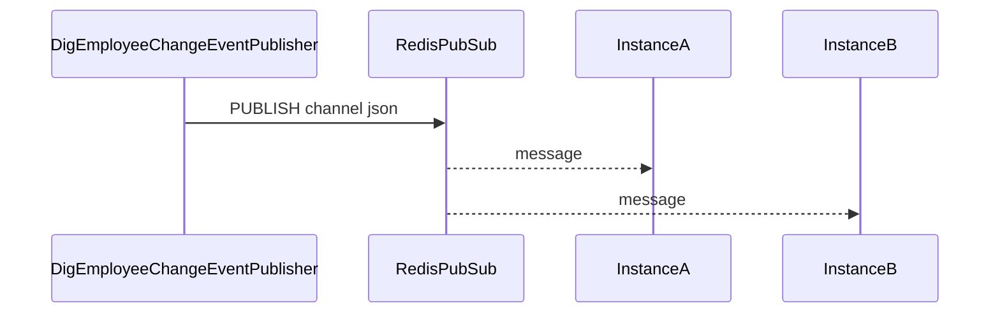

# 数字员工变更 Redis Pub/Sub 广播与消费方案

本文描述管理端在修改数字员工（`DIG_EMPLOYEE`）后如何通过 **Redis Pub/Sub**（`PUBLISH` / `SUBSCRIBE`）向**所有在线订阅方**广播变更信号，以及平台内置消费者如何按「本实例活跃用户 × Redis 用户授权 Hash」做粒度刷新。实现代码位于 `byclaw-be` 模块。

**与 Redis Stream 的差异**：Pub/Sub **不持久化**；订阅进程离线期间的消息**直接丢失**。若需要可重放日志，需在业务上另建审计（本方案不包含 Stream 双写）。

## 代码改造范围（仓库内）

以下便于评审与运维对照；路径相对于 monorepo 根目录 `byclaw-all/`。

### 新增

| 路径 | 说明 |
|------|------|
| [`DigEmployeeChangeNotifyProperties.java`](../../byclaw-be/src/main/java/com/iwhalecloud/byai/manager/application/service/digitemploy/event/DigEmployeeChangeNotifyProperties.java) | 配置绑定：`publish-enabled`、`pubsub-channel`、`auth-refresh-enabled`、`subscriber.enabled`。 |
| [`DigEmployeeChangePubSubListener.java`](../../byclaw-be/src/main/java/com/iwhalecloud/byai/state/domain/resource/digemployee/DigEmployeeChangePubSubListener.java) | 实现 `MessageListener`，解析频道消息体为 `DigEmployeeChangeEvent` 并做本地用户 + `HGET` 过滤。 |
| [`DigEmployeeChangePubSubBootstrap.java`](../../byclaw-be/src/main/java/com/iwhalecloud/byai/state/domain/resource/digemployee/DigEmployeeChangePubSubBootstrap.java) | `subscriber.enabled=true` 时向全局 `RedisMessageListenerContainer` 注册/移除 `ChannelTopic`。 |

### 修改（行为或配置与 Stream 时代不同）

| 路径 | 说明 |
|------|------|
| [`DigEmployeeChangeEventPublisher.java`](../../byclaw-be/src/main/java/com/iwhalecloud/byai/manager/application/service/digitemploy/event/DigEmployeeChangeEventPublisher.java) | 由 `XADD` Stream 改为 `StringRedisTemplate.convertAndSend`（`PUBLISH`）；消息体为整条事件 JSON。 |
| [`DigEmployeeChangeConfiguration.java`](../../byclaw-be/src/main/java/com/iwhalecloud/byai/manager/application/service/digitemploy/event/DigEmployeeChangeConfiguration.java) | `@EnableConfigurationProperties` 指向 `DigEmployeeChangeNotifyProperties`。 |
| [`DigEmployeeChangeAuthRefreshService.java`](../../byclaw-be/src/main/java/com/iwhalecloud/byai/manager/application/service/digitemploy/event/DigEmployeeChangeAuthRefreshService.java) | 注入配置类型改为 `DigEmployeeChangeNotifyProperties`（逻辑未变，仍可选异步刷授权用户 Redis）。 |
| [`DigEmployeeChangeEvent.java`](../../byclaw-be/src/main/java/com/iwhalecloud/byai/manager/application/service/digitemploy/event/DigEmployeeChangeEvent.java) | JavaDoc 与「整条消息即 JSON」语义对齐。 |
| [`DigitalEmployeeApplicationService.java`](../../byclaw-be/src/main/java/com/iwhalecloud/byai/manager/application/service/digitemploy/DigitalEmployeeApplicationService.java) | 仍调用 `DigEmployeeChangeEventPublisher`（创建/更新/注销后发布）；**不感知** Pub/Sub 与 Stream 差异。 |
| [`ToolManService.java`](../../byclaw-be/src/main/java/com/iwhalecloud/byai/state/domain/resource/service/ToolManService.java) | 数字员工软删路径仍调用 `publishNowQuietly`。 |
| [`AuthRedisSyncService.java`](../../byclaw-be/src/main/java/com/iwhalecloud/byai/manager/application/service/auth/AuthRedisSyncService.java) | `asyncSyncAuthChangedUsers` JavaDoc 交叉引用改为 Pub/Sub 频道配置说明。 |
| [`application.properties`](../../byclaw-be/config/application.properties) | `pubsub-channel`、`subscriber.enabled`；移除 `stream-key`、`stream-max-len`、`consumer.*` 等 Stream 专用项。 |
| [`DigEmployeeChangeEventPublisherTest.java`](../../byclaw-be/src/test/java/com/iwhalecloud/byai/manager/application/service/digitemploy/event/DigEmployeeChangeEventPublisherTest.java) | 断言改为 `convertAndSend`。 |
| `dig-employee-redis-change-notify.md`（本文件） | Pub/Sub 语义、第三方接入、迁移与改造范围说明。 |

### 删除（不再使用）

| 路径 | 说明 |
|------|------|
| `byclaw-be/.../DigEmployeeChangeStreamProperties.java` | 由 `DigEmployeeChangeNotifyProperties` 替代。 |
| `byclaw-be/.../DigEmployeeChangeStreamListener.java` | 由 `DigEmployeeChangePubSubListener` 替代。 |
| `byclaw-be/.../DigEmployeeChangeStreamBootstrap.java` | 由 `DigEmployeeChangePubSubBootstrap` 替代。 |
| `byclaw-be/dig-employee-redis-change-notify.md` | 与 `docs/architecture/` 重复，已删除避免双份维护。 |

### 未改动的边界

- **未改** [`RedisConfiguration.java`](../../byclaw-be/src/main/java/com/iwhalecloud/byai/state/common/redis/RedisConfiguration.java) 中已有 `RedisMessageListenerContainer` Bean；仅由 `DigEmployeeChangePubSubBootstrap` **复用**其 `addMessageListener` / `removeMessageListener`。
- **未改** 授权主链路：`AuthApplicationService#handleAuth`、`AuthRedisApplicationService` 的 Hash 结构不变。
- **未改** 数字员工技能缓存键 `RESOURCE_DIG_EMPLOYEE_{resourceId}` 的读写逻辑；Pub/Sub 仅多一层「变更已发生」的广播信号。

## Redis 配置快照键（完整 JSON）

管理端在 `synOpenClawWorkSpace` / `doSyncOpenClawWorkSpace` 将数字员工同步到开放资源目录后，可选将**同一份**标准 JSON 写入 Redis 字符串键，便于下游按文件名语义直接读取，无需访问 MinIO。

| 项 | 约定 |
|----|------|
| **Key** | `DIG_EMPLOYEE_{resourceId}`（与 `resource/dig_employee/DIG_EMPLOYEE_{resourceId}.json` 基名一致，无 `.json` 后缀） |
| **Value** | 与 MinIO 中该文件相同的 UTF-8 JSON（`DigitalEmployeeDetailsDTO` 序列化结果，含 `relTools` 等运行期字段） |
| **TTL** | 无；软删除数字员工时 `DEL` |
| **开关** | `byai.dig-employee.json-redis-sync-enabled`（默认 `true`） |
| **实现** | [`DigitalEmployeeApplicationService`](../../byclaw-be/src/main/java/com/iwhalecloud/byai/manager/application/service/digitemploy/DigitalEmployeeApplicationService.java)、键名 [`DigEmployeeRedisKeys`](../../byclaw-be/src/main/java/com/iwhalecloud/byai/manager/domain/resource/util/DigEmployeeRedisKeys.java) |

### 与技能缓存键的区别

| Key | 内容 |
|-----|------|
| `RESOURCE_DIG_EMPLOYEE_{resourceId}` | 技能列表（`querySkillsForOpenApi` 的 JSON 数组），在 save/update 主流程写入 |
| `DIG_EMPLOYEE_{resourceId}` | **完整**数字员工配置快照，在开放资源目录同步后写入 |

二者并存，互不替代。

### 下游读取示例

```bash
redis-cli GET DIG_EMPLOYEE_10000005
```

收到 Pub/Sub `DIG_EMPLOYEE_UPDATED` 后，若需要最新完整配置，可 `GET DIG_EMPLOYEE_{resourceId}`（消息体本身仍不含扩展表全量字段）。

### 数字员工关联资源（技能）

在 `doSyncOpenClawWorkSpace` 完成数字员工自身 Redis 写入后，对其关联且类型为 `TOOLKIT` / `MCP` / `AGENT` / `KG_*` / `VIEW` / `OBJECT` 的资源，将扩展表 `target_content`（与 MinIO 标准 JSON 同源）**始终**写入 Redis，键名与开放资源文件名基名一致：

| 类型示例 | Redis Key 示例 |
|----------|----------------|
| AGENT | `AGENT_1111` |
| TOOLKIT | `TOOLKIT_10000050` |
| KG_DOC | `KG_DOC_10000001` |
| MCP | `MCP_{resourceId}` |

```bash
redis-cli GET AGENT_1111
```

与 MinIO 补齐逻辑独立：MinIO 仅在产物缺失时补写；Redis 在每次数字员工同步时覆盖更新（受同一开关 `byai.dig-employee.json-redis-sync-enabled` 控制）。

### 启动时全量同步（异步）

参考 [`InitUserResourcesAuthRedisRunner`](../../byclaw-be/src/main/java/com/iwhalecloud/byai/manager/application/runner/InitUserResourcesAuthRedisRunner.java)，[`InitDigEmployeeRedisRunner`](../../byclaw-be/src/main/java/com/iwhalecloud/byai/manager/application/runner/InitDigEmployeeRedisRunner.java) 在应用启动后通过 `CompletableFuture.runAsync` 分页拉取未注销的数字员工，逐个写入 Redis（含关联的 AGENT / TOOLKIT 等），**不阻塞** Spring Boot 启动。

| 配置项 | 默认 | 说明 |
|--------|------|------|
| `INIT_DIG_EMPLOYEE_REDIS_ENABLED` | `false` | 是否启用启动全量同步 |
| `byai.dig-employee.json-redis-sync-enabled` | `true` | 为 `false` 时 Runner 直接跳过 |
| `load.to.redis.batchSize` | `1000` | 分页大小（与用户权限全量初始化共用） |

## 背景

- **授权变更**：`AuthApplicationService#handleAuth` 在授权对比落库后调用 `AuthRedisSyncService#asyncSyncAuthChangedUsers`，按用户重写 `USER:RESOURCES:AUTH:{userId}`（见 `AuthRedisApplicationService`）。
- **缺口**：管理端仅修改数字员工元数据、关联技能等时**不会**走 `handleAuth`，因此不会触发 `asyncSyncAuthChangedUsers`；原先仅有资源维度的技能缓存键 `RESOURCE_DIG_EMPLOYEE_{resourceId}`，无法驱动各容器刷新与用户相关的视图或进程内状态。

## 消息格式：整条 JSON 即事件

管理端通过 `StringRedisTemplate.convertAndSend(channel, json)` 发布，等价 Redis **`PUBLISH <channel> <message>`**。**`message` 整串为 UTF-8 JSON**，字段与 Java 类 `DigEmployeeChangeEvent` / `DigEmployeeChangeEventType` 一致（Fastjson2 序列化）；**不再**使用 Stream 时代的 Hash 字段 `payload` 嵌套。

### 事件 JSON 结构（字段级注释）

```jsonc
{
  // 必填。变更类型，取值见下表「eventType 枚举」。
  "eventType": "DIG_EMPLOYEE_UPDATED",

  // 必填。数字员工在业务库中的资源主键 resource_id，与 ss_resource.resource_id 一致。
  "resourceId": 123456789,

  // 必填。被变更资源的业务类型，当前固定为字符串 "DIG_EMPLOYEE"（与 USER:RESOURCES:AUTH Hash 的 value 对齐）。
  "resourceBizType": "DIG_EMPLOYEE",

  // 必填。事件产生时间，Unix 毫秒时间戳（long）。
  "changedAt": 1735689600000,

  // 可选。预留的版本号/etag；当前发布端多数情况下不设置，可能为 null 或缺省。
  "version": null,

  // 必填。事件来源。示例："manager-api"、"tool-man-service" 等。
  "source": "manager-api"
}
```

**最小消费逻辑**：`JSON.parse` 整条消息 → 读取 `resourceId` + `eventType` → 按需调用贵方或平台的 **OpenAPI / HTTP** 拉取最新数字员工详情（消息**不包含**完整扩展表字段）。

### `eventType` 枚举（字符串取值）

| `eventType` 值 | 含义 |
|----------------|------|
| `DIG_EMPLOYEE_CREATED` | 新建数字员工完成（主链路之后）。 |
| `DIG_EMPLOYEE_UPDATED` | 元数据或主表/扩展表/关联关系等发生更新。 |
| `DIG_EMPLOYEE_DELETED` | 软删除或工具链删除导致不可用。 |
| `DIG_EMPLOYEE_SKILLS_SYNCED` | 预留枚举值；当前主路径多以 `UPDATED` 覆盖。 |

**兼容约定**：对未知 `eventType` 应 **日志 + 忽略或降级**，避免平台新增类型时消费崩溃。

---

## 第三方服务如何接入（Pub/Sub）

适用于 **平台外**、独立部署的服务；需与平台 **同一 Redis**（或可达副本，注意主从延迟）。

### 1. 前置条件

| 项 | 说明 |
|----|------|
| **Redis** | 与 `byclaw-be` 的 `spring.redis.*` 一致。 |
| **频道名** | 默认 `byai:pub:dig_employee_change`；以运行环境 `byai.dig-employee-change.pubsub-channel` 为准。 |
| **ACL** | 最小化：`subscribe`（及连接所需命令）、**不要**授予无关写权限。发布由平台完成，第三方一般只需读订阅。 |

### 2. 广播语义

同一频道上 **每一个** `SUBSCRIBE` 连接都会收到 **同一条** `PUBLISH` 消息的副本，**无需**像 Stream 那样为「每实例一个 consumer group」做额外设计。

### 3. redis-cli 示例

```bash
# 订阅（阻塞读；Ctrl+C 结束）
redis-cli -h <host> -p <port> -a '<password>' SUBSCRIBE byai:pub:dig_employee_change
```

收到的消息类型为 multipart：第一个元素为 `"message"`，第二个为 **channel 名**，第三个为 **消息体字符串**（即上文的 JSON）。

### 4. 各语言客户端提示

| 生态 | 建议 |
|------|------|
| **Java** | Jedis：`JedisPubSub`；Spring：`RedisMessageListenerContainer` + `ChannelTopic` + `MessageListener`。 |
| **Python** | `redis-py`：`pubsub.subscribe("byai:pub:dig_employee_change")` 后 `get_message()` / 迭代 listen。 |
| **Go** | `go-redis`：`Subscribe`。 |
| **Node.js** | `ioredis`：`psubscribe` / `subscribe`。 |

### 5. 与平台权限 Hash（可选）

若需判断某用户是否仍被授权使用该 `resourceId`：

- Key：`USER:RESOURCES:AUTH:{userId}`
- Field：`{resourceId}`（字符串）
- Value：`DIG_EMPLOYEE`

纯元数据变更**不会**自动更新该 Hash；事件仍表示「应重新拉详情/刷新 UI」。是否读 Hash 由第三方决定。

### 6. 幂等与离线

- **幂等**：同一 `resourceId` 可能连续多条 `UPDATED`；可用 `changedAt` / 未来 `version` 去重。
- **离线丢消息**：Pub/Sub 无 backlog；关键状态应靠周期全量对账或业务侧持久化 cursor（本方案不提供）。

### 7. 从旧版 Redis Stream 迁移

若曾按 **Stream + entry 内 `payload` 字段** 接入：

1. 改为 **`SUBSCRIBE`（或模式订阅）** 上述频道。
2. 将原「解析 `payload` 子串」改为 **整条 `message` 即为 JSON**，字段名与结构不变。
3. 运维 ACL 从 `XREADGROUP` 等改为 **订阅** 权限。

---

## 设计要点（平台内置）

### 1. 发布端

- **`DigEmployeeChangeEventPublisher`**：`convertAndSend(pubsubChannel, eventJson)`。
- **触发点**：`DigitalEmployeeApplicationService`（创建/更新/注销）、`ToolManService`（数字员工软删）。
- **事务**：存在 Spring 事务时 `afterCommit` 再发布。
- **可选**：`byai.dig-employee-change.auth-refresh-enabled=true` 时异步 `DigEmployeeChangeAuthRefreshService` 按授权展开用户并 `asyncSyncAuthChangedUsers`（默认关）。

### 2. 内置订阅端

- **开关**：`byai.dig-employee-change.subscriber.enabled=true`。
- **`DigEmployeeChangePubSubBootstrap`**：向全局 `RedisMessageListenerContainer` 注册 `ChannelTopic`；应用关闭时 **`removeMessageListener` 仅移除本监听**，不 `stop()` 全局容器。
- **`DigEmployeeChangePubSubListener`**：解析 JSON 后，对 `DigEmployeeChangeLocalUserRegistry` 中的用户做 `HGET` 与 `asyncSyncUserAuthToRedis`（默认注册表为空则不做用户级 IO）。

### 3. 配置一览

| 配置项 | 默认 | 说明 |
|--------|------|------|
| `byai.dig-employee-change.publish-enabled` | `true` | 是否 `PUBLISH` |
| `byai.dig-employee-change.pubsub-channel` | `byai:pub:dig_employee_change` | 频道名 |
| `byai.dig-employee-change.auth-refresh-enabled` | `false` | 发布后是否按授权表批量刷用户权限 Redis |
| `byai.dig-employee-change.subscriber.enabled` | `false` | 本进程是否注册内置订阅 |

## 监控建议

- 发布失败日志：`Failed to publish dig employee change event`。
- 打开 `auth-refresh-enabled` 时：关注异步刷新耗时与线程池。
- 第三方：连接数、重连率、解析失败率（非法 JSON）。

## 流程示意



## 相关类

| 类 | 职责 |
|----|------|
| `DigEmployeeChangeEventPublisher` | `PUBLISH`（`convertAndSend`） |
| `DigEmployeeChangeNotifyProperties` | 配置绑定 |
| `DigEmployeeChangeAuthRefreshService` | 可选按授权展开用户并刷新 Redis |
| `DigEmployeeChangePubSubBootstrap` | 条件装配下注册订阅 |
| `DigEmployeeChangePubSubListener` | 解析消息并按注册表过滤刷新 |
| `DigEmployeeChangeLocalUserRegistry` | 本实例活跃用户 SPI |
