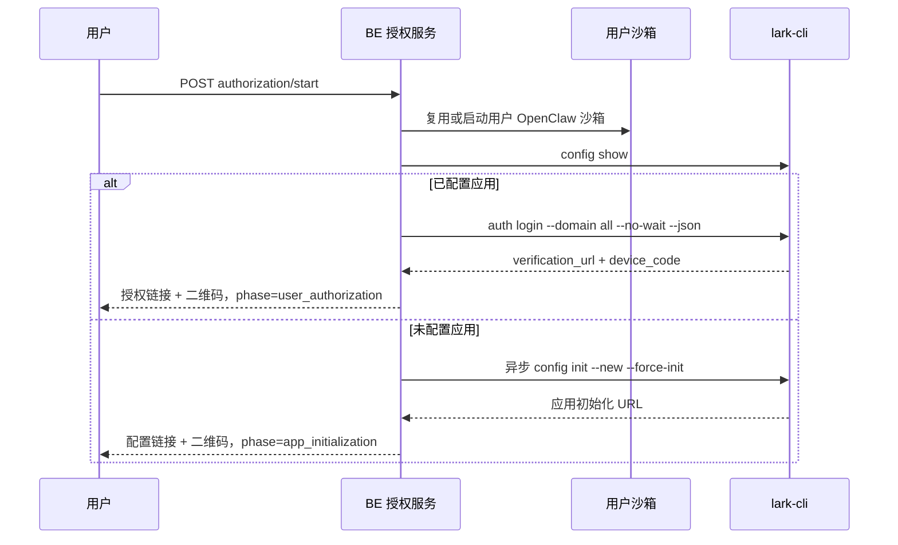

# 飞书完整授权流程迁移至用户沙箱设计

## 1. 文档信息

- 状态：已实现，本文同步记录现行契约与验收结论
- 更新日期：2026-08-12
- 适用版本：D0.3.1 及后续版本
- 适用连接器：飞书 Lark CLI（`connectorCode=lark`、`providerCode=lark-cli`）
- 关联设计：
  - [连接器统一授权架构设计](./connector-authorization-architecture.md)
  - [连接器 Runtime Manifest 对接设计](./connector-runtime-manifest-integration-design.md)
  - [连接器 Skill 授权状态回写设计](./connector-skill-authorization-sync-design.md)

## 2. 背景

早期 `LarkCliAuthorizationProvider` 在 BE 进程所在主机执行 `lark-cli`，通过
`ConnectorCredentialWorkspaceService` 将 `HOME` 指向用户独立目录：

```text
{file-storage-root}/byclaw-{userCode}/by/.connector-auth/.lark-cli
```

OpenClaw 用户沙箱将同一用户卷挂载为 `/by`，沙箱内对应路径为：

```text
/by/.connector-auth/.lark-cli
```

因此 BE 与用户沙箱能够访问同一份持久化凭据，但早期授权命令的执行位置、进程生命周期和运行时依赖仍
属于 BE，存在以下约束：

- BE 镜像必须安装与沙箱一致的 `lark-cli`；
- `config init` 和 `auth login --device-code` 的进程句柄保存在 BE 内存中；
- BE 重启或请求被其他实例处理时，无法继续管理原授权进程；
- 授权命令与实际使用飞书能力的 OpenClaw 运行环境不完全一致；
- Runtime Manifest 仍声明 `authorizeIn=be-auth-job`、`owner=be-auth-job`。

现行实现已经将飞书应用初始化、用户授权、授权完成、状态验证和取消全部迁移到当前用户的 OpenClaw
沙箱。`LarkCliAuthorizationProvider` 根据 `LarkAuthorizationProperties.isSandboxExecutor()` 固定路由
`LarkSandboxAuthorizationRuntime`；BE 只负责身份校验、沙箱编排、状态机、结果解析和授权绑定，不提供
运行时本地降级。

## 3. 目标与非目标

### 3.1 目标

- 飞书授权涉及的全部 `lark-cli` 命令只在当前用户沙箱执行；
- 启动授权前自动复用或启动用户 OpenClaw 沙箱，并等待其进入可执行状态；
- 同一次授权优先固定使用同一个 `sandboxId` 和同一份 `/by/.connector-auth/.lark-cli`；
- 通过 OpenSandbox 原生命令执行 API 管理同步命令、异步进程、输出读取、状态查询和终止；
- 远程进程标识写入 Redis 授权会话，不再依赖 BE 内存中的 `Process`；
- 保持现有前端 start/status/cancel 接口和两阶段授权体验兼容；
- 授权完成后复用现有连接状态事务，更新授权记录、Runtime Manifest 参数和 Redis；
- 多实例 BE 可以查询和推进同一授权任务；
- 严格限制可执行命令、参数、环境变量、输出大小和并发数。

### 3.2 非目标

- 本阶段不迁移钉钉 DWS 和企业微信 WeCom CLI 的授权执行位置；
- 不允许前端或 Runtime Manifest 提交任意沙箱命令；
- 不通过 OpenClaw Agent、模型会话或 Agent `exec` 工具发起授权；
- 不把真实 access token、refresh token、App Secret 或 CLI 配置写入数据库；
- 不改变飞书 Device Flow 协议，也不新增 OAuth 回调接口；
- 不把二维码图片作为长期数据保存；
- 不在沙箱执行失败时静默回退到 BE 本地执行。

## 4. 核心决策

### 4.1 使用 OpenSandbox 原生命令执行 API

BE 通过 OpenSandbox 的进程执行能力直接在目标沙箱内启动命令。该通道不依赖 OpenClaw Agent 是否存在活跃
会话，也不依赖模型、Skill 或工具权限，适合作为授权基础设施。

BE 内部增加稳定的执行抽象，屏蔽不同 OpenSandbox 部署版本的 HTTP/SDK 细节。业务 Provider 不直接拼接
OpenSandbox URL，也不处理其原始响应。

### 4.2 完整生命周期固定在沙箱

以下命令全部在用户沙箱执行：

```text
lark-cli config show
lark-cli config init --new --force-init
lark-cli config bind --source openclaw --identity user-default --force
lark-cli auth login --domain all --no-wait --json
lark-cli auth login --device-code <deviceCode> --json
lark-cli auth status --json --verify
lark-cli auth logout --json
```

所有命令使用参数数组，不经过 Shell；每个子进程显式设置：

```text
HOME=/by/.connector-auth/.lark-cli
LARK_HOME=/by/.connector-auth/.lark-cli
```

不得读取或修改 OpenClaw 进程的全局 `HOME`。

### 4.3 二维码由 BE 根据授权 URL 即时生成

`lark-cli auth login --no-wait --json` 在沙箱返回 `verification_url` 和 `device_code`。授权 URL 是 Device
Flow 的权威入口；二维码只是该 URL 的展示编码，不参与 CLI 状态机。

BE 使用本地二维码库将已校验的 HTTPS URL 编码为 PNG data URI，填充现有 `qrCodeUrl` 字段。这样无需在
沙箱创建临时图片、下载文件或开放额外文件读取接口。二维码不写 Redis、数据库或日志；状态查询需要重新
展示时，由解密后的授权 URL 即时生成。

### 4.4 不提供运行时本地降级

配置可以在发布阶段选择旧的 `be` 执行器或新的 `sandbox` 执行器，以支持灰度发布；一旦某个请求选择
`sandbox`，执行失败必须返回稳定错误，不能自动改用 BE 本地 CLI。否则同一任务会跨执行环境，破坏进程归属
和问题定位。

## 5. 总体架构

```mermaid
flowchart TD
    FE[连接器授权弹窗] --> API[ConnectorController]
    API --> AUTH[ConnectorAuthorizationService]
    AUTH --> LARK[LarkCliAuthorizationProvider]
    LARK --> RUNTIME[LarkSandboxAuthorizationRuntime]
    RUNTIME --> RESOLVER[UserSandboxResolver]
    RESOLVER --> LIFE[SandboxLifecycleFacade]
    RUNTIME --> POLICY[LarkSandboxCommandPolicy]
    POLICY --> EXEC[SandboxCommandExecutor]
    EXEC --> OPEN[OpenSandbox 原生命令执行 API]
    OPEN --> BOX[用户 OpenClaw 沙箱]
    BOX --> CLI[lark-cli]
    CLI --> HOME[/by/.connector-auth/.lark-cli]
    AUTH <--> SESSION[Redis 授权会话]
    AUTH --> STATE[ConnectorConnectionStateService]
    STATE --> DB[(授权绑定与用户参数)]
    STATE --> CACHE[(Redis 用户参数)]
```

职责边界：

1. `ConnectorAuthorizationService` 继续拥有授权会话、CAS 状态迁移和最终授权绑定；
2. `LarkCliAuthorizationProvider` 继续封装飞书协议、输出解析和错误映射；
3. `LarkSandboxAuthorizationRuntime` 负责将飞书授权动作映射为受限沙箱进程；
4. `UserSandboxResolver` 只负责解析、启动、等待和续期当前用户沙箱；
5. `SandboxCommandExecutor` 只负责远程进程通信，不理解飞书业务；
6. `LarkSandboxCommandPolicy` 是命令与环境白名单的唯一入口；
7. OpenClaw Agent 和 Skill 不参与页面授权流程。

## 6. 组件设计

### 6.1 `SandboxCommandExecutor`

在 gateway sandbox 模块增加内部接口：

```java
public interface SandboxCommandExecutor {
    SandboxCommandResult run(String sandboxId, SandboxCommandRequest request);
    SandboxProcessHandle start(String sandboxId, SandboxCommandRequest request);
    SandboxProcessSnapshot inspect(String sandboxId, String processId);
    SandboxProcessSnapshot readOutput(String sandboxId, String processId, long cursor);
    void terminate(String sandboxId, String processId);
}
```

逻辑模型：

```text
SandboxCommandRequest
  argv                 参数数组
  environment          受控环境变量
  workingDirectory     固定或空
  timeout              服务端硬超时
  maxOutputBytes       stdout + stderr 上限

SandboxCommandResult
  exitCode
  stdout
  stderr
  truncated
  timedOut

SandboxProcessHandle
  sandboxId
  processId
  startedAt

SandboxProcessSnapshot
  state                RUNNING | EXITED | FAILED | TERMINATED | NOT_FOUND
  exitCode
  output
  nextCursor
  truncated
```

`OpenSandboxCommandExecutor` 负责对接 OpenSandbox 原生 API。认证 Key、基础地址和协议差异沿用
`SandboxProperties.OpenSandboxConfig`，不得由 Provider 或用户请求传入。客户端设置连接、读取和总超时，
对只读的查询请求允许有限重试，对启动命令不做无幂等键的自动重试。

### 6.2 `UserSandboxResolver`

输入当前用户 ID，完成：

1. 通过现有登录服务解析可信 `userCode`；
2. 使用 `serviceKey=openclaw` 查询当前用户可复用沙箱；
3. 没有可复用沙箱时调用现有沙箱启动流程；
4. 等待沙箱进入 Running，并验证原生命令执行能力可用；
5. 返回 `sandboxId`、运行代次标识和失效时间；
6. 将沙箱至少续期到授权会话过期时间之后 60 秒。

解析过程必须复用现有用户级沙箱唯一性和并发创建控制，不能由连接器模块自行创建第二套沙箱记录。

### 6.3 `LarkSandboxCommandPolicy`

Policy 接收结构化动作，不接收任意 argv：

```text
SHOW_CONFIG
INITIALIZE_APP
START_USER_AUTHORIZATION
COMPLETE_USER_AUTHORIZATION
VERIFY_AUTHORIZATION
```

每个动作由 `runtime_manifest.runtime.commands` 中的二维命令组按 `action + index` 选取，再由 Policy
校验可执行文件、子命令、参数形态、环境、超时和输出上限。仅 `COMPLETE_USER_AUTHORIZATION` 接受
Provider 从加密会话中解出的 `deviceCode`；首批页面授权由 Manifest 固定使用 `--domain all`，不接受前端
或普通 `auth_config` 覆盖。

Policy 必须拒绝：

- Shell 字符串、重定向、管道和命令替换；
- 非 `lark-cli config`、`lark-cli auth` 子命令；
- 用户传入的工作目录、HOME、可执行文件路径或附加环境变量；
- 包含控制字符、空值或超长值的 `deviceCode`、domain 和 scope；
- 未配置输出上限或硬超时的执行请求。

### 6.4 `LarkSandboxAuthorizationRuntime`

Runtime 对 Provider 暴露统一授权语义入口：

```java
start(AuthorizationStartContext)
queryStatus(AuthorizationSessionContext)
verify(userId, commandCatalog)
revoke(userId, commandCatalog)
cancel(AuthorizationSessionContext)
```

Runtime 内部再将这些入口拆成配置检查、应用初始化、Device Flow 发起/完成、状态验证和注销动作。Provider
生产路径不依赖 `ConnectorCliRunner` 或 BE 本地 `ManagedProcess`。所有输出先经过大小、退出码和 JSON/URL
协议校验，再转换为现有 `AuthorizationStartResult`、`AuthorizationStatusResult` 和
`AuthorizationProgress`。

## 7. 授权会话模型

沿用现有 Redis 授权会话，并将沙箱运行信息放入加密的 `providerState`：

```json
{
  "schemaVersion": 1,
  "phase": "user_authorization",
  "sandboxId": "sandbox-id",
  "sandboxGeneration": "runtime-generation",
  "process": {
    "purpose": "complete_user_authorization",
    "processId": "remote-process-id",
    "outputCursor": 0,
    "startedAt": "2026-08-04T12:00:00Z"
  },
  "deviceCode": "encrypted-with-provider-state",
  "recoveryAttempted": false
}
```

应用初始化阶段不包含 `deviceCode`，`phase=app_initialization`，进程用途为 `initialize_app`。

安全规则：

- 整个 `providerState` 继续使用现有服务端密钥加密；
- `deviceCode` 不得写入 `providerSessionId`、错误信息、指标标签或日志；
- Redis 终态转换后立即删除授权 URL、`providerState` 和远程进程信息；
- `sandboxId` 只能由可信 Resolver 返回，不能从前端请求取得；
- 状态推进继续使用 Redis CAS，防止多个 BE 实例重复启动远程进程。

`ownerInstanceId` 不再表示 BE 进程所有者。迁移后可置空，远程进程归属由加密状态中的
`sandboxId + processId` 表达。

## 8. 授权流程

### 8.1 启动授权



具体规则：

1. `ConnectorAuthorizationService` 先创建系统 `authorizationId`；
2. Provider 获取用户沙箱并记录 `sandboxId`；
3. `config show` 退出码为 0 时直接进入用户授权；
4. 只有输出明确表示“未配置”时才启动应用初始化，其他错误直接失败；
5. 应用初始化使用异步远程进程，并在限定时间内增量读取输出，提取可信
   `https://open.feishu.cn/...` URL；
6. 用户授权使用同步短命令，解析 JSON 中的 `verification_url`、`device_code` 和设备码等待时间；
7. BE 校验 URL 协议和主机后即时生成二维码；
8. URL 和 Provider 状态加密写入 Redis，前端接口保持不变。

#### 8.1.1 授权链接的生成、获取与返回

授权链接不是由用户沙箱主动回调前端，也不是由 OpenClaw Agent 或 Skill 转发。链路由 BE 通过
OpenSandbox 原生命令执行 API 主动拉取沙箱进程输出，再复用现有授权接口返回给前端：

```text
前端
  → POST authorization/start 或轮询 authorization/status
BE 授权编排
  → OpenSandbox 原生命令执行 API
用户 OpenClaw 沙箱
  → lark-cli 生成授权链接并写入 stdout
BE 读取、校验并解析 stdout
  → 生成 qrCodeUrl，并返回授权 DTO
前端展示授权 URL 和二维码
```

BE 与沙箱之间不存在新的 OAuth 回调接口。沙箱只负责在固定凭据目录中运行 `lark-cli`，BE 负责远程
命令生命周期、输出读取、协议解析和前端结果转换。

**已有应用配置：同步获取用户授权链接**

当 `config show` 确认应用已经配置时，BE 在同一个用户沙箱中执行：

```text
lark-cli auth login --domain all --no-wait --json
```

该命令通过 `SandboxCommandExecutor.run()` 同步执行，命令请求显式携带：

```text
HOME=/by/.connector-auth/.lark-cli
LARK_HOME=/by/.connector-auth/.lark-cli
```

沙箱中的 `lark-cli` 将 JSON 写入 stdout，至少包含：

```json
{
  "verification_url": "https://accounts.feishu.cn/oauth/v1/device/verify?flow_id=...&user_code=...",
  "device_code": "...",
  "expires_in": 600
}
```

`OpenSandboxCommandExecutor` 将退出码、stdout、stderr、超时和输出截断信息返回 BE。Provider 只在以下
条件全部满足时接受结果：

1. 远程命令在当前授权会话绑定的 `sandboxId` 中执行；
2. 进程正常退出且未超时、未超出输出上限；
3. stdout 符合预期 JSON 协议；
4. `verification_url` 是通过主机白名单校验的 HTTPS 飞书授权地址。白名单按精确主机匹配，包含应用初始化域
   `open.feishu.cn`、`open.larksuite.com` 和设备码验证域 `accounts.feishu.cn`、`accounts.larksuite.com`；
5. `device_code` 和有效期通过长度、字符和范围校验。

校验通过后，BE 使用本地二维码库将 `verification_url` 编码为 PNG data URI，并将授权 URL、二维码、阶段
和过期时间组装成现有 `AuthorizationStartResult`，通过 `authorization/start` 响应返回前端。二维码只是
授权 URL 的展示编码，不参与 CLI 状态机，也不在沙箱内创建临时图片。

`device_code` 不进入响应日志、指标标签或数据库；它只写入加密的 Redis `providerState`，供后续 status
请求在服务端解密后启动完成授权进程。这里的 `expires_in` 只表示 Device Flow 完成窗口，不是授权成功后
`user_access_token` 的有效期，也不能写入 `byai_connector_auth.expire_time`。

**未配置应用：异步获取应用初始化链接**

当 `config show` 的结果明确表示应用未配置时，BE 不在 HTTP 请求线程中等待初始化完成，而是在同一个用户
沙箱中通过 `SandboxCommandExecutor.start()` 启动：

```text
lark-cli config init --new --force-init
```

BE 将远程进程的 `sandboxId`、`processId`、用途、启动时间和输出游标写入加密的 Redis `providerState`。
启动请求成功后，BE 可以通过首次输出或后续 `authorization/status` 返回 `pending`。

初始化链接的获取过程如下：

1. BE 调用 `readOutput(sandboxId, processId, cursor)` 增量读取远程 stdout/stderr；
2. 使用上次返回的 `nextCursor` 更新 Redis 中的输出游标，避免重复读取和重复解析；
3. 在限定输出大小和硬超时内，从输出中提取唯一、可信的
   `https://open.feishu.cn/...` 应用初始化 URL；
4. 校验通过后，由 BE 即时生成二维码，并在 `authorization/status` 响应中返回配置链接、二维码和
   `phase=app_initialization`；
5. 如果进程仍在运行但尚未产生完整链接，status 返回 `pending`，前端继续使用现有轮询机制；
6. 如果进程退出，BE 根据退出码、输出是否截断以及 URL 协议校验结果决定成功或失败，不把任意日志文本
   当作授权链接。

应用初始化完成后，status 请求再次在原沙箱执行 `lark-cli config show`。确认配置有效后，BE 才启动
`auth login --domain all --no-wait --json`，并将会话从 `app_initialization` 通过 Redis CAS 切换为
`user_authorization`。新的用户授权 URL 和二维码仍通过同一套同步 JSON 解析流程返回前端。

**前端如何拿到链接**

前端不直接访问 OpenSandbox，也不读取 Redis 或用户沙箱文件。它只调用现有的授权接口：

- `authorization/start`：返回同步生成的用户授权链接，或返回应用初始化阶段的当前结果；
- `authorization/status`：在异步初始化或 Device Flow 授权期间，读取并返回最新阶段、授权 URL、二维码、
  过期时间和稳定错误码；
- “我已完成授权，立即检查”：仍调用同一个 status 接口，不新增回调接口。

因此，完整的通知关系是：沙箱通过 stdout 向 BE 提供结果，BE 通过现有 HTTP 响应向前端提供结果；沙箱
不会直接向用户浏览器发送消息。

### 8.2 应用初始化推进

当前阶段为 `app_initialization` 时，status 请求执行：

1. 检查授权会话和沙箱是否仍有效；
2. 查询初始化远程进程；
3. 进程仍运行时返回 `pending`；
4. 进程失败、输出截断或超时时终止进程并返回稳定失败；
5. 进程退出后再次执行 `config show`；
6. 配置仍不存在时保持 `pending`，直到会话过期；
7. 配置有效时执行 `auth login --domain all --no-wait --json`；
8. 通过 CAS 将会话切换到 `user_authorization`，替换授权 URL、二维码来源和加密 Provider 状态。

多个并发 status 请求只有 CAS 获胜者能够启动下一阶段。CAS 失败者重新读取最新会话，不重复执行登录命令。

### 8.3 用户授权完成与验证

当前阶段为 `user_authorization` 时：

1. 先在原沙箱执行 `auth status --json --verify`；
2. 若已有效，直接返回 `CONNECTED`，避免重复消费 `deviceCode`；
3. 若未授权且尚未创建完成进程，通过 CAS 取得启动权；
4. 在原沙箱异步执行 `auth login --device-code <deviceCode> --json`；
5. 后续 status 请求查询远程进程，不在 HTTP 请求线程长时间阻塞；
6. 进程成功退出后再次执行 `auth status --json --verify`；
7. 只有退出码、JSON 协议、`identity=user` 和 verify 结果都明确有效时，Provider 才返回 `CONNECTED`；
8. 从 `identities.user` 读取账号信息和 `expiresAt`，映射为 `credentialExpiresAt`；
9. 编排服务将会话切换为 `FINALIZING`，复用 `ConnectorConnectionStateService` 原子写入授权绑定、
   `expire_time` 和环境参数；
10. 授权绑定数据库事务提交后，将会话切换为 `CONNECTED` 并删除临时秘密；用户参数缓存刷新沿用现有
   after-commit 机制，刷新失败进入现有缓存自愈流程，不能把已经提交的有效授权回退为失败。

前端自动轮询与“我已完成授权，立即检查”都调用同一 status 接口。重复请求必须幂等，不能启动多个
`--device-code` 进程。

#### 8.3.1 状态输出与凭证有效期

当前 `lark-cli auth status --json --verify` 的关键结构如下：

```json
{
  "identity": "user",
  "verified": true,
  "identities": {
    "user": {
      "tokenStatus": "valid",
      "expiresAt": "2026-08-10T23:58:47+08:00",
      "refreshExpiresAt": "2026-08-17T21:58:47+08:00",
      "grantedAt": "2026-08-10T21:58:47+08:00"
    }
  }
}
```

解析规则：

1. `identity=user && verified=true` 才代表用户身份授权有效；bot ready 不能替代用户授权；
2. 优先读取 `identities.user.expiresAt`，兼容旧版 `data.expiresAt/data.expires_at` 和顶层字段；
3. 接受 ISO 8601、Unix 秒和 Unix 毫秒，非法或缺失值按未知处理，不影响已经验证成功的连接状态；
4. `expiresAt` 写入 `AuthorizationStatusResult.credentialExpiresAt`，最终持久化到
   `byai_connector_auth.expire_time`，连接器列表据此展示“授权有效期至”；
5. `refreshExpiresAt` 当前不进入统一授权表；不得用它替换 access token 到期时间；
6. BE 本地兼容路径与用户沙箱生产路径必须使用同一字段优先级和时间语义，防止执行位置切换后数据表现不同。

### 8.4 取消

取消请求在 Redis 中先通过 CAS 将 `PENDING` 改为 `CANCELLED`，再按加密状态中的 `sandboxId + processId`
尽力终止远程进程，最后删除授权 URL 和 Provider 状态。远程终止失败不能把已取消会话恢复为 pending，但
必须记录脱敏告警并由进程硬超时兜底。

### 8.5 过期

授权会话过期时：

- 不再启动任何新远程命令；
- 尽力终止仍在运行的初始化或完成进程；
- 清理临时秘密；
- 返回 `EXPIRED`；
- 不删除已经写入用户卷的有效 CLI 凭据；若最终 verify 已成功，必须在判定过期前优先完成一次只读验证，
  避免授权已成功但回写稍晚造成假失败。

## 9. 沙箱异常与恢复

### 9.1 同一沙箱进程丢失

如果沙箱仍为同一运行代次，但远程进程返回 `NOT_FOUND`：

1. 先执行 `auth status --json --verify`；
2. 已有效则正常完成绑定；
3. 未有效且会话未过期时，允许通过 CAS 最多重启一次对应进程；
4. 再次丢失时返回 `LARK_SANDBOX_PROCESS_LOST`。

### 9.2 沙箱停止或被替换

Resolver 发现 `sandboxId` 不存在、非 Running 或运行代次变化时：

1. 若用户卷仍可由新的用户沙箱挂载，启动或取得新沙箱；
2. 只执行一次 `auth status --json --verify`；
3. 已有效则完成授权绑定；
4. 未有效则返回 `LARK_SANDBOX_CONTEXT_LOST`，要求用户重新发起授权；
5. 不在新沙箱继续使用旧 `deviceCode`，避免跨运行时重复消费临时凭据。

授权期间通过续期降低沙箱自然过期概率，但不承诺跨沙箱继续未完成的 Device Flow。

### 9.3 BE 重启或多实例切换

远程 `processId` 已保存在 Redis，不依赖 BE 内存。任意 BE 实例都可以读取会话、查询原沙箱进程并继续
状态机。所有“创建下一进程”动作必须先使用 Redis CAS 取得所有权，因此不再要求连接器授权接口固定为
单副本。

## 10. 错误模型

新增或明确以下脱敏错误码：

| errorCode | 场景 | 建议用户动作 |
| --- | --- | --- |
| `LARK_SANDBOX_UNAVAILABLE` | 用户沙箱启动、等待或续期失败 | 稍后重试 |
| `LARK_SANDBOX_EXEC_UNAVAILABLE` | OpenSandbox 不支持或拒绝命令执行 | 联系管理员 |
| `LARK_SANDBOX_PROCESS_LOST` | 同一沙箱远程进程重复丢失 | 重新授权 |
| `LARK_SANDBOX_CONTEXT_LOST` | 授权期间沙箱被替换且凭据未生效 | 重新授权 |
| `LARK_SANDBOX_COMMAND_TIMEOUT` | 命令超过硬超时 | 重试或重新授权 |
| `LARK_SANDBOX_OUTPUT_LIMIT` | 输出超过上限 | 联系管理员 |
| `APP_CONFIG_CHECK_FAILED` | `config show` 无法确认状态 | 重新授权或联系管理员 |
| `APP_INIT_FAILED` | 应用初始化失败 | 重新初始化 |
| `PROVIDER_PROTOCOL_ERROR` | CLI 输出不符合协议 | 检查 CLI 版本 |
| `PROVIDER_AUTH_FAILED` | Device Flow 完成或 verify 失败 | 重新授权 |

错误响应不得包含：原始 stdout/stderr、完整设备码、Token、App Secret、用户卷宿主机路径、OpenSandbox
认证信息和异常堆栈。

## 11. 超时、输出与并发

建议默认值：

| 动作 | 执行方式 | 硬超时 | 最大输出 |
| --- | --- | ---: | ---: |
| `config show` | 同步 | 30 秒 | 256 KiB |
| `config init` | 异步 | 10 分钟 | 512 KiB |
| `auth login --no-wait` | 同步 | 30 秒 | 256 KiB |
| `auth login --device-code` | 异步 | 授权剩余有效期，最多 10 分钟 | 512 KiB |
| `auth status --verify` | 同步 | 30 秒 | 256 KiB |

并发限制：

- 同一 `authorizationId` 最多一个活跃远程进程；
- 同一用户同一连接器最多一个活跃授权会话，沿用现有 Redis 用户索引；
- 同一用户沙箱的飞书授权命令使用独占锁，防止多个任务同时修改同一 CLI HOME；
- 全局远程授权命令使用可配置并发上限，避免沙箱平台故障时放大请求；
- status 轮询只查询远程状态，不持有数据库事务。

## 12. 安全设计

### 12.1 身份与沙箱归属

- Controller 只使用当前登录用户，不接受请求体中的 `userId`、`userCode` 或 `sandboxId`；
- Resolver 必须验证沙箱 metadata 中的 `userCode` 和 `serviceKey=openclaw`；
- Provider 状态中的 `sandboxId` 每次使用前都要重新校验归属；
- 禁止对其他用户、其他 serviceKey 或任意外部 sandboxId 执行命令。

### 12.2 命令安全

- 只使用参数数组调用 OpenSandbox API；
- 可执行文件固定为镜像中的 `lark-cli`，不接受用户路径；
- 不启用 Shell，不允许管道、重定向、变量展开和命令替换；
- 环境变量只允许 `HOME`、`LARK_HOME` 及必要的固定 locale；
- 工作目录固定为安全目录，不使用用户输入；
- Runtime Manifest 提供 argv 模板，但必须先经过 `ConnectorManifestCommandResolver` 和
  `LarkSandboxCommandPolicy` 校验；未经策略校验的 Manifest 内容不能直接成为远程 argv。

### 12.3 秘密与日志

- `deviceCode` 只存在于沙箱进程参数和加密 Provider 状态；
- 命令日志记录动作名，不记录完整 argv；
- 输出日志默认只记录字节数、退出码、耗时和协议错误分类；
- 授权 URL、二维码 data URI、Token、账号原始信息不进入日志和指标标签；
- OpenSandbox API Key 继续由 BE 配置管理，不注入用户沙箱。

## 13. Runtime Manifest 调整

飞书 Manifest 的执行归属调整为：

```json
{
  "runtime": {
    "type": "cli",
    "authorizeIn": "user-sandbox"
  },
  "authStorage": {
    "owner": "user-sandbox-auth-job",
    "runtimeMutation": "sandbox-native",
    "mode": "native-home",
    "nativePath": "/by/.connector-auth/.lark-cli",
    "environment": {
      "LARK_HOME": "/by/.connector-auth/.lark-cli"
    }
  }
}
```

`runtime.commands` 使用二维数组，至少包含：

```json
{
  "configCheck": [["lark-cli", "config", "show"]],
  "configInitialize": [["lark-cli", "config", "init", "--new", "--force-init"]],
  "contextBind": [["lark-cli", "config", "bind", "--source", "openclaw", "--identity", "user-default", "--force"]],
  "login": [
    ["lark-cli", "auth", "login", "--domain", "all", "--no-wait", "--json"],
    ["lark-cli", "auth", "login", "--device-code", "${deviceCode}", "--json"]
  ],
  "status": [["lark-cli", "auth", "status", "--json", "--verify"]],
  "logout": [["lark-cli", "auth", "logout", "--json"]]
}
```

Manifest 仍不保存设备码、App Secret、Token、账号信息、有效期或 sandboxId。`${deviceCode}` 只在执行
`login[1]` 前由加密 `providerState` 填充。

`ConnectorManifestCanonicalizer` 需要接受并校验新的枚举值；钉钉和企微 Manifest 保持
`authorizeIn=be-auth-job`，确保本次变更只作用于飞书。

## 14. 配置与发布

现行可配置项：

```yaml
byclaw:
  connector:
    lark:
      max-output-bytes: 524288
      max-concurrency: 32
```

执行器和沙箱服务固定为 `sandbox` / `openclaw`，命令短超时与初始化超时由现行 Runtime 常量和授权会话
约束管理，不开放请求级切换。配置对象的 `isSandboxExecutor()` 恒为 `true`，避免一次授权中途跨执行环境。

发布策略：

1. 先部署支持 OpenSandbox 命令执行的基础设施和 BE 客户端；
2. 验证现有 OpenClaw 镜像包含目标版本 `lark-cli`；
3. 更新飞书 Runtime Manifest 并确认 `authorizeIn=user-sandbox`；
4. 部署 BE，确认镜像内 `git.properties` 的 commit 与目标 `develop` 一致；
5. 在测试环境完成全链路验收，不对单次请求动态降级；
6. 重新授权后检查 `byai_connector_auth.expire_time` 已写入 `identities.user.expiresAt`；
7. 钉钉和企微继续使用原执行器，不受影响。

## 15. 授权成功后的运行时可见性

飞书授权成功后，`ConnectorConnectionStateService` 继续完成：

1. 写入或更新 `byai_connector_auth`；
2. 将 `LARK_HOME=/by/.connector-auth/.lark-cli` 物化为连接器托管用户参数；
3. 事务提交后刷新用户参数 Redis；
4. 后续 OpenClaw Skill 执行时，由现有动态 exec 环境注入读取最新 `LARK_HOME`。

授权命令本身不依赖动态参数注入，而是由 Policy 显式设置固定 HOME。因此首次授权可以在连接器尚未绑定时
执行。若部署环境仍采用“仅沙箱启动时注入个人参数”的旧机制，则必须在授权绑定提交后重建用户沙箱；采用
动态 exec 环境注入后不应重启正在使用的沙箱。

## 16. 可观测性

建议指标：

```text
connector_lark_sandbox_auth_started_total
connector_lark_sandbox_auth_completed_total
connector_lark_sandbox_auth_failed_total{reason}
connector_lark_sandbox_command_duration_seconds{action,result}
connector_lark_sandbox_process_lost_total{purpose}
connector_lark_sandbox_wakeup_duration_seconds{result}
connector_lark_sandbox_active_processes
```

结构化日志仅包含：`authorizationId` 的不可逆摘要、用户 ID 摘要、connectorCode、动作名、sandboxId 摘要、
processId 摘要、状态、耗时和稳定错误码。不得记录用户输入、原始 CLI 输出或秘密。

## 17. 测试方案

### 17.1 单元测试

- `LarkSandboxCommandPolicy` 为每个动作生成准确 argv 和固定环境；
- Policy 拒绝非法 deviceCode、domain、scope、环境变量和命令注入；
- Provider 正确解析 URL、deviceCode、有效期、账号摘要和错误 JSON；
- `login[0].expires_in` 只用于授权会话，`identities.user.expiresAt` 才映射为凭证到期时间；
- 二维码只接受通过白名单校验的 HTTPS URL；
- 远程输出截断、超时、非法 JSON 和非零退出码映射为稳定错误；
- Provider 状态序列化、加密、解密和版本迁移正确；
- 同一授权任务并发 status 只有一个请求启动远程完成进程；
- cancel、expire 和 terminal 状态均删除临时秘密。

### 17.2 沙箱客户端契约测试

- 同步命令执行和退出码读取；
- 异步启动、增量输出 cursor、状态查询和终止；
- OpenSandbox 401、403、404、409、429、5xx 和网络超时映射正确；
- 启动请求使用幂等键或由上层 CAS 保证不重复；
- 输出上限和硬超时由服务端及客户端双重限制；
- 不把 API Key、环境变量和 argv 写入日志。

### 17.3 Provider 集成测试

- 已配置应用时直接返回用户授权链接和二维码；
- 未配置应用时先返回初始化链接，完成后切换到用户授权链接；
- 用户授权完成后远程 verify 成功并写入连接器绑定；
- verify 输出包含 `identities.user.expiresAt` 时，授权绑定写入相同瞬间的 `expire_time`；
- `auth login --device-code` 仍运行时持续返回 pending；
- 应用初始化和用户授权取消时终止正确的远程进程；
- BE 重启或切换实例后能使用 Redis 中的 processId 继续查询；
- 沙箱进程丢失时只恢复一次；
- 沙箱被替换时 verify 成功可收敛，verify 失败要求重新授权；
- 授权失败时数据库、用户参数和 Redis 运行参数不发生部分写入。

### 17.4 端到端验收

1. 用户没有运行中沙箱，点击连接飞书后自动启动沙箱并展示真实链接和二维码；
2. 用户完成应用初始化后，弹窗自动切换为用户授权阶段；
3. 用户授权后状态变为 connected，飞书 Skill 可立即读取同一 HOME；
4. 连接器列表展示 `auth status` 返回的用户 access token 到期时间；
5. 授权期间重启一个 BE 实例，状态查询仍能继续；
6. 取消授权后沙箱中无活跃授权进程；
7. 两个用户同时授权时，凭据目录、sandboxId 和状态完全隔离；
8. 钉钉和企微授权行为不发生变化；
9. 日志、Redis 明文视图和数据库中不存在 token、App Secret 或 deviceCode 明文。

## 18. 预计代码影响范围

主要新增或调整：

```text
gateway/sandbox/client/                 OpenSandbox 命令执行请求、响应与客户端方法
gateway/sandbox/service/                SandboxCommandExecutor、用户沙箱解析和续期
manager/domain/connector/provider/lark/ LarkSandboxAuthorizationRuntime、Provider 重构
manager/domain/connector/authorization/ Provider 状态与远程进程模型
manager/domain/connector/manifest/      新执行归属枚举校验
deploy/migrations/                       飞书 Runtime Manifest 数据迁移
byclaw-fe/                               复用现有字段，通常只补二维码展示测试
```

不修改钉钉、企微 Provider 的执行方式。共享抽象只下沉沙箱通信和进程模型，不强行统一三种 CLI 的授权协议。

## 19. 验收标准

- BE 主机未安装 `lark-cli` 时，飞书页面授权仍可完整成功；
- 从 `config show` 到最终 verify 的所有飞书 CLI 命令均能证明在当前用户沙箱执行；
- 一个授权任务不会跨用户、跨 serviceKey 或无控制地跨 sandboxId；
- BE 重启不丢失远程进程查询能力；
- 授权链接、二维码、取消和前端轮询接口保持兼容；
- 授权成功后同一用户沙箱中的飞书 Skill 使用同一凭据目录且验证成功；
- 沙箱执行不可用时明确失败，不回退到 BE 或全局 HOME；
- 钉钉和企微授权回归测试通过；
- 安全测试确认不存在任意命令执行入口和敏感信息泄露。
