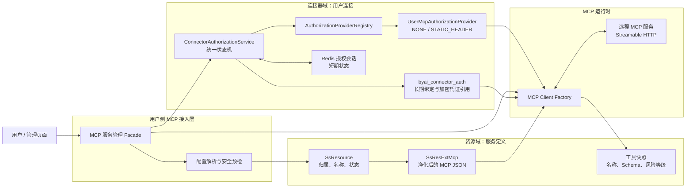
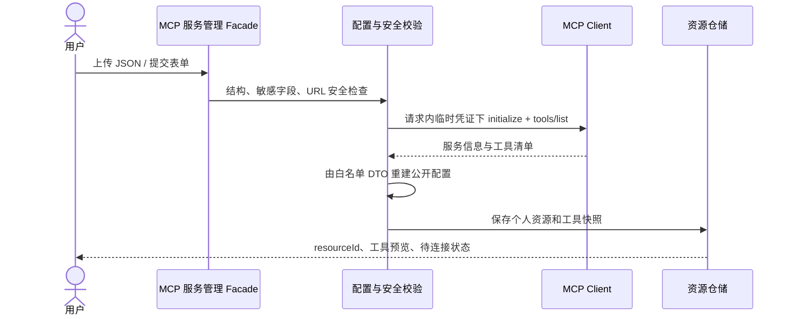
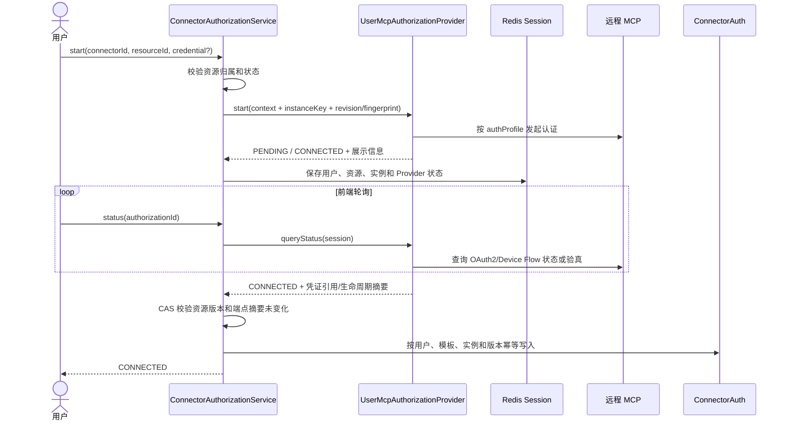
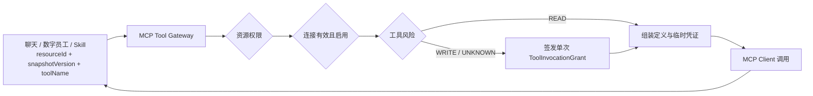

# 用户自助 MCP 服务接入设计

> 文档状态：阶段一已实现
> 更新时间：2026-08-13
> 适用范围：用户上传、保存、授权、启停和使用远程 MCP 服务

> 实现边界：当前已落地管理员公网 IP allowlist 下的远程 Streamable HTTP、`NONE/STATIC_HEADER`、实例级绑定、
> 版本化工具快照和只读调用网关。SSE 因动态 endpoint 尚无法做到 Socket 级 DNS 固定而暂不开放；
> OAuth2、写操作单次 Grant 和二维码登录仍属后续阶段；
> 旧 `/tool/mcp/*` 接口会拒绝个人 MCP，避免绕过实例鉴权网关。

## 1. 背景

ByClaw 已具备两类基础能力：

1. 资源域已支持导入 MCP JSON，以 `SsResource + SsResExtMcp` 保存服务定义，并通过
   `SsResExtMcpService` 完成 MCP 初始化、工具发现和调用；
2. 连接器域已具备统一 Provider、Redis 授权会话、长期连接状态、凭证验真、启停和撤销能力。

当前缺口是两条链路尚未按“用户的某一个 MCP 服务实例”打通。现有连接器授权以
`userId + connectorId` 标识一条连接，无法在一个通用 MCP 模板下保存多套服务；MCP 原始配置又允许包含
Header，如果直接持久化，可能造成敏感凭证明文进入资源表。

本设计保留现有资源模型和 Provider 框架，引入 MCP 实例维度，使用户能够上传并保存多个 MCP 服务，按实例完成
授权、工具预览、启用、调用、重新授权和删除。阶段一支持无需认证和静态 Header，阶段二增加标准 OAuth2；当前
不实现依赖 MCP 工具维持登录态的二维码认证。

## 2. 目标与非目标

### 2.1 目标

- 复用现有 MCP 导入、持久化、Client 和统一 Provider 框架；
- 用同一流程覆盖创建、授权、工具发现、启用、调用和治理；
- 支持一个用户保存多个 MCP 服务或多个账号实例；
- 服务定义与凭证分离，敏感信息只进入加密凭证域；
- 对远程地址、工具权限、调用参数和日志进行安全治理；
- 保持现有钉钉、飞书、企微连接器行为兼容；
- 为企业共享、审核发布、MCP 市场和标准 OAuth 留出扩展点。

### 2.2 非目标

- 第一阶段不允许普通用户上传 `stdio` 命令、可执行文件或环境变量；
- 不把 MCP 服务定义塞入现有 CLI Runtime Manifest；
- 不要求所有 MCP 服务使用同一种认证协议；
- 不在资源 JSON、日志或前端回包中返回 Token、Cookie、Authorization Header；
- 不实现 `TOOL_DRIVEN_QR`、小红书扫码登录或其他依赖 MCP 进程内登录态的非标准认证；
- 不在本设计中重写现有 MCP SDK 或连接器授权状态机。

## 3. 核心设计原则

### 3.1 定义归资源域，连接归授权域

MCP 服务的名称、地址、传输协议和工具快照属于资源定义；用户账号、Cookie、Token、到期时间和连接状态属于
授权连接。两类数据生命周期不同，必须分开管理。

### 3.2 Provider 处理认证差异

统一编排层只处理 `start/status/cancel/verify/revoke`。通用 `UserMcpAuthorizationProvider` 根据实例公开的
`authProfile` 路由 `NONE/STATIC_HEADER/OAUTH2`，`ConnectorAuthorizationService` 不判断具体服务或工具名。

通用模板的连接器级 `authMode` 固定为 `INSTANCE_DEFINED`，表示认证方式由资源实例决定并且必须进入 Provider。
现有内置连接器的 `NONE` 快捷路径只对无实例连接器生效，不能绕过 `user-mcp` Provider。

### 3.3 一个模板，多份实例

系统内置一个 `connectorCode=user-mcp`、`providerCode=user-mcp` 的通用模板。每个用户上传的服务以
`resourceId` 区分，并映射为：

```text
instanceKey = "resource:" + resourceId
```

现有内置连接器没有资源实例时继续使用 `instanceKey=default`。

### 3.4 默认最小权限

上传时只验证协议并读取工具清单，不主动调用业务工具。运行时对只读、写入和未知工具分级；写入与未知工具默认
需要服务端签发的短期、单次调用授权，不能接受客户端直接声明 `confirmed=true`。

## 4. 现状与目标能力

| 能力 | 当前基础 | 本设计补充 |
| --- | --- | --- |
| MCP JSON 导入 | `ToolManController#importToolJson` 已支持 MCP | 用户场景契约、所有权校验、公开 DTO 白名单重建 |
| MCP 定义保存 | `SsResource + SsResExtMcp` | 只保存白名单公开定义 |
| 工具发现/调用 | `SsResExtMcpService` 已支持 | 实例、连接状态、权限和风险校验 |
| 统一授权 | Provider、Registry、Redis 会话已存在 | 通用 MCP Provider 和实例上下文 |
| 长期连接状态 | `byai_connector_auth` 已存在 | 唯一键扩展到用户+模板+实例 |
| 凭证生命周期 | 已有到期、验真、续期、撤销字段和服务 | MCP Provider 按认证模式实现 |
| 生产级治理 | 已有统一状态、审计和治理基础 | MCP SSRF、防泄漏、工具风险和配额 |

## 5. 总体架构



运行时组装规则：

```text
可执行连接 = 公开服务定义(resourceId + definitionRevision) + 当前用户有效连接(instanceKey) + 解密后的临时凭证
```

资源定义不能单独产生带用户权限的可执行连接。

## 6. 数据模型

### 6.1 MCP 服务定义

服务定义继续由 `SsResource` 和 `SsResExtMcp` 承载：

| 字段 | 含义 |
| --- | --- |
| `resourceId` | MCP 服务唯一标识，也是 Provider 实例上下文 |
| `resourceBizType` | 固定为 MCP |
| `ownerType` | 第一阶段用户自助固定为 `personal` |
| `createBy` | 资源所有者，用于接口鉴权 |
| `resourceCode` | 用户范围内稳定编码 |
| `sourceContent` | 由公开 DTO 重新生成的规范配置 |
| `targetContent` | 在规范配置中注入资源 ID 后生成 |
| `definitionRevision` | 每次影响连接语义的更新递增 |
| `endpointFingerprint` | 规范化传输类型、最终 Origin、路径和认证模式的摘要 |

`sourceContent/targetContent` 不是对用户原始 JSON 做关键字删除后的副本。服务端必须先解析为严格的公开配置 DTO，
只允许名称、规范化端点、传输类型、超时和公开 `authProfile` 等白名单字段，再由该 DTO 重新序列化。Header、URL
userinfo、URL 查询参数中的凭证以及未知的凭证容器不得进入公开 DTO；无法确定是否安全的字段直接拒绝，而不是原样保存。

`definition_revision BIGINT NOT NULL DEFAULT 1` 和 `endpoint_fingerprint VARCHAR(128) NOT NULL` 建议落在
`ss_res_ext_mcp`，与 MCP 定义同生命周期，并通过 `resource_id + definition_revision` 乐观锁更新。不能只把版本放在
`sourceContent` JSON 内，否则无法可靠执行条件更新和索引查询。

个人资源的幂等身份必须包含所有者：

```text
(createBy, resourceBizType, resourceCode)
```

不能只按 `systemCode + resourceBizType + resourceCode` 全局判重，否则不同用户上传同名服务可能互相冲突。
用户自助入口使用所有者范围查询，并增加仅覆盖有效个人 MCP 的数据库唯一约束；旧导入入口继续使用原身份规则，避免
改变企业资源语义。应用层判重只用于友好报错，最终并发一致性由数据库约束保证。

### 6.2 MCP 连接实例

`byai_connector_auth` 表示“某个用户可以使用某个 MCP 服务实例”，建议新增：

| 字段 | 类型 | 规则 |
| --- | --- | --- |
| `resource_id` | BIGINT，可空 | MCP 指向 `SsResource.resource_id`；旧连接器为空 |
| `instance_key` | VARCHAR(160)，非空 | MCP 为 `resource:{resourceId}`；旧连接器为 `default` |
| `definition_revision` | BIGINT，可空 | MCP 必须等于授权时的资源版本；旧连接器为空 |
| `endpoint_fingerprint` | VARCHAR(128)，可空 | MCP 绑定授权时的端点摘要；旧连接器为空 |

有效连接唯一约束调整为：

```sql
CREATE UNIQUE INDEX uk_byai_connector_auth_active_user_connector_instance
    ON byai.byai_connector_auth (user_id, connector_id, instance_key)
    WHERE status_cd = '00A';
```

`resource_id` 是 MCP 实例的权威标识，`instance_key` 只能由服务端通过它生成。MCP 行必须同时满足
`resource_id IS NOT NULL` 且 `instance_key = 'resource:' + resource_id`；旧连接器必须满足 `resource_id IS NULL` 且
`instance_key = 'default'`。数据库建立 `resource_id` 查询索引；外键受资源软删除模型限制时，由领域约束和迁移校验保证一致性。
`auth_credential` 继续只保存加密 Provider 元数据或外部凭证引用。MCP 执行前临时解密并注入 Client，请求结束后
不缓存到业务对象。

### 6.3 公开认证描述

`authProfile` 属于公开服务定义，只描述如何认证，不包含凭证值：

```json
{
  "mode": "OAUTH2",
  "authorizationEndpoint": "https://provider.example.com/oauth/authorize",
  "tokenEndpoint": "https://provider.example.com/oauth/token",
  "scopes": ["mcp.read"],
  "pkceRequired": true
}
```

| 模式 | 适用场景 | Provider 行为 |
| --- | --- | --- |
| `NONE` | 公开 MCP | 初始化并列出工具后直接连接 |
| `STATIC_HEADER` | Token、API Key、Cookie | 临时注入 Header，验真后保存加密凭证 |
| `OAUTH2` | 授权码或 Device Flow | 复用统一回调、状态和续期能力 |

OAuth2 只允许标准授权码 + PKCE 或标准 Device Flow。普通用户不能提交任意 OAuth 授权端点；必须选择管理员审核的
Issuer/客户端模板，端点从可信元数据或管理员配置解析并固定。授权端点、Token 端点和 Device Endpoint 必须经过与
MCP 地址相同等级的 URL 安全校验，回调地址只能从服务端 allowlist 选择，不能由请求任意指定。客户端密钥只能来自
管理员配置或凭证域，不能进入资源定义。

`STATIC_HEADER` 不允许用户提交任意 Header 名称。`credentialInput.type` 通过服务端映射为允许的
`Authorization/API-Key/Cookie` 槽位；禁止覆盖 `Host`、`Content-Length`、`Transfer-Encoding`、`Connection`、
代理认证和 `Forwarded/X-Forwarded-*` 等连接或路由相关 Header。

### 6.4 工具快照

工具快照必须是可版本化的持久模型，至少包含 `resource_id`、`definition_revision`、`snapshot_version`、`tool_name`、
`description`、`input_schema`、`schema_hash`、`risk_level`、`risk_source` 和状态。有效快照以
`(resource_id, snapshot_version, tool_name)` 唯一；刷新时创建完整新快照并原子切换当前版本，不能逐行覆盖旧快照。
旧快照只用于在途请求审计，不接受新调用。刷新在远程预检后必须锁定资源定义行并复核
`definition_revision + endpoint_fingerprint`，持锁完成快照切换；定义已变化时返回 `MCP_DEFINITION_CHANGED`，不得写入旧快照。

### 6.5 工具调用授权和幂等记录

`ToolInvocationGrant` 保存于 Redis，值只包含第 7.3 节的绑定字段、过期时间和随机不可预测 ID，通过 Lua 或等价原子操作
从 `ISSUED` 转为 `CONSUMED`。写工具的幂等执行摘要和最终结果引用保存到数据库，保留时间不得短于业务允许的重试窗口；
Redis 丢失时未消费 Grant 全部失效，但已经执行的写操作仍可从数据库幂等记录返回原结果。

## 7. 关键流程

### 7.1 上传并保存



处理规则：

1. 校验名称、协议、URL、超时、认证模式和 `authProfile`，拒绝公开 DTO 之外的未知字段；
2. 将 `Authorization`、`Cookie`、Token、API Key 等敏感值解析到禁止序列化和默认 `toString()` 的专用 DTO；
3. 执行 MCP `initialize` 和 `tools/list`，默认不调用业务工具；
4. 只从公开 DTO 生成 `sourceContent/targetContent`，保存定义、`definitionRevision`、`endpointFingerprint` 和工具快照；
5. 创建接口只保存公开定义，不隐式建立连接；客户端随后单独调用授权启动接口提交凭证；
6. 任一步失败都不落凭证明文，返回分层且脱敏的错误。

`validate` 和创建接口中的临时凭证仅用于本次工具发现，请求完成后清除，不通过普通 Redis 会话或资源表传递。
建立连接时由客户端重新通过 HTTPS 提交 `credentialInput`；Provider 必须在返回 `start` 之前将其转换为加密载荷或
Vault 一次性引用。若转换失败，授权任务不得创建。这样允许资源保存与授权分别重试，不产生“资源已保存但凭证去向不明”的隐式状态。

当前 `validateValidationToolBySourceContent` 会选择一个读取类工具做验证。用户自助场景应默认只执行
`initialize + tools/list`；仅当管理员配置了明确的无副作用工具时才允许额外调用。

### 7.2 建立连接

`StartConnectorAuthorizationRequest` 增加 `resourceId`；服务端根据当前用户和资源计算 `instanceKey`，客户端不得指定。
服务端同时读取当前 `definitionRevision` 和 `endpointFingerprint`，写入授权上下文和 Redis 会话。



Redis 活跃会话索引同步扩展为 `userId + connectorId + instanceKey`。同一用户可同时授权不同 MCP 服务，但同一实例
只能有一个活跃任务；重复点击连接返回已有任务。资源版本或端点摘要在授权期间发生变化时，任务以
`MCP_DEFINITION_CHANGED` 失败，临时凭证引用立即销毁，不能把旧授权写成新定义的 `READY` 连接。

### 7.3 工具调用



模型和调用方看到的工具 ID 必须在会话内唯一，并映射到 `(resourceId, snapshotVersion, toolName)`。不同资源的同名工具
不能按最新记录或连接器级开关自动选择；用户未明确绑定实例时，调用入口返回实例选择提示。通用 MCP 不复用只表达
Boolean 的 `skill_code` 作为实例路由键。

每次调用必须校验资源权限、实例有效连接、`enable_flag`、凭证状态、定义版本、端点摘要、工具快照、参数 JSON Schema、
风险确认、超时、并发、频率和响应大小限制。

`WRITE/UNKNOWN` 的确认由服务端签发 `ToolInvocationGrant`。Grant 必须绑定用户、租户、资源、定义版本、快照版本、
工具名、规范参数哈希、会话 ID 和幂等键，设置短 TTL，并在执行时原子消费。重试只能用同一个 `idempotencyKey`
查询原执行结果；修改参数、工具、资源或版本后必须重新确认。

## 8. 对外接口

以下为目标接口。Facade 内部继续复用现有 `ToolManService`、`SsResExtMcpService` 和
`ConnectorAuthorizationService`。

```http
POST   /byaiService/connector/mcp-services/validate
POST   /byaiService/connector/mcp-services
GET    /byaiService/connector/mcp-services
GET    /byaiService/connector/mcp-services/{resourceId}
PUT    /byaiService/connector/mcp-services/{resourceId}
DELETE /byaiService/connector/mcp-services/{resourceId}
PUT    /byaiService/connector/mcp-services/{resourceId}/enabled
POST   /byaiService/connector/mcp-services/{resourceId}/tools/refresh
POST   /byaiService/connector/mcp-services/{resourceId}/tools/{toolName}/confirm
POST   /byaiService/connector/mcp-services/{resourceId}/tools/{toolName}/call
```

`validate` 只预检不落库。创建、更新、授权启动和工具调用支持 `Idempotency-Key`。更新服务地址、传输协议或认证描述时，
在同一事务中递增 `definitionRevision`、更新 `endpointFingerprint`，并将旧连接标为 `REAUTH_REQUIRED`；在途授权和
未消费的调用 Grant 因版本不匹配自动失效，避免旧凭证被发送到新主机。

授权继续复用现有统一接口，仅扩展启动上下文：

```http
POST /byaiService/connector/authorization/start
GET  /byaiService/connector/authorization/status?authorizationId=...
POST /byaiService/connector/authorization/cancel
POST /byaiService/connector/authorization/revoke
```

启动请求示意：

```json
{
  "connectorId": 10001,
  "resourceId": 90001,
  "redirectUrl": "https://example.com/connectors/callback",
  "credentialInput": {
    "type": "BEARER_TOKEN",
    "value": "仅随本次 HTTPS 请求传输"
  }
}
```

`credentialInput` 不写入普通 Redis JSON、不进入日志、不在状态接口回显。实现时使用禁止序列化和默认 `toString()` 的
敏感 DTO，并在 Provider `start` 返回前转换为带 TTL 的 Vault 一次性引用或使用带密钥版本的信封加密载荷。普通
授权会话只保存引用；任务失败、取消或过期时必须销毁引用。

建议错误码包括：`MCP_CONFIG_INVALID`、`MCP_ENDPOINT_BLOCKED`、`MCP_CONNECT_TIMEOUT`、
`MCP_RESOURCE_FORBIDDEN`、`MCP_AUTH_REQUIRED`、`MCP_CREDENTIAL_EXPIRED`、`MCP_TOOL_NOT_FOUND`、
`MCP_TOOL_CONFIRM_REQUIRED`、`MCP_CONFIRMATION_INVALID`、`MCP_DEFINITION_CHANGED` 和 `MCP_RATE_LIMITED`。
错误响应统一包含 `code/retryable/retryAfterSeconds/correlationId` 和脱敏消息；只有明确标记 `retryable=true` 的请求才可重试。

### 8.1 Connector Drawer 中的多实例交互

`user-mcp` 在连接器目录中只保留一条系统级模板，不能把模板的聚合 `enableFlag` 当作任一 MCP 实例的状态。
现有连接器设置预览中，该模板只提供“管理”入口；创建、展示和管理 MCP 服务全部位于现有“连接器配置” Drawer，
不再提供独立 `/mcpServices` 路由或菜单。

Drawer 中的“自定义 MCP”卡片展开为当前用户的实例列表，标题区提供“添加 MCP”。每个实例展示名称、编码、规范化端点、
定义版本、连接状态和启用状态，并独立提供连接/重新连接、启停、编辑和删除操作。添加与编辑使用叠加在 Drawer 上方的
Modal；静态凭证只随预检或连接请求发送，不因展示或编辑而回填。

`GET /connector/mcp-services` 的列表项必须包含实例级 `enableFlag`、`credentialState`、`connected` 和必要的最近验真时间。
后端按当前用户和 `resourceId` 批量读取有效授权，不能按 `connectorId` 折叠，也不能逐实例执行 N+1 查询。

实例关闭始终允许，只把该实例的 `enable_flag` 设为 `N`，不删除定义或凭证。重新开启仅在授权状态为 `READY` 且
`definitionRevision + endpointFingerprint` 与当前定义一致时允许；否则返回需要重新连接。`user-mcp` 模板不得进入
普通连接器的通用开关、撤销或授权流程，避免多个实例之间互相影响。

已启用实例允许编辑。仅修改名称或说明等元数据时不增加定义版本、不重新预检，也不影响现有连接；修改端点、路径、
传输协议、认证方式或凭证类型时，保存前必须提示“保存后自动停用并需要重新连接”，保存后增加定义版本、清除可用绑定并
进入 `REAUTH_REQUIRED`。`resourceCode` 创建后不可修改；静态认证的连接信息发生变化时必须重新输入凭证，元数据编辑可留空。

## 9. 安全设计

### 9.1 SSRF 防护

- 第一阶段只允许 HTTPS Streamable HTTP；SSE 在动态 endpoint 校验与 Socket 级地址固定完成前保持关闭；
- 将 `domainURL + mcpServerUrl` 规范化为一个最终 URI；禁止绝对子端点跨 Origin、URL userinfo 和凭证型查询参数，
  限制端口和重定向次数；
- 当前实现要求管理员 allowlist 和用户 URL 都使用公网 IP 字面量，并禁止回环、链路本地、私网、保留地址、
  IPv4 映射 IPv6 和云元数据地址；同时禁用隐式 HTTP 代理，以消除 DNS rebinding 的检查与使用竞态；
- 当前实现禁用 HTTP 重定向；未来如需开放，必须逐跳重新执行 Origin、地址和端口校验；
- 企业内网地址只能由管理员加入租户 allowlist；
- 设置连接、读取和总调用超时，以及请求、响应体上限。

### 9.2 凭证保护

- `sourceContent/targetContent` 只由公开配置白名单 DTO 生成，`mcpHeader/mcpEnv` 不接受用户自助写入；
- 字段名识别只用于告警和拒绝输入，不能作为允许持久化任意剩余 JSON 的依据；
- 优先在 `auth_credential` 保存外部 Vault 引用；必须保存密文时使用信封加密，记录密钥 ID/版本，并将
  `tenantId/userId/resourceId/endpointFingerprint` 作为认证上下文；
- 只有 MCP Client 组装器可在调用前读取，资源查询接口无解密权限；
- 日志和审计统一脱敏，不记录完整 Header、Cookie、工具参数和结果；
- 更新主机、所有者或认证模式时，旧凭证立即失效；密钥轮换支持新写入使用新版本、后台重加密和旧版本受控退役；
- 解密、授权完成、凭证轮换、撤销和拒绝访问均生成不含密文的审计事件。

### 9.3 工具风险

| 等级 | 示例 | 默认策略 |
| --- | --- | --- |
| `READ` | 搜索、查询状态、读取详情 | 可按用户授权调用 |
| `WRITE` | 发布、删除、评论、发送消息 | 每次确认或审批后调用 |
| `UNKNOWN` | 无法可靠判断的新工具 | 按 `WRITE` 处理 |

风险等级优先使用管理员规则和 MCP 工具注解，其次才使用名称/描述分类，自动结果允许人工覆盖。
`WRITE/UNKNOWN` 必须使用第 7.3 节定义的单次 Grant；工具风险降低只能由管理员完成，资源所有者不能把未知工具自行
降为 `READ`。

远端返回的工具名称、描述、Schema 和调用结果全部视为不可信内容：限制长度和嵌套深度，输出到日志或页面前转义，
不得把工具描述或结果提升为系统指令，也不得因其声称“安全/只读”绕过风险策略。工具响应中的外链、文件和后续工具
调用仍需经过各自的访问控制与确认流程。

### 9.4 所有权校验

所有带 `resourceId` 的接口必须统一鉴权，不能直接按 ID 调用 `listTools/callToolRequest`。个人资源至少满足：

```text
resource.ownerType = personal AND resource.createBy = currentUserId
```

企业共享资源通过独立 ACL 判断，不能通过猜测 ID 使用他人的连接或凭证。

## 10. 延后能力：工具驱动二维码认证

当前版本不实现 `TOOL_DRIVEN_QR`，不调用用户配置的二维码、轮询或验真工具，也不以小红书 MCP 作为验收范围。
这类认证只有在远端服务能够提供以下之一时才重新评估：

1. 可导出、可加密、可撤销且按用户隔离的标准凭证；
2. 每次调用都可携带、跨进程和跨节点有效的用户级不透明会话引用；
3. 由平台管理、具备用户隔离和生命周期治理的远端 Gateway Lease。

仅在临时 MCP Client、远端共享进程或本机 Cookie Jar 中生效的扫码状态不视为可持久连接，避免重启失效和多用户串号。

## 11. 状态模型

服务状态与连接状态分离：

```text
服务：DRAFT → VALIDATING → READY → DISABLED
                  └──────→ INVALID

授权任务：PENDING → CONNECTED | FAILED | EXPIRED | CANCELLED

长期连接：READY → EXPIRING → REFRESH_NEEDED → READY
                └───────────────────────────→ REAUTH_REQUIRED
```

`READY` 服务只表示定义合法、服务可访问，不代表用户已登录。删除或撤销时先尝试撤销远端凭证，再软删除长期绑定；
远端撤销失败可进入重试任务，但本地必须立即禁止继续调用。

编辑 `READY/INVALID/DISABLED` 服务的连接身份字段会创建新修订并进入 `VALIDATING`；仅编辑名称、说明等元数据不创建
新修订并保持现有连接。连接身份校验期间旧修订只允许已开始的只读调用在短超时内完成，不接受新调用；校验成功后切换为
新 `READY` 修订但长期连接进入 `REAUTH_REQUIRED`，失败则保留旧公开定义用于审计但服务状态为 `INVALID`。
`INVALID` 可再次编辑验证，`DISABLED` 可重新验证后启用，删除进入软删除终态且不能直接恢复连接。

## 12. 一致性与故障处理

- 资源保存使用数据库事务，工具快照失败时不产生半成品 `READY` 资源；
- 授权完成仍由 `ConnectorAuthorizationService` 写长期绑定，Provider 不直接写表；
- 唯一索引和幂等写入防止同一实例产生重复有效连接；
- Redis 只保存可丢弃的短期任务和 Grant，数据库是长期连接与写调用幂等结果的权威来源；
- Redis 丢失后，未完成授权任务统一标记为 `EXPIRED` 并清理临时凭证引用，不尝试凭空恢复 Provider 交互状态；
- MCP 网络超时按阈值累计失败，不立即删除有效连接；
- 更新定义使用 `definitionRevision` 乐观锁；授权完成、连接启用、确认和调用均校验 revision 与 fingerprint；
- 删除前阻止新调用，等待在途调用结束或超时，再撤销并软删除；
- 工具清单变化时生成新快照，新增工具默认 `UNKNOWN`，已删除工具立即不可调用。
- 创建服务、开始授权和工具调用使用调用方提供的 `Idempotency-Key`；服务端保存请求摘要，重复 Key 且摘要相同返回
  原结果，摘要不同返回冲突。写工具失败后的自动重试只允许查询原幂等执行结果，不能再次调用远端工具。
- 关键指标至少包含验证/调用延迟、按错误码失败数、SSRF 拦截数、授权状态转换、Grant 签发/消费/过期、工具快照漂移
  和凭证解密失败；所有事件携带 `correlationId`，不携带凭证和完整工具参数。

## 13. 需要修改的模块

| 模块 | 修改内容 |
| --- | --- |
| MCP 服务管理 Controller/Facade | 自助接口、所有权校验、配置净化、错误映射 |
| `ToolManService` | 个人 MCP 判重加入所有者，从公开 DTO 重新生成持久化 JSON |
| `SsResExtMcpService` | 拆分工具发现与业务探针，接受安全凭证解析结果 |
| `AuthorizationStartContext` | 增加 `resourceId`、`instanceKey`、定义版本、端点摘要和凭证引用 |
| `StartConnectorAuthorizationRequest` | 增加 `resourceId`，敏感输入使用专用 DTO |
| Redis 授权会话 | 保存资源实例和版本，活跃索引增加 `instanceKey`，普通 JSON 只保存凭证引用 |
| `ConnectorAuth`/Mapper | 增加实例和版本字段，调整查询、MERGE、分组和唯一索引 |
| Provider Registry | 注册 `UserMcpAuthorizationProvider` |
| MCP Client Factory | URL 安全、凭证注入、超时、限流、脱敏 |
| Tool Gateway | 实例化工具 ID、版本校验、单次 Grant、Schema、风险和审计校验 |
| 工具快照与调用记录 | 新增版本化快照、Grant 原子消费和写调用幂等结果模型 |
| Connector 读模型 | 明确通用 MCP 返回实例列表，不按 `connectorId/skill_code` 折叠为单个 Boolean |
| Connector Drawer | `user-mcp` 模板使用嵌套实例列表；提供实例级创建、连接、启停、编辑和删除，移除独立页面 |

现有 Runtime Manifest 只接受 CLI runtime。本设计不改变该语义；MCP 定义继续留在资源域。

## 14. 数据迁移

1. 为 `byai_connector_auth` 增加可空 `resource_id/definition_revision/endpoint_fingerprint` 和默认 `default` 的非空
   `instance_key`；
2. 将历史有效连接回填 `instance_key=default`；
3. 删除原有效唯一索引 `(user_id, connector_id)`；
4. 创建新索引 `(user_id, connector_id, instance_key)`；
5. 更新查询索引、Mapper 分组和 MERGE 条件；
6. 增加 `resource_id` 索引和 MCP/旧连接器实例一致性校验，扫描并拒绝不一致数据；
7. 为 `ss_res_ext_mcp` 增加非空定义版本和端点摘要，并创建版本化工具快照及写调用幂等记录表；
8. 为有效个人 MCP 创建 `(create_by, resource_biz_type, resource_code)` 唯一约束；
9. 创建 `authMode=INSTANCE_DEFINED` 的通用 `user-mcp` 模板；
10. 扫描现有 MCP 资源中的疑似明文凭证并标为待迁移，不打印或导出原值；
11. 迁移后由公开 DTO 重建资源 JSON，禁止保存原始上传 JSON 或凭证明文。

已经产生多实例连接后不能直接恢复旧唯一索引；应用回滚前必须先停用或合并重复实例。

## 15. 测试与验收

### 15.1 单元与集成测试

- 公开 DTO 白名单、未知字段拒绝、凭证 Canary 不进入资源、产物、响应和日志；
- URL 规范化、DNS 换绑、重定向、代理、IP 变体和私网地址拦截；
- 用户提交任意 OAuth Issuer/端点、未登记回调以及危险 Header 名称均被拒绝；
- `resourceId → instanceKey` 计算、防篡改和数据库不一致数据拒绝；
- `NONE/STATIC_HEADER/OAUTH2` 三种实例认证模式和 `INSTANCE_DEFINED` Provider 路由；
- 上传 → initialize → tools/list → 保存完整链路；
- 同一用户保存两个实例、两个用户保存同名资源；
- Connector Drawer 同时展示同一用户的多个 MCP，且不再暴露独立 `/mcpServices` 路由；
- `user-mcp` 模板不显示通用连接器开关，每个实例的启停只影响自身；
- 有效实例可关闭；定义和凭证仍匹配时可再次开启，否则要求重新连接；
- 并发授权只产生一个活跃会话；
- 授权期间或确认后变更定义，旧任务/Grant 失败且凭证不会发往新端点；
- 删除、撤销、过期、远端不可达和 Redis 重启；
- 越权读取、刷新和调用均被拒绝；
- 两个实例暴露同名工具时必须按 `resourceId + snapshotVersion` 确定路由；
- 超长、深层嵌套或包含提示注入文本的工具元数据和响应不能改变系统策略或绕过确认；
- 写工具未经 Grant、Grant 重放、参数替换、版本替换和跨用户使用均被拒绝；
- 相同幂等键不重复执行写工具，不同请求摘要复用幂等键返回冲突。

### 15.2 用户自助 MCP 验收场景

1. 上传公开或静态 Header MCP 配置并看到工具预览；
2. 静态凭证单独提交授权，连接成功后资源接口和状态接口均不回显凭证；
3. OAuth2 使用 PKCE 或 Device Flow 完成连接和标准续期；
4. 只读工具可执行，写入和未知工具必须获得参数绑定的单次确认；
5. 凭证失效后调用被阻止，并提示重新授权；
6. 同一用户可保存多个实例，两个实例的同名工具能够确定性路由且互不覆盖；
7. 资源定义、资源产物、接口响应、Redis 普通会话和日志均不存在 Cookie/Token 明文；
8. 更新端点后旧连接和未消费确认立即失效，旧凭证不会发送到新端点。

## 16. 分阶段实施

### 阶段一：远程 MCP 自助保存

- 新增通用 `user-mcp` 模板；
- 支持 Streamable HTTP 和 `NONE/STATIC_HEADER`；
- 安全收敛：当前仅开放 Streamable HTTP，SSE 在完成动态 endpoint 校验和 DNS 固定后再启用；
- 完成资源归属、公开配置白名单重建、SSRF、工具预览和实例连接；
- 打通聊天、数字员工和 Skill 的只读调用。

静态 Header 使用 AES-GCM 信封加密，部署时必须通过 `BYAI_MCP_CREDENTIAL_KEY` 提供 Base64 编码的
32 字节密钥；该值是部署级秘密，只能由环境变量注入，不得放入代码、数据库或管理端参数；未配置时 `NONE` 仍可使用，
`STATIC_HEADER` 授权会安全失败。
`BYAI_MCP_ALLOWED_ADDRESSES` 存放在管理端“参数配置管理 → 参数管理”，值为逗号分隔的公网 IP 字面量 allowlist，
默认为空并拒绝所有出站 MCP；策略在每次端点决策时读取最新系统参数，管理员保存后无需重启应用；
阶段一不接受域名，避免 JDK MCP transport 的 DNS 检查—使用竞态；HTTPS 证书必须覆盖该 IP。
工具风险默认为 `UNKNOWN`，不根据远端可控的名称自动降为 `READ`。
管理员可在同一参数管理页面通过 `BYAI_MCP_READ_TOOL_RULES` 配置逗号分隔的
`endpointFingerprint:toolName` 精确规则；规则同样动态读取并立即生效；
未匹配规则的工具一律不得进入阶段一调用网关。

### 阶段二：标准认证与写操作治理

- 支持标准 OAuth2 授权码 + PKCE 和标准 Device Flow；
- 补齐单次写工具 Grant、风险策略、幂等执行和调用审计；
- `TOOL_DRIVEN_QR` 不在本阶段实现。

### 阶段三：开放生态

- 支持企业共享、管理员审核、模板市场和可信发布者；
- 支持配额、健康检查、版本升级和兼容性报告；
- 只有在独立沙箱、命令白名单、镜像签名和资源限制完成后，才评估开放 `stdio` MCP。

## 17. 决策结论

1. 用户上传的 MCP 是资源实例，不是每次新增一套 Provider 代码；
2. 统一使用 `UserMcpAuthorizationProvider`，认证差异由 `authProfile` 驱动；
3. `resourceId` 是 MCP 实例主键，`instanceKey` 是授权域的稳定实例键；
4. 定义通过公开 DTO 重建后保存到资源域，凭证保存到 Vault 或信封加密授权域，只在调用瞬间组装；
5. 第一阶段只开放远程 HTTP 类传输，不开放用户自定义 `stdio`；
6. 上传验证默认只执行 `initialize + tools/list`；
7. 授权与调用绑定定义版本和端点摘要，写入/未知工具使用单次参数绑定 Grant；
8. 工具调用以 `resourceId + snapshotVersion + toolName` 唯一寻址，不依赖连接器级 Boolean；
9. 当前不实现二维码登录或 `TOOL_DRIVEN_QR`，未来必须满足可持久、可撤销和用户隔离条件后重新设计。

## 18. 相关设计

- [连接器统一授权架构设计](connector-authorization-architecture.md)
- [连接器 Runtime Manifest 集成设计](connector-runtime-manifest-integration-design.md)
- [连接器 Skill 授权同步设计](connector-skill-authorization-sync-design.md)
