# 钉钉机器人对接配置指南

## 1. 钉钉开放平台配置

### 1.1 创建钉钉企业/组织

- 注册钉钉企业账号
  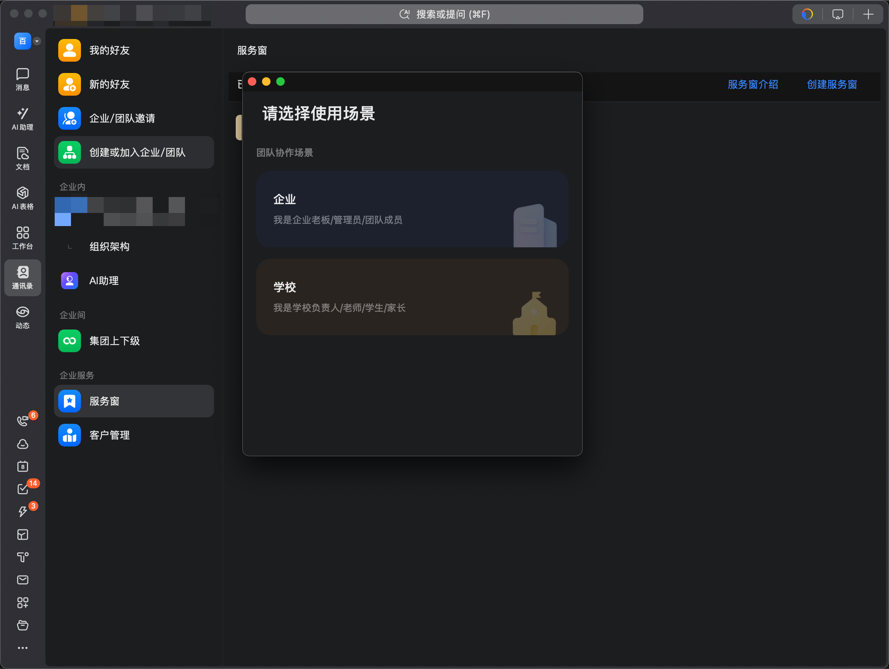
- 完成企业认证（企业名称、统一社会信用代码等）
  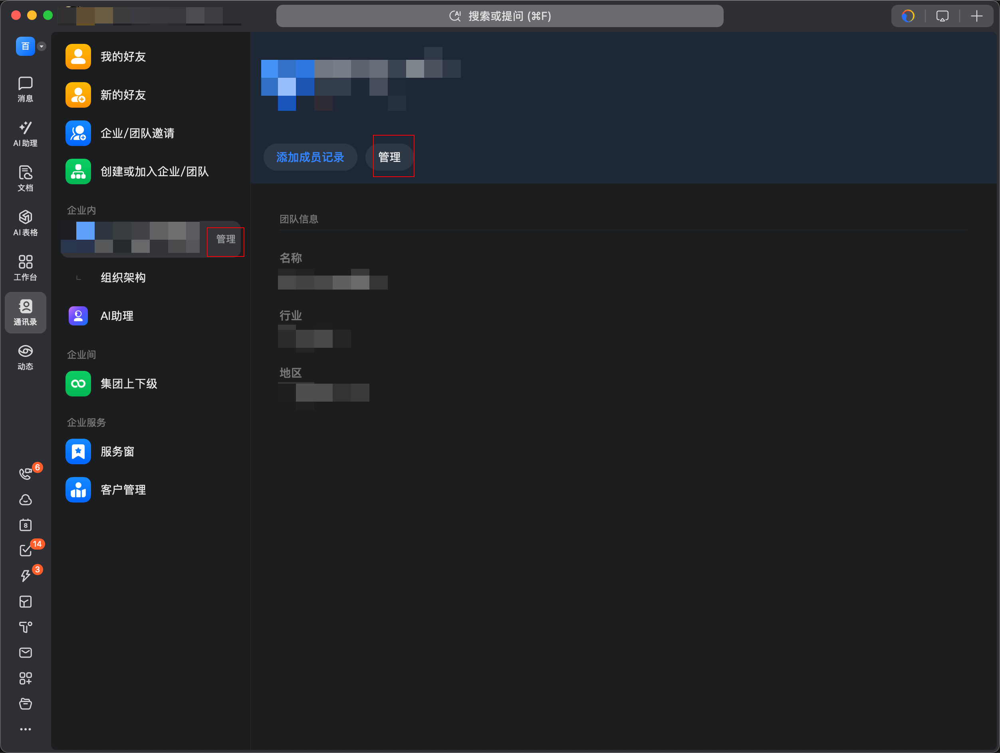
- 确认管理员权限
  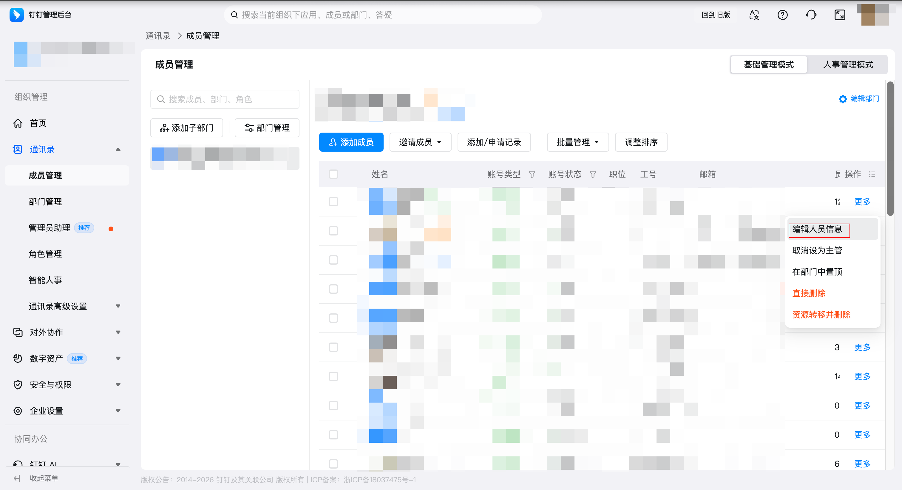
  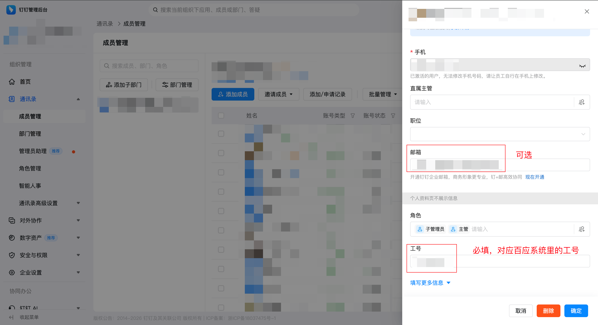

### 1.2 创建钉钉应用（企业内部应用）

- 登录 [钉钉开放平台](https://open.dingtalk.com/)
  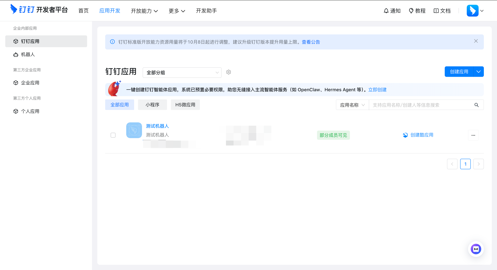
- 进入「应用开发」→「企业内部开发」→「创建应用」
- 记录 `AppKey`（即 clientId）和 `AppSecret`（即 clientSecret）
  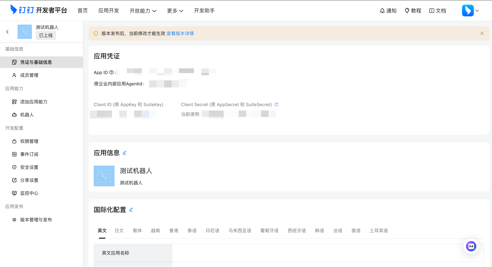

### 1.3 配置机器人能力

- 在应用详情页，开启「机器人」能力
- 配置机器人基本信息（名称、头像、简介）
- 记录 `robotCode`（机器人编码）
  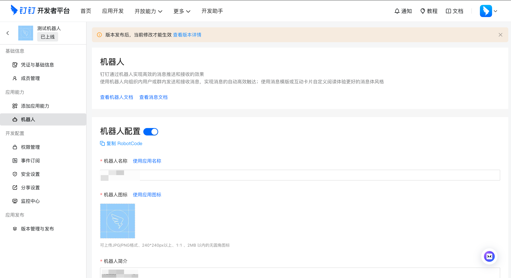
- 设置消息接收模式为 **Stream 模式**（非 HTTP 回调）

### 1.4 配置应用权限

需要开通以下权限点：

| 权限                            | 用途                |
| ----------------------------- | ----------------- |
| `fieldMobile`                 | 获取用户手机号（用于匹配系统用户） |
| `fieldEmail`                  | 获取用户邮箱            |
| `qyapi_get_member`            | 获取企业成员详情（工号、姓名等）  |
| `qyapi_get_member_by_mobile`  | 根据手机号查询成员（用户身份解析） |
| `qyapi_get_department_member` | 获取部门成员列表          |
| `qyapi_robot_sendmsg`         | 机器人发送消息           |
| `Card.Instance.Write`         | 创建互动卡片实例          |
| `Card.Streaming.Write`        | 卡片流式更新（AI 流式回复）   |
| `AIInteraction.Card.Write`    | AI 互动卡片写入         |

***

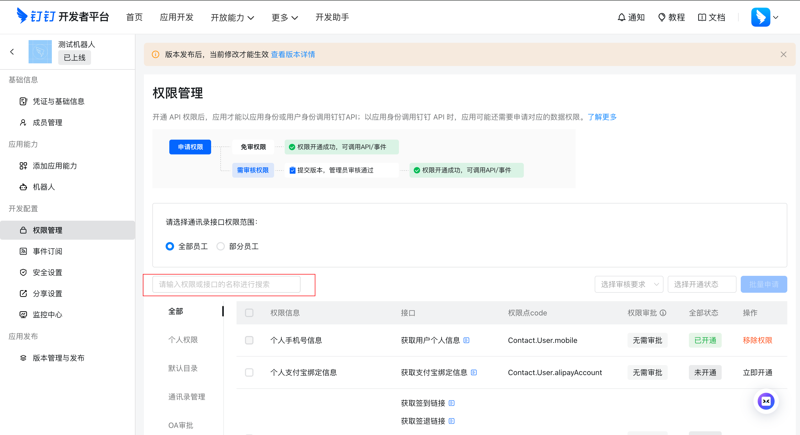

## 2. 鲸智百应系统配置

### 2.1 开启钉钉 Stream 服务

联系运维人员，确认系统已开启钉钉 Stream 服务（配置项 `dingtalk.stream.enabled=true`）。该服务是机器人接收消息的前提。

### 2.2 创建数字员工并绑定钉钉机器人

在「数字员工」页面中：

1. 创建数字员工，配置其能力、知识库等
2. 在「机器人配置」中，填写以下信息：

| 配置项          | 值              |  必填 |
| ------------ | -------------- | :-: |
| clientId     | 钉钉应用 AppKey    |  是  |
| clientSecret | 钉钉应用 AppSecret |  是  |
| robotCode    | 钉钉机器人编码        |  是  |
| appId        | 钉钉应用 ID        |  否  |

保存后机器人即刻上线。修改配置后也会自动热更新，无需重启服务。
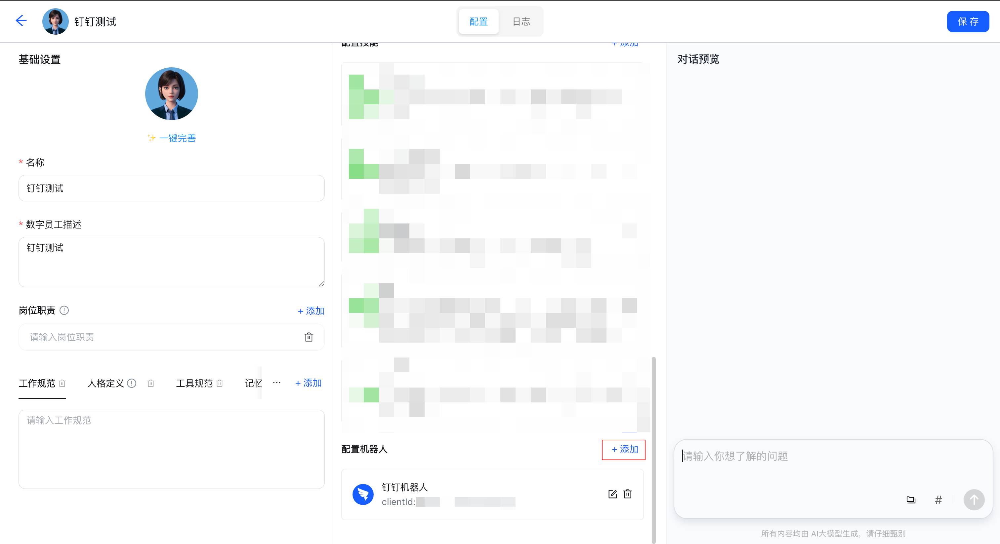
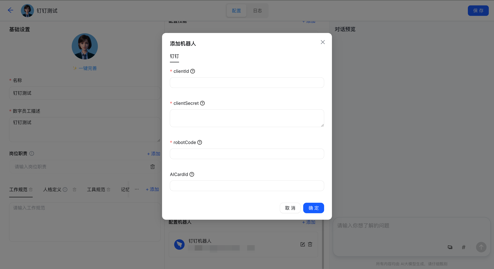

### 2.3 配置用户关联信息

钉钉用户发消息时，系统需要将其身份映射到百应本地用户。匹配按以下优先级进行：**工号 → 手机号 → 姓名**。首次匹配成功后自动建立绑定关系，后续免匹配。

#### 钉钉侧（oa.dingtalk.com 通讯录）

确保员工资料填写完整：

| 钉钉字段 | 对应百应字段 | 匹配优先级 | 说明           |
| ---- | ------ | :---: | ------------ |
| 工号   | 用户编码   |   最高  | 精确匹配，推荐保持一致  |
| 手机号  | 手机号    |   中   | 精确匹配         |
| 姓名   | 用户名    |   低   | 可能存在同名，需手动选择 |

#### 百应侧（管理后台 → 用户管理）

确保以下字段至少有一项能与钉钉通讯录对应：

| 百应字段 | 说明                  |
| ---- | ------------------- |
| 用户编码 | 建议与钉钉工号保持一致，最推荐     |
| 手机号  | 与钉钉手机号一致            |
| 用户名  | 与钉钉姓名一致，同名时机器人会提示选择 |

### 2.4 设置数字员工使用授权

在管理后台「数字员工」详情页中，配置该数字员工的使用授权范围：

- 指定哪些用户或用户组可以使用该数字员工
- 只有在授权范围内的用户，通过钉钉机器人发消息时才能获得 AI 回复
- 未授权用户发消息时，机器人回复"对不起，您可能没有数字员工的权限"
  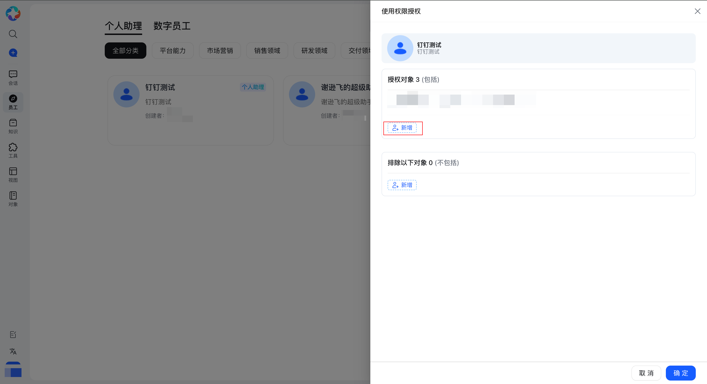

***

## 3. 消息收发说明

### 3.1 消息接收

用户在钉钉中向机器人发消息后，系统通过 Stream 长连接实时接收，无需配置公网回调地址。

### 3.2 回复方式

- **主要方式**：互动卡片流式输出（支持 Markdown、思考过程展示）
- **降级方式**：纯文本回复（卡片创建失败时自动降级）

### 3.3 支持的消息类型

| 类型  |  单聊 |  群聊 | 说明       |
| --- | :-: | :-: | -------- |
| 文本  |  ✅  |  ✅  | 直接提取文本内容 |
| 富文本 |  ✅  |  ✅  | 提取纯文本部分  |
| 图片  |  ✅  |  ✅  | 下载后上传至系统 |
| 语音  |  ✅  |  ❌  | 取语音识别文本  |
| 视频  |  ✅  |  ❌  | 下载后上传至系统 |
| 文件  |  ✅  |  ❌  | 下载后上传至系统 |

### 3.4 主动消息推送

系统支持主动向钉钉用户发送消息（一对一），用于通知、提醒等场景。

***

## 4. 常见问题

| 现象             | 可能原因                                      |
| -------------- | ----------------------------------------- |
| 机器人无响应         | Stream 服务未开启，或 clientId/clientSecret 填写错误 |
| 回复"未找到匹配的系统用户" | 钉钉用户的工号/手机号/姓名未与百应用户对应                    |
| 回复"没有数字员工的权限"  | 用户未被授权使用该数字员工                             |
| 回复"钉钉机器人编码未配置" | 渠道配置中 robotCode 为空                        |
| 卡片无法显示，回复纯文本   | 卡片相关权限未开通                                 |

