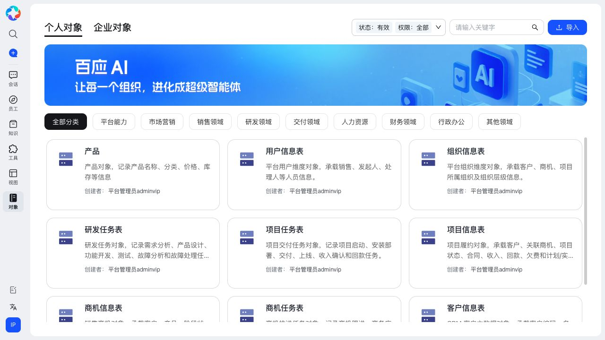
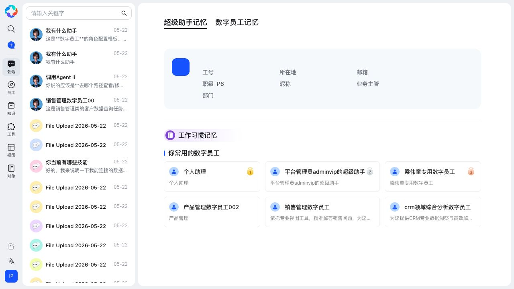
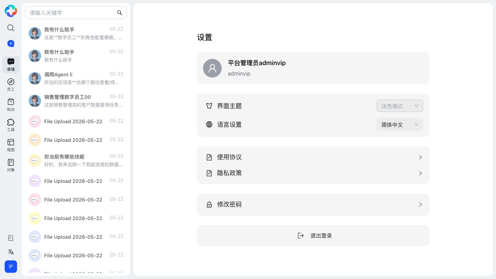
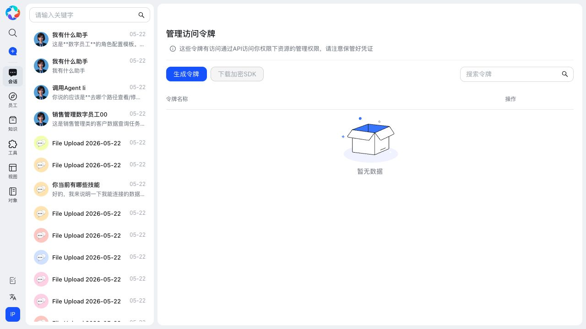
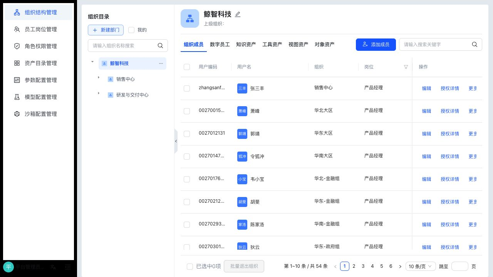
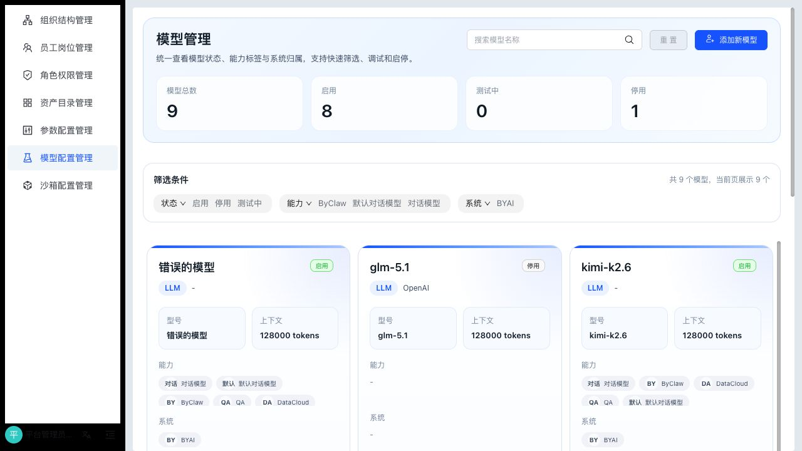
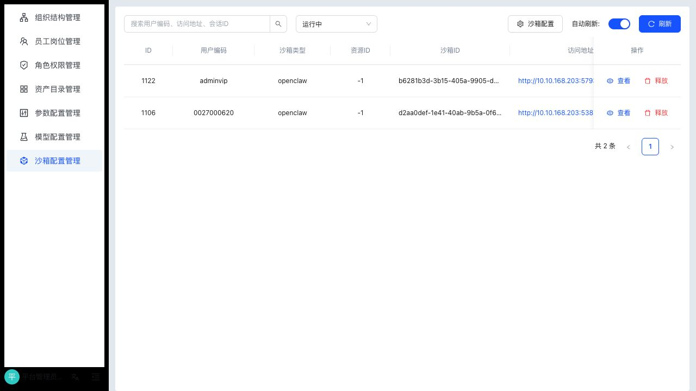

# ByClaw 操作手册

本文档面向 ByClaw 的日常使用者、业务管理员、平台管理员和运维人员，说明如何在系统界面中完成核心功能操作。本文按功能模块组织，强调“从哪里进入、怎么操作、结果怎么看、权限和注意事项是什么”。

> 本手册截图基于当前运行中的 ByClaw 系统界面采集。不同部署环境、账号权限、数据初始化状态不同，页面可见菜单和列表数据可能略有差异。

## 使用前准备

| 项目 | 要求 |
| --- | --- |
| 浏览器 | 推荐使用 Chrome、Edge 等现代浏览器 |
| 访问地址 | 以部署环境提供的 Web 地址为准，本地常见地址为 `http://localhost:8000` 或 `http://localhost:8080` |
| 账号权限 | 普通用户可使用对话、员工、知识、工具等功能；平台管理员可进入管理后台 |
| 依赖服务 | 后端、WebSocket、Redis、OpenGauss、MinIO、QA/Data 服务应处于可用状态 |

## 界面总览

登录后，ByClaw 的主界面由左侧主导航、会话/资源侧栏和右侧工作区组成。左侧菜单是高频入口，常见入口包括会话、员工、知识、工具、视图、对象、个人设置和管理后台。

| 区域 | 说明 |
| --- | --- |
| 左侧主导航 | 切换会话、员工、知识、工具、视图、对象等模块 |
| 侧栏 | 展示当前模块的列表、搜索框、分组或历史记录 |
| 右侧工作区 | 执行当前功能的主要操作，例如发起对话、查看资源、管理配置 |
| 右下/个人入口 | 进入个人设置、语言设置、退出登录等 |

## 1. 登录与账号

### 适用角色

所有用户。

### 使用前准备

- 已获得 ByClaw 账号和密码。
- 浏览器可访问 ByClaw 前端地址。
- 后端服务和登录接口正常。

### 典型操作流程

1. 打开 ByClaw Web 地址。
2. 点击右上角“登录”。
3. 在登录弹窗中选择“账号登录”。
4. 输入账号和密码。
5. 勾选“已阅读并同意使用协议和隐私政策”。
6. 点击“立即登录”。
7. 登录成功后，系统进入会话首页，并在欢迎语中显示当前用户名称。

### 字段说明

| 字段 | 是否必填 | 填写说明 |
| --- | --- | --- |
| 账号 | 是 | 输入管理员或普通用户账号 |
| 密码 | 是 | 输入账号对应密码 |
| 协议确认 | 是 | 首次或每次登录前需确认使用协议和隐私政策 |

### 权限与限制

- 普通用户只能看到已授权的员工、知识、工具、视图和对象。
- 管理员账号可进入管理后台，进行组织、岗位、权限、模型、沙箱等配置。
- 登录状态失效后，系统会提示重新登录。

### 常见问题

| 问题 | 处理建议 |
| --- | --- |
| 提示账号或密码错误 | 检查大小写、特殊字符和账号是否启用 |
| 登录后菜单很少 | 当前账号权限不足，联系管理员授权 |
| 登录状态频繁失效 | 检查后端会话配置、Redis 状态和浏览器 Cookie 设置 |

## 2. 智能对话

### 适用角色

所有用户。

### 使用前准备

- 已登录系统。
- 至少有一个可用模型或超级助手。
- 如需调用知识、工具或数字员工，应提前完成授权。

### 典型操作流程

1. 点击左侧“会话”。
2. 在输入框输入问题或任务。
3. 如需指定对象，在输入框中输入 `@` 或点击“@数字员工”，选择要调用的数字员工。
4. 如需上传文件，点击输入框右侧的文件上传入口。
5. 点击发送按钮。
6. 在回答区查看回复、引用、执行状态和后续操作入口。
7. 在左侧会话列表中查看历史会话，可通过搜索框按关键词检索。

### 关键操作

| 操作 | 说明 |
| --- | --- |
| 新建对话 | 点击左侧新建入口或回到会话首页后直接输入新问题 |
| 选择数字员工 | 使用 `@` 选择员工，把任务交给特定角色处理 |
| 上传文件 | 将文档、表格或图片作为上下文，让助手分析或提取信息 |
| 查看历史 | 左侧会话列表展示历史问题、摘要和日期 |
| 模板示例 | 首页下方按“企业问答、高效工作、办公写作、ESG、数据分析”等分类展示示例任务 |

### 字段说明

| 字段/控件 | 说明 |
| --- | --- |
| 消息输入框 | 输入自然语言问题、任务指令或上下文 |
| `@数字员工` | 选择由哪个数字员工处理任务 |
| 文件上传 | 上传本次对话需要分析或引用的文件 |
| 文件管理 | 查看当前会话相关文件 |
| 分类示例 | 选择系统预置任务模板，快速发起同类任务 |

### 权限与限制

- 用户只能调用自己有权限的数字员工、资源和知识。
- 文件上传受文件大小、格式、存储配置和安全策略限制。
- 涉及外部工具或沙箱执行时，结果受资源授权和沙箱状态影响。

### 常见问题

| 问题 | 处理建议 |
| --- | --- |
| 发送按钮不可用 | 检查输入框是否为空、是否仍在上传文件或生成中 |
| 回答没有引用知识 | 确认问题是否关联了知识库，或数字员工是否绑定了知识资源 |
| 调用数字员工失败 | 检查员工是否有效、是否已发布、是否有工具/知识权限 |

## 3. 数字员工与个人助理

### 适用角色

普通用户、业务管理员、平台管理员。

### 使用前准备

- 已登录系统。
- 如需创建个人助理，账号需具备创建权限。
- 如需管理企业级数字员工，应具备管理员或资产管理权限。

### 典型操作流程

1. 点击左侧“员工”。
2. 在顶部切换“个人助理”或“数字员工”。
3. 使用状态、权限、关键词筛选目标员工。
4. 点击员工卡片，查看员工说明和可用能力。
5. 在左侧员工列表中选择常用员工，快速发起对话。
6. 如需创建个人助理，点击“创建个人助理”，按表单填写信息并保存。

### 关键操作

| 操作 | 说明 |
| --- | --- |
| 查看员工 | 在员工中心按分类、状态、权限查看员工 |
| 搜索员工 | 使用关键词搜索员工名称或描述 |
| 创建个人助理 | 创建归属于个人的助理，适合个人工作习惯和常用场景 |
| 进入对话 | 选中员工后发起会话，让该员工处理任务 |
| 切换范围 | 在“个人助理”和“数字员工”之间切换 |

### 字段说明

| 字段/控件 | 说明 |
| --- | --- |
| 状态 | 常见为“有效”，用于过滤可使用或已注销资源 |
| 权限 | 过滤全部、我创建的、授权给我的、待我审核、我申请的等范围 |
| 关键词 | 按员工名称、描述等信息搜索 |
| 分类 | 按平台能力、市场营销、销售领域、研发领域、交付领域等业务分类筛选 |
| 创建个人助理 | 进入个人助理创建流程 |

### 权限与限制

- 个人助理通常归属于创建人。
- 企业数字员工可能由管理员统一创建、发布和授权。
- 员工能否调用知识、工具、视图、对象，取决于员工配置和资源授权。

### 常见问题

| 问题 | 处理建议 |
| --- | --- |
| 看不到某个员工 | 检查员工是否发布、是否有效、是否授权给当前用户 |
| 员工回答不符合预期 | 检查员工职责描述、绑定知识、绑定工具和模型配置 |
| 创建按钮不可见 | 当前账号可能没有创建权限 |

## 4. 知识中心

### 适用角色

普通用户、知识管理员、平台管理员。

### 使用前准备

- 已登录系统。
- MinIO、QA/Data 相关服务正常。
- 上传文件应符合系统支持的格式和大小限制。

### 典型操作流程

1. 点击左侧“知识”。
2. 在“个人知识”和“企业知识”之间选择管理范围。
3. 使用类型、状态、权限和关键词筛选知识资源。
4. 点击“新建”创建知识库。
5. 点击“导入”上传知识资源。
6. 进入知识库详情，管理目录、文件、权限和构建状态。
7. 在对话或数字员工中绑定知识库，用于智能问答。

### 关键操作

| 操作 | 说明 |
| --- | --- |
| 新建知识 | 创建新的知识库或知识资源 |
| 导入知识 | 上传文档、问答或其他知识资料 |
| 按分类查看 | 使用平台能力、市场营销、销售领域等分类管理知识 |
| 授权知识 | 将知识授权给个人、组织、岗位或数字员工 |
| 构建索引 | 上传后触发解析、切分、向量化或检索索引构建 |

### 字段说明

| 字段/控件 | 说明 |
| --- | --- |
| 个人知识/企业知识 | 区分个人维护和组织共享的知识资产 |
| 类型 | 过滤文档知识、问答知识等资源类型 |
| 状态 | 过滤有效、已注销或其他状态 |
| 权限 | 过滤当前用户创建、授权、申请、审批相关知识 |
| 关键词 | 按知识名称、描述等搜索 |
| 新建 | 创建知识资源 |
| 导入 | 从本地文件或标准资源包导入知识 |

### 权限与限制

- 企业知识一般需要管理员或资产管理员维护。
- 敏感知识应按组织、岗位或人员进行精确授权。
- 文档解析失败通常与文件格式、内容质量、大小限制或后端解析服务有关。

### 常见问题

| 问题 | 处理建议 |
| --- | --- |
| 上传后一直处理中 | 查看 QA/Data 服务日志，确认解析 worker 是否正常 |
| 问答没有命中知识 | 检查知识是否构建完成、是否已绑定到员工或会话 |
| 无法删除知识 | 检查是否有资源引用、是否具备管理权限 |

## 5. 工具中心

### 适用角色

业务管理员、工具管理员、平台管理员，普通用户可使用已授权工具。

### 使用前准备

- 已登录系统。
- 如需导入工具，应准备好符合规范的工具、MCP 或工具集配置。
- 如需调用外部系统，应确认网络、鉴权和接口可用。

### 典型操作流程

1. 点击左侧“工具”。
2. 在“个人工具”和“企业工具”之间切换。
3. 按类型、状态、权限、关键词筛选工具。
4. 点击工具卡片查看详情。
5. 点击“导入”导入工具或 MCP 配置。
6. 将工具授权给数字员工或用户。
7. 在对话中由数字员工按任务需要调用工具。

### 字段说明

| 字段/控件 | 说明 |
| --- | --- |
| 类型 | 区分 MCP、工具集、智能体工具等类型 |
| 状态 | 过滤有效或已注销工具 |
| 权限 | 查看当前用户可用、待审批或自建工具 |
| 导入 | 导入工具资源包或外部工具定义 |
| 分类 | 按业务领域组织工具，便于授权和检索 |

### 权限与限制

- 工具通常涉及外部系统或敏感数据，建议按最小权限授权。
- MCP 工具需要确保服务地址、鉴权、入参 schema 和连通性正常。
- 已授权给员工的工具变更后，应重新验证员工调用效果。

### 常见问题

| 问题 | 处理建议 |
| --- | --- |
| 工具调用失败 | 检查工具配置、外部服务地址、鉴权和网络连通性 |
| 用户看不到工具 | 检查工具状态和授权范围 |
| 员工不会调用工具 | 检查员工是否绑定工具，以及提示词是否明确工具使用场景 |

## 6. 视图中心

### 适用角色

数据管理员、业务管理员、平台管理员，普通用户可查看已授权视图。

### 典型操作流程

1. 点击左侧“视图”。
2. 在“个人视图”和“企业视图”之间切换。
3. 使用状态、权限和关键词筛选视图。
4. 点击“导入”导入视图资源。
5. 将视图授权给组织、岗位、用户或数字员工。
6. 在问数型数字员工或搜问场景中使用视图回答业务问题。

### 字段说明

| 字段/控件 | 说明 |
| --- | --- |
| 个人视图/企业视图 | 区分个人范围和企业共享范围 |
| 状态 | 过滤有效或已注销视图 |
| 权限 | 查看授权、申请和审批范围 |
| 关键词 | 按视图名称或描述搜索 |
| 导入 | 导入视图定义或资源包 |

### 权限与限制

- 视图通常关联业务数据，需控制可见范围。
- 视图被数字员工使用前，应验证字段口径、过滤条件和权限边界。

## 7. 对象中心

### 适用角色

数据管理员、业务建模人员、平台管理员。

### 典型操作流程

1. 点击左侧“对象”。
2. 在“个人对象”和“企业对象”之间切换。
3. 按状态、权限、关键词和业务分类筛选对象。
4. 点击对象卡片查看对象说明。
5. 导入或维护对象定义。
6. 将对象与视图、工具或数字员工能力关联。

### 字段说明

| 字段/控件 | 说明 |
| --- | --- |
| 对象名称 | 业务对象名称，例如产品、用户信息表、组织信息表、商机信息表 |
| 对象描述 | 说明对象承载的业务含义和主要字段口径 |
| 创建者 | 对象的创建或维护人 |
| 分类 | 对象所属业务领域 |
| 状态/权限 | 控制对象可用性和访问范围 |

### 权限与限制

- 对象是数据语义的基础，修改对象定义可能影响视图、工具和问数结果。
- 企业对象建议由统一的数据管理员维护，避免重复建模。

## 8. 搜索问询与问数

### 适用角色

业务用户、数据分析用户、管理人员。

### 使用前准备

- 已配置可用的问数型数字员工、视图或对象。
- 当前用户有对应数据资源权限。

### 典型操作流程

1. 从会话首页、数字员工列表或专用入口进入搜问/问数能力。
2. 输入业务问题，例如“本月销售线索转化情况如何”。
3. 选择或默认调用合适的问数型数字员工。
4. 查看系统返回的数据结果、解释说明和可追问建议。
5. 对结果继续追问、保存到工作空间或形成成果。

### 字段说明

| 字段/控件 | 说明 |
| --- | --- |
| 问题输入 | 使用自然语言描述要查询的数据或业务问题 |
| 数字员工 | 决定由哪个领域员工解释问题并调用视图/工具 |
| 引用资源 | 结果依赖的视图、对象、知识或工具 |
| 结果区 | 展示查询结果、解释、图表或后续建议 |

### 权限与限制

- 问数结果只能基于当前用户有权限访问的数据资源生成。
- 业务口径取决于视图和对象定义，重要经营数据建议先确认口径。

### 常见问题

| 问题 | 处理建议 |
| --- | --- |
| 查询没有结果 | 换一种业务描述，或检查视图/对象是否有数据 |
| 结果口径不一致 | 联系数据管理员确认对象、视图和指标定义 |
| 无权限访问 | 申请对应数据资源或联系管理员授权 |

## 9. 助手记忆与个人设置

### 适用角色

所有用户。

### 助手记忆

助手记忆用于沉淀用户画像、工作习惯和常用数字员工，帮助超级助手更贴近个人使用方式。

#### 典型操作流程

1. 进入“助手设置”。
2. 查看“超级助手记忆”和“数字员工记忆”。
3. 查看个人基础信息、工作习惯记忆和常用数字员工。
4. 根据页面提供的能力维护或清理记忆。

#### 字段说明

| 字段/控件 | 说明 |
| --- | --- |
| 超级助手记忆 | 与当前用户的全局助手偏好、常用场景相关 |
| 数字员工记忆 | 与具体数字员工交互沉淀相关 |
| 工作习惯记忆 | 系统根据使用过程形成的习惯信息 |
| 常用数字员工 | 当前用户高频调用的数字员工列表 |

### 个人设置

#### 典型操作流程

1. 点击左下角个人头像或进入“设置”。
2. 查看账号名称、账号编码。
3. 设置界面主题和语言。
4. 查看使用协议、隐私政策。
5. 修改密码或退出登录。

#### 字段说明

| 字段/控件 | 说明 |
| --- | --- |
| 界面主题 | 当前界面主题，部分环境可能暂不允许切换 |
| 语言设置 | 切换简体中文等界面语言 |
| 修改密码 | 修改当前账号密码 |
| 退出登录 | 清除当前登录状态并返回未登录首页 |

## 10. 访问令牌与开放接口

### 适用角色

需要通过 API 访问 ByClaw 资源的用户、开发者、管理员。

### 使用前准备

- 当前账号具备生成访问令牌的权限。
- 已明确令牌用途、调用系统和有效期。

### 典型操作流程

1. 进入“管理访问令牌”。
2. 点击“生成令牌”。
3. 填写令牌名称和有效期等信息。
4. 生成后立即保存令牌值。
5. 在外部程序中按 API 文档携带令牌调用接口。
6. 不再使用时，在令牌列表中吊销。

### 字段说明

| 字段/控件 | 说明 |
| --- | --- |
| 生成令牌 | 创建新的 API 访问凭证 |
| 下载加密 SDK | 下载调用接口时可能需要的加密/签名 SDK，按钮是否可用取决于环境配置 |
| 搜索令牌 | 按令牌名称检索 |
| 令牌名称 | 用于识别令牌用途，建议包含系统名和用途 |
| 操作 | 管理、查看或吊销令牌 |

### 权限与限制

- 令牌拥有通过 API 访问当前账号权限下资源的能力，应按生产凭证管理。
- 不要将令牌写入 Git 仓库、截图、Issue 或公开文档。
- 建议为不同系统创建不同令牌，便于审计和吊销。

## 11. 管理后台

### 适用角色

平台管理员、组织管理员、运维管理员。

### 使用前准备

- 当前账号具备管理后台访问权限。
- 进行组织、岗位、权限、模型、沙箱等变更前，应确认影响范围。

### 11.1 组织结构管理

#### 典型操作流程

1. 进入管理后台。
2. 点击“组织结构管理”。
3. 在左侧组织树中选择组织。
4. 查看组织详情和上级组织。
5. 在“组织成员、数字员工、知识资产、工具资产、视图资产、对象资产”标签中管理挂载关系。
6. 点击“新建部门”新增组织节点。
7. 点击“添加成员”将人员加入组织。

#### 字段说明

| 字段/控件 | 说明 |
| --- | --- |
| 组织目录 | 展示组织层级树 |
| 我的 | 仅查看当前用户相关组织 |
| 新建部门 | 在组织树中创建部门节点 |
| 添加成员 | 将用户加入当前组织 |
| 资产标签页 | 查看或维护组织关联的员工、知识、工具、视图、对象 |

### 11.2 员工岗位管理

#### 典型操作流程

1. 点击“员工岗位管理”。
2. 在岗位目录中选择岗位。
3. 查看岗位职责说明。
4. 在组织成员、数字员工、知识资产、工具资产、视图资产、对象资产中维护岗位关联。
5. 使用搜索框快速查找员工或资产。

#### 字段说明

| 字段/控件 | 说明 |
| --- | --- |
| 岗位目录 | 展示岗位分类和岗位列表 |
| 岗位说明 | 描述岗位职责和能力边界 |
| 组织成员 | 查看或维护属于该岗位的人员 |
| 资产标签页 | 管理岗位可访问的员工和资源 |

### 11.3 角色权限管理

#### 典型操作流程

1. 点击“角色权限管理”。
2. 在系统角色树中选择角色。
3. 查看角色下的组织成员。
4. 搜索员工姓名或工号。
5. 根据治理要求维护角色成员和权限范围。

#### 字段说明

| 字段/控件 | 说明 |
| --- | --- |
| 系统角色 | 平台管理、组织管理、业务管理、普通员工、平台运维、技术开发等 |
| 组织成员 | 当前角色关联的用户列表 |
| 搜索员工 | 按姓名或工号检索 |
| 用户名/职务/手机号/工号/部门 | 用于识别用户身份和组织归属 |

### 11.4 模型配置管理

#### 典型操作流程

1. 点击“模型配置管理”。
2. 查看模型总数、启用、测试中、停用等统计。
3. 按状态、能力、系统筛选模型。
4. 搜索模型名称。
5. 点击“添加新模型”新增模型配置。
6. 对已有模型执行调试、启用、停用等操作。

#### 字段说明

| 字段/控件 | 说明 |
| --- | --- |
| 模型名称 | 系统内展示的模型名称 |
| 型号 | 模型供应商侧的实际型号 |
| 上下文 | 模型支持的上下文 token 范围 |
| 能力 | 对话、默认对话模型、ByClaw、QA、DataCloud 等标签 |
| 系统 | 模型归属或适用系统 |
| 状态 | 启用、停用、测试中 |

#### 权限与限制

- 模型配置会影响对话、问答、问数和数字员工调用效果。
- 修改默认模型前，应完成调试验证。
- API Key、Base URL 等敏感配置不得写入公开文档或仓库。

### 11.5 沙箱配置管理

#### 典型操作流程

1. 点击“沙箱配置管理”。
2. 查看当前沙箱实例列表。
3. 使用搜索框按用户编码、访问地址、会话 ID 查询。
4. 按运行状态过滤。
5. 开启或关闭自动刷新。
6. 点击“刷新”获取最新状态。
7. 点击“沙箱配置”维护沙箱策略。

#### 字段说明

| 字段/控件 | 说明 |
| --- | --- |
| 用户编码 | 沙箱归属用户 |
| 沙箱类型 | 沙箱服务类型 |
| 资源 ID | 关联资源标识 |
| 沙箱 ID | 沙箱实例标识 |
| 访问地址 | 沙箱可访问地址 |
| 状态 | 运行中、释放中或其他状态 |
| 自动释放 | 是否按策略自动释放 |
| 超时时间 | 沙箱空闲或续约相关时间配置 |

## 12. 工作中心与成果空间

### 适用角色

普通用户、业务用户、协作人员。

### 典型操作流程

1. 从对话或问数结果中进入工作空间。
2. 查看当前任务关联的文件、结果和待办。
3. 将有价值的回答、文件或分析结果保存为成果。
4. 在成果空间查看、重命名、下载或继续使用成果。
5. 对需要沉淀的内容，关联到知识、对象或后续任务。

### 字段说明

| 字段/控件 | 说明 |
| --- | --- |
| 工作空间 | 当前任务或会话的过程产物区域 |
| 成果空间 | 已沉淀的结果集合 |
| 上传文件 | 补充任务所需材料 |
| 保存成果 | 将回答、文件或分析结果保存为可复用资产 |

### 注意事项

- 成果是否可见取决于保存人、会话和资源授权。
- 重要文件建议同时纳入知识库或正式文档库管理。

## 13. 运维操作入口

### 适用角色

系统管理员、运维人员、开发人员。

### 常用操作

| 操作 | 命令或入口 |
| --- | --- |
| 启动全部本地模块 | `scripts/start.sh --all` |
| 启动前端 | `scripts/start.sh --fe` |
| 启动后端 | `scripts/start.sh --be` |
| 启动 QA 服务 | `scripts/start.sh --qa` |
| 启动 Data 服务 | `scripts/start.sh --data` |
| 停止全部服务 | `scripts/stop.sh` |
| 启动中间件 | `cd deploy/middleware && sh start-all.sh` |
| 启动拆分部署应用 | `cd deploy/standalone && sh start-all.sh` |
| 查看部署说明 | [部署文档](../deployment/) |
| 查看 API 说明 | [API 文档](../api/) |

### 注意事项

- 修改 `.env` 后，需重启相关服务使配置生效。
- 生产环境应按模块查看日志，不要直接重启全部服务。
- 数据库、MinIO、Redis 等中间件异常会影响登录、知识、文件和会话。

## 14. 排障速查

| 现象 | 优先检查 |
| --- | --- |
| 登录失败 | 账号密码、用户状态、后端服务、Redis 会话 |
| 页面空白或加载中 | 浏览器控制台、前端代理、后端接口、用户权限 |
| 对话无响应 | WebSocket、模型配置、后端日志、默认模型状态 |
| 知识上传失败 | MinIO、文件格式、QA/Data worker、文件大小 |
| 工具调用失败 | 工具配置、MCP 地址、鉴权、网络连通性 |
| 问数结果为空 | 视图/对象配置、数据权限、业务口径、数据源 |
| 管理页不可见 | 当前账号是否具备管理员权限 |
| 沙箱不可用 | OpenSandbox 服务、沙箱配置、端口和网络 |

## 15. 文档维护规范

- 手册中的截图统一存放在 `docs/assets/guide/`。
- 图片文件使用英文短横线命名，例如 `manager-model.png`。
- 操作步骤以界面真实文案为准，避免使用内部代码名替代用户可见名称。
- 涉及密钥、令牌、生产地址、真实用户隐私的数据不得出现在截图或文档中。
- 当功能入口、字段名称或交互流程变化时，应同步更新本手册。
