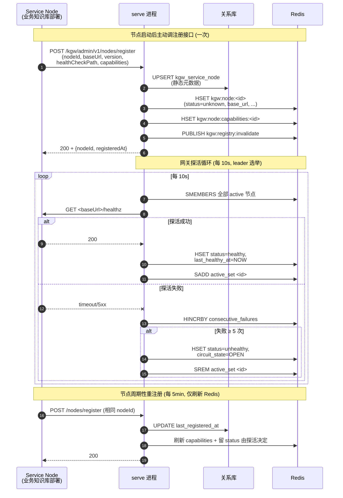
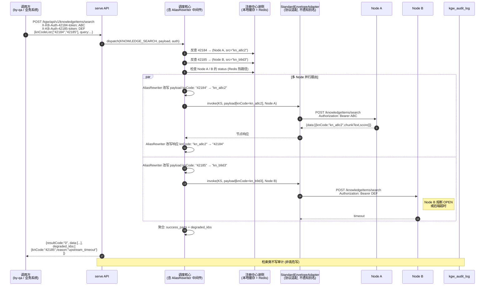
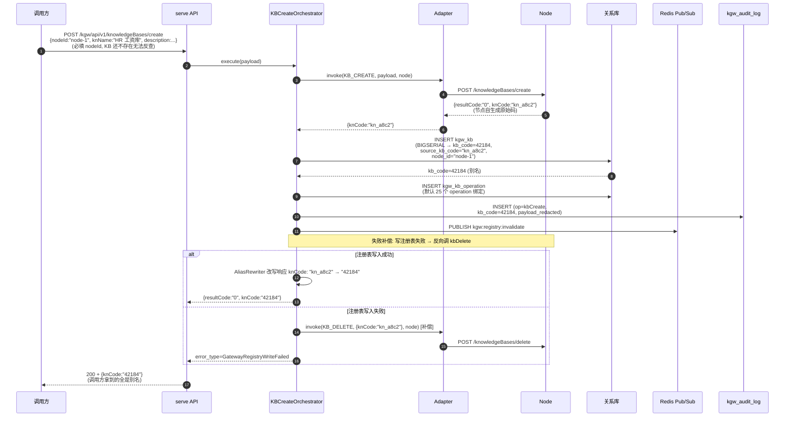
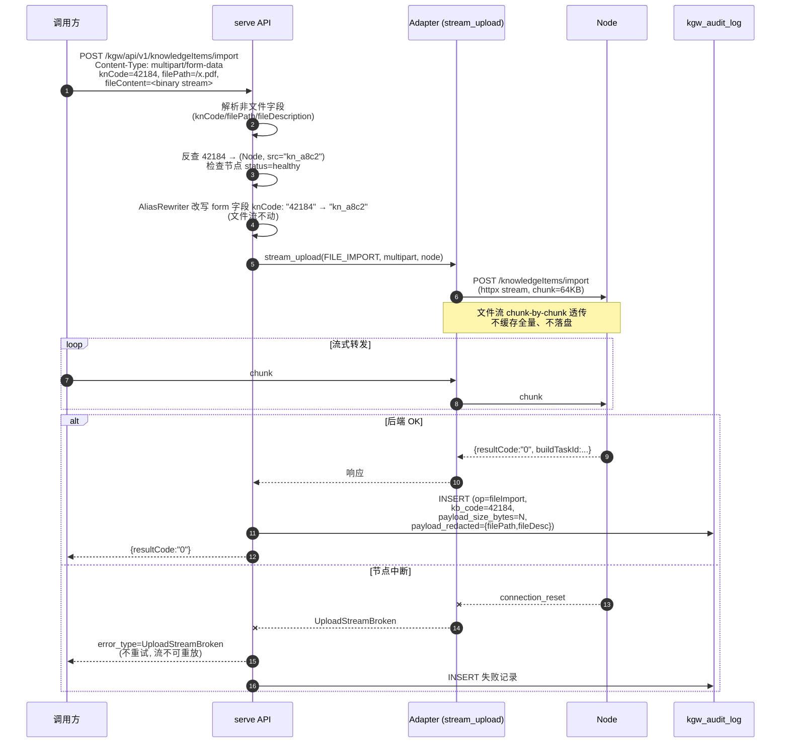
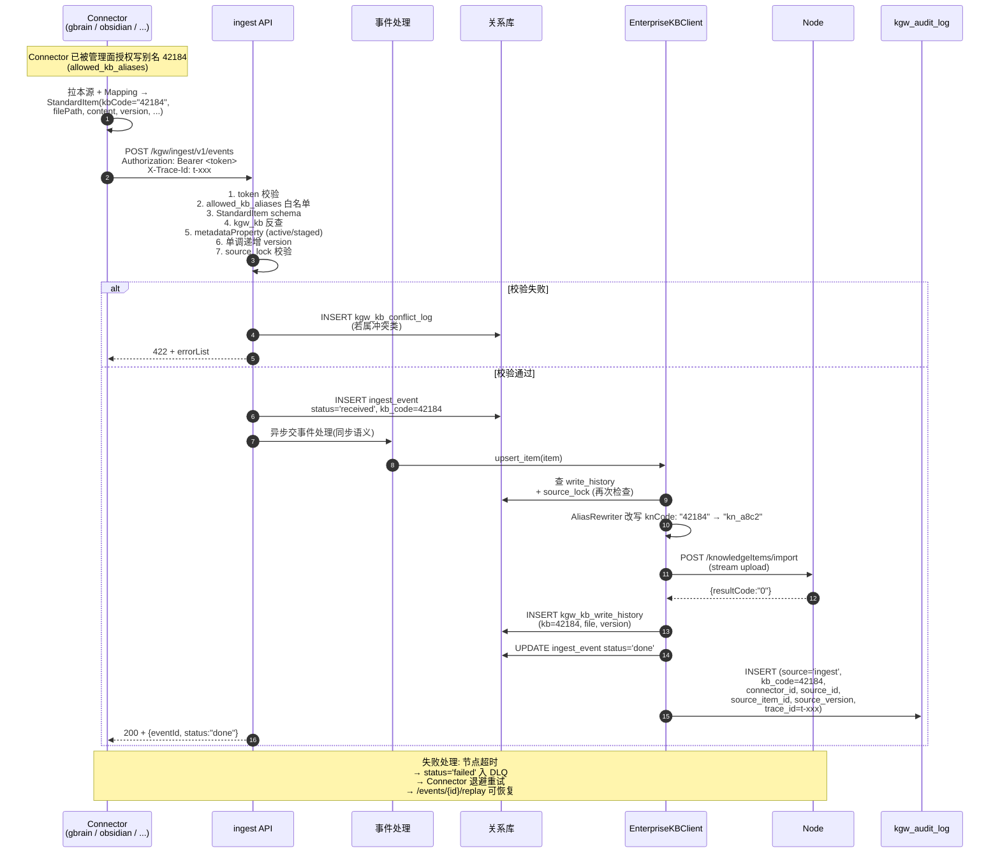
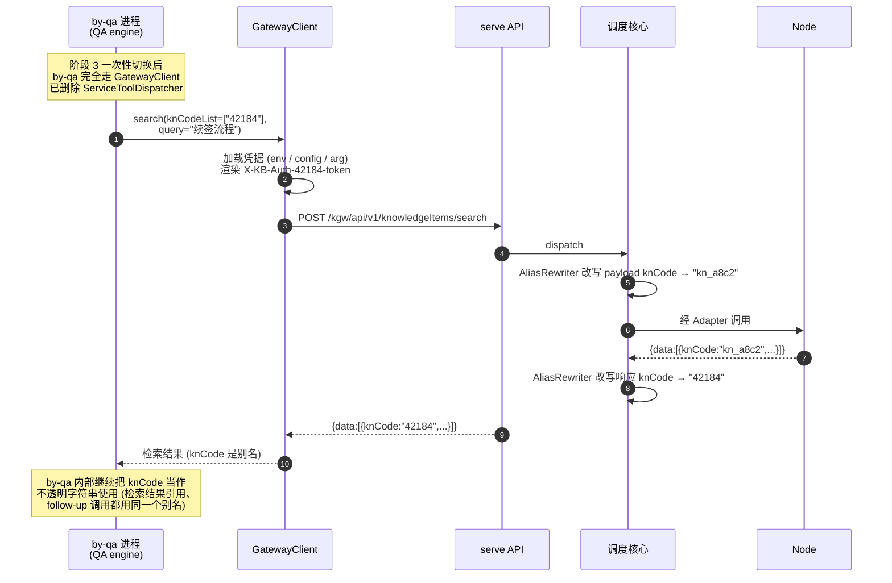
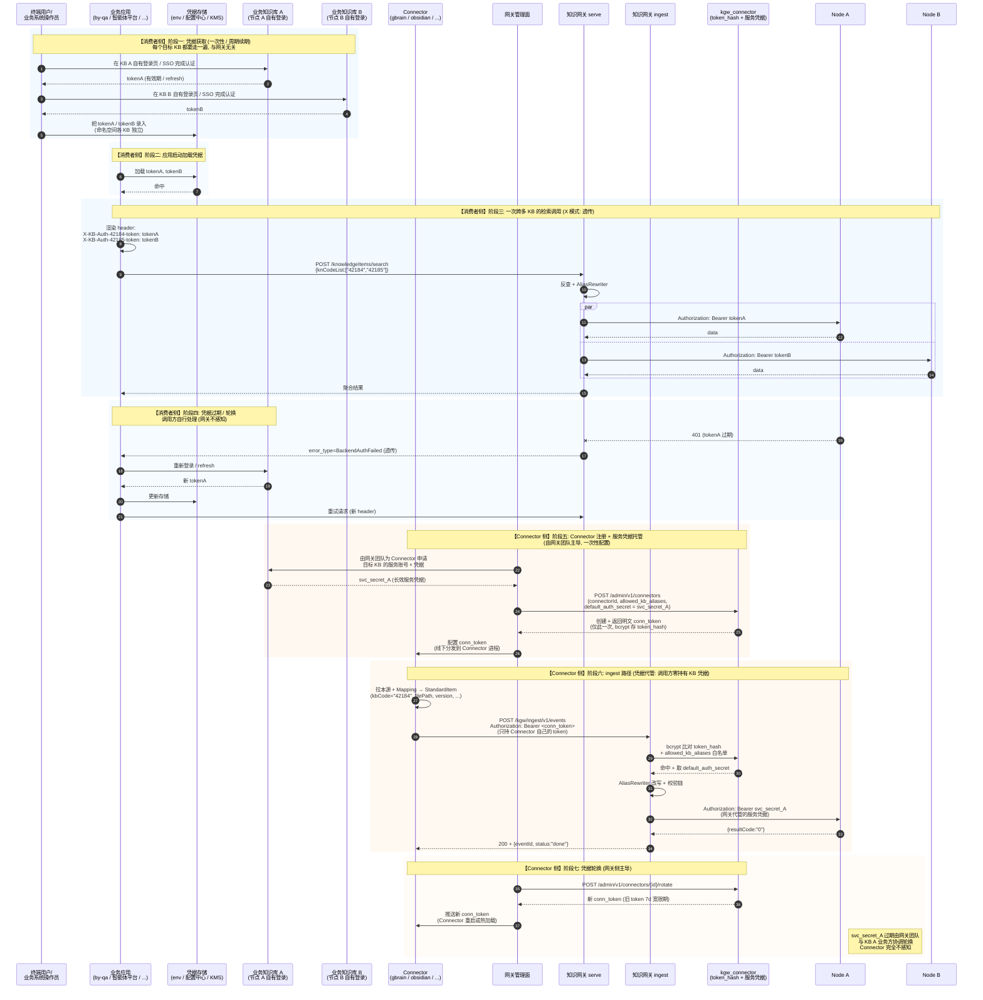

# 知识网关 (Knowledge Gateway) 设计文档 — v4.1

> 状态：草案 v4.1（独立可读，自包含）
> 日期：2026-06-01
> 作者：by-qa 团队
> 范围：本文档自包含，不依赖其他设计文档。涵盖网关定位、双进程架构（serve + ingest）、Service Node × KB 域模型、外部 Connector 契约、审计与可观测、迁移路径、风险与验收。
>
> v4 → v4.1 调整：
> - 取消 "Cluster" 概念。每个业务知识库部署 = 一个独立的 **Service Node** 端点
> - 新增 **节点注册接口 + 网关主动探活** 模型（节点首次自报到，之后由网关主动轮询 /healthz）
> - 节点静态元数据进关系库；节点动态状态/能力/配置进 Redis
> - 熔断粒度从 Cluster 改为 Service Node

---

## 1. 定位与边界

### 1.1 网关做什么

知识网关（Knowledge Gateway，KGW）是位于「消费者」与「企业标准 KB」之间的独立平台级服务，承担四项职责：

1. **企业知识标准口径**：以 OpenAPI 契约 + Agent DSL + 统一信封作为机读规范，所有 KB 实现都向这套规范对齐。规范覆盖现有业务知识库的全部 25 个对外端点（KB 管理、目录管理、文档管理、元数据属性、文件元数据、检索/读取、异步构建）。
2. **多服务节点标准分发**：每个业务知识库部署 = 一个独立的 **Service Node** 端点，节点自身可承载多个 KB。网关把 KB 路由到所属 Node，调用方一致透明。Node 启动时主动调用注册接口自报到，之后由网关主动轮询其 `/healthz` 端点探活；节点动态状态/能力/配置存 Redis，静态元数据存关系库。
3. **开源知识体系入企桥梁**：异构 KM 工具（gbrain / Obsidian / LogSeq / Notion 等）通过**外部 Connector 进程**单向 push 标准化事件到 ingest，由 ingest 写入企业 KB。**异构系统不在运行时链路上**——这是与早期 v3 蓝图最关键的方向变更。桥接是单向的：开源系统作为数据源，企业知识体系作为权威源。
4. **企业级运行保障**：高危写操作强制审计（payload 脱敏入库）、Service Node 级熔断、流式失败立即关连接不重试、请求级 trace、结构化日志、限流扩展点。

### 1.2 网关不做什么

- **不做异构 KB 的运行时协议适配**。Adapter 抽象保留，MVP 仅实现 `StandardEnvelopeAdapter` 一个；其他 Adapter 作为 P2+ 兜底，仅在现场确实出现「不能改造为标准 KB 的存量后端」时按需补，标记为低优先级。
- **不做凭据代管**。X 模式：调用方持凭据，网关只做 header 字段映射。任何「看起来需要凭据代管」的需求先回到 §9 重新审视。
- **不做 KB 级 ACL**。凭据即权限，无白名单；不维护「哪个消费者能调哪个 KB」。
- **不做异步任务管理器**。serve 路径上 节点后端持任务状态；ingest 路径上 ingest_event 事务表持事件状态——两路径状态查询接口分离（见 §5.6）。
- **不做 dry-run / 二次确认**。高危写操作直接透传，靠审计事后追溯。
- **不做应用层鉴权于消费者→网关之间**。网关南向部署在内网，靠网络隔离。
- **不感知节点内部副本数量**。Service Node 对外只暴露一个 endpoint，由节点自身用 nginx/SLB 收敛；网关把 node 当作单一调用对象。

### 1.3 关键决策概览（详见各对应章节）

| ID | 决策项 | 选择 | 章节 |
|---|---|---|---|
| D1 | 部署形态 | 独立平台级服务，**双进程**（serve + ingest） | §2 |
| D2 | 进程语言 | Python（FastAPI + uvloop + httpx），TypeScript 作为备选 | §13.3 |
| D3 | 注册表层次 | **Service Node → KB**（节点对外单端点；网关不感知节点内部副本） | §3 |
| D4 | 节点登记 | **节点首次自调注册接口** + 关系库静态元数据 + Redis 动态状态 | §3.5 / §4.4 |
| D5 | 节点探活 | **网关主动轮询节点 `/healthz`**（节点不发心跳） | §4.5 |
| D6 | Adapter 数量 | 仅 `StandardEnvelopeAdapter`；其他 P2+ 占位 | §4.3 |
| D7 | 异构知识体系接入 | **外部 Connector 进程 + push 模型 + Mapping 在 Connector 侧完成** | §6 |
| D8 | ingest 事件处理 | **同步处理 + 事务表**（POST → 落库 → 处理 → 应答） | §5 |
| D9 | 审计范围 | serve 写 + ingest 写**两路径**合并入同一审计库 | §7 |
| D10 | 韧性粒度 | **Service Node 级熔断** + degraded_kbs 标记（多 KB 并行） | §10 |
| D11 | 流式策略 | 失败立即关连接、不重试 | §10.2 |
| D12 | 凭据传递 | HTTP header（按 knCode 命名空间） + 网关零凭据存储 | §9 |
| D13 | 异步构建状态 | **双路径状态查询**（serve→Node；ingest→ingest_event） | §5.6 |
| D14 | by-qa 切换 | **一次性切换**（等价测试 + staging 灰度） | §12 |
| D15 | KB 创建 | 网关编排（节点后端 + 注册表双写 + 补偿），新增 `nodeId` 必填 | §4.2 |
| D16 | 大文件传输 | 流式代理（multipart 入 / octet-stream 出） | §4.3 |
| D17 | 南向 API 形态 | 路径与 25 个业务端点语义镜像 | §8 |
| D18 | 消费者形态 | **MVP 仅 HTTP API**；CLI/MCP 移至独立文档（后续阶段） | §11 |
| D19 | knCode 唯一性 | **企业全局别名（kgw_kb 自增主键）** + 网关透明字段改写；调用侧仍用 `knCode`，含义为别名 | §3.1 / §4.2.4 |
| D20 | Connector 别名授权 | 管理面手动配 `allowed_kb_aliases`，未授权 → 422 | §6.6 |
| D21 | Mapping 治理 | 规范文档（mapping-guide）+ Conformance Suite + CI 门控 | §6.8 |
| D22 | metadataProperty 自注册 | 允许自注册进 staged，需人工 promote 到 active | §5.10 |
| D23 | 多 Connector 写入冲突 | LWW + 单调递增版本 + 人工锁 + 冲突审计 | §6.9 |
| D24 | ingest 同步处理硬约束 | 4MB / 30s / 100 槽 / 30 RPS / ~1k events/s；队列 P1+ | §5.7 / §5.8 |
| D25 | 审计字段补全 | trace_id + 源头追溯字段（connector_id/source_*）+ 量级字段；不存 diff 全量 | §3.2 / §7 |

### 1.4 与早期 v3 蓝图的差异表

| 维度 | v3 | v4.1（本设计） |
|---|---|---|
| 异构后端形态 | 运行时 Adapter 翻译 | **离线 Connector 单向入库** |
| 注册表层次 | KB → Instance（节点自送心跳） | **Service Node → KB**（节点首次自报 + 网关主动探活） |
| 节点动态状态来源 | 关系库 + 内存 | **Redis（关系库仅静态元数据）** |
| Adapter 数量 | StandardEnvelope + RESTful + Elastic + ... | **StandardEnvelope 一个**（其他 P2+ 占位） |
| 实例熔断 | 实例粒度（节点心跳驱动） | **Service Node 粒度（网关探活驱动）** |
| ingest 子系统 | 无 | **独立进程 + Connector 契约 + 事务表 + DLQ** |
| 进程数 | 1（serve） | **2（serve + ingest）** |
| 心跳模型 | 节点主动续约 TTL | **节点首次注册一次；网关主动探活刷新 Redis** |
| 审计范围 | serve 高危写 11 个 | serve 高危写 + ingest 写**合并** |
| KB 创建参数 | knCode/name/description | **+ nodeId（必填）** |
| by-qa 切换 | 旁路并行 + 灰度切流 | **一次性切换** |

---

## 2. 顶层架构

### 2.1 总图（双进程 + 控制面存储）

```
┌────────────────────────────────────────────────────────────────────────┐
│  Layer 1 · 消费者接入层                                                  │
│                                                                          │
│  ┌──────────────────┐ ┌──────────────────┐ ┌────────────────────────┐  │
│  │ by-qa /          │ │ 业务系统 /       │ │ 管理后台 UI /           │  │
│  │ 智能体平台       │ │ 运维脚本         │ │ 其他 HTTP 客户端        │  │
│  └────────┬─────────┘ └────────┬─────────┘ └───────────┬────────────┘  │
└───────────┼────────────────────┼──────────────────────┼─────────────────┘
            │ HTTP+JSON 统一信封 / multipart / octet-stream
            ▼                    ▼                       ▼
┌────────────────────────────────────────────────────────────────────────┐
│  Layer 2 · 知识网关 — 双进程                                              │
│                                                                          │
│  ┌──────────────────────────────────┐  ┌──────────────────────────────┐│
│  │  serve 进程 (Python · FastAPI)   │  │  ingest 进程 (Python·FastAPI) ││
│  │  ──────────────────────────       │  │  ──────────────────────────  ││
│  │  · API 层 (25 个标准端点)         │  │  · 事件接收端点               ││
│  │  · 调度核心 (路由 → Node)      │  │  · 事务表 ingest_event       ││
│  │  · Adapter (StandardEnvelope)    │  │  · Schema 校验 (StandardItem) ││
│  │  · 注册中心读侧 (Node/KB)     │  │  · 写入编排 (调企业 KB API)   ││
│  │  · 韧性 (Service Node 级熔断)         │  │  · 幂等 / DLQ / 同步处理      ││
│  │  · 审计写入 (高危写)             │  │  · 审计写入 (ingest 写)       ││
│  │  · 可观测                        │  │  · Connector 注册/鉴权        ││
│  └──────────────┬───────────────────┘  └──────────────┬───────────────┘│
└─────────────────┼────────────────────────────────────┼─────────────────┘
                  │ HTTP+JSON / multipart / octet      │ HTTP+JSON
                  ▼                                    ▼
       ┌─────────────────────┐         ┌─────────────────────┐
       │  Service Node A  │         │  Service Node B  │ ...
       │  (by-qa knowledge_  │         │  (其他实现/可选)    │
       │   base 生产部署)    │         │                     │
       │  对外: 单 endpoint  │         │  对外: 单 endpoint  │
       └─────────────────────┘         └─────────────────────┘
                  ▲ ingest 写入                ▲ ingest 写入
                  │                            │
┌─────────────────┴────────────────────────────┴────────────────────────┐
│  Layer 3 · 外部 Connector 进程（任意语言/任意进程，由各源团队维护）       │
│  gbrain-connector · obsidian-connector · notion-connector · ...         │
│  实现 Connector OpenAPI 契约，主动 push 已 mapping 后的 StandardItem    │
└──────────────────────────────────────────────────────────────────────────┘

┌────────────────────────────────────────────────────────────────────────┐
│  Layer 4 · 控制面存储 (serve + ingest 共享)                              │
│  ┌────────────────────┐  ┌────────────────────┐  ┌─────────────────┐  │
│  │ OpenGauss/Postgres │  │ Redis              │  │ DLQ 表/队列     │  │
│  │ - kgw_service_node      │  │ - Pub/Sub (注册推送)│  │ - 失败事件死信   │  │
│  │ - kgw_kb           │  │ - 服务注册 (复用    │  │   归档,人工介入  │  │
│  │ - kgw_kb_op        │  │   by-framework)    │  │                  │  │
│  │ - kgw_auth_mapping │  │                    │  │                  │  │
│  │ - kgw_connector    │  │                    │  │                  │  │
│  │ - ingest_event     │  │                    │  │                  │  │
│  │ - kgw_audit_log    │  │                    │  │                  │  │
│  └────────────────────┘  └────────────────────┘  └─────────────────┘  │
└────────────────────────────────────────────────────────────────────────┘
```

### 2.2 双进程拆分理由

- **serve 关注低延迟读路径**（检索 / 元数据 / 浏览 / 读文件 / 下载 / 大文件流式代理）。资源画像 = CPU 中等 + IO 中高 + 内存稳定。水平扩展按 QPS。
- **ingest 关注吞吐型写路径**（事件接收 + 重抽子任务 + 大量 IO）。资源画像 = IO 高 + CPU 中等 + 内存有抖动（multipart/批量）。水平扩展按事件队列深度。
- 两进程共享同一控制面存储（注册表、审计、Connector 表），共享同一份 OpenAPI 规范，共享同一审计库；但**分别独立部署、独立扩缩容、独立发版**。
- 对外仍是「一套网关」语义；运维上是同一服务的两类 Pod（不同 Deployment）。

### 2.3 仓库与目录结构

新仓库 `by-knowledge-gateway`，同仓多 service：

```
by-knowledge-gateway/
├── pyproject.toml                  # 共享依赖
├── src/kgw_common/                 # 共享内核
│   ├── envelope.py                 # 统一信封 + 错误归一化
│   ├── operation_types.py          # OperationType enum
│   ├── auth_mapping.py             # header 字段映射规则
│   ├── audit/                      # 审计写入(serve+ingest 共用)
│   ├── registry/                   # 注册表 ORM + 缓存 + Pub/Sub
│   │   ├── models.py               # kgw_service_node / kgw_kb / kgw_kb_op / ...
│   │   ├── store.py                # 关系库 CRUD
│   │   ├── cache.py                # 本地缓存
│   │   └── pubsub.py               # Redis 失效广播
│   ├── http_client.py              # 统一 httpx 客户端 (含 stream)
│   └── observability/              # 日志 / 指标 / trace
│
├── src/kgw_serve/                  # serve 进程
│   ├── main.py                     # FastAPI app
│   ├── api/                        # 25 个南向端点 (路径镜像 api.md)
│   │   ├── knowledge_bases.py
│   │   ├── directories.py
│   │   ├── knowledge_items.py
│   │   ├── metadata_properties.py
│   │   ├── files.py                # listDir/glob/readFile/downloadFile/build*
│   │   ├── dsl_guide.py
│   │   └── admin.py                # 控制面 (node/kb 注册/鉴权映射)
│   ├── dispatcher.py               # 路由 → Node + 调度
│   ├── orchestrator.py             # KB 创建/删除编排
│   ├── operations/                 # 25 个 OperationSpec
│   ├── adapters/
│   │   ├── base.py
│   │   └── standard_envelope.py    # MVP 唯一 Adapter
│   └── resilience/                 # Service Node 级熔断 / 健康检查 / 流式失败处理
│
├── src/kgw_ingest/                 # ingest 进程
│   ├── main.py                     # FastAPI app
│   ├── api/                        # ingest 端点 (events/eventStatus/connector 注册)
│   ├── event_processor.py          # 同步处理: 校验 → 落库 → 写 KB → 标记
│   ├── enterprise_kb_client.py     # 调企业 KB 写接口 SDK
│   ├── schemas/standard_item.py    # StandardItem JSON Schema
│   ├── idempotency.py              # source_id+item_id+version 去重
│   ├── dlq.py                      # 死信处理
│   └── connector_registry.py       # Connector 注册/鉴权
│
├── spec/                           # OpenAPI 长期资产
│   ├── kgw-serve.openapi.yaml      # 25 个南向 + 控制面端点
│   ├── kgw-ingest.openapi.yaml     # 事件 + Connector 注册端点
│   ├── connector.openapi.yaml      # Connector 必须实现的契约
│   ├── schemas/
│   │   ├── envelope.yaml
│   │   ├── standard_item.yaml      # StandardItem schema (Connector→ingest 输入)
│   │   ├── agent_dsl.yaml
│   │   └── ...                     # 25 个 operation 请求/响应 schema
│   └── conformance/                # 黑盒测试套件 (Connector / 标准 KB 各一套)
│
├── cli/                            # Go 二进制 (kb-cli + mcp 子命令) — 见独立文档
│                                     # 2026-06-02-knowledge-gateway-cli-mcp.md
│                                     # 当前版本不实现, 仅占位
│   └── ... (沿用已有规划)
│
├── sdk-python/                     # Python 参考实现 (作为标准 KB 的接入示例)
│
├── docs/                           # 仓库内文档 (本设计的实施手册由 plan/ 输出)
└── deploy/                         # Dockerfile / k8s manifests
```

---

## 3. 核心域模型

### 3.1 实体关系（Service Node → KB → Operation Binding / Auth Mapping）

> **kbCode 别名机制（D19）**：调用方接口字段中的 `knCode / kbCode` 是**企业全局别名**——即下表 `kgw_kb.kb_code`（关系库自增主键）。节点内部的原始 knCode 存储在 `source_kb_code` 列，仅在网关与节点之间使用。运行时 Adapter 在请求/响应路径上做透明字段改写，调用方无需感知节点原始码。

```
┌──────────────────┐         ┌────────────────────────────┐
│  Service Node    │  1   N  │  KB                        │
│ ──────────────── │─────────│ ──────────────────────     │
│ nodeId (PK)      │         │ kbCode (PK, BIGSERIAL)     │← 调用方看到的别名
│ nodeName         │         │ sourceKbCode               │← 节点上的原始 knCode
│ description      │         │ nodeId (FK)                │
│ implementation   │         │ kbName                     │
│  (e.g.           │         │ description                │
│  "by-qa-kb")     │         │ owner / tags / status      │
│ baseUrl          │         │ UNIQUE(nodeId,             │
│ adapterName      │         │        sourceKbCode)       │
│ status           │         └────────────┬───────────────┘
└────────┬─────────┘                      │
         │ 1                              │ 1
         │                                │
         │ N                              │ N
         ▼                                ▼
┌──────────────────┐         ┌──────────────────┐
│ Auth Mapping     │         │ KB Operation     │
│ ──────────────── │         │ Binding          │
│ nodeId (PK)      │         │ ──────────────── │
│ consumerHeader   │         │ kbCode (PK)      │
│  (per-knCode     │         │ operationType(PK)│
│   templates)     │         │ pathTemplate     │
│ backendHeader    │         │ adapterConfig    │
│  (节点期望)      │         └──────────────────┘
└──────────────────┘
```

### 3.2 关系库 schema（DDL）

> 关系库只存**静态元数据**：Service Node 的登记信息、KB↔Node 绑定（含别名）、Operation 绑定、Auth 映射、Connector 登记、ingest 事件、审计。**节点动态状态（健康/能力/最新探活时间/configHints）见 §3.5 Redis 模型。**

```sql
-- Service Node: 一个业务知识库的部署端点; 静态元数据
CREATE TABLE kgw_service_node (
  node_id         VARCHAR(64) PRIMARY KEY,
  node_name       VARCHAR(128) NOT NULL,
  description     TEXT,
  implementation  VARCHAR(64) NOT NULL,           -- e.g. 'by-qa-knowledge-base'
  base_url        VARCHAR(256) NOT NULL,          -- 节点对外单端点 (节点内部副本由节点自隐藏)
  health_check_path VARCHAR(128) NOT NULL DEFAULT '/healthz',
  adapter_name    VARCHAR(64) NOT NULL DEFAULT 'standard_envelope',
  owner_team      VARCHAR(64),
  status          VARCHAR(16) NOT NULL DEFAULT 'active',  -- active / retired
  first_registered_at TIMESTAMPTZ DEFAULT NOW(),
  last_registered_at  TIMESTAMPTZ DEFAULT NOW(),
  created_at      TIMESTAMPTZ DEFAULT NOW(),
  updated_at      TIMESTAMPTZ DEFAULT NOW()
);

-- KB: 在某个 Service Node 上创建的具体知识库
-- kb_code = 调用方看到的「企业全局别名」(自增主键)
-- source_kb_code = 节点上的原始 knCode
CREATE TABLE kgw_kb (
  kb_code         BIGSERIAL PRIMARY KEY,
  source_kb_code  VARCHAR(64) NOT NULL,
  node_id         VARCHAR(64) NOT NULL REFERENCES kgw_service_node(node_id),
  kb_name         VARCHAR(128) NOT NULL,
  description     TEXT,
  owner           VARCHAR(64),
  tags            JSONB DEFAULT '[]',
  status          VARCHAR(16) NOT NULL DEFAULT 'active',
  created_at      TIMESTAMPTZ DEFAULT NOW(),
  updated_at      TIMESTAMPTZ DEFAULT NOW(),
  UNIQUE (node_id, source_kb_code)                -- 同节点内不重复绑定
);
CREATE INDEX idx_kgw_kb_node ON kgw_kb (node_id);
CREATE INDEX idx_kgw_kb_source ON kgw_kb (node_id, source_kb_code);  -- 反查 (node, src) → kb_code

-- Operation Binding: 每个 KB 支持哪些 operation, 路径模板/Adapter 配置
-- 注意: 这里的 kb_code 是别名 (kgw_kb.kb_code)
CREATE TABLE kgw_kb_operation (
  kb_code         BIGINT NOT NULL REFERENCES kgw_kb(kb_code) ON DELETE CASCADE,
  operation_type  VARCHAR(64) NOT NULL,
  path_template   VARCHAR(256),                   -- 默认 = api.md 路径
  config          JSONB DEFAULT '{}',
  PRIMARY KEY (kb_code, operation_type)
);

-- Auth Mapping: 节点级别 (而非 kb 级别) 的 header 字段映射
CREATE TABLE kgw_node_auth_mapping (
  node_id           VARCHAR(64) NOT NULL REFERENCES kgw_service_node(node_id) ON DELETE CASCADE,
  consumer_header   VARCHAR(128) NOT NULL,        -- e.g. "X-KB-Auth-<knCode>-token"
  backend_header    VARCHAR(128) NOT NULL,        -- e.g. "Authorization"
  backend_template  VARCHAR(128),                 -- e.g. "Bearer {value}"
  PRIMARY KEY (node_id, consumer_header)
);

-- Connector 注册 (ingest 用)
CREATE TABLE kgw_connector (
  connector_id    VARCHAR(64) PRIMARY KEY,
  connector_name  VARCHAR(128) NOT NULL,
  source_type     VARCHAR(64) NOT NULL,
  description     TEXT,
  token_hash      VARCHAR(128) NOT NULL,
  default_node_id VARCHAR(64) REFERENCES kgw_service_node(node_id),
  default_kb_code VARCHAR(64),                    -- 别名(kb_code 字符串化), 见 §6.6
  allowed_kb_aliases JSONB DEFAULT '[]',          -- Connector 被授权可写的别名集合 (议题 1.1)
  status          VARCHAR(16) NOT NULL DEFAULT 'active',
  created_at      TIMESTAMPTZ DEFAULT NOW()
);

-- KB 写入历史 (议题 3): 用于 version 单调性校验, 不存全量 payload
CREATE TABLE kgw_kb_write_history (
  kb_code         BIGINT NOT NULL,
  file_path       VARCHAR(512) NOT NULL,
  version         VARCHAR(64) NOT NULL,           -- 单调递增 (源端时间戳/递增序号)
  connector_id    VARCHAR(64),                    -- ingest 路径写入者; serve 路径置 NULL
  actor_id        VARCHAR(128),                   -- serve 路径写入者
  written_at      TIMESTAMPTZ DEFAULT NOW(),
  PRIMARY KEY (kb_code, file_path, written_at)
);
CREATE INDEX idx_kb_write_history_latest ON kgw_kb_write_history (kb_code, file_path, written_at DESC);

-- 人工写入锁 (议题 3): serve 路径写入默认设置, Connector 写不可覆盖
CREATE TABLE kgw_kb_source_lock (
  kb_code         BIGINT NOT NULL,
  file_path       VARCHAR(512) NOT NULL,
  lock_owner      VARCHAR(64) NOT NULL,           -- 'manual' 或 connector_id
  locked_at       TIMESTAMPTZ DEFAULT NOW(),
  expires_at      TIMESTAMPTZ,                    -- 可空表示永久; 管理面可显式 unlock
  PRIMARY KEY (kb_code, file_path)
);

-- 并行冲突日志 (议题 3): Connector 写入被 LWW/lock 拒绝时记录, 供管理面观察
CREATE TABLE kgw_kb_conflict_log (
  id              BIGSERIAL PRIMARY KEY,
  kb_code         BIGINT NOT NULL,
  file_path       VARCHAR(512) NOT NULL,
  current_writer  VARCHAR(64),                    -- 当前(已写入)的 connector 或 'manual'
  attempted_writer VARCHAR(64) NOT NULL,
  attempted_version VARCHAR(64),
  reason          VARCHAR(64) NOT NULL,           -- 'STALE_VERSION' / 'SOURCE_LOCKED' / 'KB_NOT_AUTHORIZED'
  attempted_at    TIMESTAMPTZ DEFAULT NOW()
);
CREATE INDEX idx_conflict_kb_time ON kgw_kb_conflict_log (kb_code, attempted_at DESC);

-- ingest 事件事务表
CREATE TABLE ingest_event (
  event_id        BIGSERIAL PRIMARY KEY,
  connector_id    VARCHAR(64) NOT NULL REFERENCES kgw_connector(connector_id),
  source_id       VARCHAR(128) NOT NULL,
  item_id         VARCHAR(256) NOT NULL,
  version         VARCHAR(64),
  op              VARCHAR(16) NOT NULL,
  node_id         VARCHAR(64) NOT NULL,
  kb_code         VARCHAR(64) NOT NULL,
  file_path       VARCHAR(512),
  payload         JSONB NOT NULL,
  status          VARCHAR(16) NOT NULL,
  error_type      VARCHAR(64),
  error_message   TEXT,
  retry_count     INTEGER DEFAULT 0,
  received_at     TIMESTAMPTZ DEFAULT NOW(),
  done_at         TIMESTAMPTZ,
  UNIQUE (connector_id, source_id, item_id, version)
);
CREATE INDEX idx_ingest_event_status ON ingest_event (status, received_at);
CREATE INDEX idx_ingest_event_kb ON ingest_event (node_id, kb_code, file_path);

-- 审计 (serve + ingest 共用)
-- kb_code 是别名 (议题 1: 全链路别名)
CREATE TABLE kgw_audit_log (
  id              BIGSERIAL PRIMARY KEY,
  source          VARCHAR(16) NOT NULL,           -- 'serve' / 'ingest'
  trace_id        VARCHAR(64),                    -- 跨进程全链路串联 (议题 7)
  actor_ip        INET,
  actor_kind      VARCHAR(32),                    -- 'consumer' / 'connector'
  actor_id        VARCHAR(128),                   -- consumer ip / actor_user / connector_id
  connector_id    VARCHAR(64),                    -- ingest 路径来源 Connector (议题 7)
  source_id       VARCHAR(128),                   -- Connector 报的源端实例 (议题 7)
  source_item_id  VARCHAR(256),                   -- 源端原始 itemId (议题 7)
  source_version  VARCHAR(64),                    -- 源端 version/etag (议题 7)
  operation_type  VARCHAR(64) NOT NULL,
  node_id         VARCHAR(64),
  kb_code         BIGINT,                         -- 别名 (BIGINT 与 kgw_kb.kb_code 类型一致)
  file_path       VARCHAR(512),
  payload_size_bytes BIGINT,                      -- 量级字段, 不存全量 payload (议题 7)
  row_count       INTEGER,                        -- batch 类操作的条目数 (议题 7)
  payload_redacted JSONB,                         -- 仅 metadata + 关键业务字段, 不全量
  result_code     VARCHAR(8),
  result_msg      TEXT,
  latency_ms      INTEGER,
  created_at      TIMESTAMPTZ DEFAULT NOW()
);
CREATE INDEX idx_audit_kb_time ON kgw_audit_log (kb_code, created_at DESC);
CREATE INDEX idx_audit_op_time ON kgw_audit_log (operation_type, created_at DESC);
CREATE INDEX idx_audit_source_time ON kgw_audit_log (source, created_at DESC);
CREATE INDEX idx_audit_trace ON kgw_audit_log (trace_id);
CREATE INDEX idx_audit_source_item ON kgw_audit_log (connector_id, source_id, source_item_id);
```

### 3.3 缓存与一致性

- **关系库**：节点静态元数据、KB 绑定、Auth 映射的唯一真源
- **Redis 状态空间**：节点动态状态（健康、能力、configHints、探活记录）的唯一真源（详见 §3.5）
- **网关本地缓存**：每个 serve / ingest 进程在内存里持有 node + kb + op + auth_mapping 的静态快照（启动时全量加载、接 Pub/Sub 失效广播）
- **Redis Pub/Sub**：管理面 CRUD 完成后发布 `kgw:registry:invalidate` 通知，所有进程刷新本地静态缓存（最终一致；Pub/Sub 失败时降级为 60s 定时全量刷新）
- **节点动态状态**：直接走 Redis 读，不进本地缓存（探活循环每 10s 刷新；任何 serve Pod 都能立刻看到最新状态）

### 3.5 Redis 节点状态模型

节点动态状态、能力、配置 Hint 全部存 Redis；关系库不重复存这些字段。

**Key 设计**

```
kgw:node:<nodeId>            HASH    节点完整动态状态 (无 TTL, 由网关探活循环写)
kgw:node:active_set          SET     当前 status=healthy 的 nodeId 集合 (路由快查)
kgw:node:capabilities:<id>   HASH    节点声明的能力 (注册时写, 节点重新注册可更新)
kgw:registry:invalidate      PUBSUB  注册表失效广播 channel
```

**`kgw:node:<nodeId>` HASH 字段**

| 字段 | 类型 | 来源 | 说明 |
|---|---|---|---|
| `status` | enum | 网关探活 | `healthy` / `unhealthy` / `unknown`（注册后未探活）/ `retired`（人工下线） |
| `last_healthy_at` | timestamp | 网关探活 | 最近一次探活成功时间 |
| `last_check_at` | timestamp | 网关探活 | 最近一次探活时间（成功或失败） |
| `consecutive_failures` | int | 网关探活 | 连续失败次数（用于熔断状态机） |
| `circuit_state` | enum | 网关 | `CLOSED` / `OPEN` / `HALF_OPEN` |
| `circuit_open_until` | timestamp | 网关 | 熔断器解除冷却的时间 |
| `last_register_at` | timestamp | 节点注册 | 节点最近一次调注册接口的时间 |
| `version` | string | 节点注册 | 节点上报的自身版本号 |
| `base_url` | string | 节点注册 | 节点 endpoint（与关系库一致；冗余存储便于路由热路径） |
| `health_check_path` | string | 节点注册 | 节点声明的健康检查路径（默认 `/healthz`）|

**`kgw:node:capabilities:<id>` HASH 字段**

| 字段 | 类型 | 说明 |
|---|---|---|
| `supports_streaming_upload` | bool | 是否支持 multipart 流式上传 |
| `supports_streaming_download` | bool | 是否支持 octet-stream 流式下载 |
| `supports_metadata_dsl` | bool | 是否支持元数据 DSL where 子句 |
| `supports_build_status` | bool | 是否支持异步构建状态查询 |
| `max_concurrent_imports` | int | 节点声明的并发上传上限（hint，网关侧限速参考） |
| `chunk_size_hint` | int | 节点偏好的流式 chunk 大小（默认 64KB） |
| `extra_capabilities` | JSON | 自由扩展键，节点可声明任意未来能力 |

**Key 生命周期**

- 节点首次调用注册接口（§4.4.5） → 写关系库 + 写 `kgw:node:<id>` (`status=unknown`) + 写 `kgw:node:capabilities:<id>` + Pub/Sub 广播
- 网关探活循环（§4.5.2） → 持续刷新 `kgw:node:<id>` 的 `status / last_healthy_at / consecutive_failures / circuit_state`
- 节点重新调用注册接口 → 视为更新（覆盖关系库 last_registered_at + 覆盖 capabilities + 重置 status=unknown 让下一轮探活决定）
- 人工调用 `POST /kgw/admin/v1/nodes/{id}/retire` → 关系库 `status=retired` + Redis hash `status=retired` + 从 active_set 移除（**不删 hash**，保留观测）

**Redis 重启的恢复**

Redis 重启后所有动态状态丢失。恢复策略：

1. 网关 serve 启动时从关系库扫一遍 `status=active` 的节点，写回 `kgw:node:<id>` 初始 hash（`status=unknown`，capabilities 留空）
2. 节点会在心跳间隔（默认 10s）内由探活循环重新探活；探活成功的节点回到 active_set
3. capabilities 信息在节点下次主动重新调用注册接口时刷新——为避免 capabilities 长时间缺失，节点 SDK 应该实现"周期性重新注册"（默认 5min 一次，作为兜底）

> 关系库不冗余 capabilities 是为了让节点能力变更只走一条写入路径（注册接口 → Redis），避免双写一致性问题。

### 3.6 Operation 全集（25 个）

完整对齐现有业务知识库的 25 个对外端点。**OperationType 仅作为网关内部 enum**，用于 Adapter 路由、注册表绑定、审计日志、Prometheus label。南向 API 路径直接镜像业务端点（前缀 `/kgw/api/v1`）。

| 类别 | OperationType | 业务端点 | 多 KB 并行 | 内容类型 | 强制审计 |
|---|---|---|---|---|---|
| 检索读取(9) | knowledgeSearch | /knowledgeItems/search | ✅ | JSON | — |
|  | metadataSearch | /knowledgeItems/metadataSearch | ✅ | JSON | — |
|  | searchFile | /knowledgeItems/searchFile | ✅ | JSON | — |
|  | metadataFieldsList | /knowledgeItems/metadataFields/list | ✅ | JSON | — |
|  | dslGuide | (网关本地) | — | JSON | — |
|  | listDir | /listDir | ❌ | JSON | — |
|  | glob | /glob | ❌ | JSON | — |
|  | readFile | /readFile | ❌ | JSON | — |
|  | downloadFile | /downloadFile | ❌ | octet-stream | — |
| KB 管理(3) | kbCreate | /knowledgeBases/create | ❌ | JSON | ✅ |
|  | kbUpdate | /knowledgeBases/update | ❌ | JSON | ✅ |
|  | kbDelete | /knowledgeBases/delete | ❌ | JSON | ✅ |
| 目录管理(3) | directoryCreate | /directories/create | ❌ | JSON | ✅ |
|  | directoryUpdate | /directories/update | ❌ | JSON | ✅ |
|  | directoryDelete | /directories/delete | ❌ | JSON | ✅ |
| 文档管理(2) | fileImport | /knowledgeItems/import | ❌ | multipart | ✅ |
|  | fileDelete | /knowledgeItems/delete | ❌ | JSON | ✅ |
| 元数据属性(4) | metadataPropertyCreate | /metadataProperties/create | ❌ | JSON | ✅ |
|  | metadataPropertyBatchCreate | /metadataProperties/batchCreate | ❌ | JSON | ✅ |
|  | metadataPropertyDelete | /metadataProperties/delete | ❌ | JSON | ✅ |
|  | metadataPropertyList | /metadataProperties/list | ❌ | JSON | — |
| 文件元数据(2) | fileMetadataUpdate | /knowledgeItems/metadata/update | ❌ | JSON | ✅ |
|  | fileMetadataGet | /knowledgeItems/metadata/get | ❌ | JSON | — |
| 异步构建(2) | buildTrigger | /fileToMarkdownIndex | ❌ | JSON | — |
|  | buildStatus | /fileBuildStatus | ❌ | JSON | — |

> 高危写操作（强制审计）合计 11 个，与流式 IO（multipart 入 / octet-stream 出）合计 2 个，多 KB 并行 4 个。

---

## 4. serve 进程

### 4.1 模块分层

```
┌──────────────────────────────────────────────────────────────────┐
│  4.1 API 层 (FastAPI 路由, 路径镜像 25 个业务端点)                  │
│  ────────────────────────────────────────────────                 │
│  /kgw/api/v1/knowledgeBases/{create,update,delete}                │
│  /kgw/api/v1/directories/{create,update,delete}                   │
│  /kgw/api/v1/knowledgeItems/{search,metadataSearch,searchFile,    │
│       import,delete,metadata/{get,update},metadataFields/list}    │
│  /kgw/api/v1/metadataProperties/{create,batchCreate,delete,list}  │
│  /kgw/api/v1/{listDir,glob,readFile,downloadFile,                 │
│       fileToMarkdownIndex,fileBuildStatus,dslGuide}               │
│  /kgw/admin/v1/* (控制面: node/kb/auth_mapping CRUD)           │
└─────────────────────────┬────────────────────────────────────────┘
                          ▼
┌──────────────────────────────────────────────────────────────────┐
│  4.2 调度核心 (dispatcher + orchestrator)                          │
│  · 路径 → OperationType 静态映射                                   │
│  · 路由 (nodeId 必填或从 KB 推断) → 选 Node                  │
│  · 多 KB 并行扇出 / 单 KB 直发                                     │
│  · KB 创建/删除编排器                                              │
│  · AliasRewriter 中间件 (kbCode 别名 ↔ source 透明改写, §4.2.4)    │
└─────────────────────────┬────────────────────────────────────────┘
                          ▼
┌──────────────────────────────────────────────────────────────────┐
│  4.3 Adapter 层 (StandardEnvelopeAdapter only, MVP)                │
│  · build_request / process_response (协议适配, 不感知别名)         │
│  · stream_upload (multipart) / stream_download (octet-stream)      │
│  · header 字段映射 (X-KB-Auth-* → 后端期望 header)                 │
└─────────────────────────┬────────────────────────────────────────┘
                          ▼
┌──────────────────────────────────────────────────────────────────┐
│  4.4 注册中心读侧 (kgw_common.registry 共享)                        │
│  · node / kb / op binding / auth mapping 缓存                   │
│  · Pub/Sub 失效处理                                                │
└─────────────────────────┬────────────────────────────────────────┘
                          ▼
┌──────────────────────────────────────────────────────────────────┐
│  4.5 韧性层                                                         │
│  · Service Node 级熔断器 (CLOSED/OPEN/HALF_OPEN)                        │
│  · 健康检查 (定时打 node /healthz)                              │
│  · degraded_kbs 标记 (多 KB 并行操作)                              │
│  · 流式失败立即关连接, 不重试                                      │
└─────────────────────────┬────────────────────────────────────────┘
                          ▼
┌──────────────────────────────────────────────────────────────────┐
│  4.6 可观测层 (kgw_common.observability + audit)                   │
│  · 结构化日志 / Prometheus / OpenTelemetry                         │
│  · 审计写入 (高危写 11 个 operation, source='serve')               │
└──────────────────────────────────────────────────────────────────┘
```

### 4.2 调度核心

#### 4.2.1 路由解析

南向请求进入 → 路径表查 OperationType → 解析 payload 中的 `knCode / knCodeList`（**调用方主要只传别名 knCode**，网关反查节点）：

> **网关价值的体现**：除 `kbCreate` 外，**所有 24 个 operation 调用方都不需要传 nodeId**——只传 `knCode`（别名）即可。网关从 `kgw_kb` 反查到所属节点，对调用方完全透明。这是 D19 别名机制带来的核心便利：调用方拿到一个全局唯一的 knCode 后，KB 跨节点迁移、节点重命名、节点能力变更全部在网关侧消化，调用方零感知。

- **多 KB 并行 operation**（`knowledgeSearch / metadataSearch / searchFile / metadataFieldsList`）：调用方传 `knCodeList`（一组别名）；网关查注册表得每个别名对应的 `(node_id, source_kb_code)`，按 node 分组并发分发，结果聚合时附 `degraded_kbs`。同一 list 中的 KB 可跨节点。
- **单 KB operation**（其他 20 个）：调用方传 `knCode`（别名）；网关查注册表反解到节点。
- **kbCreate**：唯一需要显式传 `nodeId` 的端点（KB 还不存在，无法反查）；调用方拿到的 `resultObject.knCode` 是新分配的别名（自增 ID）。
- **dslGuide**：网关本地直接返回，不进调度核心后续步骤。
- **KB 创建**：调用方必须显式传 `nodeId`（无法从 KB 反查，因为 KB 还不存在）。
- **dslGuide**：网关本地直接返回，不进调度核心后续步骤。

#### 4.2.2 三种执行模型

```
执行模型 ─┬─ 多 KB 并行 (4 个)
          │   按 Node 分组 → asyncio.gather → 各 Node 内顺序调多个 KB
          │   单 Node 失败不阻塞, 写入 degraded_kbs
          │
          ├─ 单 KB 直发 (大多数)
          │   定位 Node → 查熔断状态 → 调 node endpoint
          │   节点熔断 OPEN 时直接返回 AllInstancesUnhealthy
          │
          └─ 编排 (kbCreate/Update/Delete)
              节点后端调用 + 注册表写入双步骤; 第二步失败时反向补偿
```

#### 4.2.3 KB 创建编排器（伪代码）

```python
class KBCreateOrchestrator:
    async def execute(self, payload, auth):
        node_id = payload["nodeId"]                        # 必填
        node = await registry.get_node(node_id)
        if node is None:
            return error_envelope("NodeNotFound", node_id)

        # ① 调节点后端创建 KB; 此处不带 knCode (节点自生成)
        backend_resp = await adapter.invoke(
            op=KB_CREATE, payload=payload, node=node, auth=auth
        )
        if backend_resp["resultCode"] != "0":
            return backend_resp                            # 直接返回, 不写注册表

        source_kb_code = backend_resp["resultObject"]["knCode"]   # 节点原始 knCode

        try:
            # ② 写网关注册表; kb_code 由 BIGSERIAL 自增生成 (= 企业全局别名)
            kb_row = await registry.create_kb(
                node_id=node_id,
                source_kb_code=source_kb_code,
                kb_name=payload["knName"],
                description=payload.get("description"),
                owner=auth.actor_id,
                status="active",
            )
            alias_kb_code = str(kb_row.kb_code)            # e.g. "42184"
            await registry.bind_default_operations(kb_code=kb_row.kb_code, node=node)

            # ③ 写审计 (kb_code 用别名, 便于跨节点统一查询)
            await audit.write(source="serve", op="kbCreate",
                              node_id=node_id, kb_code=alias_kb_code, payload=payload)

            # ④ 通知缓存
            await pubsub.publish("kgw:registry:invalidate",
                                 {"kbCode": alias_kb_code})

        except Exception as e:
            # ⑤ 补偿: 反向调节点后端 kbDelete; 此处用节点原始 knCode
            try:
                await adapter.invoke(op=KB_DELETE,
                                     payload={"knCode": source_kb_code},
                                     node=node, auth=auth)
            except Exception as ce:
                logger.error("compensation_failed",
                             source_kb_code=source_kb_code, err=str(ce))
            raise GatewayRegistryWriteFailed(...) from e

        # ⑥ 改写返回 payload: knCode 改为别名后返回调用方
        backend_resp["resultObject"]["knCode"] = alias_kb_code
        return backend_resp
```

`KBUpdateOrchestrator` / `KBDeleteOrchestrator` 同构，区别在于：调用方传别名 → 网关查 `kgw_kb` 反解到 `(node_id, source_kb_code)` → 调节点后端时 payload 里把 knCode 改写为 `source_kb_code` → 返回时再改写回别名（对 update/delete 而言响应中通常无 knCode 字段，仅成功标记）。

#### 4.2.4 AliasRewriter 调度中间件（kbCode 别名透明改写）

调用方接口中的 `knCode / kbCode / knCodeList` 字段是**企业全局别名**（即 `kgw_kb.kb_code`，自增主键）。别名改写是**网关层与具体节点协议无关的公共逻辑**，因此实现为调度核心的中间件，在 Adapter 调用前后各织入一次；Adapter 自身只负责协议适配（envelope 编解码、header 字段映射、path_template 拼装），不感知别名。

```
                ┌─────────────────────────────────────────────┐
                │            调度核心 Dispatcher              │
                │  ┌───────────────────────────────────────┐  │
请求 (含别名) ──▶│  │ AliasRewriter.rewrite_request()       │  │
                │  │   payload[knCode/...] 别名 → source   │  │
                │  └─────────────────┬─────────────────────┘  │
                │                    ▼                        │
                │  ┌───────────────────────────────────────┐  │
                │  │ Adapter.invoke / stream_*             │──┼─▶ Node
                │  │   (协议适配, 不感知别名)              │  │
                │  └─────────────────┬─────────────────────┘  │
                │                    ▼                        │
                │  ┌───────────────────────────────────────┐  │
                │  │ AliasRewriter.rewrite_response()      │  │
                │  │   response[knCode/...] source → 别名  │  │
                │  └─────────────────┬─────────────────────┘  │
                └────────────────────┼────────────────────────┘
                                     ▼
                            响应 (改回别名)
```

**改写规则**

| 字段位置 | 改写方向 | 备注 |
|---|---|---|
| 请求 payload `knCode / kbCode` | 别名 → source | 单 KB 操作 |
| 请求 payload `knCodeList[]` | 逐个别名 → source | 多 KB 并行；按 node 分组分发 |
| 请求 multipart form `knCode` 字段 | 别名 → source | fileImport 上传 |
| 响应 `resultObject.knCode` | source → 别名 | KB 创建返回新 KB 的 knCode |
| 响应 `resultObject.data[*].knCode` | source → 别名 | 检索结果中的 knCode |
| 响应 `degraded_kbs[*].knCode` | 已是别名 | 网关聚合时直接写，不改 |
| 错误响应 `errorList[*].path` | 不改写 | 透传节点错误结构 |

**实现位置**

- 中间件实现在 `kgw_serve.dispatcher.middleware.alias_rewriter`，对所有 Adapter（含 P2+ `RESTfulAdapter` / `ElasticAdapter`）一致生效，不在每个 Adapter 内重复实现
- 改写规则按 OperationSpec 配置（每个 operation 在 `request_aliasable_fields` / `response_aliasable_fields` 中声明 JSONPath），运行时按规则应用
- multipart 上传：中间件只改写表单中的 `knCode` 字段，文件流不动
- octet-stream 下载：响应是二进制流，无字段改写；只需改写请求 payload

**别名 → source 反查的缓存**

- 别名是 `kgw_kb.kb_code`（自增主键），反查到 `(node_id, source_kb_code)` 是热路径
- 注册中心读侧（§4.4.1）的本地缓存预先建好正反索引：`{kb_code → KbRow}` 与 `{(node_id, source_kb_code) → kb_code}`
- 缓存命中率应接近 100%；miss 时回关系库并回填

**KB 创建路径上的特殊处理**

- 调用方调 `kbCreate` 时**不传 knCode**（节点会自生成），中间件请求阶段无字段可改
- 节点返回 `source_kb_code` → 编排器写 `kgw_kb` 拿到自增 `kb_code`（别名）→ 中间件响应阶段把 `resultObject.knCode` 改写为别名
- 调用方拿到的 `resultObject.knCode = "42184"`（别名）

**ingest 路径复用**

- ingest 进程中的 `EnterpriseKBClient`（§5.4）调节点前后织入**同一份 AliasRewriter**，serve / ingest 共享一份实现，不重写
- 这是"与节点交互的瞬间是全链路上唯一一次别名换原始码的位置"在两条路径上的统一保证

### 4.3 Adapter 层

> Adapter 只负责**协议适配**（envelope 编解码、multipart / octet-stream 流处理、header 字段映射、path_template 拼装），**不感知别名**。别名 ↔ source_kb_code 的双向改写由 §4.2.4 的 AliasRewriter 中间件在 Adapter 调用前后织入；新增 Adapter 实现（P2+）时无需重复实现别名逻辑。

#### 4.3.1 抽象接口

```python
class Adapter(ABC):
    name: ClassVar[str]

    async def invoke(
        self, op: OperationType, payload: dict,
        node: ServiceNode
    ) -> dict: ...

    async def stream_upload(
        self, op: OperationType, multipart_stream: AsyncIterator[Part],
        node: ServiceNode
    ) -> dict: ...

    async def stream_download(
        self, op: OperationType, payload: dict,
        node: ServiceNode
    ) -> AsyncIterator[bytes]: ...
```

#### 4.3.2 StandardEnvelopeAdapter（MVP 唯一实现）

- **JSON 类**：从注册表查 `path_template`（默认 = api.md 路径），用 node.base_url + path_template 拼 URL，body 透传，按 `kgw_service_node_auth_mapping` 把 `X-KB-Auth-*` header 渲染成后端期望的 header（如 `Authorization: Bearer {value}`），httpx POST。
- **multipart 上传**：`httpx.AsyncClient.stream("POST", ..., files=...)` 把 stream 透传给 node；网关只解析非文件字段（knCode/filePath/fileDescription）做路由 + 审计，**文件字段直接 forward**，chunk buffer 默认 64KB，不缓存全量。
- **octet-stream 下载**：`async for chunk in resp.aiter_bytes()` 转发给调用方，透传 `Content-Disposition` 头。

#### 4.3.3 P2+ 占位

抽象基类 `Adapter` 与注册表的 `node.adapter_name` 字段保留扩展点。当现场出现确实无法改造为标准 KB 的存量后端时，新增 Adapter 实现（如 `RESTfulAdapter`、`ElasticAdapter`）并在 节点注册时指定 `adapter_name`。**MVP 不实现**，标记为 P2+ 低优先级。新增 Adapter 不需要实现别名改写——AliasRewriter（§4.2.4）已在 Adapter 之外统一处理。

### 4.4 注册中心读侧（共享 kgw_common.registry）

#### 4.4.1 静态缓存

- 启动时全量加载 node / kb / kb_operation / node_auth_mapping 到本地内存
- 订阅 `kgw:registry:invalidate` channel；收到通知后按 key（kbCode 或 nodeId）增量刷新
- Pub/Sub 失败时降级为 60s 定时全量刷新
- 暴露只读接口给调度核心（`get_node(node_id)`, `get_kb(kn)`, `list_kbs_in_node(node_id)`, `get_op_binding(kn, op)`, `get_auth_mapping(node_id)`）

#### 4.4.2 动态状态读取

- 节点动态状态（`status / capabilities / circuit_state / consecutive_failures` 等）**直接走 Redis 读**，不进本地缓存
- 调用方接口：`get_node_runtime(node_id) -> NodeRuntime`，从 `kgw:node:<node_id>` HASH + `kgw:node:capabilities:<node_id>` HASH 合并返回
- 路由前热路径：`if get_node_runtime(node_id).status != 'healthy': raise NodeUnavailable`
- 多 KB 并行的预筛：从 `kgw:node:active_set` SET 一次拿到所有健康节点，过滤目标节点列表

#### 4.4.3 节点注册接口

节点启动后必须主动调用一次注册接口告诉网关「我在这里」；之后网关接管探活与状态维护，节点不再续约。

```http
POST /kgw/admin/v1/nodes/register
Content-Type: application/json

{
  "nodeId": "by-qa-knowledge-base-prod-1",
  "nodeName": "by-qa KB (生产环境)",
  "implementation": "by-qa-knowledge-base",
  "baseUrl": "http://kb-svc.prod.internal:8080",
  "version": "0.1.12",
  "ownerTeam": "knowledge-platform",
  "healthCheckPath": "/healthz",
  "adapterName": "standard_envelope",
  "capabilities": {
    "supportsStreamingUpload": true,
    "supportsStreamingDownload": true,
    "supportsMetadataDsl": true,
    "supportsBuildStatus": true,
    "maxConcurrentImports": 16,
    "chunkSizeHint": 65536,
    "extraCapabilities": {}
  }
}
```

**网关侧处理**

```
1. 校验 nodeId 格式 + adapterName 已知 + baseUrl 可解析
2. 关系库 UPSERT kgw_service_node:
     · 首次写入: INSERT (created_at = first_registered_at = NOW)
     · 已存在: UPDATE last_registered_at = NOW + 其他静态字段
3. Redis HSET kgw:node:<id>:
     status = unknown   (留待探活循环决定)
     base_url, health_check_path, version, last_register_at = NOW
     consecutive_failures = 0
     circuit_state = CLOSED
4. Redis HSET kgw:node:capabilities:<id>:
     按 capabilities 字段写入
5. Redis PUBLISH kgw:registry:invalidate {nodeId}
6. 返回 200 + { nodeId, registeredAt }
```

**响应**

```json
{
  "resultCode": "0",
  "resultMsg": "success",
  "resultObject": {
    "nodeId": "by-qa-knowledge-base-prod-1",
    "registeredAt": "2026-06-01T12:00:00Z",
    "expectedHealthCheckIntervalSeconds": 10
  }
}
```

**重新注册**

节点能力变更（升级版本、新增/移除 capabilities）→ 节点直接重新调用同一接口。同 nodeId 视为更新；网关的处理与首次注册一致，区别只在关系库 INSERT vs UPDATE。

**周期性兜底重新注册**

- 节点 SDK 默认每 5 分钟重新注册一次（仅写 Redis 不变更关系库），用于 Redis 重启后恢复 capabilities
- 这与心跳的关键差别：**周期性重注册不影响节点 status**（status 由网关探活决定）；它只是补齐 capabilities 信息

### 4.5 韧性层

#### 4.5.1 Service Node 级熔断器

```
            ┌────────────────────┐
            │       CLOSED       │ ◄────────────────┐
            │   (正常服务)       │                  │
            └─────────┬──────────┘                  │
                      │                             │
        连续失败 ≥ 阈值│                             │ 探测成功
                      ▼                             │
            ┌────────────────────┐                  │
            │       OPEN         │                  │
            │ (跳过 N 秒)        │                  │
            └─────────┬──────────┘                  │
                      │                             │
              冷却时间到期│                          │
                      ▼                             │
            ┌────────────────────┐                  │
            │     HALF-OPEN      │ ─────────────────┘
            │ (放行单次探测)     │
            └─────────┬──────────┘
                      │
              探测失败 │
                      ▼
                  回到 OPEN
```

- 阈值默认：连续失败 N=5 → OPEN（节点通常承载多 KB，阈值高于 v3 的实例级熔断）
- OPEN 时长：30s
- HALF-OPEN：放行单个真实请求作为探测；该请求结果决定下次状态
- 熔断状态写 `kgw:node:<id>` HASH 的 `circuit_state / circuit_open_until / consecutive_failures`，serve 路由热路径直接读 Redis 判断

#### 4.5.2 健康检查（网关主动探活）

- 节点**不主动发心跳**，由网关 serve 进程定时（默认 10s）轮询每个 status≠retired 的节点
- 探活方式：`GET <node.base_url><node.health_check_path>`（默认 `/healthz`），HTTP 2xx 视为健康
- 成功 → 写 Redis：`status=healthy, last_healthy_at=NOW, consecutive_failures=0`，加入 `kgw:node:active_set`
- 失败 → 写 Redis：`consecutive_failures += 1, last_check_at=NOW`；达到阈值进 OPEN 状态并从 active_set 移除
- HALF-OPEN 探测命中：用 `GET /healthz` 而不是真实业务流量，避免污染调用方
- 探活循环由所有 serve Pod 中的**单一 leader** 执行（用 Redis 分布式锁选举），避免 N 个 Pod 重复探活同一节点
- 节点声明的 healthCheckPath 可被覆盖（节点更熟悉自己暴露的探活端点）；未声明则用默认 `/healthz`

#### 4.5.3 多 KB 并行的 degraded_kbs

```python
async def parallel_dispatch(op, kn_codes, payload, auth):
    by_node = group_kbs_by_node(kn_codes)
    tasks = [
        dispatch_in_node(node_id, kbs, op, payload, auth)
        for node_id, kbs in by_node.items()
    ]
    results = await asyncio.gather(*tasks, return_exceptions=True)

    success_parts, degraded = [], []
    for node_id, res in zip(by_node.keys(), results):
        if isinstance(res, Exception):
            for kn in by_node[node_id]:
                degraded.append({"knCode": kn, "nodeId": node_id,
                                 "reason": classify(res), "detail": str(res)})
        else:
            success_parts.extend(res)
    return op.aggregate(success_parts, degraded_kbs=degraded)
```

`degraded_kbs` 只出现在多 KB 并行 operation 的响应中；单 KB 操作失败直接返回错误信封。

### 4.6 流式失败处理

- **上传中断**（节点后端断连）：网关立即关闭与后端的连接 → 返回 `error_type=UploadStreamBroken` 统一信封；**不重试**（流不可重放）；熔断器记一次失败。
- **下载中断**（节点后端断连）：已发送的 chunk 不可回滚；网关关闭与调用方的连接 → 调用方收到提前 EOF（可对比 Content-Length 感知）；网关日志记录中断字节数。
- **调用方主动断连**（上传途中）：网关停止从调用方继续读，关闭与 node 的连接，记录 `aborted_by_consumer=true`。

### 4.7 错误归一化

| error_type | 触发场景 | HTTP 状态 |
|---|---|---|
| `OperationNotSupported` | KB 未绑定该 operation | 200（统一信封 resultCode=-1） |
| `NodeNotFound` | nodeId 在注册表中不存在 | 200 |
| `KBNotFound` | knCode 在注册表中不存在 | 200 |
| `AllInstancesUnhealthy` | 节点熔断 OPEN 或健康检查失败 | 200 |
| `AdapterError` | Adapter 内部错误（路径模板缺失、协议翻译失败） | 200 |
| `UpstreamTimeout` | 节点后端超时 | 200 |
| `UpstreamConnectError` | 节点后端连接失败 | 200 |
| `UploadStreamBroken` | 上传流式转发中断 | 200 |
| `DownloadStreamBroken` | 下载流式转发中断 | 部分发送后 + 连接关闭 |
| `GatewayRegistryWriteFailed` | KB 创建编排注册表写失败 + 补偿尝试 | 200 |
| `DSL_VALIDATION_ERROR` | 透传 节点后端的 DSL 错误 | 200 |

---

## 5. ingest 进程

### 5.1 定位

ingest 进程是网关「数据入库子系统」，承接外部 Connector push 进来的标准化事件，写入企业 KB。**ingest 不主动调度 pull、不做 Mapping、不持有源端 cursor**：

- **被动接收**：所有事件由 Connector 主动 push（HTTP POST）；ingest 不发起拉取请求。
- **不做 Mapping**：Connector 进入 ingest 时，payload 必须已经是 `StandardItem` 形态（企业字段：knCode/filePath/title/content/metadata/perms/version 等）。Mapping 在 Connector 进程内完成（见 §6）。
- **不持游标**：增量同步状态由 Connector 自己持久化；ingest 只持事件级幂等表（`connector_id + source_id + item_id + version` 去重）。

ingest 的核心职责只有四件：**接收 → 校验 → 落库 → 写企业 KB**。

### 5.2 模块分层

```
┌──────────────────────────────────────────────────────────────────┐
│  5.1 API 层 (FastAPI)                                              │
│  · POST /kgw/ingest/v1/events           Connector push 事件        │
│  · POST /kgw/ingest/v1/events/batch     批量 push (可选优化)       │
│  · POST /kgw/ingest/v1/events/{id}/replay  重放 DLQ                │
│  · GET  /kgw/ingest/v1/events/{id}      查询单事件状态             │
│  · GET  /kgw/ingest/v1/events           按 (connector,source,item) │
│                                              查询事件列表          │
│  · POST /kgw/ingest/v1/connectors       Connector 注册 (admin)     │
│  · GET  /kgw/ingest/v1/connectors/{id}  Connector 详情             │
│  · GET  /healthz / /metrics                                        │
└─────────────────────────┬────────────────────────────────────────┘
                          ▼
┌──────────────────────────────────────────────────────────────────┐
│  5.2 鉴权层                                                         │
│  · 解析 Authorization: Bearer <connector_token>                    │
│  · 校验 token (bcrypt 比对 kgw_connector.token_hash)               │
│  · 注入 connector_id 到请求上下文                                  │
└─────────────────────────┬────────────────────────────────────────┘
                          ▼
┌──────────────────────────────────────────────────────────────────┐
│  5.3 校验层                                                         │
│  · StandardItem JSON Schema 校验 (字段/类型/必填)                  │
│  · 路由字段校验 (nodeId 存在 / kbCode 存在且属该 node)       │
│  · 元数据字段校验 (引用的 metadataProperty 是否已注册)             │
│  · 校验失败 → 立即返回 422 + errorList, 不落库                     │
└─────────────────────────┬────────────────────────────────────────┘
                          ▼
┌──────────────────────────────────────────────────────────────────┐
│  5.4 事件处理 (同步处理 + 事务表)                                  │
│  · 写 ingest_event (status='received')                             │
│  · 幂等检查 (UNIQUE 冲突 → 直接返回 already-processed)             │
│  · 调 EnterpriseKBClient 写企业 KB                                 │
│  · 成功 → status='done'; 失败 → status='failed' + DLQ              │
│  · 写审计 (source='ingest')                                        │
└─────────────────────────┬────────────────────────────────────────┘
                          ▼
┌──────────────────────────────────────────────────────────────────┐
│  5.5 EnterpriseKBClient                                             │
│  · 内部使用与 serve 相同的 Adapter 抽象 (StandardEnvelopeAdapter)  │
│  · 复用 §4.2.4 的 AliasRewriter 中间件做别名 ↔ source 双向改写      │
│  · 复用 node 注册表与 auth_mapping                              │
│  · 调企业 KB 写接口: kbCreate (条件性) / fileImport / fileDelete / │
│    fileMetadataUpdate / directoryCreate / ...                      │
│  · 上传走 multipart 流式 (与 serve 流式代理相同语义)               │
└─────────────────────────┬────────────────────────────────────────┘
                          ▼
┌──────────────────────────────────────────────────────────────────┐
│  5.6 DLQ                                                            │
│  · 失败事件归档到 ingest_event (status='failed') + 告警            │
│  · /events/{id}/replay 端点支持人工或脚本重试                      │
│  · 重试时清除 status, 走完整处理流程; 重试次数累计                  │
└──────────────────────────────────────────────────────────────────┘
```

### 5.3 事件处理流程（同步路径）

```
Connector                  ingest API           ingest Processor      Service Node KB
   │                          │                       │                  │
   │ POST /events             │                       │                  │
   │ Authorization: Bearer T  │                       │                  │
   │ Body: StandardItem       │                       │                  │
   │   (kbCode = 别名)        │                       │                  │
   ├──────────────────────────►                       │                  │
   │                          │                       │                  │
   │                          │ 1. token 校验         │                  │
   │                          │ 2. allowed_kb_aliases │                  │
   │                          │    白名单校验 (议题 1.1)                  │
   │                          │ 3. StandardItem schema│                  │
   │                          │ 4. kgw_kb 反查别名 →  │                  │
   │                          │    (nodeId, src_kb)   │                  │
   │                          │ 5. metadataProperty   │                  │
   │                          │    引用必须 active 或 │                  │
   │                          │    staged (议题 4)    │                  │
   │                          │ 6. 单调递增 version   │                  │
   │                          │    校验 (议题 3)      │                  │
   │                          │ 7. source_lock 校验   │                  │
   │                          │    (议题 3)           │                  │
   │                          │                       │                  │
   │                          │  失败 → 422 + errorList                  │
   │                          │  + kgw_kb_conflict_log (若属冲突类)       │
   │                          ◄───────────────────────                   │
   │                                                                     │
   │                          │ INSERT ingest_event   │                  │
   │                          │  status='received'    │                  │
   │                          │  kb_code=别名         │                  │
   │                          │  (UNIQUE 冲突 → 跳过) │                  │
   │                          ├──────────────────────►│                  │
   │                          │                       │                  │
   │                          │                       │ EnterpriseKBClient│
   │                          │                       │ AliasRewriter:    │
   │                          │                       │ 别名 → src_kb_code│
   │                          │                       │ POST 节点 API     │
   │                          │                       ├─────────────────►│
   │                          │                       │                  │
   │                          │                       │  resultCode=0    │
   │                          │                       ◄──────────────────│
   │                          │                       │                  │
   │                          │ INSERT               │                  │
   │                          │  kgw_kb_write_history │                  │
   │                          │ UPDATE ingest_event   │                  │
   │                          │  status='done'        │                  │
   │                          │ INSERT kgw_audit_log  │                  │
   │                          │  (kb_code 别名 +      │                  │
   │                          │   trace_id +          │                  │
   │                          │   source_id/item/ver) │                  │
   │                          │                       │                  │
   │                          │ 200 OK + eventId      │                  │
   ◄──────────────────────────                        │                  │
```

**幂等冲突处理**：当 `(connector_id, source_id, item_id, version)` 已存在：

- 若已存在记录 status ∈ {`done`}：返回 200 + `{eventId, status: "already-processed"}`，不重复写企业 KB
- 若已存在记录 status ∈ {`received`, `mapped`, `written`}：返回 409 Conflict + `{eventId, status, hint: "in_progress"}`，让 Connector 退避重试
- 若已存在记录 status = `failed`：返回 200 + `{eventId, status: "failed", error_type, error_message}`，由 Connector 决定是否提交新版本

**校验失败的错误类型枚举**

| error_type | 触发场景 | 是否进 conflict_log |
|---|---|---|
| `INVALID_STANDARD_ITEM` | StandardItem schema 不合规 | 否 |
| `KB_NOT_AUTHORIZED_FOR_CONNECTOR` | 别名不在 Connector 的 allowed_kb_aliases 里 | 是 |
| `KB_ALIAS_NOT_FOUND` | 别名在 kgw_kb 不存在 | 否 |
| `METADATA_PROPERTY_NOT_REGISTERED` | 引用未注册的 metadataProperty | 否 |
| `STALE_VERSION` | event.version <= 历史 version | 是 |
| `SOURCE_LOCKED` | (kb_code, file_path) 被人工锁或其他 Connector 锁 | 是 |

### 5.4 状态机

```
     received  ──校验通过──►  written  ──KB 后端 OK──►  done
        │                       │
        │ 校验失败              │ KB 后端失败
        │ (Schema/路由)         │ (timeout / 5xx / 业务错误)
        ▼                       ▼
     (不入库, 同步返回 422)  failed  ──/replay 端点──► received
                              │
                              └──► DLQ 告警
```

`mapped` 中间态保留作为未来扩展点（如果未来 ingest 引入轻量字段补全/校准），MVP 不进入 `mapped`，从 `received` 直接进入 `written` 或 `failed`。

### 5.5 EnterpriseKBClient 内部细节

EnterpriseKBClient 是 ingest 进程内的「企业 KB 写客户端」，内部走的就是 serve 同款 `StandardEnvelopeAdapter`，并复用 §4.2.4 的 AliasRewriter 中间件做别名 ↔ source 的双向改写。**与节点交互的瞬间是全链路上唯一一次别名换原始码的位置**。直接调节点而非走 serve 的 HTTP 端点，避免双跳延迟：

```python
class EnterpriseKBClient:
    def __init__(self, registry, adapter, alias_rewriter):
        self._registry = registry          # 复用 kgw_common.registry
        self._adapter = adapter            # StandardEnvelopeAdapter (协议适配)
        self._rewriter = alias_rewriter    # 与 serve 共享的 AliasRewriter (§4.2.4)

    async def upsert_item(self, item: StandardItem) -> dict:
        # item.kbCode 是别名 (议题 1: 全链路别名)
        kb_row = await self._registry.get_kb_by_alias(item.kbCode)
        node = await self._registry.get_node(kb_row.node_id)

        # 写入前置校验 (议题 3)
        history = await write_history.latest(kb_row.kb_code, item.filePath)
        if history and item.version <= history.version:
            raise StaleVersion(...)
        lock = await source_lock.get(kb_row.kb_code, item.filePath)
        if lock and lock.lock_owner != item.connectorId:
            raise SourceLocked(...)

        # ingest 持有的服务凭据从配置加载
        auth = build_auth_for_connector(item.connectorId, kb_row)

        # 中间件改写请求: payload[knCode] 别名 → source_kb_code
        payload = self._rewriter.rewrite_request(FILE_IMPORT, item.to_payload(), kb_row)
        if item.has_binary_payload:
            resp = await self._adapter.stream_upload(
                op=FILE_IMPORT, multipart_stream=item.stream(rewrite=self._rewriter, kb_row=kb_row),
                node=node, auth=auth)
        else:
            resp = await self._adapter.invoke(
                op=FILE_IMPORT_JSON_VARIANT,
                payload=payload, node=node, auth=auth)
        # 中间件改写响应: source_kb_code → 别名
        resp = self._rewriter.rewrite_response(FILE_IMPORT, resp, kb_row)

        # 写入历史 + 审计
        await write_history.append(
            kb_code=kb_row.kb_code, file_path=item.filePath,
            version=item.version, connector_id=item.connectorId)
        return resp     # 响应中的 source_kb_code 已被 AliasRewriter 改回别名

    async def delete_item(self, item): ...
    async def update_metadata(self, item): ...
```

凭据来源：每个 Connector 在注册时绑定**目标 node + KB 范围内的服务凭据**（写 `kgw_connector` 表的 `default_auth_secret`，加密存储）；ingest 调企业 KB 时从这里取，不依赖调用方 header。这是 ingest 与 serve 在凭据模型上的关键差别——**ingest 持有服务凭据，serve 透传调用方凭据**。

### 5.6 状态查询：双路径

呼应需求中的「调用方查询构建状态」语义。两条路径状态语义不同，**API 端点显式分离**：

| 路径 | 触发方式 | 状态来源 | 查询端点 |
|---|---|---|---|
| serve 路径 | 调用方直接 POST `/kgw/api/v1/fileToMarkdownIndex` | 节点后端任务表 | POST `/kgw/api/v1/fileBuildStatus` |
| ingest 路径 | Connector push 事件触发自动写入 | ingest_event 表 | GET `/kgw/ingest/v1/events?source_id=X&item_id=Y` |

两条路径状态查询语义不同；调用方按触发路径选择对应端点。CLI 形态下的语义聚合（同一命令两路径自动判别）见 [`2026-06-02-knowledge-gateway-cli-mcp.md`](./2026-06-02-knowledge-gateway-cli-mcp.md)，本设计 MVP 不实现。

### 5.7 同步处理硬约束（议题 6）

ingest 同步处理 + 事务表是 v4.1 MVP 的设计选择，意味着每个事件从 Connector POST 到收到响应是一次完整的"接收 → 落库 → 调企业 KB → 应答"链路。为保证可预期性，所有调用方与 Connector 都必须按下表硬约束设计自己的限速与退避：

| 维度 | 阈值 | 超限响应 |
|---|---|---|
| 单事件 payload 大小 | ≤ 4 MB（HTTP body）| 413 + `error_type=PAYLOAD_TOO_LARGE` |
| 单事件处理超时 | 30 s | 504 + `error_type=PROCESSING_TIMEOUT`，事件状态 `failed` 入 DLQ |
| 单 ingest Pod 并发槽 | 100 | 503 + `Retry-After: 5` |
| 单 Connector 限速 | 30 RPS（可在 `kgw_connector.config.rate_limit_rps` 覆写） | 429 + `Retry-After`，并发审计 |
| 全环境吞吐预期 | ~1000 events/s（8 Pod 水平扩展）| —— |

Connector 端必须实现：

- 收到 `429` / `503` → 按 `Retry-After` 退避（指数退避，上限 60s）
- 收到 `5xx` 非 429/503 → 退避后重试，连续失败超阈值告警自身运维
- 收到 `4xx`（除 429）→ 不重试，记录错误日志（事件不合规）

### 5.8 队列引入触发条件（P1+）

v4.1 MVP 不引入消息队列。下列条件**任一**满足时，启动 P1+ 升级到 Kafka / Redis Stream 解耦 push 与处理：

1. **持续 > 1× 阈值超过一周**：单 Connector 持续 30 RPS 以上，或全环境持续 1000 events/s 以上，靠水平扩展无法吸收
2. **出现"事件超限需拆分"需求**：超大文档（≥ 4MB）需要在网关侧切片重抽，需要异步 worker 池

升级路径：

```
v4.1 同步路径:
  POST /events → 落 ingest_event 同步处理 → 200/4xx/5xx

P1+ 异步路径 (升级):
  POST /events → 落 ingest_event status='received' → 立即 202 + eventId
                        ↓ 入 Kafka topic
                  worker 进程消费 → 处理 → 更新 ingest_event status
  Connector 后续轮询 GET /events/{id} 拿状态
```

### 5.9 DLQ

- `status='failed'` 的 ingest_event 记录即 DLQ 内容；不单独建表
- 告警：`kgw_ingest_failed_total{connector_id, error_type}` 指标超阈值时触发
- `POST /kgw/ingest/v1/events/{id}/replay` 端点支持单事件重放：把 status 重置为 `received`，retry_count++，再走完整处理流程
- 配套脚本 `kgw-replay --filter "status=failed AND error_type=UpstreamTimeout"` 批量重放
- **冲突类失败**（`STALE_VERSION` / `SOURCE_LOCKED` / `KB_NOT_AUTHORIZED_FOR_CONNECTOR`）也进 DLQ，但 replay 前必须先在治理面修正（unlock / 调高版本 / 重新授权），否则 replay 仍会被同样的校验拒收

### 5.10 metadataProperty 自注册（议题 4）

Connector 在 push 前可调企业 KB 的 `/metadataProperties/create` 接口注册自己依赖的字段（通过 ingest 转发或调 serve）。所有自注册字段进入 **staged** 状态，需人工 promote 才能进入 active：

```
状态机:
  staged ──promote──► active
    │
    ├─ Connector 写入引用 staged 字段: ingest 接受, 但带 warning 标记
    │  (字段值正常存储, 不丢数据)
    ├─ DSL where 子句不可引用 staged 字段 (检索拒绝)
    ├─ 出现在管理面"待审字段"列表
    │
    └─reject──► 删除字段定义 + 清除元数据中所有引用 (谨慎)

  active ──deprecate──► deprecated  (P1+, 字段保留但不推荐使用)
  注: active 不可降级回 staged
```

管理面端点：

```http
POST /kgw/admin/v1/metadataProperties/{name}/promote   → status='active'
POST /kgw/admin/v1/metadataProperties/{name}/reject    → 删除字段
GET  /kgw/admin/v1/metadataProperties?status=staged    → 待审列表
```

促进操作记入审计日志（`operation_type=metadataProperty.promote/reject`，含触发人、字段名、引用次数等）。

ingest 校验逻辑：

| 引用字段状态 | ingest 行为 |
|---|---|
| `active` | 正常接受 |
| `staged` | 接受写入，事件审计 `payload_redacted.metadata_warnings` 标记字段名 |
| 未注册 | 拒绝 422 + `error_type=METADATA_PROPERTY_NOT_REGISTERED`，进 DLQ |

> 这条放宽了之前 §5.3 描述的"未注册字段直接 422"——staged 字段被允许写入但不被检索使用，给 Connector 接入留缓冲期；active 才是企业治理认可的稳定字段。

### 5.11 ingest 不做的事

- **不主动 pull 任何源**——连定时拉取也不做。所有触发由 Connector 进程驱动。
- **不做字段归一/Mapping**——Connector 必须输出 StandardItem。
- **不维护源端 cursor**——属于 Connector 自身责任。
- **不做跨事件聚合/去重**——每个 ingest_event 独立处理；幂等只看自身唯一键。
- **不暴露 25 个业务端点**——业务端点全部在 serve 进程上。

---

## 6. Connector 接口契约

### 6.1 角色定位

Connector 是**外部独立进程**，用任意语言实现，由各源团队或网关团队按源单独维护。每个 Connector 对应一种知识体系（gbrain / Obsidian / LogSeq / Notion / Confluence / ...）。Connector 的责任：

1. **拉取本源 raw 数据**（自带调度逻辑、自管 cursor）
2. **完成 Mapping**：raw → 企业标准 `StandardItem`
3. **完成权限重写与脱敏**（按企业可见性规则处理私有 facts/字段）
4. **主动 push** `StandardItem` 给 ingest 进程

ingest 与网关团队**不感知任何源端特殊性**。所有源系统的概念差异（gbrain 的 source_id/slug、Obsidian 的 frontmatter、Notion 的 block 结构、LogSeq 的 page graph）在 Connector 进程内消化掉。

### 6.2 push 模型与回压

```
┌─────────────────────────┐                           ┌──────────────────┐
│  Connector 进程 (任意源)  │                           │  ingest 进程     │
│  ──────────────────────  │                           │  ───────────     │
│  · 拉取 raw              │                           │  · 接收事件      │
│  · Mapping → StandardItem│                           │  · 同步落库 + 写 │
│  · 持久化 cursor         │  POST /kgw/ingest/v1/events │   企业 KB        │
│  · 重试/退避             ├──────────────────────────►│  · 200/4xx/5xx   │
│  · 与 ingest 心跳        │  (Authorization: Bearer T)│                  │
└─────────────────────────┘                           └──────────────────┘
```

**回压机制**：

- ingest 应答 `200 OK` → Connector 推进游标
- ingest 应答 `409 Conflict (in_progress)` → Connector 退避并复用相同事件 key 重试（同一 item_id+version 不会被重复处理，因为 `done` 状态会直接命中 already-processed）
- ingest 应答 `422 Validation` → Connector 不重试，记录错误日志（事件不合规）
- ingest 应答 `429 Too Many` / `503` → Connector 按 `Retry-After` 退避后重试
- ingest 应答 `5xx` → Connector 指数退避（≤ 60s）重试；多次失败应告警自身运维

### 6.3 Connector 必须实现的端点（Conformance 必检）

虽然事件流向是 Connector → ingest 的单向 push，Connector 仍需暴露三个端点供 ingest/网关团队做健康监测、远程触发、问题排查：

| 端点 | 方法 | 用途 |
|---|---|---|
| `/healthz` | GET | 健康探针；返回 `{status, version, last_push_at, lag_seconds}` |
| `/sync/trigger` | POST | 远程触发一次全量/增量同步（payload: `{mode: "full" \| "incremental", scope?: ...}`）。可选；不实现时返回 405 |
| `/info` | GET | 元信息：source_type、版本、支持的事件类型、配额自报、cursor 状态摘要 |

ingest 不主动调用 Connector 拉数据；仅在管理面 UI / 运维需要时调用 `/sync/trigger`。

### 6.4 StandardItem schema（Connector → ingest 输入契约）

```yaml
# spec/schemas/standard_item.yaml (节选)
StandardItem:
  type: object
  required: [connectorId, sourceId, itemId, op, nodeId, kbCode]
  properties:
    connectorId:
      type: string
      description: 与 kgw_connector.connector_id 对应; ingest 由 token 反查覆盖, 此处仅作 echo
    sourceId:
      type: string
      description: Connector 对源端的标识 (一个 Connector 可对接多个源实例)
    itemId:
      type: string
      description: 在 (connectorId, sourceId) 范围内唯一的 item 标识
    version:
      type: string
      description: 源端版本/etag, 用于幂等
    op:
      type: string
      enum: [upsert, delete]
    nodeId:
      type: string
      description: 目标企业 KB node
    kbCode:
      type: string
      description: 目标 KB; 必须属于 nodeId 下
    filePath:
      type: string
      description: 写入企业 KB 的 filePath; upsert 必填
      pattern: '^/.*'
    title:
      type: string
    content:
      oneOf:
        - type: string                    # 内联 markdown
        - $ref: '#/components/schemas/InlineBinary'   # base64 内联小文件
        - $ref: '#/components/schemas/RemoteRef'      # url + 校验和, ingest 拉取
    contentType:
      type: string                        # "text/markdown" | "application/pdf" | ...
    metadata:
      type: object
      description: 元数据键值对; 键必须已在企业 metadataProperty 注册
      additionalProperties: true
    perms:
      type: object
      description: 企业可见性规则后的权限标签
      properties:
        visibility: { enum: [public, internal, restricted] }
        allowedRoles: { type: array, items: { type: string } }
    sourceTimestamp:
      type: string
      format: date-time
    receivedTimestamp:
      type: string
      format: date-time
      description: Connector 端构造事件的时间
    extra:
      type: object
      description: 不进入企业 KB 字段, 仅供调试与审计
```

**重要约束**：

- `metadata` 的键必须**已经**在企业 KB 的 metadataProperty 注册——这是 Connector 的责任。Connector 在启动/同步前应调用 `/kgw/api/v1/metadataProperties/list` 拉取允许的字段集，缺字段时调用 `/kgw/api/v1/metadataProperties/create` 注册（需该 node 有对应权限），再 push 事件。ingest 在 §5.3 校验层会拒绝引用未注册字段的事件。
- `delete` 事件不需要 `content/title/metadata`，只需 `nodeId/kbCode/filePath`（或 `itemId`，由 ingest 定位之前的事件）。

### 6.5 Conformance Test Suite（长期资产）

`spec/conformance/` 提供一套**语言无关的黑盒测试套件**：

```
spec/conformance/
├── connector/                      # Connector 必通过
│   ├── healthz.feature             # /healthz 行为
│   ├── trigger.feature             # /sync/trigger 行为(若实现)
│   ├── push_payload.feature        # 推送的 StandardItem 是否合规
│   ├── idempotency.feature         # 重复推送同一 (sourceId,itemId,version) 行为
│   └── retry_behavior.feature      # 收到 429/503/5xx 时退避
├── enterprise_kb/                  # 标准企业 KB 实现必通过
│   ├── envelope.feature            # 信封结构
│   ├── operations.feature          # 25 个端点行为
│   └── auth.feature                # header 透传
└── runner/
    ├── connector_runner.py         # 起 ingest mock + 验证 Connector
    └── kb_runner.py                # 起 serve mock + 验证标准 KB
```

任何语言写的 Connector 跑通 connector/ 套件 = 合规；任何 节点实现跑通 enterprise_kb/ = 标准 KB。**Conformance Suite 与 OpenAPI 规范一起，是网关团队长期维护的核心资产。**

### 6.6 Connector 注册与凭据

```http
POST /kgw/ingest/v1/connectors                        # admin 端点
Body: {
  "connectorName": "gbrain-prod-connector-1",
  "sourceType": "gbrain",
  "description": "...",
  "defaultNodeId": "by-qa-knowledge-base-prod-1",
  "defaultKbCode": "42184"                            # 企业别名 (议题 1)
}

Response: {
  "connectorId": "...",
  "token": "<明文, 仅返回一次>",                        # bcrypt 后存入 kgw_connector.token_hash
  "createdAt": "..."
}
```

之后 Connector 携带 `Authorization: Bearer <token>` push 事件。

**Connector 别名授权（议题 1.1）**

Connector 注册后默认无任何 KB 写权限。管理面通过 grant/revoke 接口为 Connector 配置可写别名集合：

```http
POST /kgw/admin/v1/connectors/{id}/grant   { "kbCode": "42184" }     # 授权一个别名
POST /kgw/admin/v1/connectors/{id}/revoke  { "kbCode": "42184" }     # 撤销
GET  /kgw/admin/v1/connectors/{id}/granted                            # 查看已授权列表
```

ingest 处理事件时，校验 `event.kbCode ∈ kgw_connector.allowed_kb_aliases`；不在白名单内 → 返回 422 + `error_type=KB_NOT_AUTHORIZED_FOR_CONNECTOR`，进 `kgw_kb_conflict_log` 留痕。

grant/revoke 操作记入 `kgw_audit_log`（operation_type=`connector.grant` / `connector.revoke`）。

**凭据轮换**：管理面调 `POST /kgw/ingest/v1/connectors/{id}/rotate` 生成新 token；老 token 在宽限期内仍可用（默认 7 天，可配置），过期后下线。

### 6.7 反向 Mapping 协助（可选 Python 帮助库）

当某个 Connector 团队不愿在自己进程里实现 Mapping，网关团队提供 `kgw-connector-helpers` Python 包（独立 SDK，不侵入 ingest 进程）封装常用归一函数：

- `frontmatter_to_metadata(frontmatter, registered_fields)` — 自由 frontmatter → 已注册 metadataProperty
- `path_normalize(source_id, slug)` → 企业 (kbCode, filePath)
- `redact_facts(text, perms)` — 按权限规则脱敏
- `compute_version_hash(content, metadata)` — 幂等 version 计算

这是**Connector 进程内**的 SDK，不在网关进程上跑。

### 6.8 Mapping 治理（议题 2）

Connector 在自己进程内完成 raw → StandardItem 的 Mapping，但企业口径必须通过双重资产兜底：

**资产 1：企业 Mapping 规范文档**

`docs/connector/mapping-guide-v1.md`（与本设计一同发布、独立版本号），覆盖：

- 字段归一规则（自由 frontmatter → 已注册 metadataProperty 收敛策略）
- 权限重写规则（visibility 枚举 / allowedRoles 取值范围 / 私有 facts 脱敏算法）
- ID 命名空间（filePath 约束、特殊字符处理、目录前缀规范）
- 时间戳与版本号语义（必须单调递增）

**资产 2：Connector Conformance Test Suite**

`spec/conformance/connector/`（与 OpenAPI 规范并列长期维护），覆盖：

| feature 文件 | 检查 |
|---|---|
| `push_payload_compliance.feature` | StandardItem 字段格式、必填、类型 |
| `metadata_registration.feature` | 引用的 metadataProperty 必须已注册（不接受 staged 进 active 之前的引用） |
| `perms_visibility_enum.feature` | visibility 必须在企业枚举内 |
| `pii_redaction_smoke.feature` | 示例 PII 字段是否被脱敏 |
| `version_monotonic.feature` | 同 (sourceId, itemId) 后续推送 version 必须严格递增 |
| `idempotency.feature` | 相同 (sourceId, itemId, version) 重复推为幂等 |

**门控**：

- Connector 仓库 CI 必须跑通 conformance suite，产出 conformance 报告
- 网关管理面执行 `POST /grant` 前检查报告（要求最新一次报告全绿）；不通过 → 拒绝授权
- conformance 不通过的 Connector 即使 push 事件也会被 ingest 校验层拒收

### 6.9 多 Connector 写入同一 KB 的冲突合并（议题 3）

允许多个 Connector 被授权写同一别名，但走 LWW + 单调递增版本 + 人工锁三重保障：

**1. 单调递增版本（StandardItem.version 必须单调）**

```
ingest 处理 upsert:
  1. 反查 (alias_kb_code) → (nodeId, source_kb_code)
  2. 从 kgw_kb_write_history 查 (kb_code, file_path) 最近 version
  3. 若 event.version <= 历史 version → 拒绝, error_type=STALE_VERSION
  4. 通过 → 写入并追加 kgw_kb_write_history
```

Conformance Suite `version_monotonic.feature` 强制 Connector 自检（保证源端 version 是时间戳/递增序号，不是任意哈希）。

**2. 人工写入锁（serve 路径默认设置）**

serve 路径上 `fileImport` / `fileMetadataUpdate` 等写操作默认在 `kgw_kb_source_lock` 写入 `(kb_code, file_path, lock_owner='manual')` 记录：

```
ingest 处理 upsert / delete:
  1. 反查 → (nodeId, source_kb_code)
  2. 检查 kgw_kb_source_lock:
     若记录存在且 lock_owner != event.connector_id → 拒绝, error_type=SOURCE_LOCKED
  3. 通过 → 写入
```

管理面端点：

```http
POST /kgw/admin/v1/kbs/{kbCode}/files/{filePath}/lock     { lockOwner, expiresAt }
POST /kgw/admin/v1/kbs/{kbCode}/files/{filePath}/unlock
```

**3. 冲突审计**

每次 ingest 因 STALE_VERSION / SOURCE_LOCKED / KB_NOT_AUTHORIZED 拒收事件，写一条 `kgw_kb_conflict_log` 记录，管理面 UI 可查询：

```http
GET /kgw/admin/v1/conflicts?kbCode=42184&fromTime=...&toTime=...
```

**冲突拒收的事件状态**：写 `ingest_event.status='failed'` + `error_type` 对应类别 → 进 DLQ；可手动 `/replay` 在治理调整后重处理。

---

## 7. 审计与可观测

### 7.1 审计范围（serve + ingest 双路径合并）

写入同一张 `kgw_audit_log` 表，按 `source` 字段区分来源。覆盖范围：

**serve 路径 — 11 个高危写 operation：**
```
kbCreate / kbUpdate / kbDelete
directoryCreate / directoryUpdate / directoryDelete
fileImport / fileDelete
fileMetadataUpdate
metadataPropertyCreate / metadataPropertyBatchCreate / metadataPropertyDelete
```

**ingest 路径 — 所有事件处理结果：**
```
ingest.upsert    — 任意 StandardItem 的 upsert (写入企业 KB 任意写操作)
ingest.delete    — 任意 StandardItem 的 delete
ingest.failed    — 进入 DLQ 的事件
ingest.replay    — 通过 /replay 端点重放的事件
```

### 7.2 审计原则

- **payload 脱敏入库**：所有 `X-KB-Auth-*` header 与 token 字段在写入审计前剥除；只保留业务字段（node_id / kb_code / file_path / 必要 metadata）。Connector token 不进入审计 payload。
- **同步写入但不阻断**：审计写入失败 → 业务调用仍成功，仅触发 `kgw_audit_write_failures_total++` 与告警。审计 DB 不可用时业务调用照常进行。
- **不做 dry-run / 二次确认**：删除直接透传，靠审计事后追溯。
- **保留期**：默认 365 天；定期归档到对象存储（P1+，可配置）。
- **可查询维度**：(operation_type, kb_code) / (source) / (actor_id) / (trace_id) / (created_at 时间段)，索引已建立。

### 7.3 审计写入接口（serve + ingest 共用 kgw_common.audit）

```python
class AuditWriter:
    async def write(
        self,
        source: Literal["serve", "ingest"],
        operation_type: str,                # OperationType.value 或 'ingest.upsert' 等
        actor_kind: Literal["consumer", "connector"],
        actor_id: str,                      # consumer ip 或 connector_id
        actor_ip: str | None,
        node_id: str | None,
        kb_code: str | None,
        payload: dict,                      # 原始 payload, 由 writer 内部调 redact
        result_code: str,
        result_msg: str,
        latency_ms: int,
        trace_id: str,
    ) -> None:
        redacted = self._redact(payload)    # 剥除 auth/token 字段
        try:
            await self._store.insert(...)
        except Exception:
            metrics.kgw_audit_write_failures_total.inc()
            logger.error(...)
            # 不抛错, 不阻断业务
```

### 7.4 结构化日志

每次 dispatch / event-process 一条 JSON 日志，trace_id 贯穿：

```json
{
  "trace_id": "...", "process": "serve",
  "consumer_ip": "...", "operation_type": "knowledgeSearch",
  "node_ids": ["by-qa-knowledge-base-prod-1"], "kb_codes": ["42184","42185"],
  "latency_ms": 187, "result_code": "0",
  "degraded_kbs": [{"knCode":"42185","nodeId":"by-qa-knowledge-base-prod-1","reason":"circuit_open"}],
  "audit": false
}
```

```json
{
  "trace_id": "...", "process": "ingest", "connector_id": "gbrain-prod-1",
  "event_id": 12345, "source_id": "...", "item_id": "...", "version": "...",
  "node_id": "by-qa-knowledge-base", "kb_code": "kb_research_imported",
  "status": "done", "latency_ms": 422, "audit": true
}
```

### 7.5 Prometheus 指标

```
# serve 进程
kgw_dispatch_total{operation, node_id, kb_code, result}
kgw_dispatch_latency_seconds{operation, node_id, kb_code}
kgw_circuit_state{node_id}                 # 0=CLOSED, 1=OPEN, 2=HALF_OPEN
kgw_service_node_health{node_id}                # 0/1
kgw_registry_cache_age_seconds
kgw_stream_bytes_total{direction, operation, node_id}

# ingest 进程
kgw_ingest_received_total{connector_id, op}
kgw_ingest_done_total{connector_id, node_id, kb_code}
kgw_ingest_failed_total{connector_id, error_type}
kgw_ingest_latency_seconds{connector_id, op}
kgw_ingest_event_age_seconds                  # received → done 耗时分布
kgw_ingest_dlq_size{connector_id}

# 共用
kgw_audit_write_failures_total{source}
kgw_registry_invalidate_total{event}
```

### 7.6 OpenTelemetry Tracing

- serve 入口生成 root span，跨 Adapter、httpx、Pub/Sub 全链路传播 `trace_id`
- ingest 入口生成 root span，跨 EnterpriseKBClient、httpx 传播
- 跨进程传播：serve 调下游 node 时透传 `traceparent` header；ingest 同
- ingest 路径中 Connector → ingest 是不同 trace_id（Connector 自管 trace），但 ingest 在审计与日志中记录 Connector 报来的 `X-Trace-Id`（如有）作为关联键

---

## 8. 数据契约

### 8.1 统一信封（serve 路径）

```http
POST /kgw/api/v1/knowledgeItems/search
Content-Type: application/json
Headers:
  X-KB-Auth-<knCode>-<field>: <token>
  X-Trace-Id: <可选>

{
  "knCodeList": ["42184", "42185"],         // 别名列表; 网关反查所属节点, 调用方无需传 nodeId
  "query": "续签流程",
  "topK": 10,
  "searchMode": "mixedRecall",
  "where": {"eq": {"fieldName": "status", "value": "active"}}
}
```

> **knCode 字段语义**：调用方接口字段中所有的 `knCode / kbCode / knCodeList` 均为**企业全局别名**（`kgw_kb.kb_code`，自增 ID 字符串形式）。网关反查目标节点并在与节点交互时把别名透明改写为节点原始码（详见 §3.1 / §4.2.4）。**调用方无需也不应该传 `nodeId`**（除 §4.2.3 kbCreate 路径必须显式指定目标节点外）。

成功响应（多 KB 并行时可能附 `degraded_kbs`）：

```json
{
  "resultCode": "0",
  "resultMsg": "success",
  "resultObject": {
    "data": [ /* api.md 字段 */ ],
    "degraded_kbs": [
      {"knCode":"42185","nodeId":"by-qa-knowledge-base-prod-1","reason":"circuit_open","detail":"..."}
    ]
  }
}
```

`degraded_kbs` 只在多 KB 并行 operation 出现；单 KB 操作失败直接返回 `resultCode != "0"` + `error_type`。

DSL 错误响应（透传 节点后端）：

```json
{
  "resultCode": "-1",
  "resultMsg": "request validation failed",
  "resultObject": {
    "errorCode": "DSL_VALIDATION_ERROR",
    "errorList": [{"path":"...","code":"UNKNOWN_FIELD","message":"..."}]
  }
}
```

网关层错误响应：

```json
{
  "resultCode": "-1",
  "resultMsg": "...",
  "resultObject": {},
  "error_type": "NodeNotFound|KBNotFound|AllInstancesUnhealthy|UploadStreamBroken|GatewayRegistryWriteFailed|...",
  "error": "..."
}
```

### 8.2 上传请求（fileImport，serve 路径）

```http
POST /kgw/api/v1/knowledgeItems/import
Content-Type: multipart/form-data
Headers:
  X-KB-Auth-<knCode>-<field>: <token>

Form fields:
  knCode=42184                              # 别名; 网关反查节点
  filePath=/制度/x.pdf
  fileDescription=...
  fileContent=<binary stream>
```

成功响应：JSON 统一信封。

### 8.3 下载请求/响应（downloadFile，serve 路径）

```http
POST /kgw/api/v1/downloadFile
Content-Type: application/json

{"knCode":"42184","filePath":"/制度/x.pdf"}     // 别名; 网关反查节点
```

成功响应：

```
200 OK
Content-Type: application/octet-stream
Content-Disposition: attachment; filename="..."
<binary stream>
```

失败响应：JSON 统一信封（不进入流式）。

### 8.4 异步构建语义（serve 路径）

`buildTrigger` 立即返回：
```json
{"resultCode":"0","resultMsg":"success","resultObject":{}}
```

`buildStatus` 返回（透传 node `/fileBuildStatus`）：
```json
{
  "resultCode":"0","resultMsg":"success",
  "resultObject":{
    "status":"processing","currentStep":"vectorizing","currentStepStatus":"running",
    "statusDict":[...], "stepDict":[...]
  }
}
```

### 8.5 ingest 事件（ingest 路径）

```http
POST /kgw/ingest/v1/events
Content-Type: application/json
Authorization: Bearer <connector_token>
X-Trace-Id: <可选, Connector 端 trace>

{
  "connectorId": "gbrain-prod-1",
  "sourceId": "vault-default",
  "itemId": "vault-default/research/2026-04-15-claude-research.md",
  "version": "sha256:...",
  "op": "upsert",
  "nodeId": "by-qa-knowledge-base",
  "kbCode": "kb_research_imported",
  "filePath": "/research/2026-04-15-claude-research.md",
  "title": "Claude Research Notes",
  "content": "# Claude Research\n...",
  "contentType": "text/markdown",
  "metadata": { "status": "active", "tags": ["claude","research"] },
  "perms": { "visibility": "internal", "allowedRoles": ["researchers"] },
  "sourceTimestamp": "2026-04-15T12:00:00Z"
}
```

成功（首次写入）：
```json
{
  "resultCode": "0", "resultMsg": "success",
  "resultObject": {
    "eventId": 12345,
    "status": "done"
  }
}
```

幂等（已处理）：
```json
{
  "resultCode": "0", "resultMsg": "already-processed",
  "resultObject": {"eventId": 12345, "status": "done"}
}
```

校验失败：
```http
422 Unprocessable Entity

{
  "resultCode": "-1", "resultMsg": "validation failed",
  "resultObject": {
    "errorCode": "INVALID_STANDARD_ITEM",
    "errorList": [
      {"path":"metadata.unknown_field","code":"UNKNOWN_FIELD",
       "message":"metadataProperty 'unknown_field' not registered in node 'by-qa-knowledge-base'"}
    ]
  }
}
```

ingest 处理失败：
```json
{
  "resultCode": "-1", "resultMsg": "...",
  "resultObject": {
    "eventId": 12345,
    "status": "failed",
    "error_type": "UpstreamTimeout"
  }
}
```

### 8.6 路由字段约定

- **`nodeId`**：node 标识；调用方若不传，serve 通过 `knCode` 反查注册表得到。`kbCreate` 必须显式传。
- **`knCode` / `knCodeList`**：调用方业务字段；与 api.md 一致。
- **多 KB 并行操作**：`knCodeList` 中允许跨 node 的 KB；网关按 Node 分组执行。
- **`filePath`**：以 `/` 开头，不含 KB 名称；与 api.md 一致。

### 8.7 控制面端点（admin）

| 端点 | 方法 | 用途 |
|---|---|---|
| `/kgw/admin/v1/nodes` | POST | 注册新 node |
| `/kgw/admin/v1/nodes/{id}` | GET / PUT / DELETE | node CRUD |
| `/kgw/admin/v1/nodes/{id}/auth-mapping` | PUT | 配置 header 字段映射 |
| `/kgw/admin/v1/kbs` | POST | 「轻量登记」: node 已有 KB, 仅写注册表（不调 节点后端） |
| `/kgw/admin/v1/kbs/{kbCode}` | GET / PUT / DELETE | KB 注册条目 CRUD |
| `/kgw/admin/v1/kbs/{kbCode}/operations` | PUT | 配置 KB 的 operation 绑定与 path_template |
| `/kgw/ingest/v1/connectors` | POST | 注册 Connector |
| `/kgw/ingest/v1/connectors/{id}` | GET / PUT / DELETE / `/rotate` | Connector CRUD + token 轮换 |

> 调用 `/kgw/api/v1/knowledgeBases/create` = 编排路径（节点后端 + 注册表双写）；调用 `/kgw/admin/v1/kbs` = 轻量登记路径（仅写注册表）。

---

## 9. 鉴权与凭据

### 9.1 X 模式（消费者→serve）

|  | 调用方 → serve | serve → node |
|---|---|---|
| 鉴权机制 | 不做应用层鉴权（内网部署） | 调用方持有的凭据按映射规则透传 |
| 网关角色 | 接收 + 解析 header | 渲染 + 转发 |
| 凭据存储 | 不存 | 不存 |

```
调用方                          serve                            node KB
   │                              │                                │
   │  X-KB-Auth-kbA-token: ABC    │                                │
   │ ───────────────────────────► │                                │
   │                              │  按 (nodeId, "X-KB-Auth-    │
   │                              │   <kn>-token") 查 auth_mapping:│
   │                              │    backend_header              │
   │                              │      = "Authorization"         │
   │                              │    backend_template            │
   │                              │      = "Bearer {value}"        │
   │                              │                                │
   │                              │  Authorization: Bearer ABC     │
   │                              │ ─────────────────────────────► │
```

设计要点：

- 网关只存「映射规则」，**不存凭据值**
- 一次请求可携带多个 KB 的不同凭据（`X-KB-Auth-<knCode>-` 前缀天然按 knCode 命名空间分组）
- 调用方拿不到 KB 凭据 = 调不通；**凭据即权限**，无 ACL
- header 名称大小写不敏感，存储时归一化为小写

### 9.2 Connector → ingest 鉴权

与 X 模式不同：ingest 不透传凭据给 node，而是**ingest 持有写凭据**。原因：Connector 是"系统对系统"调用，没有自然的"调用方人类身份"；让网关团队为每个 Connector 配置一份目标 KB 写凭据更安全。

```
Connector                        ingest                       node KB
   │                                 │                            │
   │ POST /events                    │                            │
   │ Authorization: Bearer <conn-T>  │                            │
   ├─────────────────────────────────►                            │
   │                                 │ 1. token 校验               │
   │                                 │    (kgw_connector.token_hash)│
   │                                 │ 2. 取 connector 配置的服务   │
   │                                 │    凭据 (default_auth_secret) │
   │                                 │                            │
   │                                 │ Authorization: Bearer <svc>│
   │                                 ├──────────────────────────► │
```

- Connector token：bcrypt 存储；明文仅在创建/轮换返回一次
- 服务凭据：加密存储（KMS / sealed secret，部署侧选型，不在本设计强制）
- Connector 配额隔离：每个 Connector 有独立 RPS 配额（默认 30，可在 `kgw_connector.config` 覆写）

### 9.3 凭据来源（消费者侧）

消费者按 X 模式（§9.1）持有自己业务 KB 的凭据，并在每次 HTTP 请求中以 `X-KB-Auth-<knCode>-<field>: <value>` 形式带入。本设计不规定具体加载来源——业务系统 / 智能体平台 / 管理后台 UI 各自管理自己的凭据存储（环境变量、配置中心、Secret Manager 等）。

CLI / MCP 形态的凭据加载层级设计（环境变量 > 配置文件 > 命令行参数）见独立文档 [`2026-06-02-knowledge-gateway-cli-mcp.md`](./2026-06-02-knowledge-gateway-cli-mcp.md)。

### 9.4 高危写操作不增加额外鉴权

X 模式下 serve 对高危写操作的鉴权策略与读操作一致——凭据合法即可执行。**额外保障靠强制审计**（§7.2），事后可追溯。这与"不做 dry-run / 二次确认"决策一致。

---

## 10. 韧性与降级

### 10.1 三级粒度

| 粒度 | 检测信号 | 网关行为 | 调用方感知 |
|---|---|---|---|
| **L1 Service Node 级** | 熔断器: 连续失败 N=5；或 `/healthz` 探测失败 | Service Node 进入 OPEN 30s；HALF-OPEN 探测后恢复 | 多 KB: 跳过 + degraded_kbs<br>单 KB: AllInstancesUnhealthy |
| **L2 网关单实例** | K8s liveness 探针 | Pod 重启 + LB 切流 | 无（重试到健康 Pod） |
| **L3 网关全部** | 全部 Pod 异常 | K8s 自愈 + 告警 | 调用失败（不做 SDK 旁路） |

> Service Node 内的实例级故障由 node 自己（nginx/SLB）处理，网关不感知。

### 10.2 流式 operation 的失败原则

- 流不可重放：**不做重试**，立即关连接
- 上传中断 → 立即关闭与后端连接，向调用方返回 `UploadStreamBroken` 信封
- 下载中断 → 已发送 chunk 不可回滚，调用方靠提前 EOF 感知；网关日志记录中断字节数
- 流式失败计入 node 熔断器（一次失败）
- ingest 路径上的写入也遵循同规则：上传失败立即标记 `failed`，不在 ingest 内重试，等待人工或 `/replay`

### 10.3 编排操作的失败处理

```
KB 创建编排：
  Step 1 节点后端创建 ─失败─► 直接返回, 不写注册表
  Step 1 节点后端创建 ─成功─► Step 2 写网关注册表
                                       │
                               失败 ───┼───► Step 3 反向调 node kbDelete (补偿)
                                       │              │
                                       │     成功 ────┼───► 返回 GatewayRegistryWriteFailed
                                       │              │
                                       │     失败 ────┴───► 仅告警 + 写审计；
                                       │                   留人工介入痕迹
                               成功 ───┴───► 写审计 + Pub/Sub 广播 + 返回 OK
```

补偿原则：**幂等 + 仅告警 + 不抛错**。靠审计日志保证人工兜底链路完整。

### 10.4 韧性链路总结表

| 失败粒度 | 检测 | 网关行为 | 调用方感知 |
|---|---|---|---|
| Service Node 临时不可用 | 熔断器 N=5 失败 | OPEN 30s + HALF-OPEN 探活 | 多 KB 跳过；单 KB 失败 |
| Service Node 长期不可用 | `/healthz` 持续失败或人工 disable | 注册表 status=disabled，调度跳过 | 同上 |
| 上传流中断 | 转发中 exception | 立即关闭与后端连接；返回 UploadStreamBroken | 收到失败信封 |
| 下载流中断 | 转发中 exception | 关闭与调用方连接 | 提前 EOF（可比对 Content-Length） |
| 编排第二步失败 | 关系库异常 | 反向调 node kbDelete 补偿 | 收到 GatewayRegistryWriteFailed |
| 网关单 Pod 故障 | K8s liveness probe | Pod 重启 + LB 切流 | 重试自动到健康 Pod |
| 网关全部故障 | 全部 Pod 异常 | K8s 自愈 + 告警 | 调用失败（不做 SDK 旁路） |
| ingest 写 node 超时 | UpstreamTimeout | 事件状态 failed → DLQ + 告警 | Connector 收到 `failed`，可 /replay |
| Connector push 限速 | 配额超限 | 429 + Retry-After | Connector 退避重试 |

---

## 11. 多形态接入

### 11.1 当前版本仅 HTTP API

**v4.1 MVP 形态只对外暴露 HTTP+JSON 端点**——所有调用方（智能体平台 / 业务系统 / 管理后台 UI / by-qa）都直接走网关 HTTP API。CLI 与 MCP Server 不在本设计的实现范围内。

```
┌──────────────────────────────────────────────────────────────────────┐
│  消费者                                                                 │
│  ──────────────────────────────────                                    │
│  by-qa  ·  其他智能体平台  ·  业务系统  ·  管理后台 UI  ·  运维脚本     │
└──────────────────────────────────────┬─────────────────────────────────┘
                                       │  HTTP+JSON 统一信封 / multipart / octet-stream
                                       ▼
                            Knowledge Gateway (serve)
```

设计要点：

- 所有消费者走同一份 OpenAPI 规范 + 同一份 25 个端点；语言/框架不限
- 凭据透传走 §9 X 模式（HTTP header `X-KB-Auth-<knCode>-<field>`）
- 多 KB 并行 / 流式上传 / 流式下载等高级特性都在 HTTP 层提供

### 11.2 CLI 与 MCP Server（独立文档，后续阶段）

`kb-cli`（命令行二进制）与 `kb-cli mcp`（MCP Server 子命令）作为**消费者侧封装形态**，不在本设计的实现范围。完整形态设计见独立文档：

- 路径：`docs/superpowers/specs/2026-06-02-knowledge-gateway-cli-mcp.md`
- 启动条件：HTTP API 上线后出现真实 CLI 形态需求 / MCP 客户端接入需求 / 统一消费者入口降本需要
- 实现选型：Go 静态二进制（CLI 与 MCP 共二进制，子命令切换）

### 11.3 Python 参考 SDK（标准 KB 接入示例）

`sdk-python/kgw_sdk/` 提供"作为标准 KB 接入网关"的 Python 参考实现：业务方继承基类实现 25 个 handler，handler 内部走自家业务逻辑；SDK 内置 FastAPI 路由（路径与 25 个端点 1:1 对应）+ 信封编解码 + header 解析。

```python
from kgw_sdk import KBHandler, route

class MyKBHandler(KBHandler):
    @route("POST", "/knowledgeItems/search")
    async def handle_search(self, req: SearchRequest) -> SearchResponse: ...

    @route("POST", "/knowledgeBases/create")
    async def handle_kb_create(self, req: KBCreateRequest) -> KBCreateResponse: ...

    @route("POST", "/knowledgeItems/import")
    async def handle_file_import(self, stream: MultipartStream) -> FileImportResponse: ...

    # ... 25 个 handler，路径与 api.md 完全一致
```

> 说明：MVP 阶段企业 KB node 的实现就是本仓 `by-qa knowledge_base`，这套 SDK 是面向"未来其他节点实现"的参考；不强制本仓的 knowledge_base 改造为基于 SDK，只要其对外端点与 OpenAPI 规范一致即可。

> 这里的 SDK 是**节点接入侧**（让一个新业务知识库快速符合企业规范），与上一节的 CLI/MCP 是**消费者接入侧**——两者方向相反，不要混淆。

---

## 12. by-qa 一次性切换

### 12.1 决策

by-qa 上线网关版本时**直接拆除** `ServiceToolDispatcher` 与 `KnowledgeBaseConfig` 直连配置链路；改为新的 `GatewayClient`，所有 KB 调用走 `/kgw/api/v1/*` 端点。**不保留双链路并存**。

### 12.2 风险缓解：等价测试 + staging 灰度

```
  阶段 1 · 网关 MVP 上线 + by-qa 仍直连
    └ 网关与 by-qa 在 staging 并行运行
    └ 跑等价测试套件: 同一组测试集分别打 ServiceToolDispatcher 与 GatewayClient
    └ diff 行为, 修齐至 0 差异

  阶段 2 · staging 一次性切换
    └ by-qa staging 部署改用 GatewayClient
    └ 灰度运行 1-2 周, 观察 metrics/audit/错误率
    └ 期间网关侧可继续打补丁

  阶段 3 · 生产一次性切换 (单次 PR)
    └ by-qa 生产发版同步删除 ServiceToolDispatcher 代码 + KnowledgeBaseConfig 配置
    └ 切换后保持回滚能力 (回退 git tag, 1-2 周内可回滚)
```

### 12.3 等价测试套件清单

需要在阶段 1 准备好的等价测试：

```
tests/by_qa_equivalence/
├── test_search_equivalence.py          # 检索结果 byte-by-byte 对齐
├── test_metadata_search_equivalence.py
├── test_search_file_equivalence.py
├── test_metadata_fields_equivalence.py
├── test_listdir_equivalence.py
├── test_glob_equivalence.py
├── test_readfile_equivalence.py
├── test_dsl_guide_equivalence.py       # 网关本地 dsl_guide 与现 by_qa.qa.tools.dsl_guide 一致
├── test_error_path_equivalence.py      # 各类错误路径行为对齐 (KBNotFound, OperationNotSupported, ...)
└── test_envelope_shape_equivalence.py  # 信封形状 + degraded_kbs 标记一致
```

通过标准：所有等价测试 0 diff（degraded_kbs 字段名/值结构允许差异，但需在测试中显式断言新形状）。

### 12.4 拆除范围

```
src/by_qa/qa/tools/
├── knowledge_tools.py             # 删除 ServiceToolDispatcher
├── operations/                    # 删除整个目录 (knowledge_search.py / metadata_fields_list.py / base.py)
└── dsl_guide.py                   # 保留 (网关 dslGuide 调网关本地, by-qa 客户端 import 此文件作为本地兜底是另一回事)

src/by_qa/qa/common/
├── config.py                      # 删除 KnowledgeBaseConfig 中的 service_name/base_url/operations 字段
│                                   # 保留 GatewayConfig (gateway_url + auth_bundle)
├── operation_registry.py          # 保留 OperationType enum (与网关共享语义)
└── context.py                     # QARuntimeContext 改为携带 GatewayClient 而非 ServiceToolDispatcher
```

ToolCallGuardMiddleware（`src/by_qa/qa/common/middleware/`）行为对齐：DSL prerequisite 检查逻辑保持不变，只是底层调用走 `GatewayClient`。

### 12.5 回滚预案

- 切换 PR 必须保留 git tag（如 `pre-gateway-cutover`），生产事故时 1 小时内可回滚
- 灰度期间网关侧记录所有失败请求 + payload，回滚后离线 replay 可分析根因
- 如果发现网关侧重大设计缺陷，回滚 by-qa 但保留网关进程让其他接入方继续测试

---

## 13. 演进路径

### 13.1 三阶段大方向

```
阶段 1 · serve MVP + by-qa 等价验证 (3 周)
  ├ kgw_common 基础设施 (envelope / registry / audit / observability)
  ├ serve 进程: API 层 + 调度核心 + StandardEnvelopeAdapter +
  │            注册中心读侧 + Service Node 熔断 + 高危写审计
  ├ 控制面 admin 端点 (node CRUD + 轻量 KB 登记 + auth_mapping 配置)
  ├ KB 创建/删除/更新编排器 (含补偿)
  ├ OpenAPI 规范 v0.1 (25 个南向端点)
  ├ 等价测试套件 (against ServiceToolDispatcher)
  └ Service Node #1 = by-qa knowledge_base 注册并 staging 验证

阶段 2 · ingest + Connector 契约 + 节点 SDK (4 周)
  ├ ingest 进程: 事件接收 + Schema 校验 + 事务表 + EnterpriseKBClient + DLQ
  ├ Connector OpenAPI 契约 + Conformance Suite (connector/ + enterprise_kb/)
  ├ 第一个真实 Connector: gbrain-connector (验证 push 模型 + Mapping 责任划分)
  ├ Python 参考 SDK (sdk-python, 节点接入侧)
  ├ 流式上传/下载在 serve + ingest 上跑通
  └ by-qa 一次性切换 (staging → 生产, 见 §12)

阶段 3 · 多 Connector + 治理 UI + 异构 Adapter 占位 (按需排期)
  ├ 第二/第三个 Connector: obsidian-connector, notion-connector
  ├ 管理后台 UI (node/kb/connector/审计查询)
  ├ Connector 配额与限速精细化
  ├ Adapter P2+ 占位 (RESTfulAdapter / ElasticAdapter, 仅在现场出现需求时实现)
  └ 跨地域多活 / 限流配额 / 大文件预签 URL 等远期演进

阶段 4 · 消费者侧 CLI / MCP (按需启动)
  ├ 见独立文档: 2026-06-02-knowledge-gateway-cli-mcp.md
  └ 启动条件: 真实 CLI 形态请求 / MCP 客户端接入需求 / 统一消费者入口降本
```

### 13.2 演进的不变原则

无论节奏如何调整：

- **协议优先于代码**：每个新 operation 先在 OpenAPI 规范定义，再实现 Adapter / SDK
- **不发明业务字段**：网关字段始终对齐企业 KB 接口规范，仅在响应中追加 `degraded_kbs`
- **不存凭据 / 不做 ACL**：X 模式贯穿整个演进；ingest 持服务凭据是"系统对系统"特例
- **异构系统不进运行时**：所有"接入新知识体系"先走 Connector + ingest 路径，绝不让运行时调用进入异构后端
- **Mapping 责任在 Connector**：网关团队不替源团队维护 Mapping 逻辑（提供帮助库可，但不替写）

### 13.3 进程语言备选触发条件

主选语言 = Python（FastAPI + uvloop + httpx）。下列情况之一触发"是否换 TypeScript"评估：

1. **流式代理出现明显单机吞吐瓶颈**：单 Pod 上传/下载吞吐 < 200MB/s（uvloop + httpx 实测应该能到这个量级），且水平扩展成本不可接受
2. **OpenAPI 端到端类型链成为强约束**：业务方要求"npm install kgw-types"即用，TS 生态此场景天然顺
3. **管理后台 BFF 与 serve 合并部署**：如果未来有 React 前端需要紧密耦合的 BFF 层，TS 同栈有显著协同收益

未触发上述条件前，**不动语言**。

### 13.4 Adapter 扩展触发条件

主选 = `StandardEnvelopeAdapter`。下列情况之一触发"实现新 Adapter"：

1. 现场出现**确实无法改造为标准 KB 的存量后端**（甲方已有的 RESTful 知识库 / Elastic 集群 / 第三方 SaaS）
2. 需求方书面确认"接入此后端 ROI > 改造成本"

未触发前 Adapter 抽象只占位、不实现。

### 13.5 ingest 增强触发条件

主路径 = "Connector 完成 Mapping → ingest 校验落库"。下列情况之一触发增强：

1. **多个 Connector 团队都不愿在自己进程里实现 Mapping**：考虑把 Mapping 引擎下沉到 ingest 进程（DSL 驱动或 Python Mapper 插件）
2. **需要跨事件聚合/补全**：如某些源端 Item 必须等待若干"片段"齐全后才能合并写入企业 KB，此时 ingest 需要状态机
3. **PUSH 模型反压不够用**：大流量场景下 Connector 端反压不灵活，引入 Kafka/Redis Stream 解耦 push 与处理

未触发前 ingest 保持轻量。

---

## 14. 风险、权衡与验收

### 14.1 风险与缓解

| 风险 | 缓解 |
|---|---|
| 双进程部署运维复杂度提升 | 同仓多 service，共享 kgw_common 基础设施；K8s 双 Deployment 但同一份 Helm chart |
| Connector 团队各自实现 Mapping → 企业口径漂移 | 提供企业 Mapping 规范文档 + Conformance Suite + 帮助库；Connector 必须通过 conformance 才能上线 |
| Service Node 级熔断阈值过激/过松 | N=5 / 30s 为默认值；按 node.config 可覆写；上线后按指标调参 |
| 注册缓存与关系库一致性窗口 | Redis Pub/Sub 推送失败时降级为定时全量刷新；最终一致 |
| 异步并发 + 熔断器状态线程安全 | asyncio.Lock；状态变更通过指定 API |
| OpenAPI 规范与实现漂移 | CI 用 schemathesis 做契约测试 |
| Python 网关高 QPS 性能 | FastAPI + uvloop 验证；流式 IO 是主消耗，必要时 §13.3 评估换 TS |
| 编排第二步失败的补偿不一致 | 补偿幂等；补偿失败仅告警不抛错，靠审计日志人工兜底 |
| 审计写入与业务调用同步可能影响延迟 | 审计写入失败不阻断业务，仅告警；DB 不可用时业务正常 |
| ingest 同步处理引发 Connector 阻塞 | 配额限速 + 503 退避；处理时延降到 Connector 重试退避内 |
| 大文件流式代理消耗网关带宽 | 部署多实例水平扩展；超大文件 P1 演进为预签 URL |
| 一次性切换 by-qa 出生产事故 | 等价测试 + staging 灰度 + git tag 回滚预案 |
| Connector token 泄漏 | bcrypt 存储；管理面支持 rotate；轮换宽限期默认 7 天 |
| 多 Connector 写同一 KB 冲突 | 由 (sourceId, itemId, version) 幂等键 + last-write-wins 兜底；严禁场景按 KB 白名单 P1+ |

### 14.2 关键权衡

- **双进程 vs 单进程**：选双进程是为了 serve 与 ingest 资源画像分离 + 独立扩缩容；代价是部署复杂度 +1。值。
- **Connector 完成 Mapping vs ingest 完成 Mapping**：选 Connector 完成是为了 ingest 进程零知识体系特化；代价是企业口径一致性靠规范 + Conformance 兜住。可以接受，因为 Conformance Suite 本来就是长期资产。
- **网关粗粒度探活 vs 实例级心跳**：选「Service Node 粒度 + 网关主动探活」是为了把"是否健康"的真源放在网关侧、节点零续约负担；代价是熔断粒度变粗，不能精确到节点内部副本。可接受，因为节点内部副本由节点自己用 nginx/SLB 处理，对网关透明。
- **一次性切换 by-qa vs 旁路并行**：选一次性是为了代码干净 + 不长期维护双链路；代价是切换日风险高。靠等价测试 + staging 灰度 + 回滚预案兜底。

### 14.3 验收标准

阶段 1（serve MVP）：

- [ ] OpenAPI 规范覆盖 25 个 operation，schemathesis 契约测试通过
- [ ] 注册一个 node（by-qa knowledge_base）+ 注册若干 KB，本地能跑通 knowledgeSearch 跨 2 个 KB 并行
- [ ] 故意挂掉 node /healthz，多 KB 调用方能看到 degraded_kbs 标记
- [ ] Service Node 熔断器连续失败后正确进入 OPEN，30s 后 HALF-OPEN 能恢复
- [ ] 通过 `/kgw/api/v1/knowledgeBases/create` 编排创建 KB：节点后端有数据 + 注册表有数据 + 审计有记录
- [ ] 编排第二步失败时能正确反向调 kbDelete 补偿
- [ ] fileImport 上传 100MB 文件，serve Pod 内存峰值 < 100MB
- [ ] downloadFile 流式下载 100MB 文件，调用方 < 1s 收到首字节
- [ ] 11 个高危写 operation 全部在 kgw_audit_log 中有记录，payload 已脱敏
- [ ] 关系库 + Pub/Sub：管理面变更后 < 2s 内所有 serve Pod 缓存生效
- [ ] 等价测试套件 against ServiceToolDispatcher 通过 0 diff（除新增 node 字段）

阶段 2（ingest + Connector + 节点 SDK）：

- [ ] Connector OpenAPI 契约文档 + Conformance Suite 完成
- [ ] 一个真实 gbrain-connector 跑通: 推送 100 条 StandardItem，ingest_event 全部 done，企业 KB 中可检索
- [ ] 重复推送同一 (connectorId, sourceId, itemId, version) 返回 already-processed
- [ ] 推送非法 StandardItem 返回 422 + errorList，不落 ingest_event
- [ ] 推送引用未注册 metadataProperty 的事件返回 422
- [ ] 网关侧停 node，Connector push 事件状态变 failed，进入 DLQ；/replay 端点能恢复处理
- [ ] Python 参考 SDK (sdk-python) 跑通: 一个示例节点用 SDK 接入网关，能被路由调用
- [ ] by-qa 一次性切换 staging 后，跑历史 QA 用例集与切换前结果一致

阶段 3（多 Connector + 治理）：

- [ ] 第二个 Connector（obsidian-connector）独立实现，通过同一份 Conformance Suite
- [ ] 管理后台 UI 支持 node/kb/connector CRUD + 审计查询
- [ ] Connector 配额限速生效：超额返回 429 + Retry-After
- [ ] 当现场出现"不能改造为标准 KB"的存量后端时，有 Adapter 扩展手册 + 一个示例 Adapter

阶段 4（CLI / MCP，按需启动）：见独立文档 [`2026-06-02-knowledge-gateway-cli-mcp.md`](./2026-06-02-knowledge-gateway-cli-mcp.md) 中的验收章节

---

## 15. 待澄清的方向问题

下列问题是后续实施 spec 必须明确，但**不影响本设计骨架**：

1. **Service Node `/healthz` 协议细节**：返回字段（`status`、`version`、`load`）的具体 schema，由阶段 1 实施 spec 决定
2. **Connector token 加密方案**：bcrypt round 数、轮换宽限期默认值（7 天/30 天），由部署侧选型
3. **审计归档策略**：365 天后归档到对象存储的具体路径与格式，由 P1 决定
4. **`metadataProperty` 在 ingest 路径的自动注册策略**：Connector 缺字段时是否允许自动调 `/metadataProperties/create`，还是必须管理面预先注册（涉及治理边界）
5. **KB Service Node 内的多 KB 路由优先级**：MVP 不需要（同 node 内 KB 是平级的），未来若引入"主备 KB"概念需扩展
6. **跨地域多活**：本期单地域；多活作为远期演进项

---

## 16. 评审重点

如果只读这一份文档判断"方向是否合理"，请重点确认：

1. **§1 定位**：网关 = 标准化入口 + 治理层 + 多 Service Node 分发 + 异构系统 ingest 桥；不直接代理异构后端运行时——这与你的设想是否一致？
2. **§2 双进程**：serve + ingest 拆为两个进程，共享控制面存储——这个边界是否合理？
3. **§3 Service Node→KB 两级模型**：节点对外单端点（节点内部副本由 nginx/SLB 自隐藏）；节点首次主动注册 + 网关接管探活；动态状态写 Redis——这与你"节点不维护心跳，网关主动探活"的设想是否对得上？
4. **§5–§6 ingest + Connector 契约**：Mapping 责任在 Connector 侧、push 模型 + 同步事务表、Conformance Suite 兜底——这套划分是否符合"动态可扩展接入"的需求？
5. **§7 审计双路径**：serve 写 + ingest 写合并入同一审计库，按 source 区分——是否覆盖了你心中"可追溯"的范围？
6. **§9 鉴权**：消费者→serve X 模式（透传）；Connector→ingest 服务凭据模式（ingest 持凭据）——这两种模式分离是否合理？
7. **§12 一次性切换 by-qa**：等价测试 + staging 灰度 + git tag 回滚——是否接受"切换日"风险？
8. **§13 演进触发条件**：TypeScript / 异构 Adapter / ingest 增强的触发条件——是否符合你的扩展预期？

---

## 17. 全链路调用流程图

本节用 mermaid sequenceDiagram 把核心调用链路画出来，覆盖 6 类典型场景。每张图都体现以下关键不变量：

- 调用方接口字段中的 `kbCode / knCode` 始终是**企业别名**（D19）
- 节点对外单端点；网关把节点当单一调用对象（D3）
- 与节点交互的瞬间，AliasRewriter 中间件透明把别名换为 source_kb_code（§4.2.4）
- ingest 路径走"同步处理 + 事务表"（D8），不引入异步队列
- 审计在两条路径合并入 `kgw_audit_log`（D9）

### 17.1 节点首次注册 + 网关探活循环



### 17.2 检索类调用（多 KB 并行 + 别名透明改写）



### 17.3 KB 创建编排（节点 + 注册表双写 + 别名生成）



### 17.4 流式上传（multipart 流式代理 + 别名改写）



### 17.5 ingest 路径（Connector → ingest → 节点）



### 17.6 by-qa 的运行时调用（HTTP 客户端 → serve）




## 18. 现状凭据流分析（讨论中）

> 本节是分析草稿，**不修改 §9 / D12 现有决策**。目的：把"调用方在调网关之前，必须先去各业务知识库自行登录拿凭据"这条隐性流程显式化，作为后续优化讨论的起点。

### 18.1 现状泳道图

> 同时画出**消费者侧（serve 路径，X 模式）**与 **Connector 侧（ingest 路径，凭据代管）**，两条路径在凭据这一层语义不对称。



**两条路径的关键差异（图中颜色区分）**：

| 维度 | 消费者侧 (蓝色, 阶段一-四) | Connector 侧 (橙色, 阶段五-七) |
|---|---|---|
| 凭据持有者 | 调用方持 N 份业务 KB token | Connector 只持 1 份自己的 conn_token |
| 凭据获取路径 | 调用方自行登录每个业务 KB | 网关团队统一申请 + 写入 kgw_connector |
| 凭据存储 | 网关零存储；调用方自管 | 网关代管 (default_auth_secret 加密存储) |
| 凭据轮换责任 | 调用方收 401 → 自行 refresh | 网关团队 → 与业务 KB 协调；Connector 零感知 |
| 鉴权语义 | "凭据即权限"，无 ACL | conn_token + allowed_kb_aliases 白名单双重 |
| 跨 KB 调用 | header 按 knCode 命名空间分组 | Connector 不感知节点；ingest 按事件 kbCode 反查 |


### 18.2 割裂点

| # | 现象 | 后果 |
|---|---|---|
| 1 | **凭据获取不经网关**：调用方必须分别登入每个目标业务 KB 的自有认证体系 | 网关在"接入"维度的统一价值打折——它统一了 API 形状、KB 命名空间、协议适配，但没统一**身份凭据**这一最常被踩的层 |
| 2 | **N 份凭据 ↔ 1 次调用**：跨 M 个 KB 的检索 → 调用方持 M 份 token，按 `X-KB-Auth-<别名>-<field>` 命名空间塞 header | 调用方代码里"凭据加载与渲染"成为模板代码；CLI/MCP 客户端必须实现统一的多凭据加载层 |
| 3 | **续期/轮换在调用方**：token 过期由后端透传 401，调用方收到后自行 refresh | 每个调用方实现一份 refresh 逻辑；并发请求时容易出现"token 雪崩刷新" |
| 4 | **两条路径模型不一致**：serve 走 X 模式（透传调用方凭据、零存储）；ingest 走"网关代管服务凭据"（D12 显式承认） | 模型不对称——让"为什么 ingest 可以代管而 serve 不行"很难解释；现场会反复要求统一到代管侧 |
| 5 | **凭据即权限（无 ACL）**：调用方拿到 token 即可用，网关不掺和"谁能调哪个 KB" | 一旦凭据泄露，影响范围 = 该 KB 全权限。审计能事后查（§7），但事前没拦 |
| 6 | **节点扩容/迁移时凭据生命周期外漏**：业务 KB 后端切换认证机制（如从 token 改 OIDC）→ 所有调用方需协同改 | 网关本想做"调用方零感知"，但凭据这条线漏了出去 |

### 18.3 优化方向（候选，待讨论）

> 任何一种都意味着对 §9 / D12 的修订；下面只列拆解，不预选。

#### 选项 A：网关凭据托管（"Y 模式"）

- 调用方 → 网关用网关签发的内部 token / SSO 票据 → 网关侧维护**业务 KB 凭据库**（KMS / Vault），按 (caller, knCode) 取出对应 token 调节点
- 优点：阶段一/三/六 全部消失；调用方只持一份"网关身份"
- 代价：网关进入凭据存储深水区——KMS 集成、轮换、撤销、审计、服务化压测都要做；与 D12「网关零凭据存储」原则正面冲突

#### 选项 B：SSO/OIDC 委派

- 调用方持企业 SSO 颁发的 ID token → 网关用 token exchange / on-behalf-of 模式向各业务 KB 换 token
- 优点："调用方拿一份票"语义保留；网关不直接持业务 KB 长效凭据
- 代价：依赖企业 IdP 与各业务 KB 都支持 OIDC token exchange；不是所有现存业务 KB 都支持

#### 选项 C：保留 X 模式 + 统一凭据加载 SDK

- 不改鉴权模型，但提供官方"凭据加载 SDK"统一处理 (env / 配置中心 / Secret Manager / refresh) 三阶段
- 优点：MVP 可控；最小变更
- 代价：割裂点 1/4/5/6 仍然存在，只是把模板代码集中了一次

#### 选项 D：把 ingest 模式扩展到 serve

- 让 serve 也支持"按 caller 配置服务凭据"，与 ingest 统一为代管模式；调用方仍可选择透传（兼容）
- 优点：解决割裂 4；为大量"系统对系统"调用提供更稳的形态
- 代价：人对系统调用（如 CLI / MCP）该走哪一支需要再切一刀；凭据管理面工作量上升

### 18.4 待用户决策

1. 是否要在本期 MVP 内修订凭据模型（选 A/B/C/D 之一），或保持现状把割裂点列入演进路径（§13）？
2. 若进入修订：是否需要先开一个独立的「凭据治理」spec，与本设计解耦？

