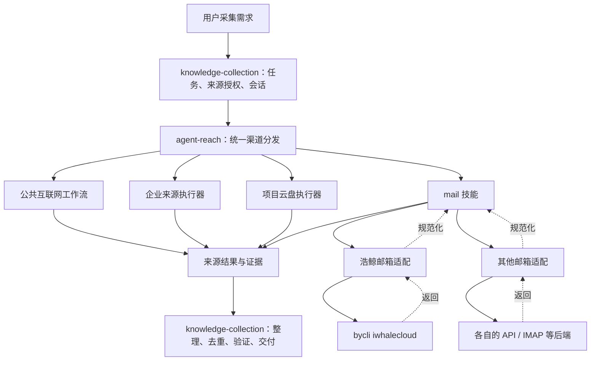

# knowledge-collection 统一渠道分发控制器设计

日期：2026-09-11

状态：设计稿。本次仅编写设计，不修改运行中的 agent-reach 规则或渠道分发代码，不部署、不提交文档。

## 1. 已确认的目标与层级

将 knowledge-collection 内的 agent-reach 从“公共互联网来源路由说明”扩展为统一数据渠道分发层，覆盖公共互联网、企业平台、项目云盘与邮件。文件保留名称 `references/agent-reach.md`，不新增一份并列的 by-reach.md；它与 `by-reach` CLI 是独立概念。

用户明确指定邮件路径为：

```text
agent-reach.md → mail 技能 → 浩鲸邮箱适配 → bycli
```

agent-reach 与浩鲸邮箱没有直接适配关系。其注册表仅注册 mail 技能，不登记浩鲸域名、邮箱 provider 列表、OWA 登录逻辑或 bycli iwhalecloud 命令。在采集执行链路中，新增或替换一种邮箱，应只修改 mail 所有的接口实现、适配器及其能力声明，不改总分发规则；产品账号连接器的独立配置不属于总分发器职责。

Markdown 负责说明分发规则，实际分发由 knowledge-collection 的程序入口执行。不能把 Markdown 文件描述成可独立运行的服务。

## 2. 现状与问题

当前 `references/agent-reach.md` 只规定公共互联网来源的执行器选择，明确将钉钉、飞书、企微和 IMA 排除在外。主 SKILL.md 另行选择企业来源；`scripts/enterprise/dispatcher.mjs` 再维护企业渠道及参数白名单。

公共 `public-collect` 流程已负责发现、正文读取、验证、数量收敛和恢复。项目云盘已有独立的单来源执行规则，mail 已有投影账号运行时与浩鲸网页邮箱包装。这些执行能力应继续复用。

现有问题是渠道执行路径分散在多个入口，统一采集容易重复做渠道选择、能力判断和恢复；如果继续在总路由文档中列举每家邮箱，控制器会依赖具体 provider。

本设计将授权范围内的技能执行选路统一到 agent-reach；用户意图到 sourceScope 的任务级来源选择仍由 knowledge-collection 按现有规则完成。同时将具体技能的账号、provider、认证、分页和后端命令保留在技能内部。

## 3. 架构



“浩鲸邮箱适配”是 mail 内部的 provider 层。agent-reach 只与 mail 的技能级契约通信，即使 mail 当前内部有多个 CLI 入口，也不允许控制器直接选择其中一个 provider 入口。

### 3.1 职责划分

| 层 | 负责 | 不负责 |
| --- | --- | --- |
| knowledge-collection | 原始任务、来源授权、父会话、整体预算、最终交付要求 | 维护邮箱 provider 或读取 Cookie |
| agent-reach 分发层 | 校验任务范围、按技能渠道选路、能力协商、调度、汇总渠道状态 | 解析邮箱域名、猜账号、直接读取数据、实现桥接恢复 |
| 技能级执行器 | 解析来源选择器、绑定账号上下文、选择 provider、发布能力、执行来源操作 | 扩大用户授权来源、宣布整个采集任务完成 |
| provider / 后端 | 具体平台协议、分页、命令、来源错误转换 | 写 knowledge-collection 的最终状态和交付目录 |
| 产物处理 | 来源结果规范化、清洗、去重、正文/附件完整度判定、原子交付 | 以缺少内容为由自行调用其他来源 |

不要求第一阶段统一改造所有企业适配器。已有 IMA、钉钉等通过兼容 facade 注册到新入口；其 provider 差异继续由各自渠道内部持有。

### 3.2 顶层渠道注册

注册表建议位于 `scripts/routing/channels.mjs`，只有一份代码权威。agent-reach.md 的表格用于解释，不再定义另一套可冲突的路由数据。

| 渠道 ID | 技能/流程所有者 | 分发目标 |
| --- | --- | --- |
| public-internet | 公共采集工作流 | 现有 public-discover / public-collect / 网页采集流程 |
| dingtalk | dws | 已有钉钉来源 facade |
| feishu | fws | 已有飞书来源 facade |
| wecom | wecomcli | 已有企微来源 facade |
| ima | IMA 来源适配器 | 已有 IMA facade，由其管理 bycli ima |
| cloud-knowledge | project-cloud-knowledge | 已有项目云盘 facade |
| mail | mail | 新增的 mail 技能级采集 facade |

mail 行中不得出现 iwhalecloud、qq、gmail 等 provider 配置，亦不得出现任何邮箱命令。

注册项声明：渠道 ID、所有者、固定入口、契约版本、上下文类型、是否委托完整工作流，以及能力查询方式。账号相关能力由技能根据当前可信上下文解析，不在注册表写死“所有邮箱都支持 search”。可执行入口只来自受版本控制的注册表，用户输入或来源响应不能提供任意命令。

## 4. 技能接口与能力协商

下述 `resolve`、`dispatch`、mail facade 均为计划新增的接口，不是当前已经可以调用的命令。

### 4.1 分发请求

```json
{
  "schemaVersion": 1,
  "sessionId": "collection-001",
  "channel": "mail",
  "operation": "discover",
  "selector": {
    "accountContextRef": "account-context-01",
    "userSourceHint": "用户原始邮箱描述"
  },
  "criteria": {
    "query": "合同",
    "timeRange": {"from": "2026-09-01", "toExclusive": "2026-09-12"},
    "timezone": "Asia/Shanghai"
  },
  "budget": {
    "maxScannedItems": 200,
    "maxReturnedItems": 20,
    "timeoutMs": 120000,
    "maxDownloadedBytes": 104857600
  },
  "contentRequirement": "full-text",
  "includeAttachments": false
}
```

`selector` 由渠道技能解释，控制器只验证容器类型、长度上限并原样转交。自然语言中的邮箱品牌/URL 可以作为不透明提示传入 mail，但控制器不能据此分支到 bycli。账号上下文引用必须来自可信任务上下文并由技能复核权限；拥有一个字符串引用本身不构成授权。

实际授权来源、父会话、项目绑定、输出根和剩余预算均从已有会话读取。请求中的字段不得扩大它们，也不得通过另建会话绕开限制。附件目录由现有会话体系派生，不接受任意输出路径。

### 4.1.1 接口分工与输入约束

新 facade 的能力查询为 describeCapabilities(context, selector)，不能触发远程读取；执行入口为 execute(request, executionContext)。通用 request.operation 只允许 discover、materialize、resource 三种采集意图，是否支持某种意图由渠道声明；邮件不支持的 resource 意图明确拒绝。原有工作流的 resume 由执行引用恢复接口承接，不伪装成一条新的 discover。

materialize 必须带 `candidateRefs: [{skillItemId, revision}]`，由父会话查出原来源、账号、query 和证据，不能由调用者重传一份可扩大范围的选择器。resource 必须有已获准的来源资源引用。例中的 discover 不携带候选 ID；单条直接读取由技能级普通任务入口处理，不能伪装成 collection materialize 绕过候选登记。

外层字段采用 additionalProperties=false；selector、criteria 的嵌套校验由注册技能的版本化 schema 执行，未知字段、重复字段及认证材料字段直接拒绝。timeRange 使用显式时区和左闭右开区间；只有技能声明支持时间筛选时才能接受，否则返回能力缺口。

evaluate 不持久化，resolve 为受控的计划提交；两者共用同一个纯选路函数，不能各自维护不同的渠道判断。

### 4.2 resolve：选择技能与执行计划

`resolve` 不获取正文或下载文件，执行步骤为：

1. 验证来源在父会话授权范围内、会话状态允许操作。
2. 选择渠道技能并查询能力；技能可解析账号元数据，但此阶段不隐式启动浏览器或触发远程读取。
3. 来源提示无法解析或账号有歧义时返回结构化需要选择状态；问题由技能生成、knowledge-collection 转达。
4. 返回技能所有者、契约版本、拟执行操作、预算分配和工作流所有者，持久化为执行计划。

统一能力语义包括 list、serverSearch、readFullText、downloadAttachment 和 boundedLocalScan。查询可用性可为 supported / unsupported / unknown；unknown 不能当成支持。`discover` 是采集意图，技能可在授权预算内通过支持的 list 或搜索能力实现，不等于每个 provider 都有服务端 search。

如果某个邮箱只有 list/read，mail 返回可执行的有界扫描策略及覆盖限制；agent-reach 不负责拼接 list/read 命令。用户要求全邮箱穷尽搜索而能力无法满足时，返回能力缺口，不能静默降为最近 200 封。

### 4.3 dispatch：执行已验证计划

`dispatch` 重新校验会话授权、剩余预算、上下文绑定和契约版本，然后调用计划指定的技能入口。技能在此时检查登录/桥接并执行；resolve 成功不代表登录有效。

计划通过渠道固定入口调用，参数结构化传递，禁止 shell 拼接。计划中的 provider 诊断信息可以保存以便追溯，但不能成为控制器选择底层命令的依据。

## 5. mail 内部职责

mail 需要新增技能级采集 facade，承接 `describeCapabilities`、`discover`、`materialize`。该 facade 由 mail 自有代码实现，并复用现有各 provider 入口；不能把邮箱选择逻辑写进 knowledge-collection 的企业 dispatcher。

mail 内部负责：

- 根据可信账号上下文或用户提示选择邮箱，无法证明具体登录身份时明确 `identityVerified=false`，不伪造身份。
- 将技能级意图映射到具体 provider 的列表、正文或附件能力。
- 管理分页、扫描去重、时间与关键词筛选、账号绑定、认证错误和允许的重试。
- 对只有列表能力的来源返回真实扫描范围和覆盖缺口。
- 通过该技能既有桥接入口管理恢复。浩鲸最终调用 bycli，其他邮箱按各自后端执行。
- 对每个正文和附件分别报告状态，已成功下载的附件在同一任务中复用。

knowledge-collection 只消费 mail 返回的标准化邮件和本地文件引用，负责形成 collection bundle。附件下载、附件正文解析、知识交付是不同阶段；解析器不属于 agent-reach 的邮箱分发逻辑。

## 6. 结果与状态契约

技能返回统一 envelope：

```json
{
  "schemaVersion": 1,
  "channel": "mail",
  "sourceSkill": "mail",
  "operation": "discover",
  "status": "partial",
  "items": [],
  "coverage": {
    "mode": "bounded-local-scan",
    "scannedCount": 200,
    "matchedCount": 0,
    "complete": false,
    "stopReason": "SCAN_BUDGET_EXHAUSTED"
  },
  "continuation": null,
  "errors": [],
  "usage": {"scannedItems": 200, "downloadedBytes": 0}
}
```

状态为 complete / partial / failed / needs-user-action。合法空结果可以 complete；未穷尽范围且扫描预算耗尽必须报告 partial。渠道 complete 只描述本次操作，不代表父采集任务 deliveryComplete。

条目允许包含 provider/backend 等由技能返回的 provenance，用于追溯。控制器将其作为不透明元数据保存，不硬编码特定 provider。通用字段包含 skillItemId、sourceUrl、账号上下文引用、正文粒度、正文状态、附件逐项状态与受控本地路径。skillItemId 由技能保证在来源与账号范围内稳定，不能只按标题去重。

continuation 是技能所有的不透明续传数据，只回传同一技能、同一账号绑定和授权范围，控制器不能解析或改写为 offset。不得包含认证材料。不存在可靠游标的技能可返回 null，并在 coverage 中说明限制。

保留现有 collection contract 作为最终产物协议。新 envelope 在兼容层映射到现有 inventory/result，不直接强行替换所有来源的 source/backend 字段，不重写历史会话。旧 source=iwhalecloud-mail 的邮件结果可以保留来源溯源；新控制器用于分发的 channel 始终是 mail。

## 7. 执行与恢复所有权

| 内容 | 唯一所有者 |
| --- | --- |
| 用户目标、来源授权、父会话、最终交付判定 | knowledge-collection |
| 渠道执行计划、多来源调度、全局预算分配 | agent-reach 分发程序 |
| 已有 public-collect 的发现、验证、数量闭环及 run 恢复 | public-collect 工作流 |
| mail 的账号选择、分页、认证、浏览器恢复 | mail 技能及其既有运行时 |
| 正文清洗、附件解析与最终 bundle 发布 | knowledge-collection 现有产物流程 |

符合现有 public-collect 选择条件的指定数量文章任务，应委托完整 public-collect 工作流；其他公共任务保留原来的 public-discover、unified-search 或 operator 路径，不能全部改走 public-collect。新控制器不得拆分已选工作流为独立底层网页命令。保留现有 runId、状态机和会话写锁，防止出现两个写者。

对于需要发布最终 bundle 的旧企业适配器，兼容 facade 继续让旧适配器独占该子会话的发布；父分发器只读取已提交结果。新 mail 执行器只写受控 raw 子目录和下载文件，最终 bundle 由 collection 产物层发布。注册项应明确 `publicationOwner=workflow` 或 `collection`，每条执行路径只能有一个发布者。

分发器不恢复浏览器、不刷新令牌、不重试来源写操作。AUTH_REQUIRED、BRIDGE_UNAVAILABLE、BRIDGE_RECOVERY_BUSY 等终态原样规范化并交给上层，不触发额外恢复。

多来源默认并发上限沿用现有 collection 配置，渠道可以要求更低或账号串行；不能提升到超过父任务预算。总扫描量、下载字节和截止时间在调度前分配额度，任务结束后汇总实际使用量，避免每个子渠道各自消耗完整全局预算。

## 8. 典型任务流程

### 8.1 浩鲸邮件采集

1. knowledge-collection 根据用户请求初始化授权来源为 mail 的会话，并保留原始邮箱提示和可信账号上下文。
2. agent-reach 把邮件发现意图交给 mail，不判断邮箱品牌。
3. mail 解析到浩鲸邮箱适配，声明 list/read/download 及有界扫描能力，明确不存在服务端 search 或已验证邮箱身份。
4. agent-reach 将技能返回的执行计划与预算绑定到会话；若不能满足请求，明确能力缺口。
5. mail 检查对应浏览器上下文，通过浩鲸适配调用 bycli，返回正文、附件和覆盖范围。
6. knowledge-collection 生成可追溯产物并校验交付要求。

若未来 mail 新增另一家邮箱，总分发层的 mail 注册项和路径不需要变化。

### 8.2 公网与项目云盘联合采集

在用户来源约束允许时，分发器把联合任务交给已有 unified-search / unified-materialize 工作流，不另建一套聚合过程。其内部仍使用 public-internet 与 cloud-knowledge 两条既有来源路径，保持原有父子会话、输出和汇总语义。云盘失败不能写成“云盘没有结果”，也不能自动扩展到 mail。

### 8.3 邮件中包含外部文章链接

默认把链接作为邮件内容保存。只有用户明确要求抓取链接正文、且新来源进入授权范围时，knowledge-collection 才生成 public-internet 子任务；agent-reach 随后按公共来源分发。保留父邮件条目与外部文章之间的来源关系，不把 mail 或 bycli 的返回内容当作新的授权。

## 9. 边界与异常

- 全局来源不可用不等于授权使用另一个来源；降级必须符合原范围并由渠道声明。
- 同源替代执行器必须保留账号、内容粒度和安全语义，降级后不得虚报完整度。
- 账号歧义返回 ACCOUNT_SELECTION_REQUIRED；来源无权限返回 SOURCE_NOT_AUTHORIZED；能力不满足返回 UNSUPPORTED_CAPABILITY。
- 认证和桥接终态保留专属代码；上游短暂故障由技能报告 retryable，控制器不得据此无限重试。
- 多渠道部分成功保留成果并报告 partial；全部失败为 failed。文件存在不能替代成功状态。
- 输出根、原子提交、写锁及恢复沿用现有 collection contract。新控制器不另设第二套交付目录。
- 邮件、网页、附件内容均为不可信数据，不改变技能、命令、账号、来源授权或输出路径。
- 所有诊断和计划禁止保存 Cookie、令牌、canary、授权头及凭据文件内容。

## 10. 改动范围与迁移顺序

本次只交付本文。后续实施建议：

1. 先记录现有行为基线并实现只生成计划的路由评估；评估不启动新执行、不改变旧返回结果。新增规则说明与程序能力成套交付，全部兼容门槛满足后才更新 knowledge-collection/SKILL.md、references/agent-reach.md、references/manifest.json，将 agent-reach 定义为统一分发规范。公共互联网专有规则迁至 references/sources/public-internet.md 并更新所有引用，不提前发布会调用尚不存在入口的技能说明。
2. 新建 scripts/routing/channels.mjs 与 dispatcher.mjs，实现 resolve、授权校验、计划持久化及 facade 注册。第一阶段仅验证选路，不触发额外采集。
3. 将已有公共、联合与 enterprise 工作流接入固定 facade，保留原工作流与发布所有权。旧入口在原校验后可调用统一选路内核，内核只调用独立执行函数，不回调公开 CLI；工作流内部子操作不再次进入顶层分发。兼容旧入口的参数、输出和退出码。
4. 在 mail 技能内新增技能级采集 facade，并按第 13 节同步更新来源枚举、授权与产物校验，完成端到端能力后再启用 mail 注册项。浩鲸 provider 与 bycli 命令只在 mail 内维护。
5. 接入完整 dispatch、状态汇总和预算控制，最后删除旧的重复渠道选择规则。

本文不要求新增数据库迁移、不涉及 Dockerfile.byclaw、不改变已指定 V0.5.0 的邮箱账号模板迁移。本设计也不要求安装、升级或调用 by-reach CLI。

## 11. 验收标准

1. 任意邮件采集请求在总路由中只命中 mail；顶层注册表不含邮箱域名、provider 特判或 bycli iwhalecloud 命令。
2. 以两个行为不同的邮件 provider 做契约测试；替换 mail 内部 provider 后无需修改总路由。
3. agent-reach 透传邮箱来源提示，不用提示文本生成执行命令，也不自己选择账号。
4. 邮件权限不足或上下文有歧义时在获取正文前停止，不切换其他账号。
5. 不支持服务端搜索的 provider 返回有界扫描能力；达到扫描预算时 coverage.complete=false。
6. 公共 public-collect 任务只由原工作流管理 run 和发布，不增加外层正文获取/恢复循环。
7. 多来源执行遵守总预算，来源范围不能扩大，失败来源与成功空结果严格区分。
8. 正文、附件下载和附件解析分别记账，未满足附件交付要求时 deliveryComplete=false。
9. 旧会话可继续读取和恢复，原 source/backend 溯源字段不被强制重写。
10. 契约测试覆盖 sourceScope 越权、账号绑定变化、未知能力、异常 JSON、路径越界、重复调度、恢复冲突以及部分失败。

## 12. 与先前邮箱设计的关系

先前《浩鲸邮箱账号连接器与 mail / knowledge-collection 对接设计》中关于 provider 能力、登录态、下载保护和产物完整度的要求继续有效。

本设计替代其中“邮箱采集不经过 agent-reach”的旧顶层路由约定：统一分发改造后，邮箱会经过 agent-reach，但仅分发至 mail 技能。先前拟由 knowledge-collection 直接维护的浩鲸来源适配逻辑应归入 mail 所有的 facade/provider 层。两份设计有冲突时，以本节明确的新分层为准。


## 13. 兼容性约束与闭环补充

本节是实施硬约束。统一分发是选路和委托重构，不能顺带修改旧任务的来源范围、默认数量、结果形态或状态机。

### 13.1 保持原有来源决策和工作流选择

- 用户明确指定来源优先于数量和默认策略；例如“从 IMA 取 5 篇”仍只走 IMA，不能转成公网 public-collect。
- 未明确来源但要求指定数量的文章全文，保持现有 public-collect 路径；只要候选链接仍为 public-discover。
- 未明确来源和数量时，只有可信项目上下文及有效云盘授权满足现有条件才使用公网+云盘；云盘不可用须按现有规则报告其状态。
- enterprise search-all 的既有默认集合保持 dingtalk/feishu/wecom/ima，不加入 mail 或 cloud-knowledge。“所有企业来源”不自动扩展为私人邮箱。
- 新 mail 采集必须显式进入任务 sourceScope 并绑定账号上下文，只有已安装 mail 技能不能视为用户同意采集邮件。
- 单页打开、登录、单个事实问答继续按原技能规则处理，不因新增分发器就变成 knowledge-collection 采集任务。

### 13.2 渠道枚举、来源授权与历史字段

当前 CLI schema 和 research-state 的 sourceScope 还没有 mail。启用新渠道必须成套修改：knowledge-collection.mjs 的帮助与 JSON schema、research-state.mjs 的 SOURCE_SCOPES/初始化校验、collection-state.mjs 的来源授权检查、相关 facade 的入参与产物校验，以及契约测试。

为新执行记录持久化由控制器确定的 authorizationChannel=mail，授权依据来自可信执行计划和已注册 mail facade，不采用来源响应自报的 channel 来绕过检查。provider 返回的 source/backend 仅作溯源，不作为新增授权来源；通用校验不新增“iwhalecloud → mail”等 provider 特判。

旧来源字段及既有 SOURCE_SCOPE_ALIAS 映射保持原语义，旧会话不补入 mail 权限。先前设计中的 source=iwhalecloud-mail 并不意味着已经存在合法的邮件采集会话；没有可验证 mail 授权绑定的记录，只能保留为已有产物读取，不允许据此自动继续抓取。

### 13.3 工作流委托不能形成递归分发

公开 CLI → 原参数与会话校验 → 路由内核 → 固定 facade → 工作流内部执行函数，调用方向单向。

public-collect、unified-search、enterprise search-all、site-crawl 等持有循环或聚合状态的任务，由原工作流继续协调子操作，注册项声明 workflow-owned。子操作使用固定来源接口，不再创建新的顶层 route。不得由 facade 再调用同一个已接入路由的公开 CLI，避免循环与双重预算计数。

旧入口是受控兼容入口，不是无权限的旁路：仍须经过原授权校验。新控制器只取代重复的技能选路判断，不删除原来源适配器的防御性权限/参数校验。

### 13.4 计划持久化、写锁与运行状态

路由计划放在会话专属 `.routing/` 控制目录，包含 planId、routeContractVersion、executionOwner、authorizationRevision、accountBindingRevision、状态、预算和 executionRef；不混入 raw 证据或 sanitized 交付列表。旧会话未包含该目录时继续使用原流程，新读者不能因缺少它拒绝读取旧产物。

对同一幂等键（会话、渠道、规范化条件、账号上下文修订、操作、候选集修订）只允许一个有效执行。用户明确刷新生成新 attempt 并保留旧记录，普通重试不自动另起任务。

路由状态为 planned → running → complete/partial/failed/waiting-user/interrupted；其中 waiting-user 对应技能结果的 needs-user-action，interrupted 表示执行状态尚不能安全判定。计划更新通过控制目录内的独占锁和原子替换实现；调用工作流前持久化 running 与 executionRef，不在远程执行期间持有 session.json 的发布锁，避免与旧工作流自身锁死锁。相同会话的最终 bundle 只有第 7 节指定的发布者写入。

执行器在进行外部读取/写文件前登记可查询的 executionRef。进程中断后先查询原执行器/已提交 receipt：仍在运行则附着等待，已提交则复用结果，可恢复则通过原 run/cursor 恢复。无法判断是否运行或完成时保持 interrupted，不自动重复执行。缺乏查询/恢复能力的旧执行器在注册表明确声明 non-resumable，不能伪装支持透明恢复。

旧会话继续由原 owner 恢复，不中途转交新 dispatcher。回滚新选路只影响尚未启动的新任务，不能把运行中的新任务重复交给旧入口。

### 13.5 预算语义与中断

请求 timeoutMs 是相对时长，只在首次制定计划时转换成持久化绝对截止时间 deadlineAt；自动重试或恢复不重新开始计时。用户显式调整预算需要记录授权修订。

新的路由任务可以使用全局预算，但旧 CLI 的 limit 和 concurrency 保持原有含义，不能把原来的“每来源 limit”悄悄改成“全任务总 limit”。已有 public-collect 两轮发现、最多 100 次正文 probe 等上限保持原 owner 管理，分发器不得再按同名字段额外扣减一次。

对子工作流分配额度时注明 budgetOwner，实际来源读取由其唯一计数，父层仅聚合实际用量。不能报告实际用量的旧执行器标记 usage=unknown，不把 unknown 当成 0；它继续沿用原工作流预算。需要严格新全局预算的任务仅调度支持预算契约的执行器，不能事后声称已保证上限。

达到截止时间由唯一执行 owner 取消或暂停，随后读取已有结果和 receipt。未取得可靠停止确认则记录 interrupted 并保留执行引用；不能因本地超时立即启动替代读取器。

### 13.6 发现到物化的授权、账号与文件闭环

materialize 只能引用本会话已登记的候选 skillItemId 和候选版本，不能接受任意邮件 ID 或任意本地路径。来源选择器、账号绑定、查询与候选必须与发现阶段一致；账号更换或权限撤销使原继续操作失效，保留历史产物但重新走获准的发现流程。

mail 负责将 provider 返回的稳定 ID 与账号上下文绑定。当前浩鲸 bycli 没有 whoami，不能据浏览器可访问就声称验证了邮箱身份；能力契约必须将 identityBinding 标记为 context-only、跨进程透明恢复标记为 unsupported。没有可靠身份绑定的暂停任务不能自动续抓旧候选；由用户重新确认账号上下文后重新发现，不把旧候选授权迁移到新账号。

单企业 search 继续要求 output-dir 与 parent-session-dir 相同；IMA 和 cloud-knowledge 的 query 必须匹配父任务。企业聚合任务继续使用与父会话互不包含的会话树，IMA 候选仍在原子会话内物化。不能为统一输出而搬迁这些路径或放宽原限制。

mail facade 把下载根限制在调用者已批准的会话中；如既有包装要求私有 0700 目录而 collection raw 目录不是该权限，使用同会话下专属的私有下载子目录，由 mail 校验真实路径。控制器不通过 chmod 整个历史会话来兼容。产物层复制到 sanitized 前再次校验存在性、类型、路径范围和非符号链接，只有验证后的文件进入交付。

### 13.7 失败 envelope 与旧接口兼容

新 facade 的 status/error 是内部规范，旧 CLI 的 stdout JSON、退出码和已有 AUTH_REQUIRED/BRIDGE_* 状态不改变。兼容层从旧结构读取语义，不因包了一层就把失败变成成功；needs-user-action 映射到原先允许的等待/失败状态并保留原因，不直接往旧 schema 写入新枚举。

原 collection 的 complete/partial/failed 与发布状态继续由原规则计算。某个工作流已提交的失败 bundle 仍是失败；来源全失败不能聚合成 complete。已发布文件被删改时走原交付校验，不因 route 状态 complete 跳过验证。

### 13.8 发布门槛与行为基线

只有同一批代码、技能文档、渠道注册、mail facade 与 schema 全部存在且测试通过，才启用新路由。过渡期使用纯 evaluate 路径比对新旧选路：只读取已有上下文和静态能力，不落盘计划、不预留预算、不执行登录检查；真正启用后的 resolve 才持久化计划。真实任务只由一个 owner 执行，禁止“双跑采集”验证。

基线至少覆盖以下现有测试族：knowledge-collection.test.mjs、public-collect.test.mjs、enterprise/dispatcher.test.mjs、enterprise/adapters/ima.test.mjs、enterprise/adapters/cloud-knowledge.test.mjs，以及 unified-search / unified-materialize、research-state / collection-state 的相关测试。新增路由测试比较相同旧输入的来源集合、默认值、执行次数、结果状态、目录布局、恢复行为和退出码。

实施前记录基线失败；不得把本次新增失败归为历史问题。上线前须无新增回归，所有原有授权与产物断言保持有效。文档审查能消除已识别的逻辑缺口，但不能替代实际实现后的回归测试，不能仅据设计宣称“绝对不影响原有逻辑”。


### 13.9 邮件采集文件预算与能力启用

同一个邮件采集任务的私有 downloadRoot 在首次计划中登记并固定复用，发现、物化、重试不能换新目录重置累计下载额度。任务级 maxDownloadedBytes 与 mail 包装自有会话上限取更小者；provider 已成功的下载由 mail 的条目记录复用，控制器不能只按新命令的返回字节数清零历史用量。

mail 技能已有的 check/list/read/download 包装不等于已经实现 discover/materialize facade。只有账号上下文、来源 schema、候选绑定、预算与结果适配齐全后才把 mail 渠道标记为 enabled；否则新注册项对执行返回 CHANNEL_UNAVAILABLE，不能直接跳到浩鲸包装“临时接通”。这也保证总路由无需知道某个 provider 的 CLI 参数。

## 14. 设计复审记录

### 第一轮：分层、授权与兼容审查

对照 SKILL.md、knowledge-collection.mjs、research-state.mjs、collection-state.mjs、enterprise-collection.mjs 和 enterprise/dispatcher.mjs，发现并处理：

| 发现的问题 | 已修改的约束 |
| --- | --- |
| “统一来源选择”可能改变用户明确来源优先规则 | 任务级 sourceScope 保持原 owner 和优先级，分发仅选择范围内执行器 |
| 仅注册 mail 无法通过现有来源枚举与产物授权检查 | 同步列出 CLI schema、状态校验、可信 authorizationChannel 与旧字段兼容 |
| 包装旧 CLI 可能递归调用自身 | facade 只调用内部执行函数，工作流子操作不再顶层分发 |
| 新计划锁可能与旧会话发布锁死锁 | 控制状态独立、网络执行前释放发布锁，发布 owner 唯一 |
| 中断后重跑可能重复下载或出现两个运行任务 | 固定幂等键、executionRef、receipt 查询及 interrupted 状态 |
| 全局预算可能改变旧 limit 语义或重试重置时间 | 旧参数语义不变、唯一预算 owner、持久化 deadlineAt |

### 第二轮：反例与端到端审查

按“公网候选”“指定数量文章”“仅 IMA”“仅云盘”“公网+云盘”“邮件发现到物化”“邮件中外链”“账号切换后恢复”“旧会话恢复”“超时但子进程仍运行”逐一推演，进一步修正：

- 联合检索继续委托已有 unified-search/unified-materialize，不另建一套父子会话与聚合逻辑。
- 只有符合原条件的任务走 public-collect；普通公网读取不被强制切换工作流。
- 区分无副作用 evaluate 与会写计划的 resolve，避免比对阶段改写旧任务。
- 补齐 materialize 的候选版本、外层/技能级 schema、内部状态枚举映射。
- 身份无法验证的邮箱不承诺透明跨进程续采，避免换号后误用旧候选。
- 固定 mail 下载根与累计用量；mail facade 未完成时禁止退回顶层直调 provider。

### 第三轮：一致性与闭环复查

逐项复查第 11 节验收条件、第 13 节兼容约束、请求/结果示例及新旧设计关系。当前未发现尚未给出处理规则的设计级闭环问题。保持以下实施门槛：

- 新渠道选路、现有工作流行为和真实数据获取必须分别验证，不能以选路测试替代端到端测试。
- 以实施前基线验证旧输入的来源范围、参数默认、结果状态、目录、恢复和退出码均不新增回归。
- 不具备能力的场景明确不支持/中断，而不是通过绕过权限、无限重试或旧入口重跑来“闭环”。

本次仅文档改动，所以运行逻辑没有因本次设计审查改变；未来实现是否满足兼容承诺，仍须通过上述发布门槛验证。
